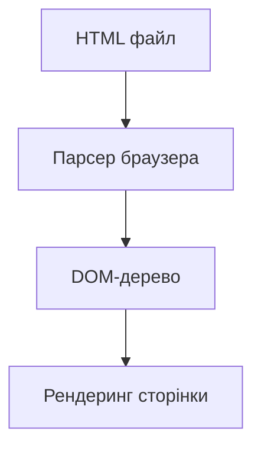
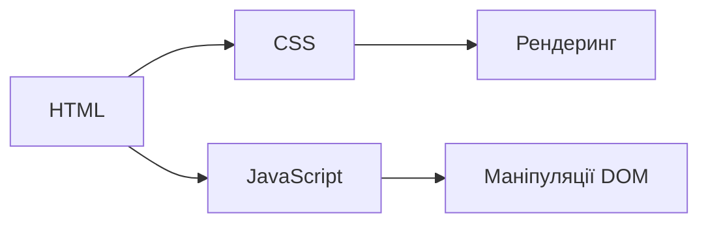

# Вступ: коротка історія та роль HTML

## Вступ

HTML (HyperText Markup Language) — це основа будь-якої веб-сторінки. Він визначає структуру контенту, дозволяє браузерам відображати текст, зображення, відео та інші елементи. Без HTML не існувало б сучасного Інтернету.

HTML — це не просто набір тегів, а ціла філософія побудови інформаційного простору. Його простота дозволяє швидко навчитися основам, але глибина — у деталях семантики, доступності та інтеграції з іншими технологіями.

## Історія/Походження

HTML був створений Тімом Бернерсом-Лі у 1989–1991 роках для обміну науковою інформацією між дослідниками CERN. Перші версії були простими, але швидко розвивалися. Від HTML 2.0 (1995) до сучасного HTML5 (2014), мова стала потужною платформою для інтерактивних застосунків.

### Віхи розвитку HTML

-   **HTML 1.0 (1993):** мінімальний набір тегів для тексту та посилань.
-   **HTML 2.0 (1995):** стандартизація, підтримка форм.
-   **HTML 3.2 (1997):** таблиці, скрипти, стилі.
-   **HTML 4.01 (1999):** розділення структури і стилів, поява атрибуту `id`, `class`.
-   **XHTML (2000):** спроба зробити HTML більш строгим, як XML.
-   **HTML5 (2014):** відео, аудіо, SVG, API для роботи з даними, семантичні теги (`<article>`, `<section>`, `<nav>`, `<header>`, `<footer>`).

## Основний матеріал

HTML — це декларативна мова розмітки. Вона складається з тегів, які описують елементи сторінки. Теги можуть бути блочними (`<div>`, `<section>`) або стрічковими (`<span>`, `<a>`). Всі елементи мають атрибути, які задають додаткові властивості.

### Семантика

Семантичні теги (`<main>`, `<aside>`, `<figure>`, `<figcaption>`, `<mark>`, `<time>`) допомагають браузерам, пошуковим системам і асистивним технологіям краще розуміти структуру контенту.

### Атрибути

-   `id` — унікальний ідентифікатор елемента.
-   `class` — групування елементів для стилізації.
-   `data-*` — зберігання додаткових даних для JS.
-   `alt` — опис зображення для доступності.
-   `lang` — мова контенту.

### Вкладеність

Правильна вкладеність тегів — основа коректного рендерингу. Наприклад, `<ul>` може містити лише `<li>`, а `<table>` — лише `<tr>`, `<td>`, `<th>`.

## Приклад коду

```html
<!DOCTYPE html>
<html lang="uk">
    <head>
        <meta charset="UTF-8" />
        <title>Моя перша сторінка</title>
        <meta name="description" content="Навчальний приклад HTML" />
        <link rel="stylesheet" href="styles.css" />
    </head>
    <body>
        <header>
            <h1>Вітаю у світі HTML!</h1>
            <nav>
                <ul>
                    <li><a href="#main">Головна</a></li>
                    <li><a href="#about">Про сайт</a></li>
                </ul>
            </nav>
        </header>
        <main id="main">
            <section>
                <h2>Що таке HTML?</h2>
                <p>HTML — це фундамент вебу.</p>
                <figure>
                    
                    <figcaption>Логотип сайту</figcaption>
                </figure>
            </section>
            <aside>
                <p>Це додаткова інформація.</p>
            </aside>
        </main>
        <footer>
            <p>&copy; 2025 Мій сайт</p>
        </footer>
    </body>
</html>
```

// Приклад містить семантичні теги, атрибути, вкладеність, коментарі.

## Пояснення під капотом

Браузер парсить HTML, створює DOM-дерево (Document Object Model), яке потім використовується для рендерингу сторінки та взаємодії з JavaScript/CSS. HTML не є мовою програмування — він не містить логіки, лише структуру.

### Як працює DOM

DOM — це ієрархічна структура, де кожен елемент HTML стає вузлом дерева. JS може змінювати DOM у реальному часі, що дозволяє створювати динамічні інтерфейси.

## Нюанси та підводні камені

-   Некоректна вкладеність тегів призводить до неочікуваного рендерингу.
-   Відсутність семантики у розмітці ускладнює SEO та доступність.
-   Старі версії HTML не підтримують сучасні можливості (відео, SVG, API).
-   Застарілі теги (`<font>`, `<center>`, `<bgsound>`) не слід використовувати.
-   Відсутність атрибуту `alt` у зображеннях — погана практика для доступності.
-   Використання `<div>` замість семантичних тегів — антипатерн.

## Діаграми





## Приклад застосування в реальних проєктах

HTML використовується для створення:

-   Лендінгів та корпоративних сайтів
-   Веб-застосунків (у поєднанні з JS, CSS)
-   Email-розсилок
-   Документації
-   Односторінкових застосунків (SPA)
-   Інтерфейсів для мобільних застосунків (через фреймворки типу Cordova, Ionic)

### Кейс: SEO та доступність

Використання семантичних тегів (`<header>`, `<nav>`, `<main>`, `<footer>`) покращує індексацію сайту пошуковими системами та роботу скрінрідерів для людей з вадами зору.

### Кейс: інтеграція з JS/CSS

HTML — це основа для стилізації (CSS) та логіки (JS). Наприклад, кнопка `<button>` може бути стилізована через CSS і керуватися через JS.

## Крос-посилання

-   [Базова структура HTML-документа](./02-basic-structure.md)
-   [Семантичний HTML](./03-semantic-tags.md)
-   [Робота з медіа](./05-media.md)

## Підсумок

-   HTML — основа структури веб-сторінки
-   Визначає елементи та їх властивості
-   Розвивається з 1990-х до сучасного HTML5
-   Семантика важлива для SEO та доступності
-   HTML парситься у DOM, який використовують JS та CSS
-   Важливо використовувати сучасні теги та атрибути
-   Коректна вкладеність і семантика — запорука якісного сайту
