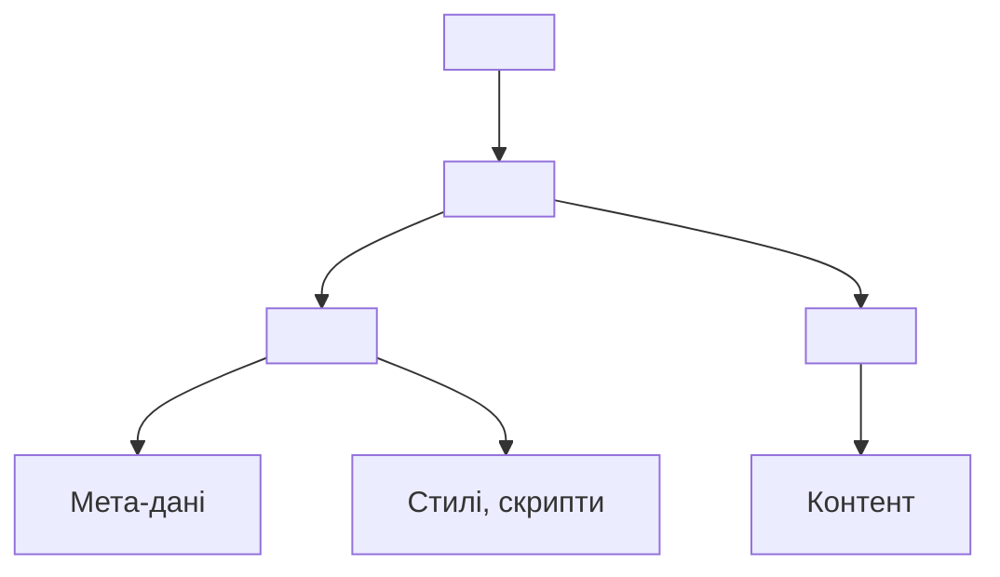
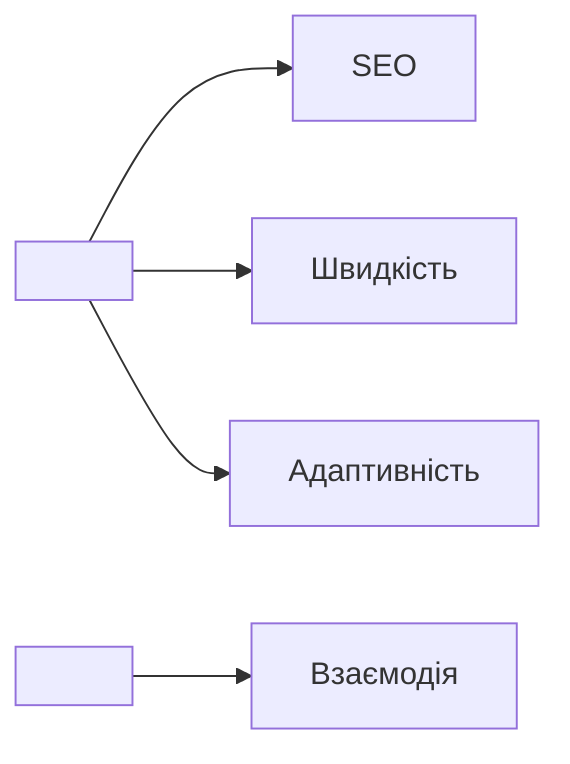

# Базова структура HTML-документа

## Вступ

Базова структура HTML-документа — це каркас, з якого починається будь-яка веб-сторінка. Від правильного оформлення залежить коректність рендерингу, SEO, доступність, інтеграція з CSS/JS, робота браузера та подальша підтримка.

## Історія/Походження

Перші HTML-документи були простими: лише текст і посилання. З розвитком стандарту структура ускладнювалась, з’явилися нові обов’язкові елементи (`<!DOCTYPE>`, `<head>`, `<meta>`, `<title>`, `<body>`). HTML5 зробив структуру більш семантичною та гнучкою, додавши нові теги та атрибути.

### Віхи розвитку структури

-   **HTML 1.0:** мінімальна структура, без head/body.
-   **HTML 2.0–4.01:** head, body, meta, title, link, script.
-   **HTML5:** семантичні теги, атрибути lang, charset, viewport, favicon, API.

## Основний матеріал

Стандартна структура HTML-документа складається з:

-   `<!DOCTYPE html>` — оголошення типу документа (визначає стандарт HTML5).
-   `<html lang="...">` — кореневий елемент, атрибут `lang` задає мову.
-   `<head>` — метадані, стилі, скрипти, SEO.
-   `<body>` — видимий контент сторінки.

### Схема базової структури

```html
<!DOCTYPE html>
<html lang="uk">
    <head>
        <meta charset="UTF-8" />
        <title>Заголовок сторінки</title>
        <meta name="description" content="Опис сторінки для SEO" />
        <meta name="viewport" content="width=device-width, initial-scale=1.0" />
        <meta name="author" content="Odysseus" />
        <link rel="icon" href="favicon.ico" />
        <link rel="stylesheet" href="styles.css" />
        <script src="main.js" defer></script>
    </head>
    <body>
        <header>
            <h1>Basic HTML Structure</h1>
        </header>
        <main>
            <p>This is a minimal HTML5 document.</p>
        </main>
        <footer>
            <p>&copy; 2025 Odysseus</p>
        </footer>
    </body>
</html>
```

// Всі елементи мають бути правильно вкладені. Атрибут charset важливий для коректного відображення тексту.

### Опис елементів

-   `<!DOCTYPE html>` — повідомляє браузеру, що це HTML5.
-   `<html>` — контейнер для всіх елементів.
-   `<head>` — не відображається, але містить важливу інформацію.
-   `<meta charset="UTF-8">` — кодування символів.
-   `<title>` — назва сторінки у вкладці браузера.
-   `<body>` — все, що бачить користувач.

### Семантика структури

Використання семантичних тегів (`<header>`, `<main>`, `<footer>`, `<nav>`, `<section>`, `<article>`) підвищує якість розмітки, SEO, доступність, інтеграцію з CSS/JS.

### Неочевидний приклад: viewport

```html
<meta name="viewport" content="width=device-width, initial-scale=1.0" />
```

// Забезпечує адаптивність сторінки на мобільних пристроях.

### Неочевидний приклад: favicon

```html
<link rel="icon" href="favicon.ico" />
```

// Додає іконку у вкладці браузера.

### Неочевидний приклад: defer для скрипта

```html
<script src="main.js" defer></script>
```

// Скрипт виконається після рендерингу сторінки, не блокує завантаження.

## Пояснення під капотом

Браузер спочатку читає `<!DOCTYPE>`, щоб визначити режим рендерингу (стандартний чи застарілий). Далі парсить `<html>`, `<head>`, `<body>`. Метадані у `<head>` впливають на SEO, швидкість завантаження, адаптивність.

### Взаємодія head/body

Все, що у `<head>`, не видно користувачу, але критично для роботи сторінки: стилі, скрипти, мета-теги, favicon. `<body>` — це контент, з яким взаємодіє користувач.

### Фундаментальна роль структури

Базова структура — це основа для формування DOM, роботи рушія браузера, SEO, доступності, інтеграції з JS/CSS, підтримки API.

## Нюанси та підводні камені

-   Відсутність `<!DOCTYPE>` може призвести до некоректного рендерингу.
-   Неправильне кодування (`charset`) — проблеми з відображенням тексту.
-   Відсутність мета-тегів — погана SEO та адаптивність.
-   Вкладення `<head>` у `<body>` — критична помилка.
-   Відсутність favicon — неестетичний вигляд вкладки.
-   Не використовуйте застарілі теги (`<frameset>`, `<noframes>`, `<basefont>`).
-   Відсутність семантичних тегів — погана доступність.

## Діаграми





## Приклад застосування в реальних проєктах

-   Корпоративні сайти — правильна структура для SEO.
-   Веб-застосунки — мета-теги для адаптивності.
-   Блоги — favicon, автор, viewport.
-   SPA — head для підключення фреймворків.
-   Email-розсилки — коректна структура для відображення у різних клієнтах.

### Кейс: SEO

Мета-теги (`description`, `author`, `viewport`) критичні для пошукових систем і мобільних пристроїв.

### Кейс: швидкість

Використання атрибута `defer` для скриптів дозволяє не блокувати рендеринг сторінки.

### Кейс: доступність

Використання семантичних тегів і правильного кодування забезпечує доступність для скрінрідерів.

## Крос-посилання

-   [Вступ: коротка історія та роль HTML](./01-history-role.md)
-   [Семантичний HTML](./03-semantic-tags.md)
-   [Мета-дані та head](./09-meta-head.md)
-   [Best practices](./10-best-practices.md)

## Підсумок

-   Базова структура — фундамент для будь-якої сторінки
-   Всі елементи мають бути правильно вкладені
-   Мета-теги впливають на SEO, адаптивність, швидкість
-   Відсутність DOCTYPE — критична помилка
-   Використовуйте сучасні теги та атрибути
-   Head — для метаданих, body — для контенту
-   Семантика — запорука якісного сайту
