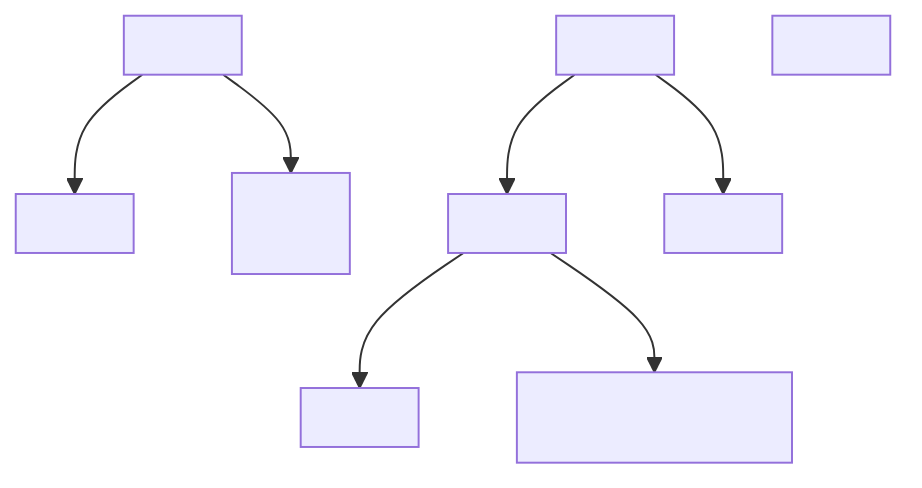
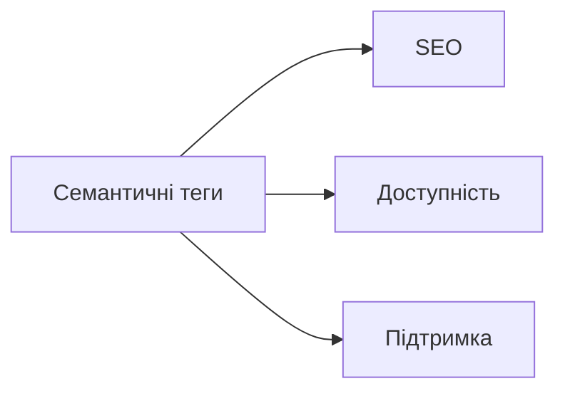

# Семантичний HTML: огляд і перелік тегів

## Вступ

Семантичний HTML — це підхід до розмітки, коли кожен елемент має чітке значення і роль у структурі сторінки. Семантика допомагає браузерам, пошуковим системам і асистивним технологіям краще розуміти контент.

## Історія/Походження

У перших версіях HTML більшість розмітки була несемантичною: для всього використовували `<div>` і `<span>`. З появою HTML4 і особливо HTML5 введено семантичні теги (`<header>`, `<nav>`, `<main>`, `<article>`, `<section>`, `<aside>`, `<footer>`), що зробило структуру зрозумілішою для машин.

## Основний матеріал

Семантичні теги — це елементи, які описують зміст і структуру сторінки:

### Основні семантичні теги

-   `<header>` — шапка сторінки або секції
-   `<nav>` — навігаційне меню
-   `<main>` — основний контент
-   `<section>` — розділ контенту
-   `<article>` — самостійний матеріал (стаття, пост)
-   `<aside>` — додаткова інформація (блоки, сайдбар)
-   `<footer>` — підвал сторінки або секції
-   `<figure>` — медіа-елемент з підписом
-   `<figcaption>` — підпис до медіа
-   `<mark>` — виділення тексту
-   `<time>` — дата/час
-   `<details>`, `<summary>` — прихований/розкривний контент

### Додаткові семантичні теги

-   `<address>` — контактна інформація
-   `<blockquote>` — цитата
-   `<cite>` — джерело цитати
-   `<code>` — фрагмент коду
-   `<em>`, `<strong>` — акцентування тексту
-   `<abbr>` — абревіатура
-   `<dfn>` — визначення терміну
-   `<small>` — дрібний текст

## Приклад коду

```html
<header>
    <h1>Семантичний HTML</h1>
    <nav>
        <ul>
            <li><a href="#main">Головна</a></li>
            <li><a href="#about">Про нас</a></li>
        </ul>
    </nav>
</header>
<main id="main">
    <article>
        <header>
            <h2>Новина дня</h2>
            <time datetime="2025-08-03">3 серпня 2025</time>
        </header>
        <section>
            <p>HTML5 зробив розмітку більш семантичною.</p>
            <figure>
                
                <figcaption>Фото до новини</figcaption>
            </figure>
        </section>
        <footer>
            <address>Автор: Odysseus</address>
        </footer>
    </article>
    <aside>
        <p>Сайдбар з додатковою інформацією.</p>
    </aside>
</main>
<footer>
    <p>&copy; 2025 Odysseus</p>
</footer>
```

// Приклад містить всі основні семантичні теги, атрибути, вкладеність.

## Пояснення під капотом

Браузер і пошукові системи використовують семантику для кращої індексації, а скрінрідери — для навігації користувачів з вадами зору. Семантичні теги дозволяють JS і CSS легше знаходити потрібні елементи.

### Взаємодія з SEO та доступністю

Семантика підвищує рейтинг у пошукових системах і робить сайт доступним для всіх.

## Нюанси та підводні камені

-   Використання `<div>` замість семантичних тегів — антипатерн.
-   Відсутність атрибуту `alt` у зображеннях — погано для доступності.
-   Неправильна вкладеність (наприклад, `<footer>` всередині `<main>` без логіки).
-   Застарілі теги (`<font>`, `<center>`) не мають семантики.
-   Надмірне вкладення `<section>` — втрата сенсу.

## Діаграми





## Приклад застосування в реальних проєктах

-   Новинні портали — `<article>`, `<section>`, `<time>` для кожної новини.
-   Блоги — `<main>`, `<aside>`, `<footer>` для структури.
-   Корпоративні сайти — `<nav>`, `<header>`, `<address>` для контактів.
-   Документація — `<code>`, `<pre>`, `<dfn>` для термінів і коду.

### Кейс: SEO

Семантична розмітка дозволяє Google краще індексувати контент, показувати розширені сніпети.

### Кейс: доступність

Скрінрідери використовують семантику для навігації.

## Крос-посилання

-   [Базова структура HTML-документа](./02-basic-structure.md)
-   [Робота з текстом](./04-text.md)
-   [Best practices](./10-best-practices.md)

## Підсумок

-   Семантичний HTML — ключ до якісної структури
-   Покращує SEO, доступність, підтримку
-   Використовуйте сучасні теги замість `<div>`
-   Важливо правильно вкладати елементи
-   Семантика — основа для інтеграції з CSS/JS
