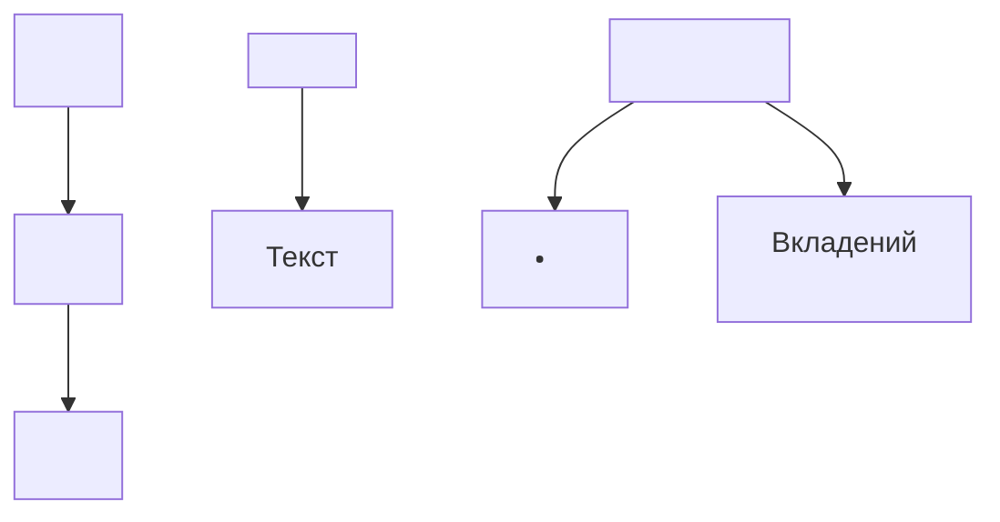
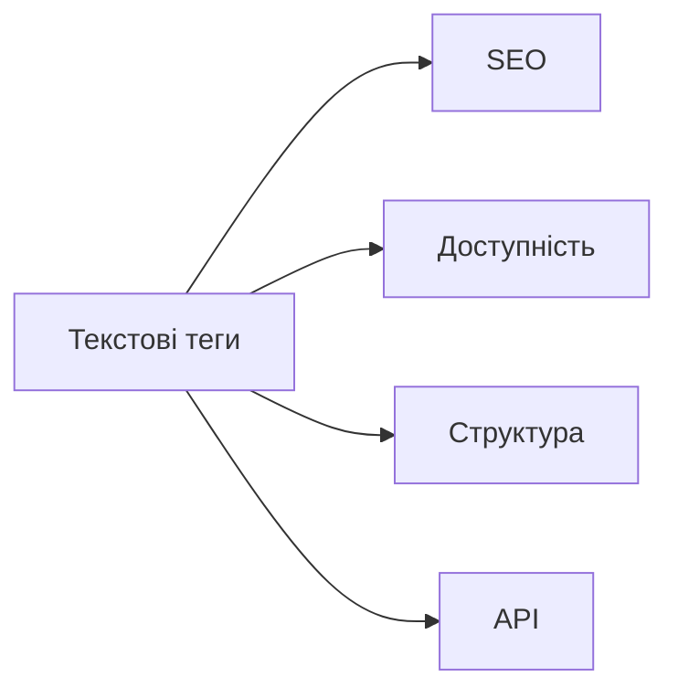

# Робота з текстом: заголовки, абзаци, списки

## Вступ

Текст — основний носій інформації у HTML. Заголовки, абзаци, списки — фундаментальні елементи для структурування, семантики, доступності та SEO. Від правильного використання текстових тегів залежить якість контенту, його читабельність і індексація.

## Історія/Походження

Перші версії HTML містили лише базові текстові теги: `<h1>`, `<p>`, `<ul>`, `<li>`. З розвитком стандарту з’явилися додаткові елементи для форматування, семантики, доступності (`<blockquote>`, `<pre>`, `<code>`, `<mark>`, `<abbr>`, `<dfn>`, `<small>`, `<strong>`, `<em>`).

### Віхи розвитку текстових тегів

-   **HTML 1.0–4.01:** базові заголовки, абзаци, списки, цитати.
-   **HTML5:** семантичні теги для акцентування, форматування, коду, абревіатур.

## Основний матеріал

### Заголовки

-   `<h1>`–`<h6>` — ієрархія заголовків, важлива для SEO та структури.

### Абзаци

-   `<p>` — основний тег для текстових блоків.

### Списки

-   `<ul>` — невпорядкований список (крапки)
-   `<ol>` — впорядкований список (номери)
-   `<li>` — елемент списку

### Додаткові текстові теги

-   `<blockquote>` — цитата
-   `<pre>` — попередньо форматований текст
-   `<code>` — фрагмент коду
-   `<mark>` — виділення
-   `<abbr>` — абревіатура
-   `<dfn>` — визначення терміну
-   `<small>` — дрібний текст
-   `<strong>` — важливий текст
-   `<em>` — акцентований текст

### Семантика тексту

Використання правильних тегів підвищує доступність, SEO, інтеграцію з CSS/JS, формування DOM, роботу скрінрідерів.

## Приклад коду

### Заголовки

```html
<h1>Головний заголовок</h1>
<h2>Підзаголовок</h2>
<h3>Розділ</h3>
```

// Важливо використовувати лише один <h1> на сторінку.

### Абзаци

```html
<p>
    Це абзац тексту. HTML дозволяє структурувати контент для кращої
    читабельності.
</p>
```

### Списки

```html
<ul>
    <li>Перший пункт</li>
    <li>Другий пункт</li>
</ul>
<ol>
    <li>Перший</li>
    <li>Другий</li>
</ol>
```

### Неочевидний приклад: вкладені списки

```html
<ul>
    <li>
        Пункт 1
        <ul>
            <li>Підпункт 1.1</li>
            <li>Підпункт 1.2</li>
        </ul>
    </li>
    <li>Пункт 2</li>
</ul>
```

### Неочевидний приклад: форматування коду

```html
<pre><code>const x = 42;</code></pre>
```

### Неочевидний приклад: акцентування

```html
<p>Це <strong>важливо</strong> і <em>акцентовано</em>.</p>
<mark>Виділений текст</mark>
```

### Неочевидний приклад: абревіатура

```html
<abbr title="HyperText Markup Language">HTML</abbr>
```

### Неочевидний приклад: визначення терміну

```html
<dfn>Семантика</dfn> — це значення елемента у структурі.
```

## Пояснення під капотом

Браузер парсить текстові теги, формує DOM-дерево, визначає структуру, ієрархію, семантику. Заголовки впливають на SEO, абзаци — на читабельність, списки — на структуру даних. Додаткові теги — на доступність, інтеграцію з API.

### Як працює текст у рушії

Текстові елементи формують логічну структуру сторінки, впливають на рендеринг, роботу скрінрідерів, пошукових систем, інтеграцію з JS/CSS.

## Нюанси та підводні камені

-   Використання декількох `<h1>` — погано для SEO
-   Відсутність абзаців — погана читабельність
-   Неправильна вкладеність списків — неочікуваний рендеринг
-   Відсутність семантичних тегів — погана доступність
-   Надмірне використання `<br>` — антипатерн
-   Відсутність атрибуту title у `<abbr>` — втрата сенсу

## Діаграми





## Приклад застосування в реальних проєктах

-   Блоги — заголовки, абзаци, списки для структури
-   Документація — форматування коду, визначення термінів
-   Корпоративні сайти — акцентування, абревіатури
-   SPA — семантична розмітка для інтеграції з фреймворками
-   Email-розсилки — правильна структура для відображення у різних клієнтах

### Кейс: SEO

Використання ієрархії заголовків та абзаців підвищує рейтинг сторінки.

### Кейс: доступність

Списки, абревіатури, визначення термінів — для скрінрідерів.

### Кейс: інтеграція з JS/CSS

Текстові теги дозволяють легко стилізувати та керувати контентом.

## Крос-посилання

-   [Семантичний HTML](./03-semantic-tags.md)
-   [Базова структура HTML-документа](./02-basic-structure.md)
-   [Best practices](./10-best-practices.md)
-   [Робота з медіа](./05-media.md)

## Підсумок

-   Текст — основа контенту HTML
-   Заголовки, абзаци, списки — фундамент структури
-   Семантичні теги — для доступності, SEO, інтеграції
-   Важливо правильно вкладати елементи
-   Неочевидні теги — для форматування, акцентування, визначень
