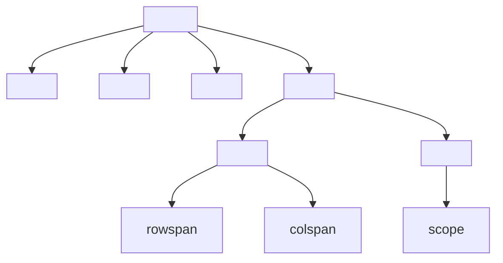
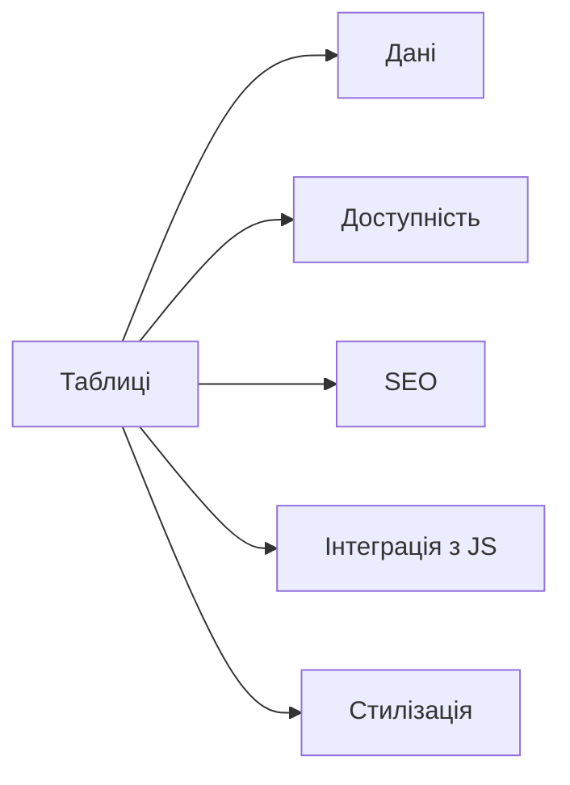

# Таблиці: <table>, <thead>, <tbody>, <tfoot>, <tr>, <td>, <th>

## Вступ

Таблиці — потужний інструмент для представлення структурованих даних у HTML. Вони використовуються для фінансових звітів, розкладів, статистики, порівнянь, а також для складних UI-компонентів.

## Історія/Походження

Перші версії HTML використовували таблиці не лише для даних, а й для верстки. З розвитком CSS таблиці стали суто інструментом для даних. З’явилися семантичні теги, атрибути для доступності, інтеграція з API.

### Віхи розвитку таблиць

-   **HTML 2.0:** `<table>`, `<tr>`, `<td>`, `<th>`
-   **HTML4/HTML5:** `<thead>`, `<tbody>`, `<tfoot>`, атрибути для доступності

## Основний матеріал

### Тег <table>

-   `<table>` — контейнер для таблиці
-   Атрибути: `border`, `cellpadding`, `cellspacing`, `summary`, `aria-label`

### Тег <thead>

-   `<thead>` — заголовок таблиці

### Тег <tbody>

-   `<tbody>` — основна частина таблиці

### Тег <tfoot>

-   `<tfoot>` — підсумки, додаткова інформація

### Тег <tr>

-   `<tr>` — рядок таблиці

### Тег <td>

-   `<td>` — комірка з даними

### Тег <th>

-   `<th>` — комірка із заголовком
-   Атрибути: `scope`, `rowspan`, `colspan`

### Семантика та доступність

-   Атрибути `scope`, `aria-label`, `summary` — для скрінрідерів
-   Правильна структура — для пошукових систем

## Приклад коду

### Базова таблиця

```html
<table border="1">
    <thead>
        <tr>
            <th>Ім’я</th>
            <th>Вік</th>
        </tr>
    </thead>
    <tbody>
        <tr>
            <td>Олег</td>
            <td>25</td>
        </tr>
        <tr>
            <td>Ірина</td>
            <td>30</td>
        </tr>
    </tbody>
    <tfoot>
        <tr>
            <td colspan="2">Всього: 2</td>
        </tr>
    </tfoot>
</table>
```

### Неочевидний приклад: rowspan/colspan

```html
<table border="1">
    <tr>
        <th rowspan="2">Категорія</th>
        <th>Пункт</th>
    </tr>
    <tr>
        <td>Значення</td>
    </tr>
</table>
```

### Неочевидний приклад: scope

```html
<table>
    <tr>
        <th scope="row">Ім’я</th>
        <td>Олег</td>
    </tr>
</table>
```

### Неочевидний приклад: summary, aria-label

```html
<table summary="Таблиця студентів" aria-label="Список студентів">
    <tr>
        <th>Ім’я</th>
        <th>Вік</th>
    </tr>
    <tr>
        <td>Олег</td>
        <td>25</td>
    </tr>
</table>
```

### Неочевидний приклад: таблиця без бордера

```html
<table>
    <tr>
        <td>Без бордера</td>
    </tr>
</table>
```

## Пояснення під капотом

Браузер парсить `<table>`, створює DOM-елементи, формує структуру, обробляє атрибути (rowspan, colspan, scope), забезпечує доступність, інтеграцію з API (DataTables, JS-фреймворки).

### Як працюють таблиці у рушії

Таблиці інтегруються з рушієм браузера, рендеряться у вигляді grid, підтримують навігацію через клавіатуру, скрінрідери, можуть стилізуватися через CSS, інтегруватися з JS для динаміки.

## Нюанси та підводні камені

-   Відсутність `<thead>`, `<tfoot>` — погана семантика
-   Відсутність атрибуту `scope` — недоступно для скрінрідерів
-   Надмірне використання таблиць для верстки — антипатерн
-   Відсутність summary/aria-label — погана доступність
-   Неправильне використання rowspan/colspan — некоректний рендеринг
-   Відсутність border — неочікуваний вигляд

## Діаграми





## Приклад застосування в реальних проєктах

-   Фінансові звіти — складні таблиці з підсумками
-   Розклади — таблиці з rowspan/colspan
-   Статистика — інтеграція з JS для фільтрації
-   Порівняння товарів — таблиці з thead/tfoot
-   UI-компоненти — DataTables, інтеграція з API

### Кейс: доступність

scope, aria-label, summary — для скрінрідерів.

### Кейс: SEO

Правильна структура таблиці підвищує рейтинг сторінки.

### Кейс: інтеграція з JS

DataTables, фільтрація, сортування, AJAX.

## Крос-посилання

-   [Форми](./07-forms.md)
-   [Семантичний HTML](./03-semantic-tags.md)
-   [Best practices](./10-best-practices.md)
-   [Текстові елементи](./04-text.md)

## Підсумок

-   Таблиці — основа структурованих даних у HTML
-   `<table>`, `<thead>`, `<tbody>`, `<tfoot>`, `<tr>`, `<td>`, `<th>` — фундаментальні теги
-   Семантика, доступність, SEO — ключові аспекти
-   Важливо використовувати правильні атрибути
-   Неочевидні приклади — для інтеграції, доступності, UI
