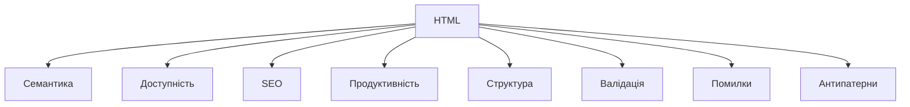
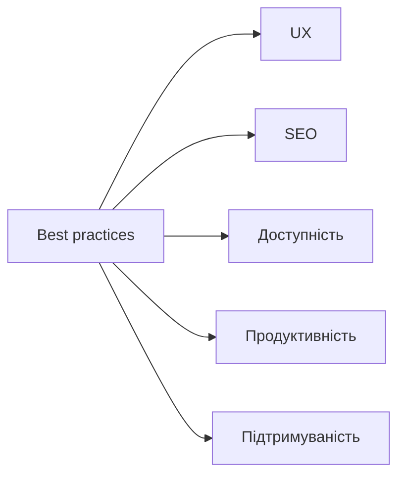

# Best practices, типові помилки, антипатерни

## Вступ

Best practices — це набір перевірених підходів, які допомагають створювати якісний, доступний, підтримуваний HTML-код. Типові помилки та антипатерни — це дії, які призводять до проблем із SEO, UX, доступністю, продуктивністю.

## Історія/Походження

З розвитком вебу сформувалися стандарти, рекомендації W3C, best practices від Google, Mozilla, Microsoft. Антипатерни виникли через неправильне використання тегів, атрибутів, структури.

### Віхи розвитку best practices

-   **HTML4/HTML5:** семантика, доступність, SEO, продуктивність
-   **W3C, WHATWG:** стандарти, рекомендації

## Основний матеріал

### Семантика

-   Використовуйте семантичні теги (`<header>`, `<nav>`, `<main>`, `<section>`, `<article>`, `<footer>`, `<aside>`, `<figure>`, `<figcaption>`, `<mark>`, `<time>`, `<address>`, `
`, `
`, `<dialog>`, `<progress>`, `<meter>`, `<output>`, `<template>`, `<picture>`, `<source>`, `<track>`, `<wbr>`, `<bdi>`, `<bdo>`, `<ruby>`, `<rt>`, `<rp>`, `<data>`, `<datalist>`, `<fieldset>`, `<legend>`, `<optgroup>`, `<output>`, `<samp>`, `<kbd>`, `<var>`, `<abbr>`, `<dfn>`, `<cite>`, `<code>`, `<pre>`, `<small>`, `<strong>`, `<em>`, ``, ``, `<del>`, `<ins>`, `<q>`, `<blockquote>`, `
`, ` `, ``, `
`)
-   Не використовуйте `
` для всього — це антипатерн

### Доступність

-   Використовуйте атрибути `aria-*`, `<label>`, `alt`, `title`, `role`
-   Забезпечуйте навігацію через клавіатуру
-   Перевіряйте контрастність кольорів

### SEO

-   Використовуйте `<h1>` лише один раз на сторінку
-   Додавайте мета-дані: опис, ключові слова, Open Graph
-   Використовуйте семантичні теги для структури

### Продуктивність

-   Оптимізуйте зображення (розмір, формат, lazy loading)
-   Використовуйте адаптивні зображення (`srcset`, `sizes`)
-   Мінімізуйте HTML, CSS, JS
-   Використовуйте кешування

### Структура

-   Дотримуйтесь ієрархії заголовків
-   Використовуйте правильну вкладеність тегів
-   Уникайте надмірної глибини DOM

### Валідація

-   Перевіряйте HTML через [validator.w3.org](https://validator.w3.org/)
-   Виправляйте помилки, попередження

### Неочевидні best practices

-   Використовуйте `<picture>` для адаптивних зображень
-   Використовуйте `<template>` для динамічного контенту
-   Використовуйте `<dialog>` для модальних вікон
-   Використовуйте `
` та `
` для FAQ
-   Використовуйте `<mark>` для виділення тексту

## Типові помилки

-   Відсутність alt у зображеннях
-   Використання декількох `<h1>`
-   Відсутність `<label>` для input
-   Використання ` ` для відступів
-   Надмірне вкладення `
`
-   Відсутність viewport/meta charset
-   Відсутність aria-атрибутів
-   Відсутність favicon
-   Відсутність summary/scope у таблицях
-   Відсутність required у формах
-   Використання таблиць для верстки
-   Відсутність семантики

## Антипатерни

-   Таблиці для верстки
-   Надмірне використання `
`
-   Використання inline-стилів
-   Використання ` ` для структури
-   Відсутність доступності
-   Відсутність мета-даних
-   Відсутність структури
-   Використання deprecated тегів (``, `
`, `<bgsound>`, `<marquee>`, `<blink>`, `<applet>`, `<basefont>`, `<big>`, `<strike>`, `<tt>`, `<u>`, `<xmp>`, `<isindex>`, `<noframes>`, `<frame>`, `<frameset>`, `<acronym>`, `<dir>`, `<menuitem>`, `<rb>`, `<rtc>`, `<spacer>`, `<listing>`, `<nextid>`, `<plaintext>`, `<hgroup>`, `<keygen>`, `<output>`, `<s>`, `
`, ``, `<basefont>`, `<applet>`, `<acronym>`, `<dir>`, `<menuitem>`, `<rb>`, `<rtc>`, `<spacer>`, `<listing>`, `<nextid>`, `<plaintext>`, `<hgroup>`, `<keygen>`, `<output>`, `<s>`)

## Пояснення під капотом

Браузер парсить HTML, формує DOM, перевіряє структуру, семантику, доступність, оптимізує рендеринг, інтегрує з API, забезпечує SEO, UX, продуктивність.

### Як працюють best practices у рушії

Best practices впливають на швидкість завантаження, індексацію, доступність, інтеграцію з JS/CSS, підтримку браузерами, безпеку.

## Нюанси та підводні камені

-   Відсутність семантики — поганий SEO, доступність
-   Надмірне використання `
` — важко підтримувати
-   Відсутність aria-атрибутів — недоступно для скрінрідерів
-   Використання inline-стилів — погана продуктивність
-   Відсутність мета-даних — поганий вигляд у соцмережах
-   Deprecated теги — не підтримуються сучасними браузерами

## Діаграми

## Приклад застосування в реальних проєктах

-   Корпоративні сайти — семантика, доступність, SEO
-   Блоги — структура, мета-дані, оптимізація
-   E-commerce — продуктивність, адаптивність, кешування
-   SPA — семантика, інтеграція з JS, accessibility
-   Документація — структура, валідація, best practices

### Кейс: SEO

Семантика, структура, мета-дані — для індексації.

### Кейс: доступність

aria-атрибути, лейбли, alt — для скрінрідерів.

### Кейс: продуктивність

Lazy loading, оптимізація ресурсів, кешування.

## Крос-посилання

-   [Семантичний HTML](./03-semantic-tags.md)
-   [Текстові елементи](./04-text.md)
-   [Медіа](./05-media.md)
-   [Форми](./07-forms.md)
-   [Таблиці](./08-tables.md)
-   [Мета-дані та head](./09-meta-head.md)

## Підсумок

-   Best practices — основа якісного HTML
-   Семантика, доступність, SEO, продуктивність — ключові аспекти
-   Важливо уникати антипатернів, типових помилок
-   Неочевидні best practices — для інтеграції, доступності, продуктивності
