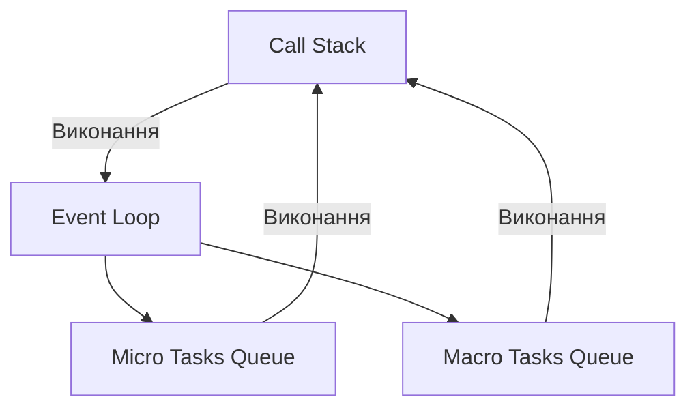
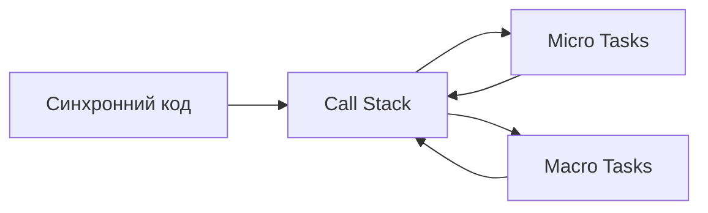

# Event Loop, Call Stack, Micro/Macro Tasks

## Вступ

Event Loop — це фундаментальний механізм JavaScript, який забезпечує асинхронність, неблокуюче виконання коду, роботу з подіями, таймерами, промісами. Call Stack — стек викликів, що визначає порядок виконання функцій. Micro/Macro Tasks — черги задач, які керують пріоритетом виконання асинхронних операцій.

## Історія/Походження

Модель Event Loop з'явилася у браузерах для обробки подій DOM, а потім стала основою Node.js для високопродуктивних серверів. Micro/Macro Tasks були стандартизовані з появою промісів (ES6) та MutationObserver.

## Основний матеріал

### Call Stack

Call Stack — це структура даних (стек), у яку потрапляють всі виклики функцій. JS виконує код по принципу LIFO (Last In, First Out).

### Event Loop

Event Loop — це цикл, який постійно перевіряє, чи є задачі у чергах (micro/macro), і виконує їх, коли стек порожній.

### Micro/Macro Tasks

-   **Micro Tasks:** проміси, MutationObserver, queueMicrotask
-   **Macro Tasks:** setTimeout, setInterval, I/O, events
    Micro Tasks мають вищий пріоритет: виконуються одразу після поточного стеку, перед будь-якими Macro Tasks.

## Приклад коду

### Простий стек викликів

```js
function a() {
    console.log("a");
    b();
}
function b() {
    console.log("b");
    c();
}
function c() {
    console.log("c");
}
a();
// Вивід: a, b, c
```

### Event Loop з таймерами

```js
console.log("start");
setTimeout(() => console.log("timeout"), 0);
Promise.resolve().then(() => console.log("promise"));
console.log("end");
// Вивід: start, end, promise, timeout
```

// Promise (microtask) виконується раніше за setTimeout (macrotask)

### Micro/Macro Tasks у циклі

```js
setTimeout(() => console.log("macro"), 0);
queueMicrotask(() => console.log("micro"));
console.log("main");
// Вивід: main, micro, macro
```

### Неочевидний приклад: рекурсія та стек

```js
function recurse(n) {
    if (n === 0) return;
    recurse(n - 1);
}
recurse(10000); // Stack Overflow!
```

### Неочевидний приклад: блокування Event Loop

```js
while (true) {} // Блокує Event Loop, браузер "зависає"
```

## Пояснення під капотом

JavaScript — однопотокова мова. Весь код виконується у одному потоці, але Event Loop дозволяє обробляти асинхронні задачі, не блокуючи основний потік. Call Stack — це "робочий простір" рушія, а черги задач — "планувальник".

### Як працює Event Loop

1. Виконується весь синхронний код (Call Stack)
2. Після очищення стеку рушій перевіряє Micro Tasks Queue
3. Виконує всі Micro Tasks
4. Потім одну Macro Task
5. Повторює цикл

## Нюанси та підводні камені

-   Таймери не гарантують точний час виконання (затримка залежить від навантаження Event Loop)
-   Stack Overflow при глибокій рекурсії
-   Блокування потоку (while(true)) — браузер "зависає"
-   Неочевидний порядок виконання промісів, таймерів, подій
-   Взаємодія з DOM: події можуть "застрягати" у Macro Tasks
-   В Node.js microtasks виконуються трохи інакше, ніж у браузері

## Діаграми





## Приклад застосування в реальних проєктах

-   Обробка подій у браузері (click, input)
-   Таймери для анімацій, оновлення UI
-   Асинхронні запити (fetch, AJAX)
-   Робота з промісами (async/await)
-   Node.js — високопродуктивні сервери
-   React — оновлення стану через microtasks

### Кейс: debounce/throttle

```js
function debounce(fn, delay) {
    let timer;
    return function (...args) {
        clearTimeout(timer);
        timer = setTimeout(() => fn.apply(this, args), delay);
    };
}
// debounce використовує таймери (macro tasks)
```

### Кейс: асинхронний рендер

```js
async function render() {
    await Promise.resolve(); // microtask
    document.body.innerHTML = "Rendered!";
}
render();
```

## Крос-посилання

-   [Асинхронність: callback, promise, async/await](./10-async.md)
-   [Замикання (Closure)](./06-closure.md)
-   [Error handling, custom errors](./11-error-handling.md)

## Підсумок

-   Event Loop — фундамент JS для асинхронності
-   Call Stack — стек викликів, основа виконання
-   Micro/Macro Tasks — черги задач, що керують пріоритетом
-   Важливо розуміти порядок виконання для коректної роботи коду
-   Event Loop — основа для сучасних фреймворків, серверів, UI
