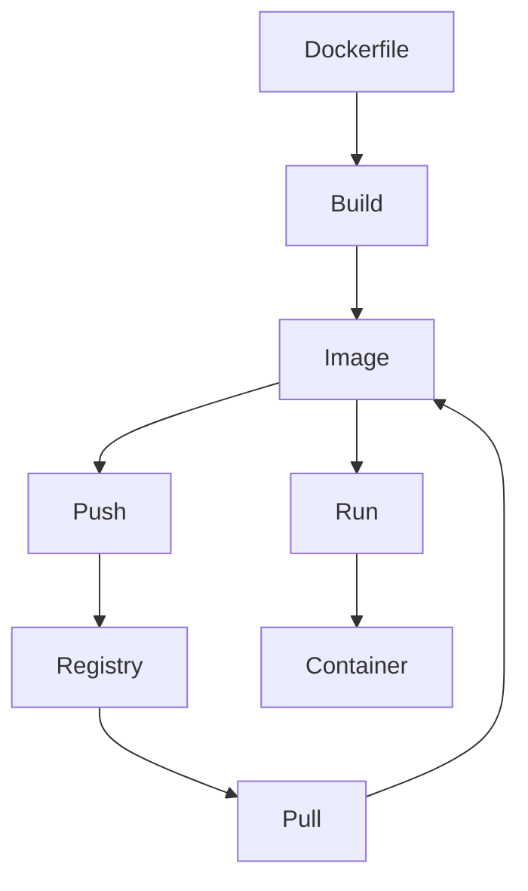

# Docker: Основні поняття

Docker — це платформа для розробки, доставки та запуску застосунків у контейнерах, що забезпечує ізоляцію, портативність та ефективне використання ресурсів.

## Ключові компоненти Docker

### Image (Образ)

**Образ** — це легковагий, автономний, виконуваний пакет, що містить все необхідне для запуску застосунку: код, середовище виконання, системні інструменти, бібліотеки та налаштування.

```bash
# Отримати образ з Docker Hub
docker pull nginx:latest

# Перегляд наявних образів
docker images
```

**Підкапотні механізми:**

-   Образи побудовані з шарів (layers), кожен шар відповідає інструкції в Dockerfile
-   Шари кешуються та використовуються повторно між образами
-   Образи зберігаються у реєстрі (локальному або віддаленому)
-   Образи є незмінними (immutable) — після створення їх не можна змінити

### Container (Контейнер)

**Контейнер** — це запущений екземпляр образу, що є ізольованим середовищем з власною файловою системою, мережею та процесами.

```bash
# Запустити контейнер
docker run -d --name my-nginx -p 80:80 nginx:latest

# Перегляд запущених контейнерів
docker ps
```

**Підкапотні механізми:**

-   Контейнери використовують технології ядра Linux: namespaces (для ізоляції процесів, мережі, файлової системи) та cgroups (для обмеження ресурсів)
-   Контейнери мають верхній шар із можливістю запису (writable layer)
-   Контейнери ефективно використовують ресурси, оскільки не потребують гіпервізора

### Registry (Реєстр)

**Реєстр** — це сховище Docker-образів, де вони зберігаються та розповсюджуються.

```bash
# Відправити образ у реєстр
docker push username/my-app:1.0

# Отримати образ з реєстру
docker pull username/my-app:1.0
```

**Підкапотні механізми:**

-   Docker Hub — публічний реєстр за замовчуванням
-   Приватні реєстри дозволяють зберігати внутрішні образи організації
-   Реєстри підтримують автентифікацію та авторизацію
-   Образи передаються шарами, що дозволяє оптимізувати передачу даних

### Dockerfile

**Dockerfile** — це текстовий файл з інструкціями для автоматичного створення Docker-образу.

```dockerfile
# Приклад простого Dockerfile
FROM node:14-alpine
WORKDIR /app
COPY package*.json ./
RUN npm install
COPY . .
EXPOSE 3000
CMD ["npm", "start"]
```

**Підкапотні механізми:**

-   Кожна інструкція в Dockerfile створює новий шар в образі
-   Інструкції виконуються послідовно, зверху вниз
-   Docker використовує кеш для прискорення збірки

### Tag (Тег)

**Тег** — це ідентифікатор для конкретної версії образу, що дозволяє розрізняти різні версії одного образу.

```bash
# Створення тегу для образу
docker tag nginx:latest my-nginx:v1.0

# Отримання образу з конкретним тегом
docker pull python:3.9-slim
```

**Підкапотні механізми:**

-   Теги — це просто вказівники на конкретні образи
-   Один образ може мати кілька тегів
-   Якщо тег не вказано, за замовчуванням використовується "latest"
-   "latest" не обов'язково означає найновішу версію

## Взаємодія між компонентами



## Підводні камені та оптимізація

1. **Розмір образів**:

    - Використовуйте легкі базові образи (alpine, slim)
    - Очищуйте тимчасові файли та кеш пакетних менеджерів в одному шарі
    - Застосовуйте multi-stage builds для зменшення розміру кінцевого образу

2. **Безпека**:

    - Не використовуйте тег "latest" в production
    - Регулярно оновлюйте базові образи для усунення вразливостей
    - Сканування образів на наявність відомих вразливостей

3. **Продуктивність**:
    - Розміщуйте інструкції, що рідше змінюються, на початку Dockerfile
    - Використовуйте .dockerignore для виключення непотрібних файлів
    - Групуйте команди RUN для зменшення кількості шарів
