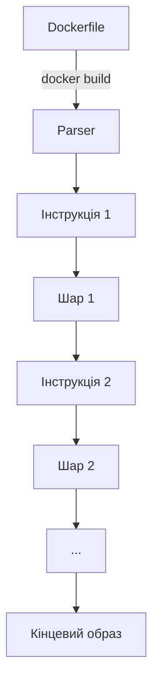

# Docker: Dockerfile

Dockerfile — це текстовий файл з інструкціями для автоматичного створення Docker-образу. Правильно написаний Dockerfile є основою ефективної контейнеризації.

## Основні інструкції Dockerfile

### FROM

**FROM** — вказує базовий образ, на основі якого будується новий.

```dockerfile
# Використання офіційного образу Node.js
FROM node:16-alpine

# Багатоетапна збірка з різними базовими образами
FROM golang:1.17 AS builder
# ... (перший етап)
FROM alpine:3.14
# ... (другий етап)
```

**Підкапотні механізми:**

-   Це перша дійсна інструкція в Dockerfile (крім ARG)
-   Базовий образ надає початкове середовище та файлову систему
-   Використання конкретного тегу (не latest) гарантує стабільність

### RUN

**RUN** — виконує команди у новому шарі поверх поточного образу.

```dockerfile
# Встановлення залежностей в Ubuntu-подібних системах
RUN apt-get update && \
    apt-get install -y --no-install-recommends curl git && \
    apt-get clean && \
    rm -rf /var/lib/apt/lists/*

# Встановлення залежностей NPM
RUN npm install --production
```

**Підкапотні механізми:**

-   Кожна інструкція RUN створює новий шар у файловій системі
-   Використання && та \ дозволяє об'єднати команди в один шар
-   Очищення кешу пакетних менеджерів зменшує розмір образу

### COPY / ADD

**COPY** — копіює файли з хост-системи в образ.
**ADD** — розширена версія COPY з додатковими можливостями.

```dockerfile
# Копіювання файлів проекту
COPY package.json package-lock.json ./
COPY src/ ./src

# ADD може розпаковувати архіви
ADD project.tar.gz /app/
```

**Підкапотні механізми:**

-   COPY більш передбачуваний і рекомендований для більшості випадків
-   ADD автоматично розпаковує локальні tar-архіви та може завантажувати файли з URL
-   Кожна інструкція створює новий шар

### WORKDIR

**WORKDIR** — встановлює робочий каталог для наступних інструкцій.

```dockerfile
# Встановлення робочого каталогу
WORKDIR /app

# Відносні шляхи інтерпретуються щодо поточного WORKDIR
WORKDIR src
RUN pwd  # Виведе /app/src
```

**Підкапотні механізми:**

-   Створює каталог, якщо він не існує
-   Впливає на всі наступні інструкції (RUN, CMD, ENTRYPOINT, COPY, ADD)
-   Може використовуватись кілька разів для зміни каталогу

### ENV

**ENV** — встановлює змінні середовища.

```dockerfile
# Встановлення змінних середовища
ENV NODE_ENV production
ENV PORT=3000 DEBUG=false

# Використання у подальших командах
RUN echo $NODE_ENV
```

**Підкапотні механізми:**

-   Змінні доступні під час збірки та виконання контейнера
-   Можна перевизначити при запуску контейнера
-   Часто використовуються для конфігурації застосунків

### EXPOSE

**EXPOSE** — інформує Docker про порти, які слухає контейнер.

```dockerfile
# Вказання портів
EXPOSE 80
EXPOSE 443 8080
```

**Підкапотні механізми:**

-   Це лише документація, не відкриває порти автоматично
-   Для фактичного відкриття порту потрібно використовувати опцію -p при запуску
-   Сприяє автоматичному налаштуванню мережевих з'єднань між контейнерами

### CMD / ENTRYPOINT

**CMD** — визначає команду за замовчуванням для запуску контейнера.
**ENTRYPOINT** — конфігурує контейнер, який запускається як виконуваний файл.

```dockerfile
# CMD у форматі exec (рекомендовано)
CMD ["node", "server.js"]

# ENTRYPOINT з CMD як параметрами
ENTRYPOINT ["nginx"]
CMD ["-g", "daemon off;"]
```

**Підкапотні механізми:**

-   В одному Dockerfile може бути лише один CMD (враховується останній)
-   CMD можна перевизначити через аргументи командного рядка при запуску
-   ENTRYPOINT визначає точку входу, а CMD надає параметри за замовчуванням
-   Shell-формат (`CMD npm start`) створює додатковий процес оболонки

### HEALTHCHECK

**HEALTHCHECK** — вказує команду для перевірки здоров'я контейнера.

```dockerfile
# Перевірка веб-сервера
HEALTHCHECK --interval=30s --timeout=3s --start-period=5s --retries=3 \
    CMD curl -f http://localhost/ || exit 1

# Вимкнення перевірки здоров'я
HEALTHCHECK NONE
```

**Підкапотні механізми:**

-   Docker запускає команду періодично і відстежує її статус
-   Статуси: starting, healthy, unhealthy
-   Не впливає на роботу контейнера, лише на моніторинг

### USER

**USER** — встановлює користувача (або UID) для виконання подальших інструкцій та запуску контейнера.

```dockerfile
# Створення користувача та перемикання на нього
RUN addgroup -S appgroup && adduser -S appuser -G appgroup
USER appuser

# Використання UID напряму
USER 1001
```

**Підкапотні механізми:**

-   За замовчуванням використовується root
-   Запуск від непривілейованого користувача підвищує безпеку
-   Впливає на виконання RUN, CMD, ENTRYPOINT

### Multi-stage Builds

**Multi-stage Builds** — техніка створення легких образів шляхом використання кількох етапів збірки.

```dockerfile
# Етап збірки
FROM node:16 AS build
WORKDIR /app
COPY package*.json ./
RUN npm install
COPY . .
RUN npm run build

# Етап виконання
FROM nginx:alpine
COPY --from=build /app/dist /usr/share/nginx/html
```

**Підкапотні механізми:**

-   Дозволяє розділити інструменти збірки та середовище виконання
-   Значно зменшує розмір кінцевого образу
-   Підвищує безпеку, видаляючи інструменти збірки з кінцевого образу

## Порядок виконання та оптимізація

### Оптимальний порядок інструкцій

```dockerfile
FROM alpine:3.14
WORKDIR /app
COPY package*.json ./
RUN npm install
COPY . .
ENV NODE_ENV=production
EXPOSE 3000
USER node
CMD ["node", "index.js"]
```

**Рекомендації з оптимізації:**

1. Розміщуйте інструкції від найменш до найбільш змінюваних
2. Використовуйте .dockerignore для виключення непотрібних файлів
3. Об'єднуйте пов'язані команди RUN для зменшення кількості шарів
4. Видаляйте тимчасові файли в тому ж шарі, де вони створені
5. Використовуйте multi-stage builds для складних застосунків
6. Вказуйте конкретні версії залежностей для відтворюваності

## Схема побудови образу



## Підводні камені

1. **Кеш збірки:**

    - Зміна файлу інвалідує кеш для цієї інструкції та всіх наступних
    - Інструкції ADD/COPY чутливі до вмісту файлів
    - RUN apt-get update окремо може призвести до використання застарілих пакетів

2. **Розмір образу:**

    - Кожен шар додає розмір, навіть якщо видаляються файли
    - Використовуйте --squash при збірці для стиснення всіх шарів в один (експериментальна функція)

3. **Безпека:**
    - Не зберігайте секрети в Dockerfile (використовуйте build args або secrets)
    - Не запускайте застосунки від root-користувача
    - Регулярно оновлюйте базові образи
