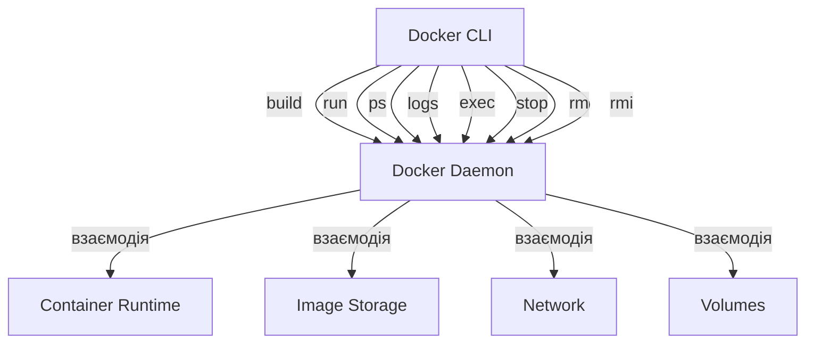

# Docker: Робота з образами/контейнерами (CLI)

Docker CLI (Command Line Interface) — це основний інструмент для взаємодії з Docker. Він дозволяє керувати образами, контейнерами та іншими ресурсами Docker.

## Основні команди

### Робота з образами

#### build

**build** — створює Docker-образ з Dockerfile.

```bash
# Базова команда збірки
docker build -t myapp:1.0 .

# Збірка з вказанням Dockerfile
docker build -f Dockerfile.prod -t myapp:prod .

# Передача аргументів збірки
docker build --build-arg VERSION=1.2.3 -t myapp:1.2.3 .
```

**Підкапотні механізми:**

-   Docker клієнт відправляє весь контекст збірки (файли в поточному каталозі) демону Docker
-   Демон послідовно виконує інструкції Dockerfile, створюючи проміжні шари
-   Кожен шар кешується для пришвидшення наступних збірок
-   Використовуйте .dockerignore для виключення непотрібних файлів з контексту

#### run

**run** — створює та запускає новий контейнер з вказаного образу.

```bash
# Базовий запуск контейнера
docker run nginx

# Запуск у фоновому режимі з іменем та мапінгом портів
docker run -d --name web -p 8080:80 nginx

# Запуск з обмеженням ресурсів
docker run -d --memory=512m --cpus=0.5 nginx

# Запуск з монтуванням томів
docker run -v /host/path:/container/path nginx

# Передача змінних середовища
docker run -e DB_HOST=localhost -e DB_PORT=5432 myapp
```

**Підкапотні механізми:**

-   Docker створює файлову систему для контейнера на основі образу
-   Додає шар з можливістю запису поверх незмінних шарів образу
-   Налаштовує мережу, DNS, вводу/виводу
-   Запускає вказану команду (CMD або ENTRYPOINT з Dockerfile)

#### ps

**ps** — показує запущені контейнери.

```bash
# Перегляд запущених контейнерів
docker ps

# Перегляд усіх контейнерів (включно з зупиненими)
docker ps -a

# Відображення розміру контейнерів
docker ps -s

# Форматований вивід
docker ps --format "table {{.ID}}\t{{.Names}}\t{{.Status}}"
```

**Підкапотні механізми:**

-   Відображає метадані контейнерів зі сховища Docker
-   Фільтрує результати на основі вказаних опцій
-   Не вимагає особливих привілеїв для виконання

#### logs

**logs** — отримує логи контейнера.

```bash
# Перегляд логів контейнера
docker logs web

# Перегляд останніх N рядків
docker logs --tail 100 web

# Постійне відстеження логів
docker logs -f web

# Перегляд логів з мітками часу
docker logs -t web
```

**Підкапотні механізми:**

-   Зчитує потоки stdout та stderr контейнера
-   За замовчуванням використовує драйвер логування json-file
-   Лог-файли зберігаються на хості у /var/lib/docker/containers/
-   Доступні альтернативні драйвери: syslog, journald, fluentd та інші

#### exec

**exec** — виконує команду у запущеному контейнері.

```bash
# Виконання одиночної команди
docker exec web ls -la

# Інтерактивний shell у контейнері
docker exec -it web bash

# Виконання від імені іншого користувача
docker exec -u www-data web whoami
```

**Підкапотні механізми:**

-   Використовує механізм Linux namespaces для входу в простір процесів контейнера
-   Не створює новий контейнер, а працює в існуючому
-   Опція -i (interactive) тримає STDIN відкритим
-   Опція -t (tty) виділяє псевдо-TTY

#### stop

**stop** — зупиняє запущені контейнери.

```bash
# Зупинка контейнера за іменем
docker stop web

# Зупинка кількох контейнерів
docker stop web db redis

# Зупинка всіх контейнерів
docker stop $(docker ps -q)

# Зупинка з таймаутом
docker stop --time=30 web
```

**Підкапотні механізми:**

-   Спочатку надсилає сигнал SIGTERM процесу з PID 1 у контейнері
-   Якщо контейнер не завершується протягом 10 секунд (за замовчуванням), надсилає SIGKILL
-   Контейнер зупиняється, але не видаляється (дані зберігаються)

#### rm

**rm** — видаляє один або більше контейнерів.

```bash
# Видалення контейнера за іменем
docker rm web

# Видалення запущеного контейнера
docker rm -f web

# Видалення всіх зупинених контейнерів
docker container prune

# Видалення з томами
docker rm -v web
```

**Підкапотні механізми:**

-   Видаляє метадані контейнера зі сховища Docker
-   Видаляє файлову систему контейнера
-   Опція -v видаляє анонімні томи, приєднані до контейнера
-   Не можна видалити запущений контейнер без опції -f

#### rmi

**rmi** — видаляє один або більше образів.

```bash
# Видалення образу за тегом
docker rmi nginx:latest

# Видалення образу за ID
docker rmi a6c3b5f2d35d

# Видалення всіх незадіяних образів
docker image prune

# Видалення всіх незадіяних образів (включно з тегованими)
docker image prune -a
```

**Підкапотні механізми:**

-   Видаляє посилання (теги) на образи
-   Видаляє шари образу, якщо на них немає інших посилань
-   Не може видалити образи, які використовуються контейнерами
-   Шари, які використовуються кількома образами, видаляються лише коли видалено всі залежні образи

## Найважливіші параметри

### Загальні опції

```bash
# Обмеження ресурсів
--memory=512m        # Обмеження пам'яті
--cpus=0.5           # Обмеження CPU (половина ядра)
--pids-limit=100     # Обмеження кількості процесів

# Налаштування мережі
-p, --publish=8080:80  # Проброс портів (host:container)
--network=host         # Використання мережі хоста
--dns=8.8.8.8          # Налаштування DNS

# Налаштування томів
-v, --volume=/host:/container  # Монтування тому
--mount type=bind,src=/host,dst=/container  # Новий синтаксис монтування

# Змінні середовища
-e, --env=KEY=VALUE   # Встановлення змінної середовища
--env-file=.env       # Завантаження змінних з файлу

# Метадані
--name=web            # Ім'я контейнера
--label=com.example.description="Web server"  # Мітка
```

## Схема взаємодії компонентів CLI



## Корисні патерни та рецепти

### Одноразові контейнери

```bash
# Запуск одноразового контейнера, який самовидаляється
docker run --rm alpine echo "Hello, world"

# Запуск інтерактивного сеансу bash
docker run --rm -it ubuntu bash
```

### Копіювання файлів

```bash
# Копіювання з контейнера на хост
docker cp web:/var/log/nginx/access.log ./access.log

# Копіювання з хоста в контейнер
docker cp ./config.ini web:/etc/myapp/config.ini
```

### Запуск із заміною entrypoint

```bash
# Заміна entrypoint на іншу команду
docker run --entrypoint=bash nginx -c "echo Hello"
```

### Отримання інформації

```bash
# Деталі контейнера у форматі JSON
docker inspect web

# Статистика використання ресурсів
docker stats

# Перегляд історії образу
docker history nginx:latest
```

## Підводні камені та оптимізація

1. **Продуктивність:**

    - Використовуйте `-d` (detached) для запуску контейнерів у фоні
    - Обмежуйте ресурси контейнерів для запобігання вичерпання ресурсів хоста
    - Використовуйте `docker system prune` для очищення невикористаних ресурсів

2. **Безпека:**

    - Не використовуйте `--privileged` без крайньої необхідності
    - Обмежуйте можливості (capabilities) контейнерів
    - Використовуйте непривілейованих користувачів у контейнерах

3. **Управління логами:**

    - Налаштовуйте ротацію логів для запобігання заповнення диску
    - Використовуйте централізовані системи логування у production
    - Обмежуйте розмір логів: `--log-opt max-size=10m --log-opt max-file=3`

4. **Мережа:**
    - Використовуйте користувацькі мережі замість --link (застаріло)
    - Пам'ятайте, що проброс портів може створювати додаткове навантаження
    - Для високопродуктивних застосунків розгляньте режим host network
