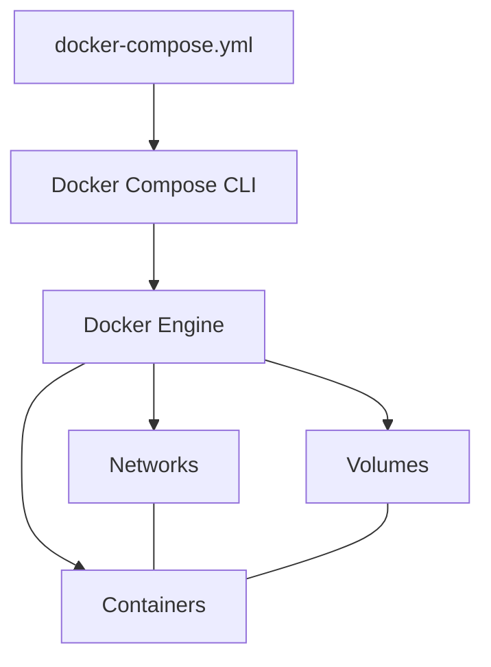

# Docker Compose

Docker Compose — це інструмент для визначення та запуску багатоконтейнерних Docker-застосунків. З Compose ви використовуєте YAML-файл для налаштування сервісів вашого застосунку, а потім створюєте та запускаєте всі сервіси з цієї конфігурації одною командою.

## Основні компоненти

### services

**services** — визначає контейнери, які повинні бути створені.

```yaml
version: "3.8"
services:
    web:
        image: nginx:alpine
        ports:
            - "80:80"

    api:
        build: ./api
        ports:
            - "3000:3000"
        environment:
            - NODE_ENV=production
```

**Підкапотні механізми:**

-   Кожен сервіс стає окремим контейнером
-   Імена сервісів використовуються як DNS-імена в мережі Docker
-   Порядок запуску можна контролювати через `depends_on`
-   Compose створює мережу за замовчуванням для всіх сервісів

### volumes

**volumes** — визначає постійні томи для контейнерів.

```yaml
services:
    db:
        image: postgres:13
        volumes:
            - postgres_data:/var/lib/postgresql/data
            - ./init.sql:/docker-entrypoint-initdb.d/init.sql

volumes:
    postgres_data:
        driver: local
```

**Підкапотні механізми:**

-   Іменовані томи (`postgres_data`) зберігаються між запусками compose
-   Bind-монтування (`./init.sql:...`) монтує файли з хоста в контейнер
-   Томи можуть мати додаткові налаштування через `driver_opts`
-   Томи можуть бути спільними між кількома сервісами

### networks

**networks** — визначає мережі для комунікації між сервісами.

```yaml
services:
    web:
        networks:
            - frontend

    api:
        networks:
            - frontend
            - backend

    db:
        networks:
            - backend

networks:
    frontend:
    backend:
        internal: true # доступна лише для сервісів, не для зовнішніх підключень
```

**Підкапотні механізми:**

-   Compose створює виділені мережі для ізоляції та комунікації
-   Сервіси можуть належати до кількох мереж
-   Можна використовувати зовнішні мережі через `external: true`
-   Підтримуються різні драйвери мереж: bridge, host, overlay та інші

### depends_on

**depends_on** — визначає залежності між сервісами.

```yaml
services:
    web:
        image: nginx
        depends_on:
            - api

    api:
        build: ./api
        depends_on:
            - db

    db:
        image: postgres
```

**Підкапотні механізми:**

-   Визначає порядок запуску сервісів
-   Сервіс чекає, поки залежності запустяться (але не обов'язково будуть готові)
-   Для очікування готовності сервісів потрібні додаткові інструменти (healthcheck або скрипти)
-   Також впливає на порядок зупинки (зворотний)

## Команди Docker Compose

### Основні команди

```bash
# Запуск сервісів
docker-compose up

# Запуск у фоновому режимі
docker-compose up -d

# Зупинка сервісів
docker-compose down

# Зупинка з видаленням томів
docker-compose down -v

# Перегляд логів
docker-compose logs

# Перегляд запущених сервісів
docker-compose ps

# Виконання команди в сервісі
docker-compose exec web bash

# Перезапуск сервісів
docker-compose restart

# Збірка образів
docker-compose build

# Збірка без кешу
docker-compose build --no-cache
```

## Розширені можливості

### build

**build** — налаштування збірки Docker-образу.

```yaml
services:
    api:
        build:
            context: ./api
            dockerfile: Dockerfile.prod
            args:
                - NODE_ENV=production
            target: production
```

**Підкапотні механізми:**

-   `context` — шлях до контексту збірки
-   `dockerfile` — ім'я використовуваного Dockerfile
-   `args` — аргументи збірки, що передаються в Dockerfile
-   `target` — цільовий етап для multi-stage builds

### image

**image** — вказує образ для сервісу.

```yaml
services:
    web:
        image: nginx:alpine

    # Збірка з тегом
    api:
        build: ./api
        image: myorg/myapi:latest
```

**Підкапотні механізми:**

-   Можна використовувати разом з `build` для тегування образу
-   Якщо вказано лише `image`, контейнер запускається з готового образу
-   Підтримує іменовані теги та хеші образів

## Розширена конфігурація

### Змінні середовища

```yaml
services:
    web:
        # Окремі змінні
        environment:
            - DEBUG=true
            - API_URL=http://api:3000

        # З файлу .env
        env_file:
            - .env.web
```

### Налаштування ресурсів

```yaml
services:
    api:
        deploy:
            resources:
                limits:
                    cpus: "0.5"
                    memory: 512M
                reservations:
                    cpus: "0.25"
                    memory: 256M
```

### Healthcheck

```yaml
services:
    web:
        image: nginx
        healthcheck:
            test: ["CMD", "curl", "-f", "http://localhost"]
            interval: 30s
            timeout: 10s
            retries: 3
            start_period: 5s
```

### Масштабування

```yaml
# Запуск декількох екземплярів сервісу
docker-compose up -d --scale web=3 --scale worker=5
```

## Схема взаємодії компонентів



## Версії файлу docker-compose.yml

```yaml
# docker-compose.yml

# Версія 2
version: '2'
services:
  # ...

# Версія 3 (рекомендується)
version: '3.8'
services:
  # ...
```

**Відмінності між версіями:**

-   Версія 1: Застаріла, не має ключа `version`
-   Версія 2: Додано іменовані томи, мережі, залежності
-   Версія 3: Підтримка Swarm mode, deploy параметрів
-   Останні версії (3.7+): Додаткові функції для томів, healthchecks та інше

## Типові паттерни використання

### Стек для веб-розробки

```yaml
version: "3.8"

services:
    web:
        build: ./frontend
        ports:
            - "80:80"
        depends_on:
            - api

    api:
        build: ./backend
        environment:
            - DB_HOST=db
            - DB_USER=postgres
            - DB_PASS=secret
        depends_on:
            - db
        volumes:
            - ./backend:/app
            - /app/node_modules

    db:
        image: postgres:13
        environment:
            - POSTGRES_USER=postgres
            - POSTGRES_PASSWORD=secret
        volumes:
            - postgres_data:/var/lib/postgresql/data

volumes:
    postgres_data:
```

### Стек для мікросервісів

```yaml
version: "3.8"

services:
    nginx:
        image: nginx:alpine
        ports:
            - "80:80"
        volumes:
            - ./nginx.conf:/etc/nginx/nginx.conf
        depends_on:
            - service1
            - service2

    service1:
        build: ./service1
        environment:
            - REDIS_URL=redis://cache
        depends_on:
            - cache

    service2:
        build: ./service2
        environment:
            - MONGO_URL=mongodb://db
        depends_on:
            - db

    db:
        image: mongo:4
        volumes:
            - mongo_data:/data/db

    cache:
        image: redis:alpine
        volumes:
            - redis_data:/data

volumes:
    mongo_data:
    redis_data:
```

## Підводні камені та оптимізація

1. **Залежності:**

    - `depends_on` не чекає, поки сервіс буде готовий до роботи
    - Використовуйте healthchecks або скрипти очікування для надійних залежностей
    - Приклад скрипта очікування: [wait-for-it.sh](https://github.com/vishnubob/wait-for-it)

2. **Змінні середовища:**

    - Не зберігайте секрети в docker-compose.yml у репозиторії
    - Використовуйте .env файли для змінних або Docker Secrets в Swarm
    - Змінні з командного рядка можуть перевизначати змінні з файлів

3. **Мережі:**

    - DNS-резолвінг використовує імена сервісів
    - Для зовнішнього доступу потрібен маппінг портів
    - Внутрішні мережі ізолюють сервіси від зовнішнього світу

4. **Продуктивність:**

    - Використовуйте Docker BuildKit для швидкої збірки: `COMPOSE_DOCKER_CLI_BUILD=1 DOCKER_BUILDKIT=1`
    - Для production використовуйте pre-built образи, а не `build` директиву
    - Розділяйте розробницькі та production конфігурації

5. **Масштабування:**
    - Docker Compose не оптимальний для масштабування в production
    - Для production краще використовувати Docker Swarm або Kubernetes
    - Масштабування через `--scale` працює лише з правильно налаштованими портами
