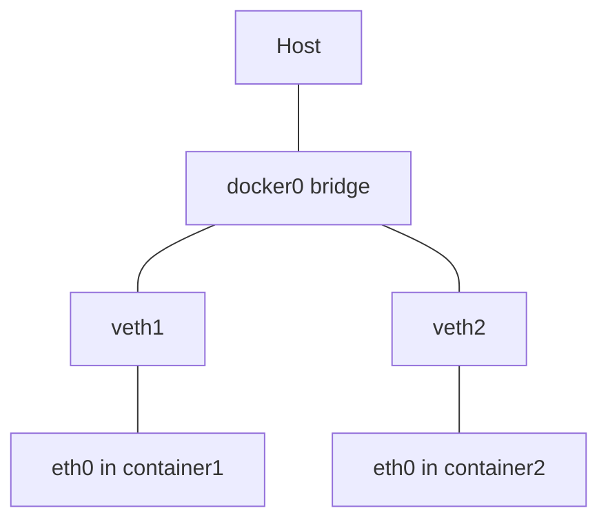
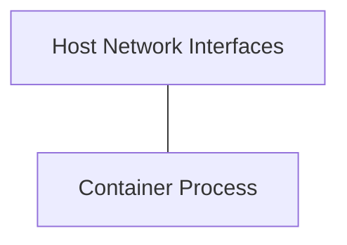
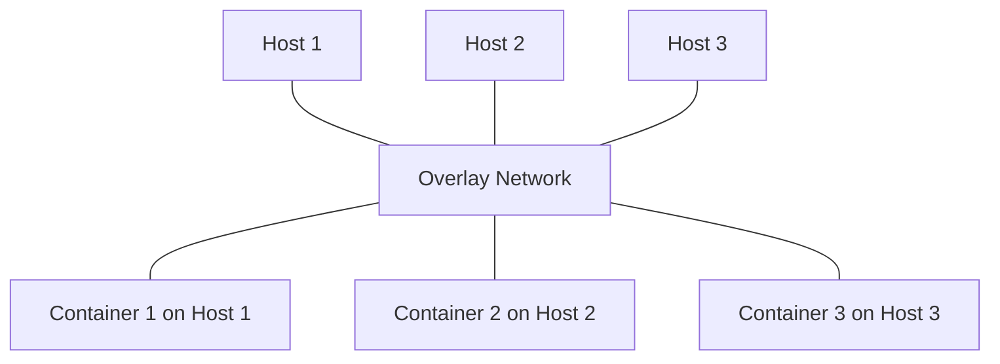
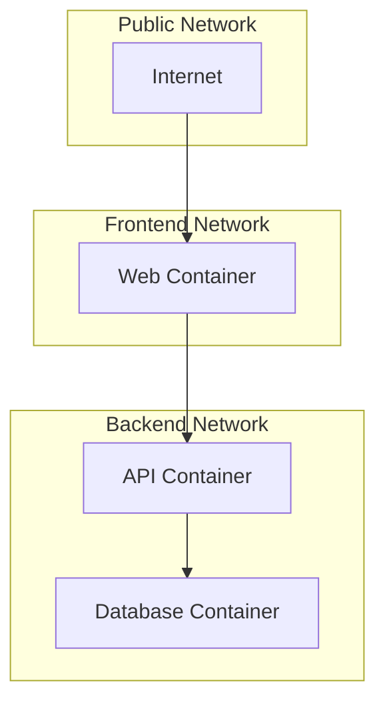
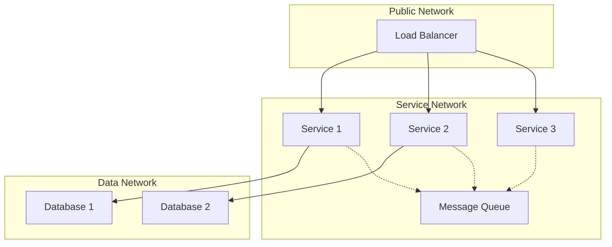

# Docker: Мережі

Docker мережі — це механізм, що забезпечує комунікацію між контейнерами та зовнішнім світом. Розуміння мережевих моделей Docker критично важливе для розробки багатоконтейнерних застосунків.

## Типи мереж

### bridge

**bridge** — це мережа за замовчуванням, що забезпечує ізольовану внутрішню мережу для контейнерів з можливістю зовнішнього доступу.

```bash
# Створення користувацької bridge-мережі
docker network create my-network

# Запуск контейнера в цій мережі
docker run --network=my-network --name=container1 nginx

# Підключення існуючого контейнера до мережі
docker network connect my-network container2
```

**Підкапотні механізми:**

-   Реалізована через Linux-bridge та iptables
-   Кожен контейнер отримує власну IP-адресу
-   Контейнери в одній мережі можуть спілкуватися за іменами
-   Забезпечує NAT для вихідного трафіку
-   Для вхідного трафіку потрібне пробкидання портів (-p)



### host

**host** — мережа, яка використовує мережевий стек хост-системи без ізоляції.

```bash
# Запуск контейнера в host-мережі
docker run --network=host nginx
```

**Підкапотні механізми:**

-   Немає мережевої ізоляції від хоста
-   Немає віртуальних інтерфейсів або NAT
-   Контейнер використовує всі мережеві інтерфейси хоста
-   Порти прослуховуються безпосередньо на хості
-   Найвища продуктивність, але найнижча ізоляція



### overlay

**overlay** — розподілена мережа, що з'єднує контейнери на різних хостах.

```bash
# Створення overlay-мережі (потребує Docker Swarm)
docker network create --driver=overlay my-overlay-network

# Створення сервісу в overlay-мережі
docker service create --network=my-overlay-network --name=myservice nginx
```

**Підкапотні механізми:**

-   Використовує VXLAN для інкапсуляції пакетів
-   Працює через UDP-порт 4789 для інкапсуляції
-   Забезпечує розподілений DNS для пошуку сервісів
-   Автоматично маршрутизує трафік між вузлами
-   Оптимізована для Docker Swarm, але доступна і для Kubernetes



## Публікація портів vs внутрішні мережі

### Публікація портів

```bash
# Публікація порту (HOSTPORT:CONTAINERPORT)
docker run -p 8080:80 nginx

# Публікація на конкретному інтерфейсі
docker run -p 127.0.0.1:8080:80 nginx

# Публікація на випадковому порті
docker run -p 80 nginx
```

**Підкапотні механізми:**

-   Docker налаштовує правила iptables для перенаправлення трафіку
-   Створює додаткове навантаження через NAT
-   Дозволяє зовнішнім клієнтам підключатися до контейнера
-   Можливе обмеження доступу на конкретний інтерфейс

### Внутрішні мережі

```bash
# Створення користувацької внутрішньої мережі
docker network create --internal private-network

# Запуск контейнерів у цій мережі
docker run --network=private-network --name=db postgres
docker run --network=private-network --name=backend myapp
```

**Підкапотні механізми:**

-   Повна ізоляція від зовнішнього світу (немає вихідного з'єднання)
-   Контейнери спілкуються між собою за іменами
-   Підвищена безпека для чутливих сервісів (бази даних)
-   Для доступу ззовні потрібен шлюзовий контейнер

## DNS в Docker мережах

```bash
# Контейнери в користувацьких мережах можуть звертатись один до одного за іменами
docker network create mynet
docker run --network=mynet --name=api api-image
docker run --network=mynet --name=web web-image
# Тепер web може звертатись до api за іменем "api"
```

**Підкапотні механізми:**

-   Docker надає вбудований DNS-сервер (127.0.0.11)
-   Записи автоматично створюються для кожного контейнера
-   Оновлення DNS відбувається в реальному часі
-   Підтримка round-robin DNS для масштабованих сервісів

## Мережеві драйвери

Docker підтримує різні мережеві драйвери через плагіни:

1. **bridge** — стандартний драйвер для ізольованих мереж на одному хості
2. **host** — використання мережевого стеку хоста
3. **overlay** — розподілена мережа між кількома хостами
4. **macvlan** — призначення MAC-адрес контейнерам (схоже на фізичні пристрої)
5. **none** — відключення мережі
6. **Сторонні драйвери** — Calico, Weave, Cilium та інші

## Керування мережами

```bash
# Список мереж
docker network ls

# Деталі мережі
docker network inspect my-network

# Створення мережі
docker network create --driver=bridge --subnet=172.20.0.0/16 my-network

# Видалення мережі
docker network rm my-network

# Очищення невикористаних мереж
docker network prune
```

## Мережеві топології

### Базовий веб-стек



### Мікросервісна архітектура



## Приклади конфігурацій

### Багаторівнева архітектура в Docker Compose

```yaml
version: "3.8"

networks:
    frontend:
        driver: bridge
    backend:
        driver: bridge
        internal: true # Немає доступу до інтернету

services:
    nginx:
        image: nginx:alpine
        networks:
            - frontend
        ports:
            - "80:80"

    api:
        image: my-api:latest
        networks:
            - frontend
            - backend
        environment:
            - DB_HOST=db

    db:
        image: postgres:13
        networks:
            - backend
        volumes:
            - db-data:/var/lib/postgresql/data

volumes:
    db-data:
```

### Складна мережева конфігурація

```yaml
version: "3.8"

networks:
    public:
        driver: bridge
        ipam:
            config:
                - subnet: 172.20.0.0/24

    secure:
        driver: bridge
        internal: true
        ipam:
            config:
                - subnet: 172.21.0.0/24

    admin:
        driver: bridge
        ipam:
            config:
                - subnet: 172.22.0.0/24

services:
    web:
        image: nginx
        networks:
            public:
                ipv4_address: 172.20.0.2
            secure:
        ports:
            - "80:80"

    api:
        image: my-api
        networks:
            secure:
                ipv4_address: 172.21.0.2

    db:
        image: postgres
        networks:
            secure:
                ipv4_address: 172.21.0.3

    admin:
        image: phpmyadmin
        networks:
            admin:
            secure:
        ports:
            - "8080:80"
```

## Підводні камені та оптимізація

1. **Продуктивність:**

    - Мережа `host` має найкращу продуктивність, але найнижчу ізоляцію
    - Публікація портів додає невелике навантаження через NAT
    - Overlay-мережі мають додаткові накладні витрати через інкапсуляцію

2. **Безпека:**

    - Використовуйте `internal` мережі для баз даних та інших чутливих сервісів
    - Обмежуйте публікацію портів на localhost, якщо зовнішній доступ не потрібен
    - Налаштовуйте фаєрвол на хості як додатковий шар захисту

3. **Використання DNS:**

    - DNS-розпізнавання працює лише в користувацьких мережах
    - Стандартна bridge-мережа не має DNS-сервера
    - Для надійного DNS в масштабованих середовищах розгляньте зовнішні рішення

4. **Обмеження:**

    - Мережеві аліаси доступні лише в тій же мережі
    - Неможливо змінити мережу запущеного контейнера (потрібно підключити/відключити)
    - Overlay-мережі потребують відкритих портів між хостами

5. **Поради для Windows/WSL:**
    - У WSL2 використовуйте bridge-мережі для найкращої сумісності
    - Проброс портів додає додатковий шар у WSL2, що може вплинути на продуктивність
    - Переконайтеся, що необхідні порти відкриті в брандмауері Windows
