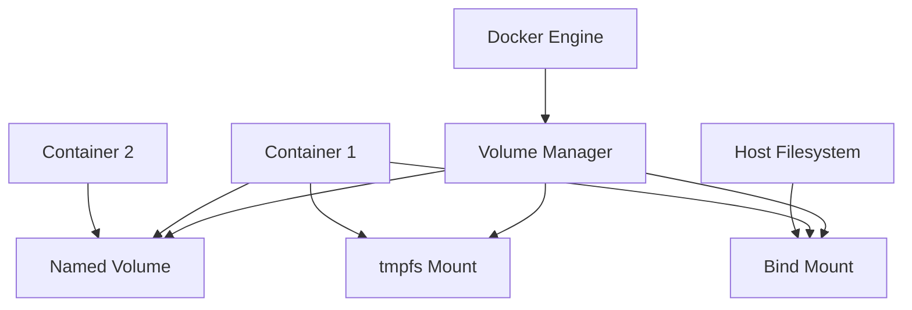

# Docker: Томи / Volumes

Docker томи — це механізм для зберігання даних, створених і використовуваних Docker-контейнерами. Томи надають можливість зберігати дані поза контейнером, що забезпечує їх стійкість і можливість спільного використання.

## Типи томів

### Named Volumes (Іменовані томи)

**Named Volumes** — це томи, створені та керовані Docker, які мають ім'я для простої ідентифікації.

```bash
# Створення іменованого тому
docker volume create my-data

# Використання тому при запуску контейнера
docker run -v my-data:/app/data nginx

# В Docker Compose
volumes:
  my-data:
```

**Підкапотні механізми:**

-   Зберігаються в `/var/lib/docker/volumes/` на хості (Linux)
-   Під управлінням Docker Engine
-   Автоматично створюються при запуску контейнера, якщо не існують
-   Найкращий варіант для довгострокового зберігання даних
-   Дані ініціалізуються з вмісту цільового каталогу в образі
-   Підтримують різні драйвери для різних систем зберігання

### Bind Mounts (Монтування каталогів)

**Bind Mounts** — монтують шлях з хоста безпосередньо в контейнер.

```bash
# Монтування каталогу хоста у контейнер
docker run -v /host/path:/container/path nginx

# Монтування з обмеженням прав доступу
docker run -v /host/path:/container/path:ro nginx

# В Docker Compose
volumes:
  - ./host/path:/container/path
```

**Підкапотні механізми:**

-   Монтують існуючий каталог з хоста в контейнер
-   Шлях хоста має бути абсолютним
-   Зміни в контейнері відразу видимі на хості і навпаки
-   Не керуються Docker Engine
-   Дані НЕ ініціалізуються з образу
-   Ідеальні для розробки, коли потрібно монтувати вихідний код

### tmpfs Mounts (Тимчасові томи)

**tmpfs Mounts** — створюють тимчасову файлову систему в пам'яті контейнера.

```bash
# Створення tmpfs тому
docker run --tmpfs /app/temp nginx

# З налаштуваннями розміру та прав
docker run --tmpfs /app/temp:rw,noexec,nosuid,size=100m nginx

# В Docker Compose
tmpfs:
  - /app/temp
```

**Підкапотні механізми:**

-   Дані зберігаються лише в пам'яті хоста, не на диску
-   Дані втрачаються при зупинці контейнера
-   Висока продуктивність для тимчасових даних
-   Допомагає захистити чутливу інформацію від запису на диск
-   Можна обмежити розмір

## Керування томами

```bash
# Створення тому
docker volume create my-volume

# Перегляд списку томів
docker volume ls

# Детальна інформація про том
docker volume inspect my-volume

# Видалення тому
docker volume rm my-volume

# Видалення всіх невикористовуваних томів
docker volume prune
```

## Драйвери томів

Docker підтримує різні драйвери томів для різних сценаріїв використання:

```bash
# Створення тому з конкретним драйвером
docker volume create --driver local my-volume

# З додатковими опціями
docker volume create --driver local \
  --opt type=nfs \
  --opt o=addr=192.168.1.1,rw \
  --opt device=:/path/to/dir \
  my-nfs-volume
```

**Основні драйвери:**

1. **local** — стандартний драйвер, зберігає дані на локальному хості
2. **nfs** — мережева файлова система
3. **cifs/smb** — Windows-подібні файлові системи
4. **ceph/glusterfs** — розподілені файлові системи
5. **Сторонні драйвери** — для хмарних провайдерів (AWS EBS, Azure Disk, GCE PD)

## Передові методи використання томів

### Резервне копіювання томів

```bash
# Створення резервної копії тому
docker run --rm -v my-volume:/source -v $(pwd):/backup alpine \
  tar -czf /backup/my-volume-backup.tar.gz -C /source .

# Відновлення тому з резервної копії
docker run --rm -v my-volume:/target -v $(pwd):/backup alpine \
  sh -c "rm -rf /target/* && tar -xzf /backup/my-volume-backup.tar.gz -C /target"
```

### Спільне використання даних

```bash
# Кілька контейнерів, що використовують один том
docker run -d --name web1 -v shared-data:/app/data nginx
docker run -d --name web2 -v shared-data:/app/data nginx
```

### Міграція даних

```bash
# Копіювання даних з одного тому в інший
docker run --rm \
  -v source-volume:/from \
  -v target-volume:/to \
  alpine cp -av /from/. /to/
```

## Приклади використання

### Бази даних

```yaml
version: "3.8"
services:
    postgres:
        image: postgres:13
        volumes:
            - postgres_data:/var/lib/postgresql/data
            - ./init-scripts:/docker-entrypoint-initdb.d
        environment:
            POSTGRES_PASSWORD: secret

volumes:
    postgres_data:
```

### Веб-розробка

```yaml
version: "3.8"
services:
    node:
        image: node:14
        working_dir: /app
        volumes:
            - ./src:/app/src:ro # Код (тільки для читання)
            - ./package.json:/app/package.json
            - node_modules:/app/node_modules
        command: npm run dev

volumes:
    node_modules: # Кешування node_modules
```

### Кешування та логи

```yaml
version: "3.8"
services:
    app:
        image: myapp
        volumes:
            - logs:/app/logs
            - cache:/app/cache
            - ./config:/app/config:ro

volumes:
    logs:
    cache:
```

## Схема взаємодії томів з контейнерами



## Поради для Windows/WSL

### Продуктивність на Windows

```bash
# Найкраща продуктивність: використання шляхів всередині WSL
docker run -v /home/user/project:/app node

# Повільніше: використання шляхів Windows
docker run -v C:/Users/user/project:/app node
```

**Рекомендації для Windows:**

1. Для найкращої продуктивності зберігайте проекти в файловій системі WSL, а не в Windows
2. Використовуйте іменовані томи для баз даних та інших постійних даних
3. Будьте обережні з правами доступу — вони працюють інакше в Windows
4. Використовуйте Docker Desktop для автоматичного керування сумісністю WSL

### Проблеми з правами доступу

```bash
# Вирішення проблем із правами в Linux/WSL
docker run -v $(pwd):/app:z nginx  # SELinux-сумісне монтування
```

## Підводні камені та оптимізація

1. **Продуктивність:**

    - Bind mounts можуть бути повільнішими, ніж named volumes, особливо на Windows/macOS
    - tmpfs дає найвищу продуктивність, але дані втрачаються після перезапуску
    - Розташовуйте часто змінювані файли (логи, кеш) на окремих томах

2. **Безпека:**

    - Використовуйте опцію `:ro` для монтування конфігураційних файлів лише для читання
    - Будьте обережні з bind mounts, які можуть експортувати чутливі файли з хоста
    - Розглядайте tmpfs для чутливих тимчасових даних (ключі, паролі)

3. **Управління простором:**

    - Регулярно використовуйте `docker volume prune` для очищення невикористовуваних томів
    - Налаштовуйте автоматичне видалення томів для тимчасових контейнерів

4. **Стан додатків:**

    - Розділяйте код (bind mount) та дані (named volume)
    - Використовуйте docker-compose down -v для повного очищення при потребі
    - Пам'ятайте про ініціалізацію порожніх томів

5. **Типові проблеми:**
    - Невидимі файли (контейнер не бачить файли хоста)
    - Відсутні дозволи (особливо з SELinux/AppArmor)
    - Конфлікти при одночасному доступі з кількох контейнерів
    - Проблеми продуктивності при використанні неоптимальних монтувань
