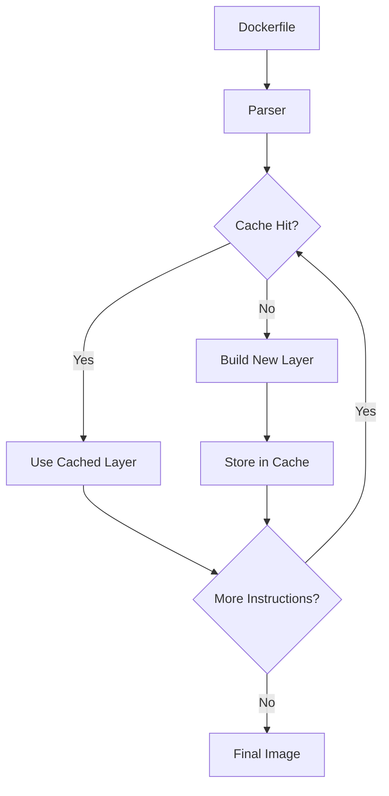

# Docker: Кеш і оптимізація побудови

Оптимізація процесу побудови Docker-образів критично важлива для ефективного розгортання та розробки. Розуміння механізмів кешування та передових практик побудови дозволяє створювати легкі, безпечні та швидко відтворювані образи.

## Layer Caching (Кешування шарів)

Docker образи складаються з шарів, кожен з яких представляє результат виконання інструкції в Dockerfile.

```dockerfile
FROM node:14-alpine
WORKDIR /app
COPY package.json package-lock.json ./  # Шар 1
RUN npm install                         # Шар 2
COPY . .                                # Шар 3
RUN npm run build                       # Шар 4
CMD ["npm", "start"]                    # Шар 5 (метадані)
```

**Підкапотні механізми:**

-   Кожна інструкція в Dockerfile створює новий шар
-   Docker створює кеш шарів на основі хешу інструкції та її вхідних даних
-   Якщо інструкція не змінилася, Docker використовує кешований шар
-   Якщо шар змінюється, всі наступні шари повторно створюються

### Правила кешування для різних інструкцій

```dockerfile
# Залежить лише від базового образу
FROM alpine:3.14  # Змінюється лише при зміні базового образу

# Залежить від значення аргументу
ARG VERSION=1.0   # Змінюється при зміні VERSION

# Не впливає на кешування шарів, лише метадані
LABEL version="1.0"  # Не викликає інвалідацію кешу шарів

# Залежить від вмісту файлів
COPY package.json .  # Змінюється, якщо змінюється вміст package.json

# Залежить від команди та попередніх шарів
RUN npm install    # Змінюється, якщо змінилась команда або попередні шари

# Не впливає на кеш шарів, лише метадані
ENV NODE_ENV=production  # Не викликає інвалідацію кешу шарів

# Не впливає на кеш шарів, лише метадані
EXPOSE 3000   # Не викликає інвалідацію кешу шарів

# Не впливає на кеш шарів, лише метадані
CMD ["node", "app.js"]  # Не викликає інвалідацію кешу шарів
```

## Оптимізація порядку інструкцій

Оптимальний порядок інструкцій для максимального використання кешу:

```dockerfile
FROM node:14-alpine

# 1. Встановлення системних залежностей (рідко змінюються)
RUN apk add --no-cache python3 make g++

# 2. Копіювання файлів залежностей
WORKDIR /app
COPY package.json package-lock.json ./

# 3. Встановлення залежностей програми
RUN npm ci --production

# 4. Копіювання вихідного коду (часто змінюється)
COPY . .

# 5. Збірка додатку
RUN npm run build

# 6. Налаштування середовища (метадані)
ENV NODE_ENV=production
EXPOSE 3000
USER node
CMD ["node", "dist/index.js"]
```

**Принцип:** Розміщуйте інструкції від найменш змінюваних до найбільш змінюваних.

## Multi-stage builds (Багатоетапні збірки)

Multi-stage builds дозволяють використовувати різні базові образи на різних етапах збірки та копіювати лише необхідні файли в кінцевий образ.

```dockerfile
# Етап збірки
FROM node:14 AS build
WORKDIR /app
COPY package*.json ./
RUN npm ci
COPY . .
RUN npm run build

# Етап виконання
FROM node:14-alpine
WORKDIR /app
COPY --from=build /app/dist ./dist
COPY --from=build /app/package*.json ./
RUN npm ci --production
ENV NODE_ENV=production
USER node
CMD ["node", "dist/index.js"]
```

**Підкапотні механізми:**

-   Кожен етап має власний незалежний набір шарів
-   Файли можна копіювати з одного етапу в інший за допомогою `COPY --from`
-   Лише шари фінального етапу потрапляють у кінцевий образ
-   Інструменти збірки, вихідний код та проміжні файли не включаються в кінцевий образ

### Паттерни використання multi-stage builds

#### 1. Етап збірки та етап виконання

```dockerfile
# Етап збірки
FROM golang:1.17 AS build
WORKDIR /src
COPY . .
RUN go build -o /bin/app .

# Етап виконання
FROM alpine:3.14
COPY --from=build /bin/app /bin/app
CMD ["/bin/app"]
```

#### 2. Безпечне копіювання секретів для збірки

```dockerfile
# Етап з секретами
FROM alpine AS secrets
COPY ./secrets/api-key.txt /secrets/
RUN chmod 400 /secrets/api-key.txt

# Етап збірки
FROM node:14 AS build
COPY --from=secrets /secrets /secrets
COPY . .
RUN npm ci && npm run build

# Етап виконання
FROM nginx:alpine
COPY --from=build /app/dist /usr/share/nginx/html
# Секрети не потрапляють у кінцевий образ
```

#### 3. Етап залежностей

```dockerfile
# Етап залежностей
FROM node:14 AS deps
WORKDIR /app
COPY package*.json ./
RUN npm ci

# Етап збірки
FROM node:14 AS build
WORKDIR /app
COPY --from=deps /app/node_modules ./node_modules
COPY . .
RUN npm run build

# Етап виконання
FROM nginx:alpine
COPY --from=build /app/dist /usr/share/nginx/html
```

## Slim images (Оптимізовані образи)

Використання мінімальних базових образів значно зменшує розмір кінцевого образу.

### Порівняння розмірів базових образів

| Образ          | Розмір  | Опис                  |
| -------------- | ------- | --------------------- |
| node:14        | ~940 MB | Повний образ з Debian |
| node:14-slim   | ~170 MB | Мінімальний Debian    |
| node:14-alpine | ~115 MB | На базі Alpine Linux  |

### Оптимізація розміру образу

```dockerfile
FROM node:14-alpine

# Встановлення залежностей в одному шарі
RUN apk add --no-cache python3 make g++ \
    && npm ci --production \
    && npm cache clean --force \
    && rm -rf /tmp/*

# Виключення непотрібних файлів
COPY --chown=node:node . .
RUN rm -rf tests docs *.md

# Використання непривілейованого користувача
USER node
```

## Кеш пакетних менеджерів

### npm/yarn

```dockerfile
# Ефективне кешування npm
COPY package.json package-lock.json ./
RUN npm ci --production && npm cache clean --force

# Для Yarn
COPY package.json yarn.lock ./
RUN yarn install --frozen-lockfile --production && yarn cache clean
```

### pip (Python)

```dockerfile
COPY requirements.txt .
RUN pip install --no-cache-dir -r requirements.txt
```

### apt (Debian/Ubuntu)

```dockerfile
RUN apt-get update && apt-get install -y --no-install-recommends \
    package1 package2 \
    && rm -rf /var/lib/apt/lists/*
```

### apk (Alpine)

```dockerfile
RUN apk add --no-cache package1 package2
```

## BuildKit

BuildKit — це новий внутрішній механізм збірки в Docker, що забезпечує кращу продуктивність, кешування та можливості.

```bash
# Увімкнення BuildKit
export DOCKER_BUILDKIT=1
docker build -t myapp .

# Або
docker buildx build -t myapp .
```

### Можливості BuildKit

#### 1. Паралельне виконання незалежних етапів

```dockerfile
FROM alpine AS base

FROM base AS branch1
RUN sleep 2 && echo "branch1" > /branch1.txt

FROM base AS branch2
RUN sleep 2 && echo "branch2" > /branch2.txt

FROM scratch
COPY --from=branch1 /branch1.txt /
COPY --from=branch2 /branch2.txt /
```

BuildKit виконує етапи `branch1` і `branch2` паралельно.

#### 2. Секрети під час збірки

```dockerfile
# Syntax потрібен для BuildKit
# syntax=docker/dockerfile:1.3
FROM alpine
RUN --mount=type=secret,id=api_key \
    cat /run/secrets/api_key
```

```bash
docker buildx build --secret id=api_key,src=./api-key.txt -t myapp .
```

#### 3. Монтування кешу

```dockerfile
# syntax=docker/dockerfile:1.3
FROM node:14-alpine
WORKDIR /app
COPY package.json package-lock.json ./
RUN --mount=type=cache,target=/root/.npm \
    npm ci
COPY . .
```

## Схема роботи кешу Docker



## Підводні камені та найкращі практики

### 1. Інвалідація кешу

**Проблема:** Непотрібна інвалідація кешу.

**Рішення:**

-   Розділяйте інструкції COPY для залежностей та коду
-   Використовуйте .dockerignore для виключення непотрібних файлів
-   Уникайте копіювання змінних файлів, які не впливають на збірку

```dockerfile
# Погано: вся кодова база копіюється разом
COPY . .
RUN npm ci

# Добре: спочатку копіюються тільки файли залежностей
COPY package.json package-lock.json ./
RUN npm ci
COPY . .
```

### 2. Очищення в одному шарі

**Проблема:** Видалення файлів в окремому шарі не зменшує розмір образу.

**Рішення:** Встановлення та очищення в одній інструкції RUN.

```dockerfile
# Погано: розмір образу включає пакети для збірки
RUN apt-get update && apt-get install -y build-deps
RUN make install
RUN apt-get purge -y build-deps  # Не зменшує розмір образу!

# Добре: все в одній інструкції RUN
RUN apt-get update \
    && apt-get install -y build-deps \
    && make install \
    && apt-get purge -y build-deps \
    && rm -rf /var/lib/apt/lists/*
```

### 3. Кеш npm/yarn

**Проблема:** Кеш пакетних менеджерів займає багато місця.

**Рішення:** Видаляйте кеш після встановлення.

```dockerfile
RUN npm ci \
    && npm cache clean --force
```

### 4. Контроль версій залежностей

**Проблема:** Нефіксовані версії можуть призвести до різних результатів збірки.

**Рішення:** Використовуйте точні версії та lock-файли.

```dockerfile
# Погано: може призвести до різних версій
RUN npm install express

# Добре: використання lock-файлу
COPY package.json package-lock.json ./
RUN npm ci
```

## Рекомендації для CI/CD

1. **Використовуйте BuildKit в CI/CD:**

    ```yaml
    # GitHub Actions
    - name: Build and push
      uses: docker/build-push-action@v2
      with:
          context: .
          push: true
          tags: myorg/myapp:latest
    ```

2. **Налаштуйте кешування між збірками:**

    ```yaml
    # GitLab CI
    build:
        script:
            - docker buildx build --cache-from=type=registry,ref=myorg/myapp:cache --cache-to=type=registry,ref=myorg/myapp:cache -t myorg/myapp:latest .
    ```

3. **Рекомендації для оптимізації CI/CD:**
    - Використовуйте builder instances в BuildKit для паралельних збірок
    - Налаштуйте кешування залежностей на рівні CI/CD
    - Проводьте перевірку безпеки образів як частину CI/CD
