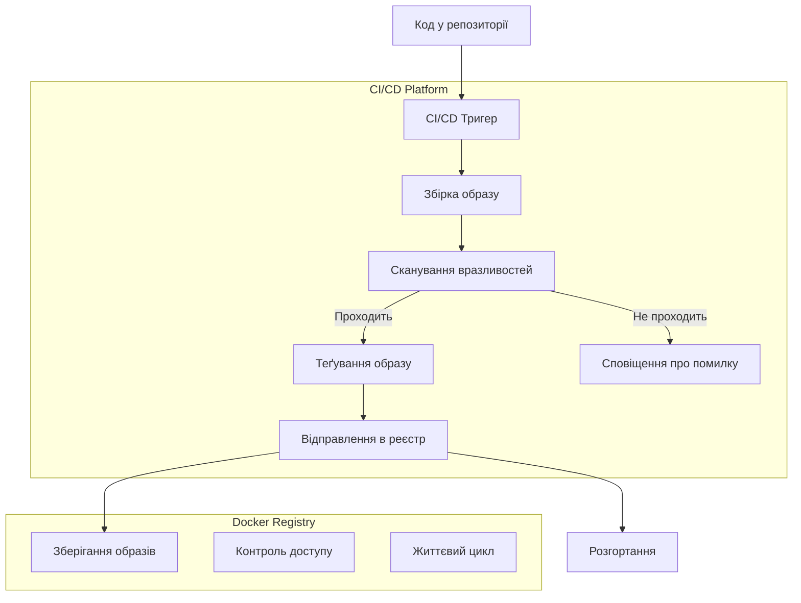

# Docker: CI/CD та реєстри

Інтеграція Docker з CI/CD (Continuous Integration/Continuous Deployment) системами та використання реєстрів образів є ключовими компонентами сучасних DevOps-практик. Правильна організація цих процесів забезпечує ефективну доставку додатків від розробки до production.

## Реєстри Docker

Docker-реєстр — це сховище Docker-образів, яке дозволяє зберігати, розповсюджувати та керувати версіями образів.

### Типи реєстрів

1. **Публічні реєстри**

    - Docker Hub (hub.docker.com)
    - GitHub Container Registry (ghcr.io)
    - Quay.io

2. **Приватні реєстри**
    - Docker Registry (self-hosted)
    - Amazon ECR
    - Google Container Registry (GCR)
    - Azure Container Registry (ACR)
    - Harbor
    - GitLab Container Registry
    - Nexus Repository

### Робота з реєстрами

```bash
# Автентифікація в реєстрі
docker login registry.example.com

# Теґування образу для реєстру
docker tag myapp:latest registry.example.com/myorg/myapp:latest

# Відправлення образу в реєстр
docker push registry.example.com/myorg/myapp:latest

# Отримання образу з реєстру
docker pull registry.example.com/myorg/myapp:latest

# Перегляд тегів образу (використовуючи API Docker Hub)
curl -s https://registry.hub.docker.com/v2/repositories/library/ubuntu/tags/ | jq -r '.results[].name'
```

**Підкапотні механізми:**

-   Образи відправляються та отримуються шар за шаром
-   Реєстр перевіряє існування шарів перед відправкою, щоб уникнути дублювання
-   API реєстрів підтримує Manifest Lists для багатоплатформних образів
-   Сучасні реєстри підтримують контроль доступу, сканування вразливостей та політики життєвого циклу

## Теґування (tagging)

Стратегія теґування образів є важливою частиною CI/CD процесу.

### Стратегії теґування

1. **Семантичне версіонування (SemVer)**

    ```bash
    # Основні версії
    myapp:1.0.0, myapp:1.0.1, myapp:1.1.0, myapp:2.0.0

    # Різні рівні конкретизації
    myapp:1, myapp:1.0, myapp:1.0.0
    ```

2. **Git-базоване теґування**

    ```bash
    # На основі комітів
    myapp:git-a7d3fe2

    # На основі гілок
    myapp:main, myapp:develop, myapp:feature-auth
    ```

3. **Середовище і дата**
    ```bash
    myapp:production-20230615
    myapp:staging-20230615-1
    ```

**Найкращі практики:**

-   Використовуйте `latest` з обережністю, завжди вказуйте конкретні версії для production
-   Створюйте теґи-аліаси для спрощення роботи: `myapp:1.0.0` і `myapp:stable`
-   Автоматизуйте теґування як частину CI/CD
-   Документуйте стратегію теґування для команди

## CI/CD з Docker

### Build у CI

**GitHub Actions:**

```yaml
name: Build and Push Docker Image

on:
    push:
        branches: [main]

jobs:
    build:
        runs-on: ubuntu-latest
        steps:
            - uses: actions/checkout@v3

            - name: Set up Docker Buildx
              uses: docker/setup-buildx-action@v2

            - name: Login to Docker Hub
              uses: docker/login-action@v2
              with:
                  username: ${{ secrets.DOCKERHUB_USERNAME }}
                  password: ${{ secrets.DOCKERHUB_TOKEN }}

            - name: Build and push
              uses: docker/build-push-action@v4
              with:
                  context: .
                  push: true
                  tags: |
                      user/app:latest
                      user/app:${{ github.sha }}
                  cache-from: type=registry,ref=user/app:buildcache
                  cache-to: type=registry,ref=user/app:buildcache,mode=max
```

**GitLab CI:**

```yaml
variables:
    DOCKER_DRIVER: overlay2
    DOCKER_TLS_CERTDIR: ""
    IMAGE_TAG: $CI_REGISTRY_IMAGE:$CI_COMMIT_REF_SLUG

stages:
    - build
    - test
    - deploy

build:
    stage: build
    image: docker:20.10
    services:
        - docker:20.10-dind
    before_script:
        - docker login -u $CI_REGISTRY_USER -p $CI_REGISTRY_PASSWORD $CI_REGISTRY
    script:
        - docker build -t $IMAGE_TAG .
        - docker push $IMAGE_TAG
```

**Jenkins Pipeline:**

```groovy
pipeline {
    agent any

    environment {
        DOCKER_REGISTRY = 'registry.example.com'
        IMAGE_NAME = 'myapp'
        IMAGE_TAG = "${env.BUILD_NUMBER}"
    }

    stages {
        stage('Build') {
            steps {
                sh '''
                docker build -t ${DOCKER_REGISTRY}/${IMAGE_NAME}:${IMAGE_TAG} .
                '''
            }
        }

        stage('Push') {
            steps {
                withCredentials([string(credentialsId: 'docker-registry-token', variable: 'DOCKER_TOKEN')]) {
                    sh '''
                    echo $DOCKER_TOKEN | docker login ${DOCKER_REGISTRY} -u username --password-stdin
                    docker push ${DOCKER_REGISTRY}/${IMAGE_NAME}:${IMAGE_TAG}
                    '''
                }
            }
        }
    }
}
```

## Секрети та конфіденційна інформація

### Безпечна робота з секретами

```yaml
# GitHub Actions з секретами
- name: Build with secrets
  uses: docker/build-push-action@v4
  with:
      context: .
      push: true
      tags: user/app:latest
      build-args: |
          API_KEY=${{ secrets.API_KEY }}
      # BuildKit для безпечної роботи з секретами
      secret-files: |
          "my_secret=./secret.txt"
```

```dockerfile
# Dockerfile з BuildKit для секретів
# syntax=docker/dockerfile:1.4
FROM node:14-alpine
WORKDIR /app
COPY . .
RUN --mount=type=secret,id=my_secret \
    cat /run/secrets/my_secret > /app/config/secret
```

**Найкращі практики:**

-   Ніколи не зберігайте секрети в образах
-   Використовуйте секрети CI/CD та змінні середовища
-   Для Production використовуйте системи керування секретами (Vault, AWS Secrets Manager, Kubernetes Secrets)
-   Для побудови з секретами використовуйте BuildKit

## Сканування вразливостей

### Інструменти сканування образів

1. **Trivy**

    ```bash
    trivy image myapp:latest
    ```

2. **Clair**

    ```bash
    # Зазвичай інтегрується з реєстрами
    ```

3. **Snyk**

    ```bash
    snyk container test myapp:latest
    ```

4. **Docker Scout**
    ```bash
    docker scout cves myapp:latest
    ```

### Інтеграція в CI/CD

```yaml
# GitHub Actions з Trivy
- name: Scan for vulnerabilities
  uses: aquasecurity/trivy-action@master
  with:
      image-ref: "user/app:latest"
      format: "table"
      exit-code: "1"
      ignore-unfixed: true
      severity: "CRITICAL,HIGH"
```

## Багатоетапні та багатоплатформні збірки

### Багатоплатформні образи (Multi-arch)

```bash
# Налаштування BuildKit для багатоплатформних збірок
docker buildx create --name mybuilder --use

# Збірка для різних платформ
docker buildx build --platform linux/amd64,linux/arm64 \
  -t user/app:latest --push .
```

```yaml
# GitHub Actions для багатоплатформних збірок
- name: Set up QEMU
  uses: docker/setup-qemu-action@v2

- name: Set up Docker Buildx
  uses: docker/setup-buildx-action@v2

- name: Build and push multi-platform
  uses: docker/build-push-action@v4
  with:
      context: .
      platforms: linux/amd64,linux/arm64
      push: true
      tags: user/app:latest
```

## Схема CI/CD процесу з Docker



## Підводні камені та оптимізація

### 1. Кешування збірок у CI/CD

**Проблема:** Кожна збірка починається з нуля, що сповільнює процес.

**Рішення:**

-   Використовуйте кешування між збірками
-   Налаштуйте BuildKit з підтримкою кешу реєстру
-   Оптимізуйте Dockerfile для кешування (див. розділ про кешування)

### 2. Секрети та конфігурації

**Проблема:** Секрети можуть потрапити в кінцеві образи.

**Рішення:**

-   Використовуйте multi-stage builds для відокремлення збірки та виконання
-   Передавайте конфігурації через змінні середовища або том-монтування
-   Використовуйте BuildKit для безпечної роботи з секретами під час збірки

### 3. Розмір образів

**Проблема:** Великі образи сповільнюють відправлення та розгортання.

**Рішення:**

-   Використовуйте slim-образи та multi-stage builds
-   Налаштуйте .dockerignore для виключення непотрібних файлів
-   Встановлюйте лише необхідні залежності

### 4. Безпека

**Проблема:** Вразливості в образах можуть становити загрозу безпеці.

**Рішення:**

-   Регулярно оновлюйте базові образи
-   Налаштуйте автоматичне сканування образів
-   Реалізуйте політику "Fail the build" для критичних вразливостей
-   Використовуйте мінімальні образи з меншою поверхнею атаки
