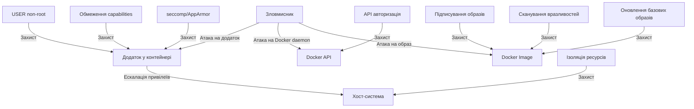

# Docker: Безпека

Безпека Docker-контейнерів є критично важливим аспектом впровадження контейнеризації. Розуміння принципів безпеки та використання найкращих практик допомагає захистити як контейнери, так і хост-систему.

## Принцип найменших привілеїв (Least Privilege)

**Принцип найменших привілеїв** означає надання мінімально необхідних прав для виконання завдання.

```dockerfile
# Створення непривілейованого користувача
FROM node:14-alpine
RUN addgroup -S appgroup && adduser -S appuser -G appgroup
USER appuser
WORKDIR /app
COPY --chown=appuser:appgroup . .
CMD ["node", "index.js"]
```

**Підкапотні механізми:**

-   Без інструкції USER контейнери запускаються від користувача root
-   Непривілейований користувач не може змінювати системні файли
-   Обмежується вплив потенційної вразливості в додатку

### Запуск контейнерів з безпечними параметрами

```bash
# Запуск з обмеженими можливостями
docker run --user 1000:1000 \
  --cap-drop=ALL \
  --cap-add=NET_BIND_SERVICE \
  --security-opt=no-new-privileges \
  myapp
```

## Уникнення збереження секретів в образах

Секрети ніколи не повинні бути частиною Docker-образу.

### Антипатерн: Секрети в Dockerfile

```dockerfile
# НЕ РОБІТЬ ТАК!
FROM alpine
RUN echo "my-secret-password" > /app/config/secret.txt
```

### Правильні підходи

#### 1. Змінні середовища при запуску

```bash
# Передача секрету через змінну середовища
docker run -e API_KEY=secret123 myapp
```

```yaml
# В Docker Compose
services:
    app:
        image: myapp
        environment:
            - API_KEY=secret123
```

#### 2. Docker Secrets

```bash
# Створення Docker Secret (в Swarm mode)
printf "secret123" | docker secret create api_key -

# Використання в сервісі
docker service create \
  --name myapp \
  --secret api_key \
  myapp
```

```yaml
# У docker-compose.yml
services:
    app:
        image: myapp
        secrets:
            - api_key

secrets:
    api_key:
        external: true
```

#### 3. Монтування секретів

```bash
# Монтування файлу з секретом
docker run -v /path/to/secrets/:/run/secrets/ myapp
```

#### 4. BuildKit для секретів при збірці

```dockerfile
# syntax=docker/dockerfile:1.4
FROM alpine
RUN --mount=type=secret,id=api_key \
    cat /run/secrets/api_key > /app/config
```

```bash
docker buildx build --secret id=api_key,src=./api-key.txt .
```

## Обмеження можливостей (capabilities)

Linux capabilities дозволяють точно контролювати привілеї процесів у контейнері.

```bash
# Запуск з мінімальними можливостями
docker run --cap-drop=ALL --cap-add=NET_BIND_SERVICE nginx

# Перегляд поточних можливостей у контейнері
docker exec mycontainer capsh --print
```

**Найважливіші capabilities:**

-   `CAP_NET_BIND_SERVICE` — дозволяє прив'язку до портів < 1024
-   `CAP_SYS_ADMIN` — надає широкі адміністративні можливості (небезпечно)
-   `CAP_SYS_PTRACE` — дозволяє відлагодження
-   `CAP_NET_RAW` — дозволяє низькорівневий мережевий доступ

**Підкапотні механізми:**

-   Docker за замовчуванням відкидає деякі небезпечні capabilities
-   `--cap-drop=ALL` відкидає всі capabilities
-   `--cap-add` дозволяє додати конкретні необхідні capabilities
-   Ця система більш деталізована, ніж повний root-доступ

## Захист хоста від контейнерів

### Ізоляція ресурсів

```bash
# Обмеження пам'яті та CPU
docker run -d \
  --name myapp \
  --memory="256m" \
  --memory-swap="512m" \
  --cpus=0.5 \
  --pids-limit=100 \
  myapp
```

### Обмеження доступу до хост-системи

```bash
# Заборона доступу до хост-пристроїв
docker run --device=/dev/null:/dev/null \
  --tmpfs /tmp \
  --read-only \
  myapp
```

### Налаштування безпечних параметрів

```bash
# Запуск з додатковими параметрами безпеки
docker run \
  --security-opt="no-new-privileges=true" \
  --security-opt="seccomp=default.json" \
  --security-opt="apparmor=docker-default" \
  myapp
```

## Сканування вразливостей у образах

```bash
# Використання Docker Scout
docker scout cves myapp:latest

# Використання Trivy
trivy image myapp:latest

# Використання Clair (через клієнт clairctl)
clairctl analyze myapp:latest
```

**Типові вразливості:**

1. Застарілі системні пакети
2. Вразливі залежності додатків
3. Небезпечні конфігурації
4. Збережені секрети

## Шифрування та підписування образів

### Підписування образів

```bash
# Налаштування Docker Content Trust (DCT)
export DOCKER_CONTENT_TRUST=1

# Підписування при push
docker push myorg/myapp:1.0.0
```

### Перевірка підписів

```bash
# Перевірка підпису при pull
export DOCKER_CONTENT_TRUST=1
docker pull myorg/myapp:1.0.0
```

**Підкапотні механізми:**

-   Використовує The Update Framework (TUF) для управління ключами
-   Кореневі ключі (root keys) зберігаються офлайн
-   Цільові ключі (target keys) використовуються для підписування образів
-   Захищає від атак "людина посередині" та підроблених образів

## Мережева безпека

### Ізоляція мереж

```bash
# Створення ізольованої мережі
docker network create --internal private-network

# Запуск контейнера в ізольованій мережі
docker run --network=private-network myapp
```

### Міжконтейнерна комунікація

```bash
# Вимкнення міжконтейнерної комунікації на рівні Docker daemon
# (в /etc/docker/daemon.json)
{
  "icc": false
}
```

## Схема вектора атаки та захисту



## Безпека на рівні Docker daemon

```bash
# Захист Docker API сокета
# Налаштування TLS (в /etc/docker/daemon.json)
{
  "tls": true,
  "tlscert": "/var/docker/server-cert.pem",
  "tlskey": "/var/docker/server-key.pem",
  "tlsverify": true,
  "tlscacert": "/var/docker/ca.pem"
}
```

**Налаштування авторизації:**

```bash
# Обмеження доступу до Docker socket
chmod 660 /var/run/docker.sock
chown root:docker /var/run/docker.sock
```

## Підводні камені та найкращі практики

### 1. Безпечні базові образи

**Проблема:** Вразливості в базових образах.

**Рішення:**

-   Використовуйте офіційні або перевірені базові образи
-   Віддавайте перевагу мінімальним образам (alpine, slim, distroless)
-   Регулярно оновлюйте базові образи
-   Використовуйте багатоетапні збірки для мінімізації кінцевого образу

### 2. Runtime захист

**Проблема:** Атаки під час виконання.

**Рішення:**

-   Використовуйте seccomp профілі для обмеження системних викликів
-   Налаштуйте AppArmor/SELinux для додаткового рівня захисту
-   Запускайте контейнери з `--read-only` по можливості
-   Моніторте аномальну поведінку за допомогою інструментів як Falco

### 3. Захист секретів

**Проблема:** Витік секретів.

**Рішення:**

-   Перевіряйте образи на наявність секретів перед публікацією
-   Використовуйте системи управління секретами (Vault, Kubernetes Secrets)
-   Видаляйте змінні середовища з образів, що містять секрети
-   Використовуйте кілька етапів збірки для видалення артефактів з секретами

### 4. Continuous Security

**Проблема:** Безпека як одноразовий захід.

**Рішення:**

-   Інтегруйте сканування безпеки в CI/CD
-   Регулярно оновлюйте образи для усунення вразливостей
-   Використовуйте автоматизовані тести безпеки
-   Налаштуйте моніторинг та логування для виявлення підозрілої активності

### 5. Найгірші практики, яких слід уникати

```bash
# НЕ РОБІТЬ ЦЕ
docker run --privileged myapp                # Повний доступ до хост-системи
docker run -v /:/host myapp                  # Монтування всієї хост-системи
docker run -v /var/run/docker.sock:/var/run/docker.sock myapp  # Доступ до Docker API з контейнера
```
