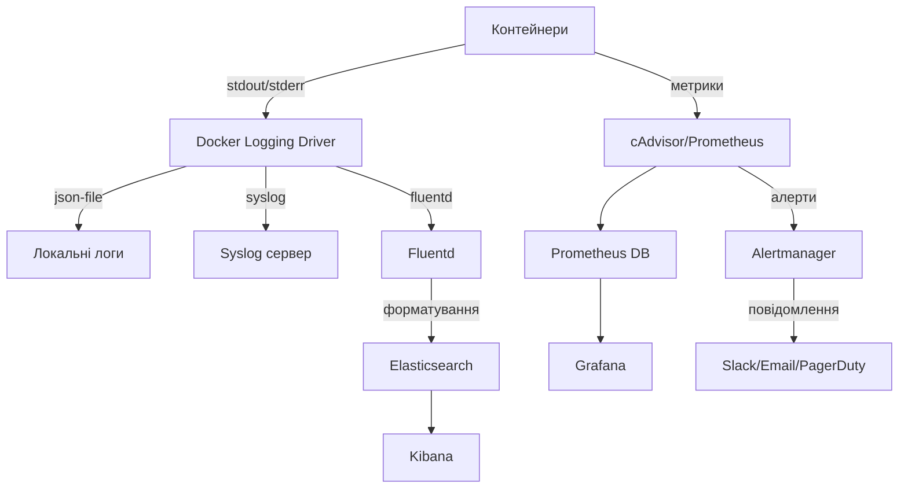

# Docker: Логування та моніторинг

Ефективне логування та моніторинг контейнерів є критично важливими для виявлення проблем, оптимізації продуктивності та забезпечення безпеки Docker-інфраструктури.

## stdout/stderr у контейнерах

Docker-контейнери за замовчуванням використовують стандартні потоки виведення (stdout) та помилок (stderr) для логування.

```dockerfile
# Додатки в контейнерах повинні виводити логи в stdout/stderr
FROM node:14-alpine
WORKDIR /app
COPY . .
RUN npm install
CMD ["node", "app.js"]
```

**Підкапотні механізми:**

-   Docker перехоплює stdout/stderr процесу з PID 1 у контейнері
-   Логи направляються до налаштованого драйвера логування
-   За замовчуванням це json-file драйвер, який зберігає логи в JSON-файлах на хості
-   Контейнери, що пишуть логи у файли всередині себе, ускладнюють централізоване логування

### Доступ до логів

```bash
# Перегляд логів контейнера
docker logs my-container

# Слідкування за логами в реальному часі
docker logs -f my-container

# Обмеження кількості рядків
docker logs --tail=100 my-container

# Перегляд логів з часовими мітками
docker logs -t my-container

# Фільтрація за часом
docker logs --since=2023-05-20T10:00:00 my-container
```

### Драйвери логування

Docker підтримує різні драйвери для перенаправлення логів:

```bash
# Запуск контейнера з конкретним драйвером логування
docker run --log-driver=syslog --log-opt syslog-address=udp://logs.example.com:5000 nginx
```

**Основні драйвери логування:**

1. **json-file** — зберігає логи в JSON-файлах на хості (за замовчуванням)
2. **syslog** — відправляє логи в syslog демон
3. **journald** — відправляє логи в systemd journal
4. **gelf** — відправляє логи в Graylog Extended Log Format
5. **fluentd** — відправляє логи в Fluentd колектор
6. **awslogs** — відправляє логи в Amazon CloudWatch
7. **splunk** — відправляє логи в Splunk
8. **local** — оптимізований локальний драйвер без індексації

```yaml
# Налаштування логування в docker-compose.yml
services:
    web:
        image: nginx
        logging:
            driver: "json-file"
            options:
                max-size: "10m"
                max-file: "3"
```

**Підкапотні механізми:**

-   Драйвери логування можуть конфігуруватися глобально для Docker daemon або для окремих контейнерів
-   Параметри `max-size` та `max-file` контролюють ротацію логів
-   Docker використовує плагіни для розширення можливостей логування

## Healthchecks (перевірки здоров'я)

Healthchecks дозволяють Docker перевіряти, чи контейнер функціонує правильно.

```dockerfile
# Додавання healthcheck у Dockerfile
FROM nginx:alpine
HEALTHCHECK --interval=30s --timeout=3s --start-period=5s --retries=3 \
  CMD curl -f http://localhost/ || exit 1
```

```yaml
# Healthcheck у docker-compose.yml
services:
    web:
        image: nginx
        healthcheck:
            test: ["CMD", "curl", "-f", "http://localhost/"]
            interval: 30s
            timeout: 3s
            retries: 3
            start_period: 5s
```

**Підкапотні механізми:**

-   Docker періодично виконує команду, вказану в healthcheck
-   Контейнер може мати один з трьох станів: starting, healthy, unhealthy
-   Статус перевірки видно в `docker ps` або `docker inspect`
-   Orchestration tools (Swarm, Kubernetes) використовують healthchecks для перезапуску проблемних контейнерів

### Налаштування healthcheck

```bash
# Перегляд статусу перевірки здоров'я
docker inspect --format='{{json .State.Health.Status}}' my-container

# Ручний запуск перевірки здоров'я (для відлагодження)
docker exec my-container curl -f http://localhost/ || echo "Failed"
```

## Експортування метрик

### Prometheus метрики

[Prometheus](https://prometheus.io/) — популярна система моніторингу, яка збирає метрики за допомогою HTTP запитів до спеціальних endpoint-ів.

```yaml
# docker-compose.yml з Prometheus і cAdvisor
services:
    prometheus:
        image: prom/prometheus
        volumes:
            - ./prometheus.yml:/etc/prometheus/prometheus.yml
        ports:
            - "9090:9090"

    cadvisor:
        image: gcr.io/cadvisor/cadvisor:latest
        volumes:
            - /:/rootfs:ro
            - /var/run:/var/run:ro
            - /sys:/sys:ro
            - /var/lib/docker/:/var/lib/docker:ro
            - /dev/disk/:/dev/disk:ro
        ports:
            - "8080:8080"
```

```yaml
# prometheus.yml
scrape_configs:
    - job_name: "cadvisor"
      scrape_interval: 5s
      static_configs:
          - targets: ["cadvisor:8080"]
```

**Підкапотні механізми:**

-   cAdvisor збирає деталізовані метрики з контейнерів
-   Prometheus періодично опитує cAdvisor для отримання метрик
-   Метрики зберігаються у часових рядах для аналізу та візуалізації
-   Grafana часто використовується для створення панелей моніторингу

### Docker Stats API

Docker надає вбудований API для отримання базових метрик контейнерів.

```bash
# Перегляд метрик в реальному часі
docker stats

# Перегляд метрик конкретних контейнерів
docker stats container1 container2

# Отримання метрик у форматі JSON
docker stats --format '{{json .}}' --no-stream
```

**Метрики, доступні через Docker Stats:**

-   CPU використання (%)
-   Обмеження CPU
-   Використання пам'яті
-   Обмеження пам'яті
-   Мережевий I/O
-   Дисковий I/O
-   PID (кількість процесів)

## Повний стек моніторингу

```yaml
# docker-compose.yml для повного стеку моніторингу
version: "3.8"

services:
    prometheus:
        image: prom/prometheus
        volumes:
            - ./prometheus.yml:/etc/prometheus/prometheus.yml
        ports:
            - "9090:9090"

    grafana:
        image: grafana/grafana
        depends_on:
            - prometheus
        ports:
            - "3000:3000"
        volumes:
            - grafana_data:/var/lib/grafana

    cadvisor:
        image: gcr.io/cadvisor/cadvisor
        volumes:
            - /:/rootfs:ro
            - /var/run:/var/run:ro
            - /sys:/sys:ro
            - /var/lib/docker/:/var/lib/docker:ro
        ports:
            - "8080:8080"

    node-exporter:
        image: prom/node-exporter
        volumes:
            - /proc:/host/proc:ro
            - /sys:/host/sys:ro
            - /:/rootfs:ro
        command:
            - "--path.procfs=/host/proc"
            - "--path.sysfs=/host/sys"
            - "--collector.filesystem.ignored-mount-points=^/(sys|proc|dev|host|etc)($$|/)"
        ports:
            - "9100:9100"

    alertmanager:
        image: prom/alertmanager
        ports:
            - "9093:9093"
        volumes:
            - ./alertmanager.yml:/etc/alertmanager/alertmanager.yml

volumes:
    grafana_data:
```

## Інтеграція з системами централізованого логування

### ELK Stack (Elasticsearch, Logstash, Kibana)

```yaml
# docker-compose.yml для ELK Stack
version: "3.8"

services:
    elasticsearch:
        image: docker.elastic.co/elasticsearch/elasticsearch:7.14.0
        environment:
            - discovery.type=single-node
            - "ES_JAVA_OPTS=-Xms512m -Xmx512m"
        ports:
            - "9200:9200"
        volumes:
            - elasticsearch_data:/usr/share/elasticsearch/data

    logstash:
        image: docker.elastic.co/logstash/logstash:7.14.0
        depends_on:
            - elasticsearch
        volumes:
            - ./logstash.conf:/usr/share/logstash/pipeline/logstash.conf
        ports:
            - "5000:5000/udp"

    kibana:
        image: docker.elastic.co/kibana/kibana:7.14.0
        depends_on:
            - elasticsearch
        ports:
            - "5601:5601"

    filebeat:
        image: docker.elastic.co/beats/filebeat:7.14.0
        user: root
        volumes:
            - ./filebeat.yml:/usr/share/filebeat/filebeat.yml:ro
            - /var/lib/docker/containers:/var/lib/docker/containers:ro
            - /var/run/docker.sock:/var/run/docker.sock:ro

volumes:
    elasticsearch_data:
```

```
# filebeat.yml
filebeat.inputs:
- type: container
  paths:
    - '/var/lib/docker/containers/*/*.log'

processors:
- add_docker_metadata:
    host: "unix:///var/run/docker.sock"

output.elasticsearch:
  hosts: ["elasticsearch:9200"]
```

### Fluentd

```yaml
# docker-compose.yml з Fluentd
services:
    fluentd:
        image: fluent/fluentd:v1.14
        volumes:
            - ./fluent.conf:/fluentd/etc/fluent.conf
            - /var/lib/docker/containers:/var/lib/docker/containers:ro
        ports:
            - "24224:24224"
            - "24224:24224/udp"

    app:
        image: myapp
        logging:
            driver: fluentd
            options:
                fluentd-address: localhost:24224
                tag: docker.{{.Name}}
```

## Схема потоку логів і метрик



## Підводні камені та оптимізація

### 1. Управління розміром логів

**Проблема:** Неконтрольоване зростання файлів логів може призвести до заповнення диску.

**Рішення:**

-   Налаштуйте ротацію логів за допомогою `max-size` та `max-file`
-   Використовуйте зовнішні системи логування
-   Регулярно перевіряйте розмір логів за допомогою `du -sh /var/lib/docker/containers/*/`

```bash
# Налаштування ротації логів
docker run --log-opt max-size=10m --log-opt max-file=3 nginx
```

### 2. Перформанс моніторингу

**Проблема:** Інструменти моніторингу можуть створювати значне навантаження.

**Рішення:**

-   Оптимізуйте інтервали збору метрик
-   Використовуйте агрегацію даних
-   Налаштуйте retention policy для довгострокового зберігання
-   Обмежуйте ресурси контейнерів моніторингу

```yaml
# Налаштування ресурсів для Prometheus
services:
    prometheus:
        deploy:
            resources:
                limits:
                    cpus: "0.5"
                    memory: 512M
```

### 3. Структуроване логування

**Проблема:** Неструктуровані логи складно аналізувати.

**Рішення:**

-   Використовуйте JSON або інші структуровані формати логування в додатках
-   Налаштуйте парсинг логів у Logstash або Fluentd
-   Додавайте метадані (контейнер ID, ім'я сервісу, хост) до логів

```javascript
// Node.js приклад структурованого логування
console.log(
    JSON.stringify({
        level: "info",
        message: "User logged in",
        timestamp: new Date().toISOString(),
        userId: 123,
        service: "auth-service",
    })
);
```

### 4. Рівні логування

**Проблема:** Надмірне логування створює шум і ускладнює пошук важливої інформації.

**Рішення:**

-   Використовуйте різні рівні логування (DEBUG, INFO, WARN, ERROR)
-   В production середовищі обмежуйте рівень до INFO або вище
-   Налаштовуйте тимчасове підвищення рівня логування для діагностики

```yaml
# Налаштування змінних середовища для рівня логування
services:
    app:
        environment:
            - LOG_LEVEL=INFO
```

### 5. Аналіз та візуалізація

**Проблема:** Зібрані логи та метрики безкорисні без належного аналізу.

**Рішення:**

-   Створюйте інформативні панелі в Grafana
-   Налаштуйте сповіщення на аномальні значення метрик
-   Використовуйте Kibana для створення візуалізацій та пошуку в логах
-   Регулярно переглядайте агреговані дані для виявлення трендів
