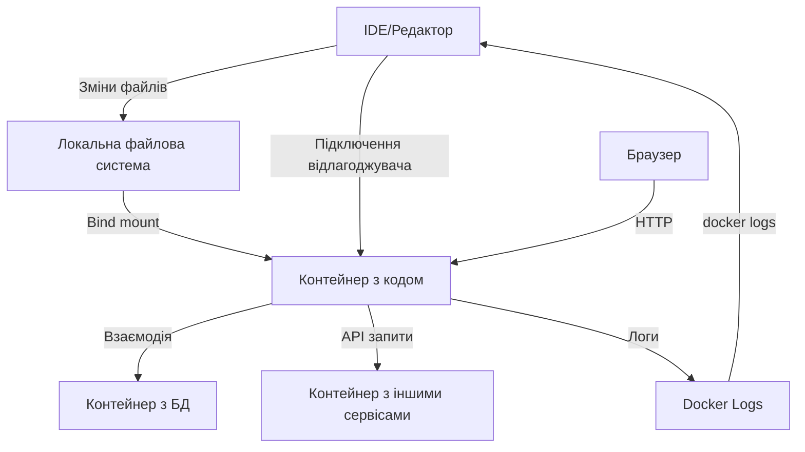

# Docker: Debugging та локальна розробка

Ефективне налагодження контейнерів та організація локального середовища розробки з Docker дозволяє швидше знаходити і виправляти помилки, а також створювати більш надійні застосунки.

## docker exec -it

Команда `docker exec` дозволяє виконувати команди всередині запущеного контейнера, що є надзвичайно корисним для діагностики проблем.

```bash
# Запуск interactive shell у контейнері
docker exec -it my-container bash

# Якщо bash недоступний, спробуйте sh
docker exec -it my-container sh

# Виконання конкретної команди
docker exec my-container ls -la /app

# Запуск від імені іншого користувача
docker exec -it -u www-data my-container bash

# Встановлення змінних середовища
docker exec -it -e DEBUG=true my-container bash
```

**Підкапотні механізми:**

-   Не створює новий контейнер, а підключається до існуючого
-   Опція `-i` (interactive) тримає STDIN відкритим
-   Опція `-t` (tty) виділяє псевдо-TTY для інтерактивного використання
-   Виконує команду в тому ж просторі імен, що й основний процес контейнера

### Типові сценарії використання

```bash
# Перевірка мережевих з'єднань
docker exec my-container netstat -tulpn

# Перевірка процесів
docker exec my-container ps aux

# Перегляд логів додатку
docker exec my-container tail -f /var/log/app.log

# Перевірка вмісту файлів
docker exec my-container cat /etc/nginx/nginx.conf

# Налагодження проблем з DNS
docker exec my-container nslookup another-service
```

## Bind mounts для розробки

Монтування локальних директорій у контейнер дозволяє розробникам бачити зміни в коді в реальному часі без перезбірки контейнера.

```bash
# Монтування локальної директорії в контейнер
docker run -v $(pwd)/src:/app/src my-image

# Монтування лише для читання
docker run -v $(pwd)/config:/app/config:ro my-image

# З Docker Compose
```

```yaml
# docker-compose.yml
services:
    app:
        image: node:14
        volumes:
            - ./src:/app/src
            - ./package.json:/app/package.json
            - node_modules:/app/node_modules
        working_dir: /app
        command: npm run dev

volumes:
    node_modules: # Іменований том для node_modules
```

**Підкапотні механізми:**

-   Bind mount створює двосторонній зв'язок між хостом і контейнером
-   Зміни файлів на хості миттєво відображаються в контейнері
-   Може використовуватися з опцією `:ro` для безпечного монтування конфігураційних файлів
-   Продуктивність може відрізнятися залежно від хост-системи (особливо на Windows/macOS)

### Типові паттерни використання bind mounts

#### Розробка Node.js застосунку

```yaml
# docker-compose.yml для Node.js
services:
    app:
        image: node:14
        volumes:
            - ./src:/app/src # Код
            - ./package.json:/app/package.json # package.json
            - node_modules:/app/node_modules # Для швидкості та запобігання конфліктам
        working_dir: /app
        command: npm run dev
        ports:
            - "3000:3000"

volumes:
    node_modules:
```

#### Розробка Python застосунку

```yaml
# docker-compose.yml для Python
services:
    app:
        build: .
        volumes:
            - ./app:/app # Код
            - ./requirements.txt:/requirements.txt # Залежності
        command: flask run --host=0.0.0.0
        ports:
            - "5000:5000"
        environment:
            - FLASK_ENV=development
            - FLASK_DEBUG=1
```

#### Розробка PHP/WordPress застосунку

```yaml
# docker-compose.yml для WordPress
services:
    wordpress:
        image: wordpress:latest
        volumes:
            - ./wp-content:/var/www/html/wp-content # Теми і плагіни
            - ./custom-plugin:/var/www/html/wp-content/plugins/custom-plugin # Окремий плагін
        ports:
            - "8000:80"
        environment:
            - WORDPRESS_DB_HOST=db
            - WORDPRESS_DB_USER=wordpress
            - WORDPRESS_DB_PASSWORD=secret
            - WORDPRESS_DB_NAME=wordpress

    db:
        image: mysql:5.7
        volumes:
            - db_data:/var/lib/mysql
        environment:
            - MYSQL_ROOT_PASSWORD=rootsecret
            - MYSQL_DATABASE=wordpress
            - MYSQL_USER=wordpress
            - MYSQL_PASSWORD=secret

volumes:
    db_data:
```

## Вирішення проблем з правами доступу

### Linux

```bash
# Перевірка прав на хості
ls -la ./src

# Встановлення правильних прав
chmod -R 755 ./src

# Запуск контейнера з тим же UID/GID, що й поточний користувач
docker run -v $(pwd)/src:/app/src -u $(id -u):$(id -g) my-image
```

### SELinux

```bash
# Додавання :z або :Z до тому для правильного контексту SELinux
docker run -v $(pwd)/src:/app/src:z my-image  # Приватна мітка
docker run -v $(pwd)/src:/app/src:Z my-image  # Спільна мітка
```

### Windows

```powershell
# У PowerShell використовуйте повний шлях
docker run -v ${PWD}/src:/app/src my-image

# Або використовуйте форматування шляху в стилі Unix
docker run -v "/c/Users/username/project:/app/src" my-image
```

## Debugging контейнерів

### Inspect контейнера

```bash
# Перегляд всієї інформації про контейнер
docker inspect my-container

# Фільтрація конкретної інформації
docker inspect --format='{{.NetworkSettings.IPAddress}}' my-container
docker inspect --format='{{json .Config.Env}}' my-container | jq

# Перевірка мереж
docker inspect --format='{{json .NetworkSettings.Networks}}' my-container | jq
```

### Перегляд використання ресурсів

```bash
# Перегляд статистики використання ресурсів
docker stats my-container

# Перегляд використання дискового простору
docker system df -v
```

### Налагодження проблем з мережею

```bash
# Встановлення інструментів діагностики в контейнері
docker exec my-container apt-get update && \
  apt-get install -y iputils-ping net-tools curl dnsutils

# Перевірка доступності іншого сервісу
docker exec my-container ping another-service

# Перевірка відкритих портів
docker exec my-container netstat -tulpn

# Перегляд DNS налаштувань
docker exec my-container cat /etc/resolv.conf
```

### Відлагодження Java-застосунків

```bash
# Додавання Java Debug Wire Protocol (JDWP)
docker run -e JAVA_TOOL_OPTIONS="-agentlib:jdwp=transport=dt_socket,server=y,suspend=n,address=*:5005" \
  -p 5005:5005 my-java-app

# Тепер IDE може підключитись через порт 5005
```

### Відлагодження Node.js застосунків

```bash
# Запуск Node.js з інспектором
docker run -p 9229:9229 my-node-app node --inspect=0.0.0.0:9229 app.js

# Для додатків на базі npm
docker run -p 9229:9229 my-node-app npm run debug
```

## Корисні паттерни для локальної розробки

### Live Reload / Hot Reloading

```yaml
# docker-compose.yml для React застосунку з hot reloading
services:
    frontend:
        image: node:14
        volumes:
            - ./:/app
            - /app/node_modules # Виключаємо node_modules
        working_dir: /app
        command: npm start
        ports:
            - "3000:3000"
        environment:
            - CHOKIDAR_USEPOLLING=true # Для Windows/WSL
```

### Локальні бази даних з persistent storage

```yaml
# docker-compose.yml з постійним зберіганням даних
services:
    app:
        # ... конфігурація app ...

    db:
        image: postgres:13
        volumes:
            - postgres_data:/var/lib/postgresql/data
            - ./init-scripts:/docker-entrypoint-initdb.d # Скрипти ініціалізації
        environment:
            - POSTGRES_USER=dev
            - POSTGRES_PASSWORD=dev
            - POSTGRES_DB=myapp
        ports:
            - "5432:5432" # Опціонально для зовнішнього доступу

volumes:
    postgres_data:
```

### Інтеграція з інструментами відлагодження

```yaml
# docker-compose.yml з конфігурацією для відлагодження
services:
    app:
        build:
            context: .
            dockerfile: Dockerfile.dev
        volumes:
            - ./:/app
        ports:
            - "3000:3000" # Основний додаток
            - "9229:9229" # Node.js відлагоджувач
        command: npm run debug
```

### Підтримка різних середовищ

```yaml
# docker-compose.override.yml для локальної розробки
services:
    app:
        volumes:
            - ./:/app
        environment:
            - DEBUG=true
            - LOG_LEVEL=debug
        ports:
            - "9229:9229" # Порт відлагодження
```

```bash
# Використання різних конфігурацій
docker-compose -f docker-compose.yml -f docker-compose.dev.yml up
```

## Схема взаємодії компонентів при локальній розробці



## Підводні камені та оптимізація

### 1. Продуктивність на Windows/WSL

**Проблема:** Повільна робота з bind mounts на Windows, особливо з WSL.

**Рішення:**

-   Зберігайте проекти в файловій системі WSL (не на диску Windows)
-   Використовуйте `CHOKIDAR_USEPOLLING=true` для інструментів на основі Node.js
-   Для великих проектів використовуйте делегований режим монтування: `:delegated`
-   Для менш критичних файлів використовуйте named volumes замість bind mounts

```yaml
# Для Windows/WSL
services:
    app:
        volumes:
            - ./src:/app/src:delegated # :delegated для кращої продуктивності
```

### 2. Управління залежностями

**Проблема:** Конфлікти між локальними і контейнерними залежностями.

**Рішення:**

-   Використовуйте named volumes для залежностей
-   Виконуйте встановлення залежностей всередині контейнера
-   Використовуйте контейнери лише для запуску, не для встановлення залежностей на хості

```yaml
# Правильне управління node_modules
services:
    app:
        volumes:
            - ./:/app
            - /app/node_modules # Запобігає монтуванню локальних node_modules
```

### 3. Кешування та продуктивність збірки

**Проблема:** Повільна збірка образів під час розробки.

**Рішення:**

-   Використовуйте BuildKit для паралельної збірки
-   Оптимізуйте Dockerfile для кешування
-   Використовуйте багатоетапні збірки для відокремлення середовища розробки і виробництва

```bash
# Використання BuildKit
DOCKER_BUILDKIT=1 docker build -t myapp:dev .
```

### 4. Вирішення проблем з DNS та мережею

**Проблема:** Проблеми з DNS-резолвінгом між контейнерами.

**Рішення:**

-   Використовуйте користувацькі мережі Docker
-   Перевіряйте доступність за іменем сервісу та IP-адресою
-   Додавайте явні DNS-налаштування при необхідності

```yaml
# Явні DNS-налаштування
services:
    app:
        dns:
            - 8.8.8.8
            - 8.8.4.4
```

### 5. Вирішення проблем з правами/SELinux/Windows

**Проблема:** Різні системи мають різні моделі безпеки, які можуть блокувати доступ до файлів.

**Рішення:**

-   Linux: перевіряйте/встановлюйте правильні права (chmod, chown)
-   SELinux: використовуйте опції монтування `:z` або `:Z`
-   Windows: перевіряйте правильність шляхів та використовуйте коректний синтаксис
-   Використовуйте явне вказування користувача при запуску контейнера (`-u` або `user:` в docker-compose)
