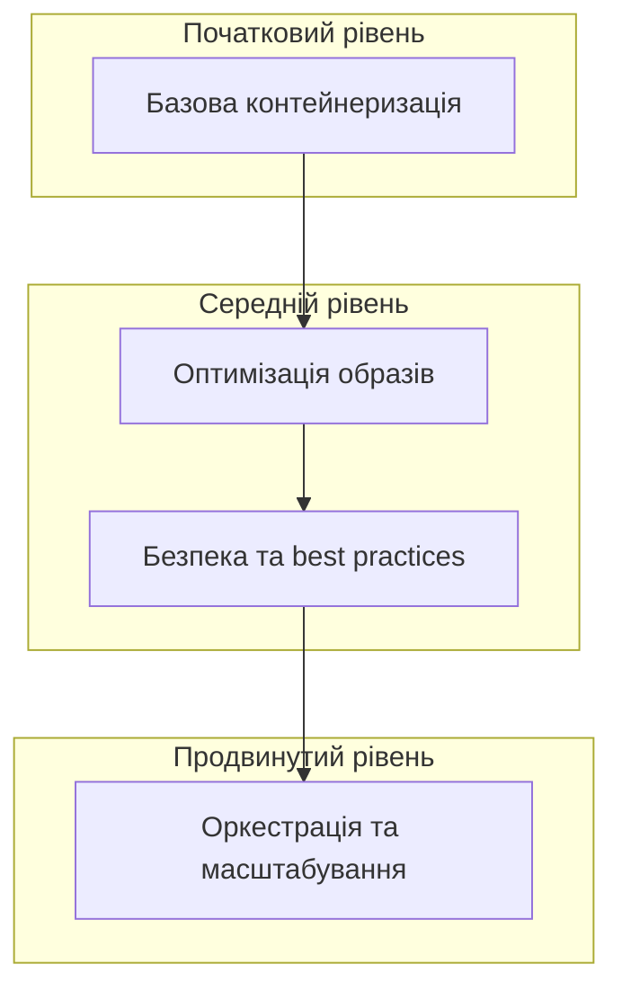

# Docker: Best Practices

Дотримання найкращих практик при роботі з Docker забезпечує ефективність, безпеку та масштабованість ваших контейнеризованих додатків. Ця шпаргалка охоплює основні рекомендації та типові анти-патерни.

## Маленькі образи

Менші образи мають численні переваги: швидше завантаження, менше споживання ресурсів, менша поверхня для атак.

### Вибір базового образу

```dockerfile
# ❌ Погано: використання великого базового образу
FROM ubuntu:latest  # ~70 MB

# ✅ Краще: використання мінімального базового образу
FROM alpine:3.15  # ~5 MB

# ✅ Найкраще: використання distroless для продакшну
FROM gcr.io/distroless/nodejs:16  # Мінімальний образ без shell та пакетного менеджера
```

**Порівняння розмірів популярних базових образів:**

| Образ         | Розмір    | Особливості                                        |
| ------------- | --------- | -------------------------------------------------- |
| ubuntu:latest | ~70 MB    | Повний дистрибутив, зручний для розробки           |
| debian:slim   | ~30 MB    | Мінімізований Debian                               |
| alpine:latest | ~5 MB     | Ультра-легкий дистрибутив на базі musl libc        |
| distroless    | ~20-50 MB | Лише runtime без shell та пакетних менеджерів      |
| scratch       | 0 MB      | Пустий образ (для статично скомпільованих програм) |

### Багатоетапна збірка (Multi-stage builds)

```dockerfile
# ✅ Найкращий підхід: багатоетапна збірка
# Етап збірки
FROM node:16 AS builder
WORKDIR /app
COPY package*.json ./
RUN npm ci
COPY . .
RUN npm run build

# Етап виконання
FROM node:16-alpine
WORKDIR /app
COPY --from=builder /app/dist ./dist
COPY --from=builder /app/package*.json ./
RUN npm ci --only=production && npm cache clean --force
USER node
CMD ["node", "dist/index.js"]
```

**Підкапотні механізми:**

-   Перший етап містить усі інструменти збірки та залежності для розробки
-   Другий етап включає лише необхідні файли для запуску
-   Інструменти збірки, вихідний код та проміжні файли не потрапляють у кінцевий образ
-   Значно зменшується розмір кінцевого образу та поверхня для атак

## Не зберігати секрети в образах

Секрети (ключі API, паролі, сертифікати) ніколи не повинні зберігатися в Docker образах.

### Антипатерни та їх виправлення

```dockerfile
# ❌ Дуже погано: жорстко закодовані секрети
FROM nginx
RUN echo "apiKey=1234567890abcdef" > /app/config.ini

# ❌ Погано: секрети через аргументи збірки (видно в історії)
FROM nginx
ARG API_KEY
RUN echo "apiKey=${API_KEY}" > /app/config.ini

# ✅ Краще: використання змінних середовища при запуску
FROM nginx
CMD echo "apiKey=$API_KEY" > /app/config.ini && nginx -g 'daemon off;'

# ✅ Найкраще: використання систем управління секретами
# Docker Swarm secrets, Kubernetes secrets, HashiCorp Vault, etc.
```

### Безпечна передача секретів

```bash
# Запуск з передачею секретів через змінні середовища
docker run -e API_KEY=1234567890abcdef myapp

# Використання .env файлу
docker run --env-file=.env myapp

# Docker Swarm secrets
printf "1234567890abcdef" | docker secret create api_key -
docker service create --name myapp --secret api_key myapp
```

**Безпечні альтернативи:**

1. Змінні середовища при запуску контейнера
2. Docker Secrets (для Docker Swarm)
3. Kubernetes Secrets
4. Зовнішні системи управління секретами (HashiCorp Vault, AWS Secrets Manager)
5. Монтування секретів як файлів під час виконання

## Resource Limits

Встановлення обмежень ресурсів запобігає ситуаціям, коли один контейнер може споживати всі ресурси хоста.

```bash
# Запуск з обмеженням ресурсів
docker run \
  --memory=512m \
  --memory-swap=512m \
  --cpus=0.5 \
  --pids-limit=100 \
  myapp
```

```yaml
# docker-compose.yml з обмеженнями ресурсів
services:
    app:
        image: myapp
        deploy:
            resources:
                limits:
                    cpus: "0.5"
                    memory: 512M
                reservations:
                    cpus: "0.25"
                    memory: 256M
```

**Підкапотні механізми:**

-   Обмеження пам'яті реалізуються через cgroups (control groups) в Linux
-   Обмеження CPU визначає частку доступного процесорного часу
-   `pids-limit` обмежує кількість процесів для захисту від fork-бомб
-   Різниця між limits (жорсткі обмеження) та reservations (гарантовані ресурси)

## Вибір базового образу

Вибір правильного базового образу залежить від контексту використання та потреб додатку.

### Критерії вибору

1. **Розмір:** менші образи швидше завантажуються та мають менше залежностей
2. **Безпека:** менша поверхня атаки, регулярні оновлення безпеки
3. **Сумісність:** підтримка необхідних бібліотек та залежностей
4. **Підтримка:** активна підтримка спільнотою або організацією

### Рекомендовані базові образи за типом застосунку

```dockerfile
# Node.js додатки
FROM node:16-alpine  # Для продакшну
FROM node:16  # Для розробки або складних залежностей

# Python додатки
FROM python:3.10-slim  # Хороший компроміс
FROM python:3.10-alpine  # Найменший, але може бути проблеми з компіляцією

# Java додатки
FROM eclipse-temurin:17-jre-alpine  # Лише JRE для запуску
FROM eclipse-temurin:17  # Повний JDK для збірки

# Go додатки
FROM golang:1.18-alpine AS builder  # Для збірки
FROM alpine  # Для запуску (або scratch для статичних бінарників)

# .NET додатки
FROM mcr.microsoft.com/dotnet/sdk:6.0 AS builder  # Для збірки
FROM mcr.microsoft.com/dotnet/aspnet:6.0  # Для запуску
```

## План для масштабування (K8s)

Хоча Docker відмінно працює для розробки та простих сценаріїв, для масштабування продакшн-середовища варто розглянути оркестратори контейнерів, такі як Kubernetes.

### Підготовка до переходу на Kubernetes

1. **Дотримуйтесь 12-factor app принципів:**

    - Конфігурація через змінні середовища
    - Виведення логів у stdout/stderr
    - Stateless процеси (стан у зовнішніх сервісах)
    - Обробка сигналів для graceful shutdown

2. **Розробляйте контейнери з думкою про масштабування:**

    - Уникайте залежності від локальних файлів
    - Використовуйте обмеження ресурсів
    - Впроваджуйте health checks
    - Уникайте жорстко закодованих хостів/портів

3. **Використовуйте docker-compose як перехідний етап:**
    - Kompose може конвертувати docker-compose.yml у Kubernetes-маніфести
    - Міграція по службах, а не весь додаток одразу

```bash
# Конвертація docker-compose.yml в K8s маніфести
kompose convert -f docker-compose.yml
```

### Практичні поради для Kubernetes-ready контейнерів

```dockerfile
# Kubernetes-ready Dockerfile
FROM node:16-alpine
WORKDIR /app
COPY package*.json ./
RUN npm ci --only=production
COPY . .

# Health check для оркестраторів
HEALTHCHECK --interval=30s --timeout=3s --start-period=5s --retries=3 \
  CMD wget -q -O - http://localhost:3000/health || exit 1

# Правильна обробка сигналів
USER node
ENTRYPOINT ["node", "index.js"]
```

```yaml
# docker-compose.yml з Kubernetes-compatible конфігурацією
services:
    api:
        image: myapi:latest
        environment:
            - DB_HOST=db
            - CACHE_HOST=redis
        ports:
            - "3000:3000"
        healthcheck:
            test:
                ["CMD", "wget", "-q", "-O", "-", "http://localhost:3000/health"]
            interval: 30s
            timeout: 3s
            retries: 3
            start_period: 5s
        deploy:
            resources:
                limits:
                    cpus: "0.5"
                    memory: 512M
```

## Практичні патерни та рішення

### Патерн init контейнера

```yaml
# docker-compose.yml з init контейнером для очікування залежностей
services:
    app:
        image: myapp
        depends_on:
            - db
        entrypoint: ["/wait-for-it.sh", "db:5432", "--", "node", "app.js"]
        volumes:
            - ./wait-for-it.sh:/wait-for-it.sh:ro
```

### Патерн sidecar контейнера

```yaml
# docker-compose.yml з sidecar контейнером для логування
services:
    app:
        image: myapp
        volumes:
            - logs:/logs

    log-collector:
        image: fluent/fluent-bit
        volumes:
            - logs:/logs:ro
            - ./fluent-bit.conf:/fluent-bit/etc/fluent-bit.conf
        depends_on:
            - app

volumes:
    logs:
```

### Патерн readonly контейнери

```dockerfile
# Dockerfile для readonly контейнера
FROM node:16-alpine
WORKDIR /app
COPY package*.json ./
RUN npm ci --only=production && \
    mkdir -p /app/logs && \
    chown -R node:node /app/logs
COPY --chown=node:node . .
USER node
CMD ["node", "app.js"]
```

```bash
# Запуск з readonly файловою системою
docker run --read-only --tmpfs /app/logs myapp
```

## Схема еволюції Docker-практик



## Контрольний список найкращих практик

### Dockerfile та образи

-   [ ] Використовувати конкретні теги замість `latest`
-   [ ] Мінімізувати кількість шарів (об'єднувати RUN команди)
-   [ ] Очищати кеш пакетних менеджерів в тому ж шарі
-   [ ] Правильно використовувати кеш (порядок інструкцій)
-   [ ] Додавати HEALTHCHECK
-   [ ] Застосовувати .dockerignore
-   [ ] Запускати від непривілейованого користувача (USER)
-   [ ] Використовувати multi-stage build
-   [ ] Встановлювати залежності перед копіюванням коду
-   [ ] Мінімізувати розмір образу

### Безпека

-   [ ] Регулярно оновлювати базові образи
-   [ ] Сканувати образи на наявність вразливостей
-   [ ] Обмежувати capabilities контейнерів
-   [ ] Не зберігати секрети в образах
-   [ ] Використовувати readonly файлову систему, де можливо
-   [ ] Підписувати образи з Docker Content Trust
-   [ ] Налаштувати обмеження ресурсів

### Виконання

-   [ ] Встановлювати обмеження ресурсів
-   [ ] Перевіряти вихідний код на 0 при помилках
-   [ ] Правильно обробляти сигнали завершення
-   [ ] Використовувати правильні стратегії логування
-   [ ] Налаштовувати збір метрик
-   [ ] Ротація та обмеження розміру логів
-   [ ] Правильна робота з томами для даних

### Розробка та CI/CD

-   [ ] Налаштувати CI/CD для автоматичної збірки та тестування
-   [ ] Використовувати послідовну стратегію тегування
-   [ ] Кешувати шари в CI/CD
-   [ ] Документувати образи (LABEL, README)
-   [ ] Версіонувати образи
-   [ ] Тестувати контейнери в CI/CD
-   [ ] Автоматизувати оновлення базових образів
