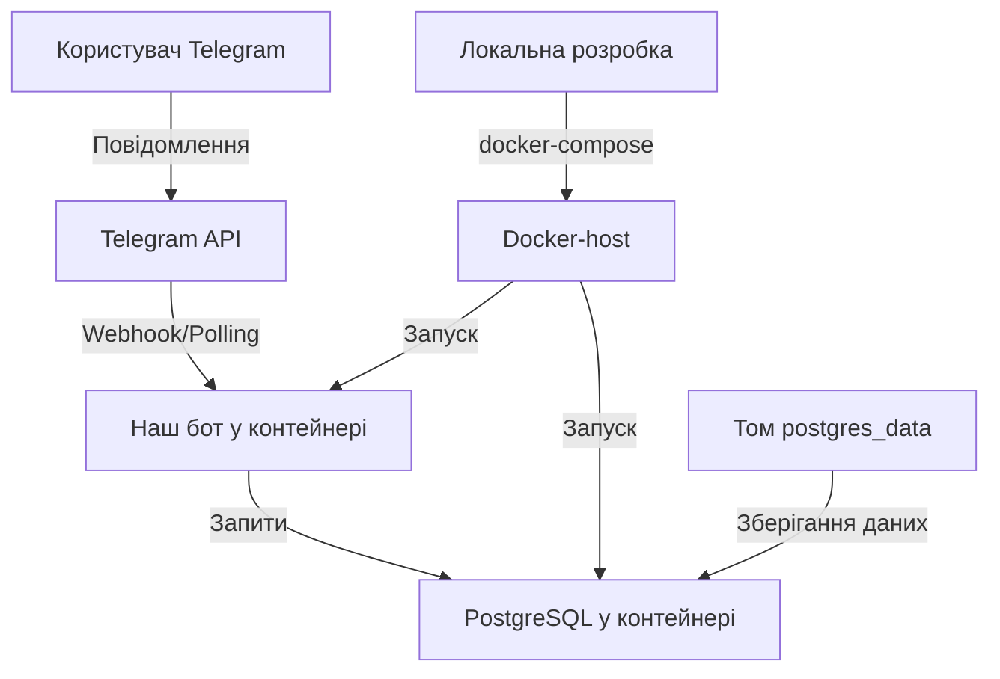

# Docker: Практичний приклад - Телеграм бот з базою даних

У цьому розділі ми створимо повноцінний проект з використанням Docker: телеграм-бот на Python з базою даних PostgreSQL. Покроково розглянемо весь процес від створення структури проекту до запуску в контейнерах.

## Крок 1: Структура проекту

Почнемо зі створення структури нашого проекту:

```
telegram-bot/
├── app/
│   ├── __init__.py
│   ├── bot.py         # Основний код бота
│   ├── config.py      # Конфігурація
│   └── db.py          # Робота з базою даних
├── migrations/        # Міграції для бази даних
├── .env.example       # Приклад змінних середовища
├── .dockerignore      # Файли, які не потрібно включати в образ
├── docker-compose.yml # Конфігурація для Docker Compose
├── Dockerfile         # Інструкції для збірки образу
└── requirements.txt   # Залежності Python
```

**Пояснення:**

-   Ми розділяємо код бота на окремі модулі для кращої організації
-   Файл `.env.example` містить шаблон змінних середовища, які потрібні для проекту
-   Каталог `migrations` міститиме скрипти для міграції бази даних

## Крок 2: Код бота (базовий приклад)

Створимо основні файли з кодом:

**app/config.py**:

```python
import os
from dotenv import load_dotenv

# Завантаження змінних середовища з .env файлу
load_dotenv()

# Конфігурація
TELEGRAM_TOKEN = os.getenv("TELEGRAM_TOKEN")
DATABASE_URL = os.getenv("DATABASE_URL")

# Перевірка наявності обов'язкових змінних
if not TELEGRAM_TOKEN:
    raise ValueError("TELEGRAM_TOKEN is not set in environment variables")

if not DATABASE_URL:
    raise ValueError("DATABASE_URL is not set in environment variables")
```

**app/db.py**:

```python
import psycopg2
from psycopg2.extras import DictCursor
from config import DATABASE_URL

def get_connection():
    """Створює з'єднання з базою даних"""
    return psycopg2.connect(DATABASE_URL)

def init_db():
    """Ініціалізує базу даних - створює таблиці, якщо вони не існують"""
    conn = get_connection()
    cur = conn.cursor()

    # Створення таблиці для збереження користувачів
    cur.execute('''
    CREATE TABLE IF NOT EXISTS users (
        id SERIAL PRIMARY KEY,
        user_id BIGINT UNIQUE NOT NULL,
        username VARCHAR(255),
        first_name VARCHAR(255),
        last_name VARCHAR(255),
        created_at TIMESTAMP DEFAULT CURRENT_TIMESTAMP
    )
    ''')

    # Створення таблиці для збереження повідомлень
    cur.execute('''
    CREATE TABLE IF NOT EXISTS messages (
        id SERIAL PRIMARY KEY,
        user_id BIGINT REFERENCES users(user_id),
        text TEXT,
        created_at TIMESTAMP DEFAULT CURRENT_TIMESTAMP
    )
    ''')

    conn.commit()
    cur.close()
    conn.close()

def save_user(user_id, username=None, first_name=None, last_name=None):
    """Зберігає інформацію про користувача в базу даних"""
    conn = get_connection()
    cur = conn.cursor()

    cur.execute('''
    INSERT INTO users (user_id, username, first_name, last_name)
    VALUES (%s, %s, %s, %s)
    ON CONFLICT (user_id) DO UPDATE
    SET username = EXCLUDED.username,
        first_name = EXCLUDED.first_name,
        last_name = EXCLUDED.last_name
    ''', (user_id, username, first_name, last_name))

    conn.commit()
    cur.close()
    conn.close()

def save_message(user_id, text):
    """Зберігає повідомлення користувача"""
    conn = get_connection()
    cur = conn.cursor()

    cur.execute('''
    INSERT INTO messages (user_id, text)
    VALUES (%s, %s)
    ''', (user_id, text))

    conn.commit()
    cur.close()
    conn.close()

def get_user_stats(user_id):
    """Отримує статистику повідомлень для користувача"""
    conn = get_connection()
    cur = conn.cursor(cursor_factory=DictCursor)

    cur.execute('''
    SELECT COUNT(*) as message_count
    FROM messages
    WHERE user_id = %s
    ''', (user_id,))

    result = cur.fetchone()
    cur.close()
    conn.close()

    return result['message_count'] if result else 0
```

**app/bot.py**:

```python
import logging
from telegram import Update
from telegram.ext import Updater, CommandHandler, MessageHandler, Filters, CallbackContext
from config import TELEGRAM_TOKEN
import db

# Налаштування логування
logging.basicConfig(
    format='%(asctime)s - %(name)s - %(levelname)s - %(message)s', level=logging.INFO
)
logger = logging.getLogger(__name__)

def start(update: Update, context: CallbackContext) -> None:
    """Обробник команди /start"""
    user = update.effective_user
    db.save_user(
        user.id,
        username=user.username,
        first_name=user.first_name,
        last_name=user.last_name
    )

    update.message.reply_text(f'Привіт, {user.first_name}! Я бот, який зберігає повідомлення.')

def stats(update: Update, context: CallbackContext) -> None:
    """Обробник команди /stats - показує статистику повідомлень"""
    user = update.effective_user
    message_count = db.get_user_stats(user.id)

    update.message.reply_text(f'Ви надіслали {message_count} повідомлень.')

def echo(update: Update, context: CallbackContext) -> None:
    """Обробник звичайних повідомлень"""
    user = update.effective_user
    db.save_user(
        user.id,
        username=user.username,
        first_name=user.first_name,
        last_name=user.last_name
    )

    # Зберігаємо повідомлення в БД
    db.save_message(user.id, update.message.text)

    # Відповідаємо користувачу
    update.message.reply_text(f'Я отримав ваше повідомлення: {update.message.text}')

def main() -> None:
    """Запуск бота"""
    # Ініціалізація бази даних
    db.init_db()

    # Створення об'єкта Updater і передача йому токена бота
    updater = Updater(TELEGRAM_TOKEN)

    # Отримання диспетчера для реєстрації обробників
    dispatcher = updater.dispatcher

    # Реєстрація обробників команд
    dispatcher.add_handler(CommandHandler("start", start))
    dispatcher.add_handler(CommandHandler("stats", stats))

    # Реєстрація обробника звичайних повідомлень
    dispatcher.add_handler(MessageHandler(Filters.text & ~Filters.command, echo))

    # Запуск бота
    updater.start_polling()
    updater.idle()

if __name__ == '__main__':
    main()
```

**app/**init**.py**:

```python
# Пустий файл для позначення каталогу як пакета Python
```

**requirements.txt**:

```
python-telegram-bot==13.7
psycopg2-binary==2.9.3
python-dotenv==0.19.2
```

## Крок 3: Створення Dockerfile

Тепер створимо Dockerfile для нашого бота:

```dockerfile
# Використовуємо офіційний образ Python як базовий
FROM python:3.9-slim

# Встановлюємо робочу директорію в контейнері
WORKDIR /app

# Встановлюємо залежності для psycopg2
RUN apt-get update && apt-get install -y \
    gcc \
    libpq-dev \
    && apt-get clean \
    && rm -rf /var/lib/apt/lists/*

# Копіюємо файл з залежностями
COPY requirements.txt .

# Встановлюємо залежності
RUN pip install --no-cache-dir -r requirements.txt

# Копіюємо код бота
COPY . .

# Створюємо непривілейованого користувача для запуску бота
RUN adduser --disabled-password --gecos "" appuser
USER appuser

# Запускаємо бота при старті контейнера
CMD ["python", "-m", "app.bot"]
```

**Пояснення кожного кроку:**

1. `FROM python:3.9-slim` - використовуємо легкий Python образ для зменшення розміру
2. `WORKDIR /app` - встановлюємо робочу директорію всередині контейнера
3. `RUN apt-get update...` - встановлюємо системні залежності для psycopg2 (PostgreSQL бібліотека)
4. `COPY requirements.txt .` - копіюємо список залежностей окремо (для кешування)
5. `RUN pip install...` - встановлюємо Python залежності
6. `COPY . .` - копіюємо весь код бота
7. `RUN adduser...` і `USER appuser` - створюємо та використовуємо непривілейованого користувача для безпеки
8. `CMD ["python", "-m", "app.bot"]` - запускаємо бота

## Крок 4: Створення .dockerignore

Щоб уникнути копіювання непотрібних файлів у Docker-образ, створимо файл `.dockerignore`:

```
__pycache__/
*.py[cod]
*$py.class
*.so
.Python
env/
build/
develop-eggs/
dist/
downloads/
eggs/
.eggs/
lib/
lib64/
parts/
sdist/
var/
wheels/
*.egg-info/
.installed.cfg
*.egg

# Dotenv files
.env
.env.*
!.env.example

# Docker files
Dockerfile
docker-compose.yml

# Git
.git
.gitignore

# Virtual Environment
venv/
ENV/
```

**Пояснення:**

-   Виключаємо кеш Python, віртуальні середовища та тимчасові файли
-   Виключаємо .env файли з секретами, але залишаємо .env.example як шаблон
-   Виключаємо Docker-файли та Git-директорії, щоб зменшити розмір образу

## Крок 5: Створення .env.example

Створимо шаблон для змінних середовища:

```
# Токен Telegram бота (отримується від @BotFather)
TELEGRAM_TOKEN=your_telegram_bot_token_here

# URL для підключення до PostgreSQL
DATABASE_URL=postgresql://postgres:postgres@db:5432/telegram_bot
```

**Пояснення:**

-   `TELEGRAM_TOKEN` - токен, який ви отримуєте від @BotFather при створенні бота
-   `DATABASE_URL` - URL для підключення до бази даних (зверніть увагу на "db" як хост - це ім'я сервісу в Docker Compose)

## Крок 6: Створення docker-compose.yml

Тепер створимо файл `docker-compose.yml` для запуску бота з базою даних:

```yaml
version: "3.8"

services:
    # Сервіс для бази даних
    db:
        image: postgres:13-alpine
        volumes:
            - postgres_data:/var/lib/postgresql/data
        environment:
            - POSTGRES_PASSWORD=postgres
            - POSTGRES_USER=postgres
            - POSTGRES_DB=telegram_bot
        restart: unless-stopped
        healthcheck:
            test: ["CMD-SHELL", "pg_isready -U postgres"]
            interval: 10s
            timeout: 5s
            retries: 5

    # Сервіс для телеграм бота
    bot:
        build: .
        depends_on:
            - db
        environment:
            - TELEGRAM_TOKEN=${TELEGRAM_TOKEN}
            - DATABASE_URL=postgresql://postgres:postgres@db:5432/telegram_bot
        restart: unless-stopped

volumes:
    postgres_data:
```

**Пояснення сервісів:**

**db (PostgreSQL):**

1. `image: postgres:13-alpine` - використовуємо легкий Alpine-образ PostgreSQL
2. `volumes:` - створюємо том для зберігання даних PostgreSQL між перезапусками
3. `environment:` - встановлюємо змінні середовища для бази даних
4. `restart: unless-stopped` - автоматичний перезапуск у разі збою
5. `healthcheck:` - перевірка працездатності бази даних

**bot (наш Telegram-бот):**

1. `build: .` - збірка з Dockerfile в поточній директорії
2. `depends_on:` - залежність від сервісу бази даних
3. `environment:` - змінні середовища для бота
4. `restart: unless-stopped` - автоматичний перезапуск у разі збою

## Крок 7: Запуск проекту

Щоб запустити проект, потрібно:

1. Створити файл `.env` з реальними значеннями (на основі `.env.example`):

    ```
    TELEGRAM_TOKEN=your_actual_token
    ```

2. Зібрати та запустити контейнери:
    ```bash
    docker-compose up -d
    ```

**Що відбувається при запуску:**

1. Docker Compose спочатку запускає сервіс `db` (PostgreSQL)
2. Після запуску бази даних, запускається сервіс `bot`
3. Бот підключається до Telegram API та бази даних
4. Дані зберігаються в томі `postgres_data`, що забезпечує їх збереження

## Крок 8: Моніторинг і управління

### Перегляд логів бота:

```bash
docker-compose logs -f bot
```

### Перевірка статусу контейнерів:

```bash
docker-compose ps
```

### Зупинка проекту:

```bash
docker-compose down
```

### Зупинка проекту з видаленням даних бази даних:

```bash
docker-compose down -v
```

## Крок 9: Розширення проекту

### Додавання нового сервісу (наприклад, Adminer для управління базою даних):

Розширимо `docker-compose.yml`:

```yaml
version: "3.8"

services:
    db:
        # ... як раніше ...

    bot:
        # ... як раніше ...

    # Додаємо Adminer для управління базою даних через веб-інтерфейс
    adminer:
        image: adminer
        restart: unless-stopped
        ports:
            - "8080:8080"
        depends_on:
            - db
```

### Додавання міграцій бази даних:

Створимо каталог `migrations` і файл міграції:

**migrations/01_initial.sql**:

```sql
-- Створення таблиці для збереження користувачів
CREATE TABLE IF NOT EXISTS users (
    id SERIAL PRIMARY KEY,
    user_id BIGINT UNIQUE NOT NULL,
    username VARCHAR(255),
    first_name VARCHAR(255),
    last_name VARCHAR(255),
    created_at TIMESTAMP DEFAULT CURRENT_TIMESTAMP
);

-- Створення таблиці для збереження повідомлень
CREATE TABLE IF NOT EXISTS messages (
    id SERIAL PRIMARY KEY,
    user_id BIGINT REFERENCES users(user_id),
    text TEXT,
    created_at TIMESTAMP DEFAULT CURRENT_TIMESTAMP
);

-- Додавання індексів для оптимізації запитів
CREATE INDEX IF NOT EXISTS idx_messages_user_id ON messages(user_id);
```

Додамо скрипт для запуску міграцій в Dockerfile:

```dockerfile
# ... як раніше ...

# Копіюємо міграції
COPY migrations /app/migrations

# ... як раніше ...

# Змінюємо CMD, щоб спочатку запускати міграції
CMD ["sh", "-c", "python -c 'from app.db import init_db; init_db()' && python -m app.bot"]
```

## Крок 10: CI/CD налаштування

Для автоматизації процесу розробки, створимо `.github/workflows/docker-build.yml` для GitHub Actions:

```yaml
name: Docker Build and Push

on:
    push:
        branches: [main]
    pull_request:
        branches: [main]

jobs:
    build:
        runs-on: ubuntu-latest
        steps:
            - uses: actions/checkout@v2

            - name: Set up Docker Buildx
              uses: docker/setup-buildx-action@v1

            - name: Build and test
              run: |
                  docker-compose build
                  docker-compose up -d db
                  sleep 10  # Даємо час для запуску бази даних
                  docker-compose run --rm bot python -c "from app.db import init_db; init_db()"
                  docker-compose down

            # Для production - додайте кроки для відправки образу в реєстр
            # - name: Login to DockerHub
            #   uses: docker/login-action@v1
            #   with:
            #     username: ${{ secrets.DOCKERHUB_USERNAME }}
            #     password: ${{ secrets.DOCKERHUB_TOKEN }}

            # - name: Build and push
            #   uses: docker/build-push-action@v2
            #   with:
            #     push: true
            #     tags: yourusername/telegram-bot:latest
```

## Схема взаємодії компонентів



## Підводні камені та оптимізація

### 1. Управління секретами

**Проблема:** Токен бота та інші секрети не повинні зберігатися в репозиторії.

**Рішення:**

-   Використовуйте `.env` файл локально, але не комітьте його
-   Для production середовища використовуйте секрети Docker Swarm або Kubernetes
-   Не зберігайте секрети в образах Docker

### 2. Стійкість до збоїв

**Проблема:** Бот повинен автоматично відновлюватися після збоїв.

**Рішення:**

-   Використовуйте `restart: unless-stopped` для автоматичного перезапуску
-   Додайте healthcheck для бота
-   Налаштуйте логування помилок

### 3. Резервне копіювання даних

**Проблема:** Дані в PostgreSQL повинні бути захищені від втрати.

**Рішення:**

-   Налаштуйте регулярне резервне копіювання бази даних
-   Використовуйте скрипт резервного копіювання в cron

```bash
# Приклад скрипта резервного копіювання
docker-compose exec -T db pg_dump -U postgres telegram_bot > backup_$(date +%Y%m%d).sql
```

## Висновок

Ми створили повноцінний проект з телеграм-ботом та базою даних, повністю контейнеризований за допомогою Docker та Docker Compose. Цей підхід забезпечує:

1. **Ізоляцію:** кожен компонент працює у своєму контейнері
2. **Портативність:** проект легко запустити на будь-якій системі з Docker
3. **Масштабованість:** легко додавати нові сервіси або розширювати існуючі
4. **Відтворюваність:** однаковий результат на різних середовищах

Наш проект можна використовувати як шаблон для інших ботів або розширювати його, додаючи нові функції та компоненти.
