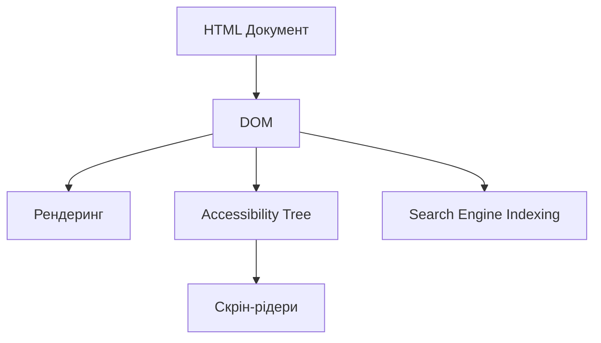
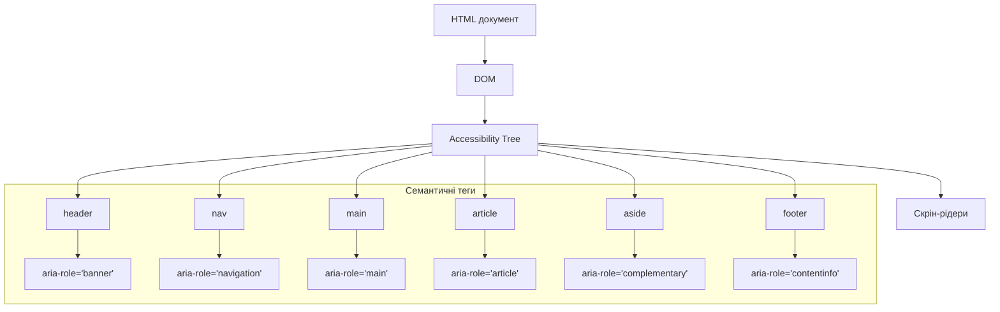

# HTML

## HTML: Семантичні теги

Семантичні теги — це елементи HTML, які надають зміст і структурне значення контенту, який вони обрамляють. На відміну від `<div>` або `<span>`, семантичні теги явно вказують браузеру, пошуковим системам та асистивним технологіям на тип вмісту всередині них.

### Для чого використовуються

-   **Структурування документа**: Забезпечують логічну структуру вмісту сторінки
-   **Доступність**: Допомагають асистивним технологіям (наприклад, скрін-рідерам) розуміти контент
-   **SEO-оптимізація**: Покращують індексацію сторінки пошуковими системами
-   **Підтримка коду**: Роблять HTML більш читабельним та зрозумілим

### Повний список семантичних тегів

#### Основні структурні теги

| Тег         | Опис                                                                                         | Приклад                                                       |
| ----------- | -------------------------------------------------------------------------------------------- | ------------------------------------------------------------- |
| `<header>`  | Верхня частина сторінки або секції; містить вступний контент (логотип, навігацію, заголовок) | `<header><h1>Назва сайту</h1><nav>...</nav></header>`         |
| `<main>`    | Основний контент сторінки (використовується лише один раз на сторінці)                       | `<main><article>Головний контент</article></main>`            |
| `<footer>`  | Нижня частина сторінки або секції; містить підсумкову інформацію                             | `<footer>&copy; 2025 Мій сайт</footer>`                       |
| `<nav>`     | Секція з навігаційними посиланнями                                                           | `<nav><ul><li><a href="/">Головна</a></li></ul></nav>`        |
| `<article>` | Незалежний, самодостатній контент, який може існувати окремо                                 | `<article><h2>Заголовок статті</h2><p>Зміст...</p></article>` |
| `<section>` | Логічне групування контенту, зазвичай має заголовок                                          | `<section><h2>Про нас</h2><p>Деталі...</p></section>`         |
| `<aside>`   | Контент, пов'язаний з основним, але непрямо (сайдбар, рекламні банери)                       | `<aside><h3>Популярні статті</h3><ul>...</ul></aside>`        |

#### Додаткові семантичні теги

| Тег            | Опис                                    | Приклад                                                               |
| -------------- | --------------------------------------- | --------------------------------------------------------------------- |
| `<figure>`     | Самодостатній контент, часто з підписом | `<figure><figcaption>Опис</figcaption></figure>`   |
| `<figcaption>` | Підпис до `<figure>`                    | Див. приклад вище                                                     |
| `<time>`       | Дата або час                            | `<time datetime="2025-08-05">5 серпня 2025</time>`                    |
| `<mark>`       | Виділений/підсвічений текст             | `<p>Це <mark>важливий</mark> момент</p>`                              |
| `<details>`    | Інтерактивний розкривний елемент        | `<details><summary>Деталі</summary><p>Прихований вміст</p></details>` |
| `<summary>`    | Видимий заголовок для `<details>`       | Див. приклад вище                                                     |
| `<address>`    | Контактна інформація                    | `<address>info@example.com</address>`                                 |

### Приклад використання семантичних тегів

```html
<!DOCTYPE html>
<html lang="uk">
    <head>
        <meta charset="UTF-8" />
        <title>Семантичний HTML</title>
    </head>
    <body>
        <header>
            <h1>Мій блог</h1>
            <nav>
                <ul>
                    <li><a href="/">Головна</a></li>
                    <li><a href="/blog">Статті</a></li>
                    <li><a href="/about">Про мене</a></li>
                </ul>
            </nav>
        </header>

        <main>
            <article>
                <header>
                    <h2>Заголовок статті</h2>
                    <time datetime="2025-08-05">5 серпня 2025</time>
                </header>
                <section>
                    <h3>Перший розділ</h3>
                    <p>Текст першого розділу...</p>
                </section>
                <section>
                    <h3>Другий розділ</h3>
                    <p>Текст другого розділу...</p>
                </section>
                <footer>
                    <p>Автор: Іван Петренко</p>
                </footer>
            </article>

            <aside>
                <h3>Рекомендовані статті</h3>
                <ul>
                    <li><a href="#">Стаття 1</a></li>
                    <li><a href="#">Стаття 2</a></li>
                </ul>
            </aside>
        </main>

        <footer>
            <p>&copy; 2025 Мій блог. Усі права захищено.</p>
            <address>
                Контакт: <a href="mailto:info@example.com">info@example.com</a>
            </address>
        </footer>
    </body>
</html>
```

### Підкапотні механізми

#### Як браузер інтерпретує семантичні теги

1. **Парсинг DOM**:

    - Браузер створює DOM (Document Object Model), де кожен семантичний тег стає вузлом зі спеціальним типом
    - Семантичні теги обробляються так само, як `<div>` з точки зору рендерингу, але мають особливі властивості accessibility

2. **Роль у accessibility (доступності)**:
    - Скрін-рідери використовують семантичні теги для навігації по сторінці
    - Наприклад, користувач може перейти між розділами, заголовками або навігацією
    - ARIA-ролі (Accessible Rich Internet Applications) часто вбудовані в семантичні теги за замовчуванням



#### Роль у SEO

1. **Розуміння структури контенту**:

    - Пошукові системи використовують семантичні теги, щоб визначити структуру та ієрархію контенту
    - `<header>`, `<h1>-<h6>` мають більшу вагу для визначення теми сторінки

2. **Показники якості**:
    - Правильне використання семантичних тегів є показником якості для пошукових систем
    - Впливає на ранжування в результатах пошуку

#### Особливості та підводні камені

1. **Неправильне використання**:

    - Використання `<section>` замість `<div>` без логічного групування не дає переваг
    - Використання більше одного `<main>` на сторінці суперечить специфікації

2. **Вкладеність семантичних тегів**:

    - Семантичні теги можуть бути вкладеними (наприклад, `<article>` всередині `<main>`)
    - Але деякі комбінації нелогічні (наприклад, `<header>` всередині `<footer>`)

3. **Підтримка браузерами**:
    - Сучасні браузери підтримують усі семантичні теги
    - Для старих браузерів (IE8 і нижче) потрібні поліфіли або CSS для правильного відображення

```css
/* Для старих браузерів без підтримки HTML5 */
header,
main,
footer,
article,
section,
nav,
aside {
    display: block;
}
```

#### Оптимізація використання семантичних тегів

1. **Планування структури**:

    - Спочатку визначіть логічну структуру сторінки, потім підбирайте відповідні теги
    - Використовуйте заголовки (`<h1>-<h6>`) для створення ієрархії контенту

2. **Перевірка доступності**:

    - Використовуйте інструменти на кшталт Lighthouse, axe або WAVE для перевірки доступності
    - Забезпечте, щоб скрін-рідери правильно інтерпретували структуру

3. **Доповнення ARIA-атрибутами**:
    - Коли семантичних тегів недостатньо, доповнюйте їх ARIA-атрибутами
    - Наприклад: `<nav aria-label="Головна навігація">`

### Схеми та діаграми

#### Порівняння семантичної та несемантичної структури

```
Несемантична структура:
┌─────────────────────────────┐
│ <div class="header">        │
│   <div class="logo">        │
│   <div class="navigation">  │
└─────────────────────────────┘
┌─────────────────────────────┐
│ <div class="main-content">  │
│   <div class="article">     │
│   <div class="sidebar">     │
└─────────────────────────────┘
┌─────────────────────────────┐
│ <div class="footer">        │
└─────────────────────────────┘

Семантична структура:
┌─────────────────────────────┐
│ <header>                    │
│   <h1>                      │
│   <nav>                     │
└─────────────────────────────┘
┌─────────────────────────────┐
│ <main>                      │
│   <article>                 │
│   <aside>                   │
└─────────────────────────────┘
┌─────────────────────────────┐
│ <footer>                    │
└─────────────────────────────┘
```

#### Доступність семантичної структури



> **Важливо**: Правильне використання семантичних тегів — це не просто питання "чистого коду". Це суттєво впливає на доступність веб-сайту, SEO та майбутню підтримку.
