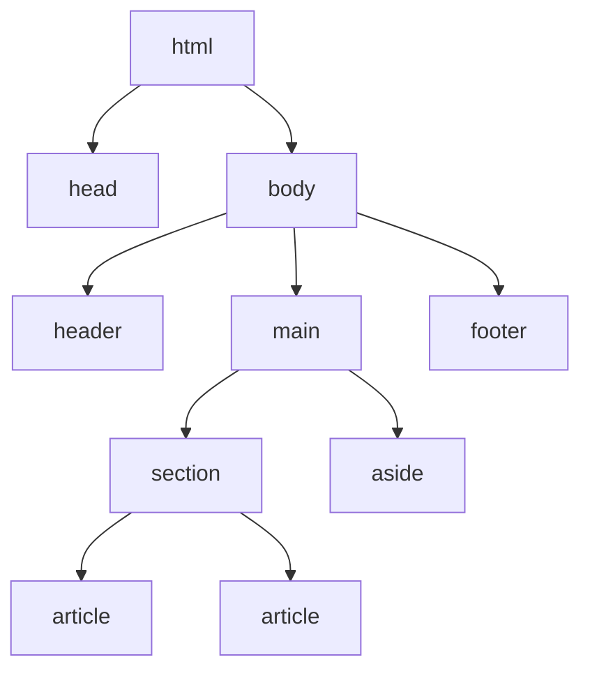
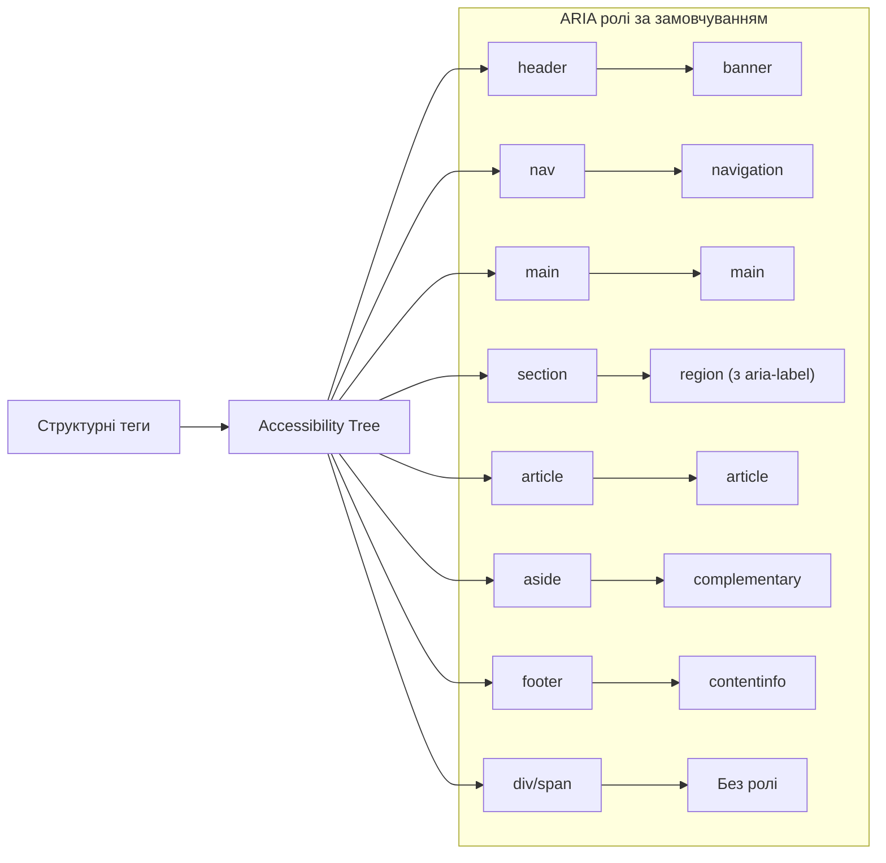

# HTML

## HTML: Структурні теги

Структурні теги HTML — це елементи, які формують основний каркас веб-сторінки. Вони дозволяють розділити вміст сторінки на логічні блоки, створюючи чітку організацію документа.

### Для чого використовуються

-   **Організація контенту**: Створюють ієрархічну та логічну структуру сторінки
-   **Покращення читабельності коду**: Роблять HTML-розмітку більш зрозумілою для розробників
-   **Семантика документа**: Надають значення різним частинам сторінки
-   **Консистентність структури**: Забезпечують уніфікований підхід до побудови різних сторінок сайту

### Повний список структурних тегів

#### Базові структурні теги

| Тег      | Опис                                           | Приклад                                      |
| -------- | ---------------------------------------------- | -------------------------------------------- |
| `<html>` | Кореневий елемент HTML документа               | `<html lang="uk">...</html>`                 |
| `<head>` | Контейнер для метаданих та посилань на ресурси | `<head><title>Назва сторінки</title></head>` |
| `<body>` | Контейнер для всього видимого вмісту сторінки  | `<body><h1>Привіт, світ!</h1></body>`        |

#### Семантичні структурні теги HTML5

| Тег         | Опис                                           | Приклад                                                |
| ----------- | ---------------------------------------------- | ------------------------------------------------------ |
| `<header>`  | Верхня частина сторінки або секції             | `<header><h1>Заголовок сайту</h1></header>`            |
| `<main>`    | Основний вміст документа (має бути унікальним) | `<main><p>Основний контент</p></main>`                 |
| `<footer>`  | Нижня частина сторінки або секції              | `<footer>© 2025</footer>`                              |
| `<section>` | Тематичний розділ вмісту                       | `<section><h2>Про нас</h2>...</section>`               |
| `<article>` | Самодостатній, незалежний блок вмісту          | `<article><h2>Стаття</h2>...</article>`                |
| `<aside>`   | Вміст, побічно пов'язаний з основним           | `<aside><h3>Також читайте</h3>...</aside>`             |
| `<nav>`     | Блок з навігаційними посиланнями               | `<nav><ul><li><a href="/">Головна</a></li></ul></nav>` |

#### Контейнерні структурні теги

| Тег      | Опис                                                       | Приклад                                                     |
| -------- | ---------------------------------------------------------- | ----------------------------------------------------------- |
| `<div>`  | Універсальний блоковий контейнер без семантичного значення | `<div class="container">Вміст</div>`                        |
| `<span>` | Універсальний рядковий контейнер без семантичного значення | `<p>Текст з <span class="highlight">виділенням</span>.</p>` |

### Вкладеність і структура документа

Правильна вкладеність структурних тегів критично важлива для створення логічної ієрархії документа. Ось основні принципи:

#### Базова структура HTML-документа

```html
<!DOCTYPE html>
<html lang="uk">
    <head>
        <meta charset="UTF-8" />
        <meta name="viewport" content="width=device-width, initial-scale=1.0" />
        <title>Назва документа</title>
        <!-- CSS, JavaScript та інші ресурси -->
    </head>
    <body>
        <!-- Видимий вміст сторінки -->
    </body>
</html>
```

#### Приклад семантичної структури сторінки

```html
<!DOCTYPE html>
<html lang="uk">
    <head>
        <meta charset="UTF-8" />
        <title>Мій веб-сайт</title>
        <link rel="stylesheet" href="style.css" />
    </head>
    <body>
        <header>
            <h1>Назва сайту</h1>
            <nav>
                <ul>
                    <li><a href="/">Головна</a></li>
                    <li><a href="/about">Про нас</a></li>
                    <li><a href="/contact">Контакти</a></li>
                </ul>
            </nav>
        </header>

        <main>
            <section id="featured">
                <h2>Головні новини</h2>
                <article>
                    <h3>Заголовок статті</h3>
                    <p>Текст статті...</p>
                </article>
                <article>
                    <h3>Інша стаття</h3>
                    <p>Інший текст...</p>
                </article>
            </section>

            <section id="regular-content">
                <h2>Інші матеріали</h2>
                <!-- Вміст розділу -->
            </section>

            <aside>
                <h3>Рекомендовані матеріали</h3>
                <ul>
                    <li><a href="#">Посилання 1</a></li>
                    <li><a href="#">Посилання 2</a></li>
                </ul>
            </aside>
        </main>

        <footer>
            <p>&copy; 2025 Мій веб-сайт. Усі права захищено.</p>
            <nav>
                <ul>
                    <li><a href="/privacy">Політика конфіденційності</a></li>
                    <li><a href="/terms">Умови використання</a></li>
                </ul>
            </nav>
        </footer>
    </body>
</html>
```

### Рекомендації з вкладеності структурних тегів

1. **Дозволена вкладеність**:

    - `<article>` може містити `<header>`, `<section>`, `<footer>`
    - `<section>` може містити інші `<section>`, `<article>`, `<aside>`
    - `<header>` та `<footer>` можуть бути як на рівні сторінки, так і всередині `<article>` чи `<section>`

2. **Обмеження вкладеності**:
    - `<main>` повинен бути єдиним на сторінці
    - Уникайте вкладення `<header>` в `<header>` або `<footer>` в `<footer>`
    - `<main>` не повинен бути нащадком `<article>`, `<aside>`, `<footer>`, `<header>` або `<nav>`

### Підкапотні механізми

#### Як браузер інтерпретує структурні теги

1. **Створення DOM дерева**:
    - Браузер парсить HTML і створює DOM (Document Object Model)
    - Кожен структурний тег стає вузлом в DOM-дереві
    - Вкладеність тегів формує ієрархію батьківських і дочірніх вузлів



2. **Блокова природа структурних тегів**:

    - Більшість структурних тегів є блоковими елементами
    - За замовчуванням вони займають всю доступну ширину і створюють новий рядок до і після

3. **Візуальне відображення**:
    - Самі по собі структурні теги не мають візуального оформлення
    - Їх зовнішній вигляд визначається CSS

#### Особливості та підводні камені

1. **Семантика vs `<div>`**:

    - `<div>` не має семантичного значення і повинен використовуватися лише коли жоден семантичний тег не підходить
    - Надмірне використання `<div>` призводить до "div-супу" (div soup) — коду, який важко підтримувати

2. **Доступність**:

    - Структурні семантичні теги автоматично встановлюють ARIA-ролі, які допомагають асистивним технологіям
    - `<div>` такої функціональності не має

3. **Підтримка браузерами**:

    - Всі сучасні браузери підтримують структурні теги HTML5
    - Для підтримки IE8 та нижче потрібні поліфіли або CSS-фікси

4. **Вплив на SEO**:
    - Пошукові системи використовують структуру документа для розуміння його організації
    - Правильне використання структурних тегів покращує SEO

#### Оптимізація використання структурних тегів

1. **Чіткий план структури**:

    - Спершу спроектуйте логічну структуру документа
    - Потім обирайте відповідні структурні теги

2. **Мінімалізм**:

    - Не використовуйте зайві вкладені структурні елементи
    - Один вкладений рівень `<div>` краще, ніж три-чотири

3. **Ієрархія заголовків**:

    - Використовуйте заголовки `<h1>-<h6>` для відображення структурної ієрархії
    - Заголовки повинні відповідати рівням вкладеності структурних елементів

4. **Консистентність**:
    - Дотримуйтесь однакової структурної організації на всіх сторінках сайту

### Схеми та діаграми

#### Типова структура HTML5 документа

```
┌───────────────────────────────────┐
│ <!DOCTYPE html>                   │
│ <html>                            │
│  ┌───────────────────────────────┐│
│  │ <head>                        ││
│  │   <meta>, <title>, <link>...  ││
│  └───────────────────────────────┘│
│  ┌───────────────────────────────┐│
│  │ <body>                        ││
│  │  ┌───────────────────────────┐││
│  │  │ <header>                  │││
│  │  │   <h1>, <nav>...          │││
│  │  └───────────────────────────┘││
│  │  ┌───────────────────────────┐││
│  │  │ <main>                    │││
│  │  │  ┌───────────────────────┐│││
│  │  │  │ <section>/<article>   ││││
│  │  │  └───────────────────────┘│││
│  │  │  ┌───────────────────────┐│││
│  │  │  │ <aside>               ││││
│  │  │  └───────────────────────┘│││
│  │  └───────────────────────────┘││
│  │  ┌───────────────────────────┐││
│  │  │ <footer>                  │││
│  │  └───────────────────────────┘││
│  └───────────────────────────────┘│
└───────────────────────────────────┘
```

#### Порівняння блокових та рядкових структурних елементів

```
Блокові елементи:
┌───────────────────────────────────┐
│ <div>, <header>, <main>, <footer>,│
│ <section>, <article>, <aside>,    │
│ <nav>, <p>, <h1>-<h6>             │
└───────────────────────────────────┘

Рядкові елементи:
└─── <span> ───┘  (частина рядка)
```

#### Семантичні ролі структурних тегів для доступності



> **Важливо**: Структурні теги є основою будь-якого HTML-документа. Правильне їх використання не тільки покращує читабельність коду, але й має суттєвий вплив на доступність, SEO та загальну якість веб-сторінки.
