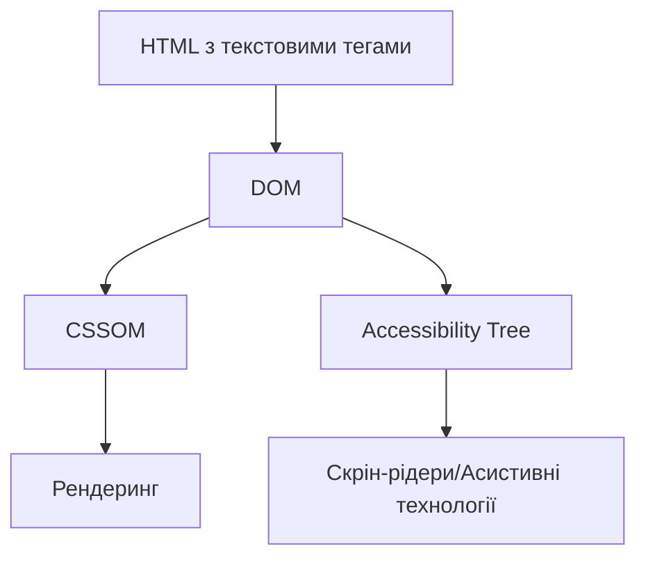
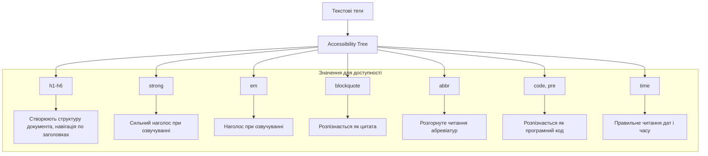

# HTML

## HTML: Текстові теги

Текстові теги HTML призначені для форматування та структурування текстового вмісту на веб-сторінках. Вони дозволяють виділяти заголовки, абзаци, цитати та спеціальні фрагменти тексту, надаючи їм як візуального оформлення, так і семантичного значення.

### Для чого використовуються

-   **Структурування тексту**: Створення ієрархії та логічної організації контенту
-   **Семантичне позначення**: Надання тексту змістового значення
-   **Візуальне форматування**: Виділення тексту за допомогою стилізації
-   **Покращення доступності**: Допомога скрін-рідерам та іншим асистивним технологіям
-   **SEO-оптимізація**: Сприяння кращому розумінню змісту пошуковими системами

### Повний список текстових тегів

#### Заголовки

| Тег    | Опис                                 | Приклад                        |
| ------ | ------------------------------------ | ------------------------------ |
| `<h1>` | Заголовок першого (найвищого) рівня  | `<h1>Назва сайту</h1>`         |
| `<h2>` | Заголовок другого рівня              | `<h2>Розділ</h2>`              |
| `<h3>` | Заголовок третього рівня             | `<h3>Підрозділ</h3>`           |
| `<h4>` | Заголовок четвертого рівня           | `<h4>Підпідрозділ</h4>`        |
| `<h5>` | Заголовок п'ятого рівня              | `<h5>Менший підрозділ</h5>`    |
| `<h6>` | Заголовок шостого (найнижчого) рівня | `<h6>Найменший підрозділ</h6>` |

#### Базові текстові теги

| Тег      | Опис                                         | Приклад                                                      |
| -------- | -------------------------------------------- | ------------------------------------------------------------ |
| `<p>`    | Абзац тексту                                 | `<p>Це абзац тексту.</p>`                                    |
| `<span>` | Рядковий контейнер без семантичного значення | `<p>Текст із <span style="color:red">виділенням</span>.</p>` |
| `<br>`   | Переведення рядка                            | `Перший рядок<br>Другий рядок`                               |
| `<hr>`   | Горизонтальна лінія (тематичний розділювач)  | `<p>Текст вище</p><hr><p>Текст нижче</p>`                    |

#### Семантичні виділення тексту

| Тег        | Опис                                       | Приклад                                             |
| ---------- | ------------------------------------------ | --------------------------------------------------- |
| `<strong>` | Сильне смислове виділення (важливий текст) | `<p>Це <strong>дуже важливо</strong>!</p>`          |
| `<em>`     | Емфатичне виділення (наголос)              | `<p>Це <em>справді</em> працює.</p>`                |
| `<mark>`   | Текст, виділений для привернення уваги     | `<p>Ось <mark>ключове слово</mark>.</p>`            |
| `<small>`  | Дрібний текст (примітки, дисклеймери)      | `<p>Ціна $100 <small>(без ПДВ)</small></p>`         |
| `<del>`    | Видалений текст                            | `<p><del>Стара ціна: $100</del> Нова ціна: $80</p>` |
| `<ins>`    | Доданий/вставлений текст                   | `<p>Це <ins>новий</ins> текст.</p>`                 |
| `<sub>`    | Нижній індекс                              | `<p>H<sub>2</sub>O</p>`                             |
| `<sup>`    | Верхній індекс                             | `<p>2<sup>3</sup> = 8</p>`                          |

#### Цитування та спеціальний текст

| Тег            | Опис                                | Приклад                                                      |
| -------------- | ----------------------------------- | ------------------------------------------------------------ |
| `<blockquote>` | Блоковий елемент для довгих цитат   | `<blockquote>Велика цитата з іншого джерела...</blockquote>` |
| `<q>`          | Рядковий елемент для коротких цитат | `<p>Він сказав <q>Привіт всім</q> і пішов.</p>`              |
| `<cite>`       | Посилання на джерело цитати         | `<p><cite>Кобзар</cite> Тараса Шевченка</p>`                 |
| `<abbr>`       | Абревіатура з розшифровкою          | `<abbr title="HyperText Markup Language">HTML</abbr>`        |
| `<dfn>`        | Визначення терміну                  | `<p><dfn>HTML</dfn> - мова розмітки гіпертексту.</p>`        |
| `<code>`       | Фрагмент коду                       | `<p>Функція <code>alert()</code> виводить повідомлення.</p>` |
| `<pre>`        | Попередньо відформатований текст    | `<pre>                                                       |

Цей текст
зберігає форматування
та пробіли.

</pre>` |
| `<kbd>` | Текст, що має бути введений користувачем | `<p>Натисніть <kbd>Ctrl</kbd>+<kbd>C</kbd> для копіювання.</p>` |
| `<samp>` | Приклад виводу програми | `<p><samp>Hello World!</samp> буде виведено в консоль.</p>` |
| `<var>` | Позначення змінної | `<p>Рівняння: <var>x</var> + <var>y</var> = <var>z</var></p>` |
| `<time>` | Дата або час | `<time datetime="2025-08-05">5 серпня 2025</time>` |
| `<bdo>` | Зміна напрямку тексту | `<bdo dir="rtl">Цей текст буде справа наліво</bdo>` |
| `<ruby>`, `<rt>`, `<rp>` | Анотації для східних мов | `<ruby>漢 <rt>Hàn</rt></ruby>` |

### Приклади використання текстових тегів

#### Семантичне форматування тексту

```html
<!DOCTYPE html>
<html lang="uk">
    <head>
        <meta charset="UTF-8" />
        <title>Семантичне форматування</title>
    </head>
    <body>
        <h1>Теорія еволюції</h1>

        <p>
            Теорія еволюції — <strong>фундаментальна наукова теорія</strong> в
            біології, яка пояснює процес зміни успадкованих ознак у популяціях
            живих організмів протягом поколінь.
        </p>

        <h2>Природний відбір</h2>

        <p>
            Природний відбір — <em>ключовий механізм</em> еволюції, вперше
            описаний Чарльзом Дарвіном.
        </p>

        <blockquote cite="https://example.com/darwin">
            <p>
                Вважаю, що природний відбір був головним, але не єдиним, засобом
                модифікації.
            </p>
            <footer>
                — <cite>Чарльз Дарвін, "Походження видів"</cite>, 1859
            </footer>
        </blockquote>

        <p>
            Формула виживання часто записується як <var>f</var> = <var>s</var> ×
            <var>r</var>, де <var>f</var> — пристосованість, <var>s</var> —
            виживання, і <var>r</var> — репродуктивний успіх.
        </p>

        <p>
            У молекулі води (H<sub>2</sub>O) два атоми водню зв'язані з одним
            атомом кисню.
        </p>

        <h3>Термінологія</h3>

        <p>
            <dfn>Мутація</dfn> — це зміна в послідовності
            <abbr title="Дезоксирибонуклеїнова кислота">ДНК</abbr>.
        </p>

        <pre><code>
function evolve(population, generations) {
    for(let i = 0; i < generations; i++) {
        population = naturalSelection(population);
    }
    return population;
}
    </code></pre>

        <p>
            Натисніть <kbd>Ctrl</kbd>+<kbd>F</kbd> для пошуку терміну "еволюція"
            на цій сторінці.
        </p>

        <p>
            Останнє оновлення:
            <time datetime="2025-08-05T15:00:00">5 серпня 2025 о 15:00</time>
        </p>
    </body>
</html>
```

### Підкапотні механізми

#### Як браузер інтерпретує текстові теги

1. **Парсинг і побудова DOM**:

    - Браузер читає HTML і перетворює текстові теги на відповідні вузли DOM
    - Теги заголовків (`<h1>-<h6>`) створюють "обриси документа" (document outline)

2. **Стилізація за замовчуванням**:
    - Кожен текстовий тег має власні стилі за замовчуванням (User Agent Stylesheet)
    - Наприклад, `<h1>` більший за `<h2>`, а `<strong>` зазвичай відображається жирним шрифтом

```css
/* Приклад стилів браузера за замовчуванням */
h1 {
    font-size: 2em;
    margin: 0.67em 0;
}
h2 {
    font-size: 1.5em;
    margin: 0.83em 0;
}
strong {
    font-weight: bold;
}
em {
    font-style: italic;
}
```

3. **Семантика для доступності**:
    - Текстові теги створюють семантичне значення в Accessibility Tree
    - Скрін-рідери використовують цю інформацію для правильного озвучування



#### Особливості та підводні камені

1. **Семантика vs візуальне форматування**:

    - Теги `<strong>` і `<em>` семантичні, а не просто візуальні виділення
    - `<strong>` означає важливість, а не просто жирний текст
    - `<em>` означає наголос, а не просто курсив

2. **Застарілі теги форматування**:

    - `<b>`, `<i>`, `<u>` були винесені для візуального форматування
    - У HTML5 вони перевизначені з новим семантичним значенням:
        - `<b>` — текст, який привертає увагу, але не є особливо важливим
        - `<i>` — текст, що виділяється стилістично (іноземні слова, технічні терміни)
        - `<u>` — текст із немовною анотацією (власні імена в китайському тексті)

3. **Вкладеність заголовків**:

    - Пропуск рівнів заголовків (наприклад, `<h1>` потім `<h3>`) порушує логічну структуру
    - Вкладеність заголовків повинна відповідати ієрархії контенту

4. **Блокові vs рядкові елементи**:

    - Блокові текстові теги (`<p>`, `<h1>-<h6>`, `<blockquote>`) починаються з нового рядка
    - Рядкові теги (`<span>`, `<strong>`, `<em>`) вбудовуються в текстовий потік

5. **Обмеження вкладеності**:
    - Блокові елементи не можна вкладати у рядкові
    - Наприклад, `<p>` не можна помістити всередину `<span>`

#### Оптимізація використання текстових тегів

1. **Правильна семантика**:

    - Використовуйте теги відповідно до їх семантичного значення
    - Не використовуйте заголовки для стилізації звичайного тексту

2. **Структура заголовків**:

    - Дотримуйтесь логічної ієрархії заголовків (h1 → h2 → h3...)
    - Кожна сторінка повинна мати один `<h1>` для основної теми

3. **Оптимізація для SEO**:

    - Використовуйте ключові слова в заголовках і першому абзаці
    - Структуруйте контент з заголовками для кращої індексації

4. **Доступність**:
    - Використовуйте `<abbr>` з атрибутом `title` для абревіатур
    - Застосовуйте `<lang>` для іншомовних фрагментів тексту

### Схеми та діаграми

#### Ієрархія заголовків у документі

```
┌───────────────────────────────────┐
│ <h1>Головна тема сторінки</h1>    │
│ ┌───────────────────────────────┐ │
│ │ <h2>Основний розділ 1</h2>    │ │
│ │ ┌───────────────────────────┐ │ │
│ │ │ <h3>Підрозділ 1.1</h3>    │ │ │
│ │ └───────────────────────────┘ │ │
│ │ ┌───────────────────────────┐ │ │
│ │ │ <h3>Підрозділ 1.2</h3>    │ │ │
│ │ └───────────────────────────┘ │ │
│ └───────────────────────────────┘ │
│ ┌───────────────────────────────┐ │
│ │ <h2>Основний розділ 2</h2>    │ │
│ └───────────────────────────────┘ │
└───────────────────────────────────┘
```

#### Блокові vs рядкові текстові елементи

```
Блокові елементи (займають всю ширину):
┌───────────────────────────────────┐
│ <h1>, <h2>, <h3>, <h4>, <h5>, <h6>│
│ <p>, <blockquote>, <pre>          │
└───────────────────────────────────┘

Рядкові елементи (вбудовуються в потік):
текст <strong>виділений текст</strong> звичайний текст
       └───────────────────┘
текст <em>курсив</em> звичайний текст
       └────────┘
```

#### Семантика текстових тегів для доступності



> **Важливо**: Правильне використання текстових тегів — це не лише питання форматування, але й семантичної структури документа. Браузери, скрін-рідери та пошукові системи всі покладаються на семантичні теги для розуміння змісту сторінки.
