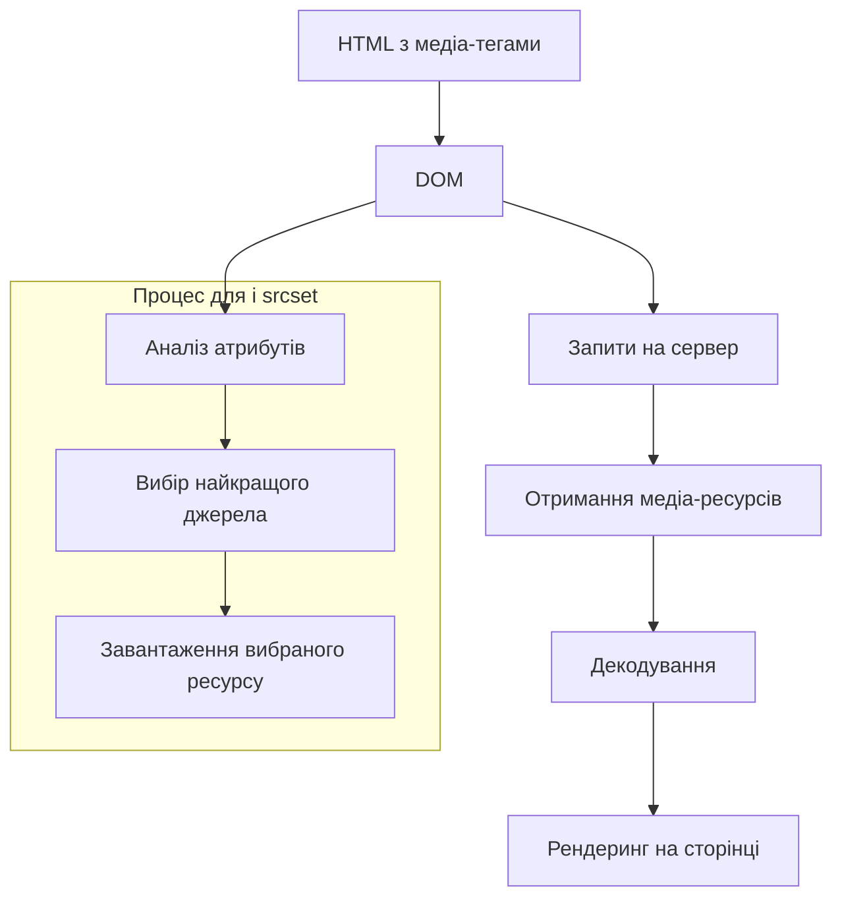
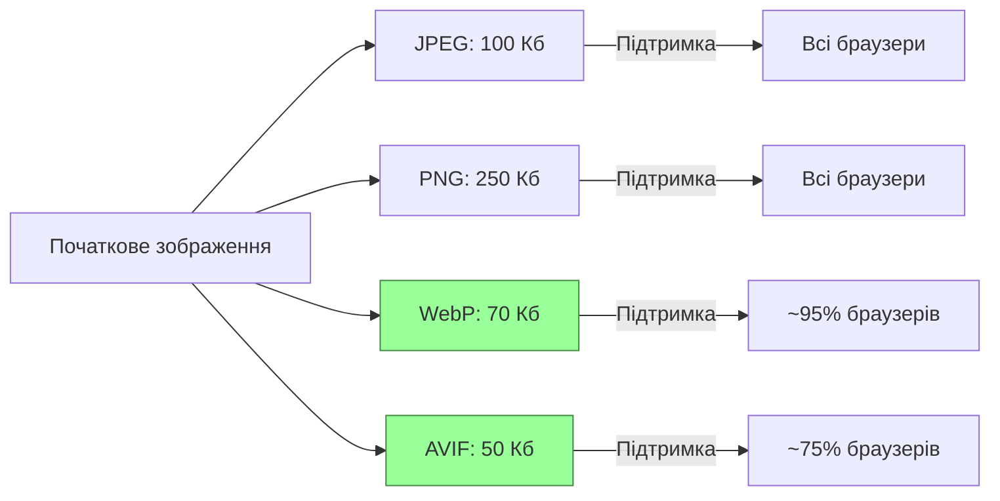

# HTML

## HTML: Медіа-теги

Медіа-теги в HTML використовуються для інтеграції різноманітного мультимедійного контенту на веб-сторінки, включаючи зображення, аудіо, відео та інші типи мультимедіа. Ці теги дозволяють створювати багатий, інтерактивний контент, який виходить за рамки простого тексту.

### Для чого використовуються

-   **Візуальний контент**: Додавання зображень та графіки для ілюстрації контенту
-   **Аудіо та відео**: Вбудовування медіафайлів для відтворення безпосередньо на сторінці
-   **Інтерактивність**: Створення багатого користувацького досвіду з різними типами медіа
-   **Адаптивність**: Забезпечення оптимального медіаконтенту для різних пристроїв і розмірів екранів
-   **Доступність**: Надання альтернативного контенту для користувачів з обмеженими можливостями

### Повний список медіа-тегів

#### Зображення

| Тег            | Опис                                             | Приклад                                                                                                                         |
| -------------- | ------------------------------------------------ | ------------------------------------------------------------------------------------------------------------------------------- |
| ``        | Базовий тег для вставки зображень                | ``                                                                                   |
| `<picture>`    | Контейнер для кількох варіантів зображень        | `<picture><source srcset="large.jpg" media="(min-width: 800px)"></picture>`                     |
| `<source>`     | Визначає альтернативні медіаресурси              | `<source srcset="image.webp" type="image/webp">`                                                                                |
| `<figure>`     | Контейнер для самодостатнього вмісту             | `<figure><figcaption>Рис. 1: Статистика</figcaption></figure>`                                |
| `<figcaption>` | Підпис для елемента `<figure>`                   | Див. приклад вище                                                                                                               |
| `<map>`        | Визначає карту зображення                        | `<map name="workmap"><area shape="rect" coords="34,44,270,350" href="computer.htm"></map>` |
| `<area>`       | Визначає клікабельну область на карті зображення | Див. приклад вище                                                                                                               |
| `<canvas>`     | Створює область для малювання через JavaScript   | `<canvas id="myCanvas" width="200" height="100"></canvas>`                                                                      |
| `<svg>`        | Вбудовує SVG-графіку                             | `<svg width="100" height="100"><circle cx="50" cy="50" r="40" stroke="black" fill="red" /></svg>`                               |

#### Аудіо та відео

| Тег        | Опис                                                            | Приклад                                                                                                                   |
| ---------- | --------------------------------------------------------------- | ------------------------------------------------------------------------------------------------------------------------- |
| `<audio>`  | Вбудовує аудіофайл                                              | `<audio src="sound.mp3" controls></audio>`                                                                                |
| `<video>`  | Вбудовує відеофайл                                              | `<video src="movie.mp4" controls width="640" height="480"></video>`                                                       |
| `<source>` | Визначає альтернативні медіаресурси для `<audio>` або `<video>` | `<video controls><source src="movie.mp4" type="video/mp4"><source src="movie.webm" type="video/webm"></video>`            |
| `<track>`  | Додає текстові доріжки до `<audio>` або `<video>`               | `<video src="movie.mp4" controls><track src="subtitles_uk.vtt" kind="subtitles" srclang="uk" label="Українська"></video>` |

#### Вбудовування зовнішнього контенту

| Тег        | Опис                                         | Приклад                                                                                 |
| ---------- | -------------------------------------------- | --------------------------------------------------------------------------------------- |
| `<iframe>` | Вбудовує інший HTML-документ                 | `<iframe src="https://example.com" width="500" height="300"></iframe>`                  |
| `<embed>`  | Вбудовує зовнішній вміст (плагін)            | `<embed src="flash.swf" type="application/x-shockwave-flash" width="300" height="200">` |
| `<object>` | Вбудовує зовнішній ресурс (PDF, Flash, тощо) | `<object data="document.pdf" type="application/pdf" width="600" height="400"></object>` |
| `<param>`  | Параметр для `<object>`                      | `<object data="movie.swf"><param name="autoplay" value="true"></object>`                |

### Атрибути для медіа-тегів

#### Основні атрибути для ``

| Атрибут           | Опис                             | Приклад                                    |
| ----------------- | -------------------------------- | ------------------------------------------ |
| `src`             | URL зображення                   | `src="image.jpg"`                          |
| `alt`             | Альтернативний текст             | `alt="Опис зображення"`                    |
| `width`, `height` | Розміри зображення               | `width="600" height="400"`                 |
| `loading`         | Спосіб завантаження              | `loading="lazy"` (відкладене завантаження) |
| `srcset`          | Набір джерел для різних розмірів | `srcset="small.jpg 500w, large.jpg 1000w"` |
| `sizes`           | Розміри для різних viewports     | `sizes="(max-width: 600px) 100vw, 50vw"`   |
| `decoding`        | Метод декодування                | `decoding="async"`                         |
| `crossorigin`     | Режим CORS                       | `crossorigin="anonymous"`                  |

#### Основні атрибути для `<audio>` та `<video>`

| Атрибут           | Опис                                | Приклад                    |
| ----------------- | ----------------------------------- | -------------------------- |
| `src`             | URL медіафайлу                      | `src="video.mp4"`          |
| `controls`        | Відображає елементи керування       | `controls`                 |
| `autoplay`        | Автоматичне відтворення             | `autoplay`                 |
| `loop`            | Циклічне відтворення                | `loop`                     |
| `muted`           | Вимкнений звук                      | `muted`                    |
| `preload`         | Тип попереднього завантаження       | `preload="auto"`           |
| `poster`          | Зображення-афіша для відео          | `poster="thumbnail.jpg"`   |
| `width`, `height` | Розміри відеоплеєра                 | `width="640" height="480"` |
| `playsinline`     | Відтворення в рядку (для мобільних) | `playsinline`              |

### Приклади використання медіа-тегів

#### Адаптивні зображення з елементом `<picture>`

```html
<picture>
    <!-- Використовуємо WebP, якщо браузер підтримує -->
    <source
        type="image/webp"
        srcset="
            images/photo-large.webp  1200w,
            images/photo-medium.webp  800w,
            images/photo-small.webp   400w
        "
        sizes="(max-width: 600px) 100vw, 
                   (max-width: 1200px) 50vw,
                   33vw"
    />

    <!-- Джерела для JPEG як запасний варіант -->
    <source
        type="image/jpeg"
        srcset="
            images/photo-large.jpg  1200w,
            images/photo-medium.jpg  800w,
            images/photo-small.jpg   400w
        "
        sizes="(max-width: 600px) 100vw, 
                   (max-width: 1200px) 50vw,
                   33vw"
    />

    <!-- Резервне зображення, якщо браузер не підтримує srcset або picture -->
    
</picture>
```

#### Аудіоплеєр з кількома форматами

```html
<figure>
    <figcaption>Аудіозапис інтерв'ю з експертом:</figcaption>
    <audio controls>
        <source src="audio/interview.mp3" type="audio/mpeg" />
        <source src="audio/interview.ogg" type="audio/ogg" />
        <source src="audio/interview.wav" type="audio/wav" />
        <p>
            Ваш браузер не підтримує аудіоелемент.
            <a href="audio/interview.mp3">Завантажити аудіо</a>.
        </p>
    </audio>
</figure>
```

#### Відеоплеєр з субтитрами

```html
<video controls width="800" height="450" poster="images/video-thumbnail.jpg">
    <source src="videos/presentation.mp4" type="video/mp4" />
    <source src="videos/presentation.webm" type="video/webm" />

    <!-- Субтитри різними мовами -->
    <track
        default
        src="subtitles/uk.vtt"
        kind="subtitles"
        srclang="uk"
        label="Українська"
    />
    <track
        src="subtitles/en.vtt"
        kind="subtitles"
        srclang="en"
        label="English"
    />
    <track
        src="subtitles/de.vtt"
        kind="subtitles"
        srclang="de"
        label="Deutsch"
    />

    <!-- Аудіоопис для користувачів з вадами зору -->
    <track
        src="descriptions/uk.vtt"
        kind="descriptions"
        srclang="uk"
        label="Аудіоопис"
    />

    <p>
        Ваш браузер не підтримує відеоелемент.
        <a href="videos/presentation.mp4">Завантажити відео</a>.
    </p>
</video>
```

#### SVG-графіка безпосередньо в HTML

```html
<svg width="200" height="200" viewBox="0 0 200 200">
    <circle cx="100" cy="100" r="80" fill="#007bff" />
    <rect x="70" y="70" width="60" height="60" fill="#ffffff" />
    <text
        x="100"
        y="160"
        text-anchor="middle"
        fill="#ffffff"
        font-family="Arial"
        font-size="20"
    >
        SVG Logo
    </text>
</svg>
```

### Оптимізація зображень

#### Формати зображень та їх застосування

| Формат   | Опис                                      | Найкраще застосування                                  |
| -------- | ----------------------------------------- | ------------------------------------------------------ |
| **JPEG** | Стиснення з втратами, мільйони кольорів   | Фотографії, складні зображення з плавними переходами   |
| **PNG**  | Стиснення без втрат, підтримка прозорості | Логотипи, іконки, зображення з текстом, прозорим фоном |
| **GIF**  | 256 кольорів, підтримка анімації          | Прості анімації, іконки з обмеженою палітрою           |
| **WebP** | Сучасний формат з кращим стисненням       | Універсальна заміна JPEG та PNG з кращим стисненням    |
| **AVIF** | Новітній формат на основі AV1             | Найкраще стиснення, але менша підтримка браузерами     |
| **SVG**  | Векторний формат на основі XML            | Логотипи, іконки, ілюстрації, що масштабуються         |

#### Методи оптимізації зображень

1. **Вибір правильного формату**:

    - JPEG для фотографій
    - PNG для зображень з прозорістю
    - WebP як універсальна альтернатива
    - SVG для векторної графіки

2. **Стиснення зображень**:

    - Використання інструментів стиснення (ImageOptim, TinyPNG, Squoosh)
    - Вибір оптимального балансу між якістю та розміром файлу

3. **Адаптивні зображення**:

    - Використання `srcset` і `sizes` для різних розмірів екранів
    - Використання `<picture>` для різних форматів і роздільних здатностей

4. **Відкладене завантаження (lazy loading)**:

    - Атрибут `loading="lazy"` для зображень
    - Завантаження зображень тільки коли вони потрапляють у viewport

5. **Оптимізація для мобільних пристроїв**:
    - Використання відповідних розмірів зображень
    - Уникнення завантаження великих зображень на мобільних пристроях

### Підкапотні механізми

#### Як браузер обробляє медіа-теги

1. **Завантаження ресурсів**:

    - Браузер аналізує HTML і виявляє медіа-теги
    - Для кожного тегу відправляється HTTP-запит на сервер для отримання медіа-ресурсу
    - Паралельне завантаження обмежується кількістю одночасних з'єднань (зазвичай 6-8)

2. **Обробка `<picture>` і `srcset`**:

    - Браузер оцінює умови media-queries і дескриптори розмірів
    - Вибирає найбільш підходяще зображення залежно від:
        - Розміру екрану (через `sizes`)
        - Щільності пікселів (дескриптори `x`)
        - Ширини зображення (дескриптори `w`)
        - Підтримуваних форматів (через `<source type="...">`)

3. **Рендеринг зображень**:

    - Після завантаження зображення декодується
    - Виділяється простір на сторінці відповідно до розмірів і верстки
    - Зображення відображається на екрані

4. **Відтворення аудіо та відео**:
    - Браузер аналізує метадані файлу для визначення кодеків і параметрів
    - Поступове буферизування вмісту під час відтворення
    - Реалізація елементів керування відтворенням



#### Особливості та підводні камені

1. **Автовідтворення медіа**:

    - Більшість браузерів блокують автовідтворення відео і аудіо зі звуком
    - Для автовідтворення потрібні атрибути `muted` або користувацька взаємодія

2. **Вплив на продуктивність**:

    - Великі зображення і відео значно сповільнюють завантаження сторінки
    - Медіаконтент може спричинити зайві reflow і repaint операції

3. **Проблеми з адаптивністю**:

    - Використання фіксованих розмірів у `width` і `height` може порушити адаптивний дизайн
    - Неправильно налаштовані медіа-запити можуть призвести до завантаження невідповідних ресурсів

4. **Доступність**:

    - Відсутність атрибута `alt` для зображень ускладнює доступність для скрін-рідерів
    - Відсутність субтитрів і аудіоопису для відео обмежує доступність

5. **Проблеми з форматами**:
    - Різні браузери підтримують різні формати
    - WebP та AVIF мають обмежену підтримку в старих браузерах

#### Оптимізація використання медіа-тегів

1. **Стратегія завантаження**:

    - Використовуйте `loading="lazy"` для зображень поза першим екраном
    - Додавайте `preload` для критичних медіаресурсів

2. **Резервні варіанти**:

    - Завжди надавайте резервні формати для широкої підтримки браузерів
    - Додавайте альтернативний контент всередині `<video>` і `<audio>` для несумісних браузерів

3. **Використання CDN**:

    - Розміщуйте медіаконтент на CDN для швидшого завантаження
    - Використовуйте автоматичну оптимізацію зображень через CDN (наприклад, Cloudinary, Imgix)

4. **Правильна специфікація розмірів**:

    - Завжди вказуйте атрибути `width` і `height` для зображень, щоб уникнути зсувів макета
    - Використовуйте CSS `aspect-ratio` для збереження пропорцій

5. **Кешування медіаресурсів**:
    - Налаштуйте правильні HTTP-заголовки для кешування статичних медіаресурсів
    - Використовуйте хеші у назвах файлів для інвалідації кешу при оновленнях

### Схеми та діаграми

#### Процес вибору зображення в `<picture>` і `srcset`

```
┌─────────────────────────────────────────────────────┐
│ <picture>                                           │
│  ┌─────────────────────────────────────────────────┐│
│  │ <source media="(min-width: 1200px)" srcset="...">││
│  └─────────────────────────────────────────────────┘│
│  ┌─────────────────────────────────────────────────┐│
│  │ <source media="(min-width: 800px)" srcset="..."> ││
│  └─────────────────────────────────────────────────┘│
│  ┌─────────────────────────────────────────────────┐│
│  │               ││
│  └─────────────────────────────────────────────────┘│
└─────────────────────────────────────────────────────┘

                       ↓

                ┌───────────────┐
                │ Media Queries │
                └───────┬───────┘
                        ↓
      ┌─────────────────────────────────┐
      │ Вибір найкращого <source> або   │
      │ резервного  на основі:     │
      │ - Розміру екрану (media)        │
      │ - Підтримуваних форматів (type) │
      │ - Розміру зображення (srcset)   │
      └─────────────────┬───────────────┘
                        ↓
              ┌───────────────────┐
              │ Завантаження та   │
              │ рендеринг обраного│
              │ зображення        │
              └───────────────────┘
```

#### Порівняння ефективності форматів зображень



#### Порівняння audio/video форматів і кодеків

```
┌────────────────────────────────────────────────────────┐
│ Відеоформати                                           │
├────────────┬────────────┬─────────────┬───────────────┤
│ Формат     │ Кодеки     │ Стиснення   │ Підтримка     │
├────────────┼────────────┼─────────────┼───────────────┤
│ MP4        │ H.264      │ Дуже добре  │ Всі браузери  │
│            │ HEVC/H.265 │ Відмінне    │ Обмежена      │
├────────────┼────────────┼─────────────┼───────────────┤
│ WebM       │ VP8, VP9   │ Дуже добре  │ Сучасні       │
│            │ AV1        │ Найкраще    │ Нові браузери │
├────────────┼────────────┼─────────────┼───────────────┤
│ Ogg        │ Theora     │ Нормальне   │ Обмежена      │
└────────────┴────────────┴─────────────┴───────────────┘

┌────────────────────────────────────────────────────────┐
│ Аудіоформати                                           │
├────────────┬────────────┬─────────────┬───────────────┤
│ Формат     │ Кодеки     │ Якість      │ Підтримка     │
├────────────┼────────────┼─────────────┼───────────────┤
│ MP3        │ MP3        │ Добра       │ Всі браузери  │
├────────────┼────────────┼─────────────┼───────────────┤
│ AAC        │ AAC        │ Краща за MP3│ Всі браузери  │
├────────────┼────────────┼─────────────┼───────────────┤
│ Ogg        │ Vorbis     │ Дуже добра  │ Більшість     │
├────────────┼────────────┼─────────────┼───────────────┤
│ WebM       │ Opus       │ Найкраща    │ Сучасні       │
└────────────┴────────────┴─────────────┴───────────────┘
```

> **Важливо**: Медіаконтент суттєво впливає на розмір сторінки та час завантаження. Оптимізація зображень, відео та аудіо — одне з найважливіших завдань для швидкої роботи веб-сайту. Використання адаптивних зображень, відкладеного завантаження та сучасних форматів стиснення є критично важливим для сучасної веб-розробки.
