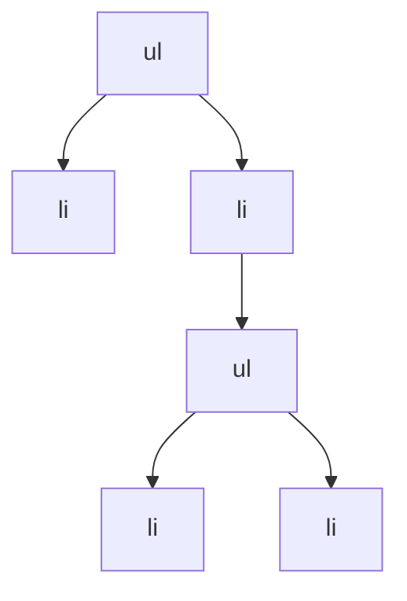
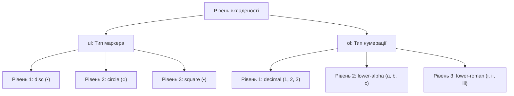

# HTML

## HTML: Списки

Списки в HTML - це структурні елементи, які дозволяють організувати та представити інформацію у вигляді упорядкованих або неупорядкованих переліків. Вони є одним з фундаментальних елементів структурування контенту, дозволяючи логічно групувати пов'язані елементи та створювати ієрархічні структури даних.

### Для чого використовуються

-   **Структурування інформації**: Групування пов'язаних елементів
-   **Навігаційні меню**: Створення навігаційних структур сайту
-   **Переліки даних**: Представлення послідовностей, інструкцій, кроків
-   **Глосарії та словники**: Організація термінів та їх визначень
-   **Ієрархічне відображення**: Представлення вкладених даних та їх взаємозв'язків

### Повний список типів списків і тегів

#### Неупорядковані списки

| Тег    | Опис                                                      | Приклад                                         |
| ------ | --------------------------------------------------------- | ----------------------------------------------- |
| `<ul>` | Контейнер для неупорядкованого списку (маркований список) | `<ul><li>Елемент 1</li><li>Елемент 2</li></ul>` |
| `<li>` | Елемент списку                                            | `<li>Текст елемента</li>`                       |

#### Упорядковані списки

| Тег    | Опис                                                     | Приклад                                             |
| ------ | -------------------------------------------------------- | --------------------------------------------------- |
| `<ol>` | Контейнер для упорядкованого списку (нумерований список) | `<ol><li>Перший крок</li><li>Другий крок</li></ol>` |
| `<li>` | Елемент списку                                           | `<li>Текст елемента</li>`                           |

#### Списки визначень

| Тег    | Опис                                | Приклад                                       |
| ------ | ----------------------------------- | --------------------------------------------- |
| `<dl>` | Контейнер для списку визначень      | `<dl><dt>Термін</dt><dd>Визначення</dd></dl>` |
| `<dt>` | Термін (елемент, який визначається) | `<dt>HTML</dt>`                               |
| `<dd>` | Визначення (опис терміну)           | `<dd>Мова розмітки гіпертексту</dd>`          |

### Атрибути списків

#### Атрибути для `<ol>` (упорядкованого списку)

| Атрибут    | Опис                                                                                                         | Приклад                                                                             |
| ---------- | ------------------------------------------------------------------------------------------------------------ | ----------------------------------------------------------------------------------- |
| `type`     | Тип нумерації: `1` (цифри), `a` (малі літери), `A` (великі літери), `i` (малі римські), `I` (великі римські) | `<ol type="A"><li>Пункт A</li><li>Пункт B</li></ol>`                                |
| `start`    | Початкове значення для нумерації                                                                             | `<ol start="5"><li>Пункт 5</li><li>Пункт 6</li></ol>`                               |
| `reversed` | Зворотній порядок нумерації                                                                                  | `<ol reversed><li>Третій пункт</li><li>Другий пункт</li><li>Перший пункт</li></ol>` |

#### Атрибути для `<li>` (елемента списку)

| Атрибут | Опис                                                                             | Приклад                                                            |
| ------- | -------------------------------------------------------------------------------- | ------------------------------------------------------------------ |
| `value` | Встановлює номер елемента в `<ol>` (наступні елементи будуть пронумеровані далі) | `<ol><li>Перший</li><li value="5">П'ятий</li><li>Шостий</li></ol>` |

### Приклади використання списків

#### Неупорядкований список (навігаційне меню)

```html
<nav>
    <ul>
        <li><a href="/">Головна</a></li>
        <li><a href="/about">Про нас</a></li>
        <li><a href="/services">Послуги</a></li>
        <li><a href="/contact">Контакти</a></li>
    </ul>
</nav>
```

#### Упорядкований список (інструкція)

```html
<h2>Приготування чаю</h2>
<ol>
    <li>Закип'ятіть воду до 90-95°C.</li>
    <li>Підготуйте чайник, додавши 2 чайні ложки чаю.</li>
    <li>Залийте окропом і закрийте кришкою.</li>
    <li>Дайте настоятися 3-5 хвилин.</li>
    <li>Розлийте у чашки та насолоджуйтесь.</li>
</ol>
```

#### Список визначень (глосарій)

```html
<h2>Словник веб-термінів</h2>
<dl>
    <dt>HTML</dt>
    <dd>
        Мова розмітки гіпертексту, що використовується для створення структури
        веб-сторінок.
    </dd>

    <dt>CSS</dt>
    <dd>
        Каскадні таблиці стилів, що використовуються для оформлення
        веб-сторінок.
    </dd>

    <dt>JavaScript</dt>
    <dd>
        Мова програмування, що дозволяє створювати інтерактивні елементи на
        веб-сторінках.
    </dd>
</dl>
```

#### Упорядкований список з різними типами нумерації

```html
<h3>Зміст:</h3>
<ol type="I">
    <li>Вступ</li>
    <li>
        Основна частина
        <ol type="A">
            <li>Перший розділ</li>
            <li>
                Другий розділ
                <ol type="1">
                    <li>Підрозділ 2.1</li>
                    <li>Підрозділ 2.2</li>
                </ol>
            </li>
            <li>Третій розділ</li>
        </ol>
    </li>
    <li>Висновки</li>
    <li>Список літератури</li>
</ol>
```

### Вкладені списки

Вкладеність — потужний інструмент для створення ієрархічних структур даних. HTML дозволяє вкладати списки один в одного, створюючи складні деревоподібні структури.

#### Приклад вкладеного списку (ієрархічне меню)

```html
<ul class="site-map">
    <li>Головна сторінка</li>
    <li>
        Про компанію
        <ul>
            <li>Історія</li>
            <li>Місія та цінності</li>
            <li>
                Команда
                <ul>
                    <li>Керівництво</li>
                    <li>Розробники</li>
                    <li>Маркетинг</li>
                </ul>
            </li>
            <li>Нагороди</li>
        </ul>
    </li>
    <li>
        Послуги
        <ul>
            <li>Веб-розробка</li>
            <li>Мобільні додатки</li>
            <li>Консалтинг</li>
        </ul>
    </li>
    <li>Контакти</li>
</ul>
```

#### Комбінування різних типів списків

```html
<h2>Курси програмування</h2>
<ol>
    <li>
        Початковий рівень
        <ul>
            <li>Основи HTML та CSS</li>
            <li>Вступ до JavaScript</li>
            <li>Git для початківців</li>
        </ul>
    </li>
    <li>
        Середній рівень
        <ul>
            <li>
                Фреймворки JavaScript:
                <dl>
                    <dt>React</dt>
                    <dd>Бібліотека для створення інтерфейсів користувача</dd>
                    <dt>Vue</dt>
                    <dd>Прогресивний фреймворк для побудови UI</dd>
                </dl>
            </li>
            <li>
                Бекенд розробка:
                <ol type="a">
                    <li>Node.js</li>
                    <li>Express</li>
                    <li>Бази даних</li>
                </ol>
            </li>
        </ul>
    </li>
</ol>
```

### Підкапотні механізми

#### Як браузер інтерпретує списки

1. **Структура DOM**:
    - Браузер створює деревоподібну структуру DOM
    - Кожен елемент списку (`<li>`) є нащадком батьківського списку (`<ul>`, `<ol>` або `<dl>`)
    - Вкладені списки створюють додаткові рівні в ієрархії DOM



2. **Стилізація за замовчуванням**:
    - Елементи `<ul>` за замовчуванням мають відступ та маркери (bullets)
    - Елементи `<ol>` мають відступ та нумерацію
    - Теги `<dl>`, `<dt>` і `<dd>` мають специфічні відступи для відображення структури визначень

```css
/* Приблизні стилі браузера за замовчуванням */
ul,
ol {
    display: block;
    margin-top: 1em;
    margin-bottom: 1em;
    padding-left: 40px;
}

ul {
    list-style-type: disc;
}

ol {
    list-style-type: decimal;
}

li {
    display: list-item;
}

dl {
    display: block;
    margin-top: 1em;
    margin-bottom: 1em;
}

dt {
    display: block;
}

dd {
    display: block;
    margin-left: 40px;
}
```

3. **Обробка вкладеності**:
    - Для вкладених списків браузер автоматично змінює стиль маркерів
    - Наприклад, для `<ul>`: перший рівень — кружечки, другий — кружки, третій — квадрати

#### Особливості та підводні камені

1. **Семантика та структура**:

    - Списки повинні використовуватися для семантично пов'язаних елементів
    - Використання списків лише для відступів або оформлення є некоректним з точки зору семантики

2. **Проблеми з вкладеністю**:

    - Надмірна вкладеність ускладнює підтримку коду та може спричинити проблеми з макетом
    - Рекомендується обмежувати вкладеність 3-4 рівнями

3. **Списки та доступність**:

    - Скрін-рідери оголошують кількість елементів у списку
    - Упорядковані списки оголошуються з їхніми номерами, що важливо для інструкцій

4. **Стилізація маркерів**:
    - Традиційні `list-style-*` властивості працюють лише для вбудованих маркерів
    - Для складної стилізації маркерів часто доводиться їх вимикати і використовувати псевдоелементи

#### Оптимізація використання списків

1. **Семантична цілісність**:

    - Використовуйте правильний тип списку відповідно до змісту:
        - `<ul>` для переліків без порядку
        - `<ol>` для послідовностей та інструкцій
        - `<dl>` для термінів та визначень

2. **Консистентність структури**:

    - Дотримуйтесь однакового рівня деталізації для елементів одного списку
    - Елементи одного списку повинні бути логічно пов'язані між собою

3. **CSS оптимізація**:

    - Використовуйте селектори нащадків для стилізації вкладених списків
    - Застосовуйте CSS-властивості `list-style-*` для базової стилізації

4. **Доступність**:
    - Переконайтесь, що вкладені списки мають правильну ієрархію
    - Уникайте вимикання маркерів для навігаційних списків без додавання альтернативних візуальних індикаторів

### Схеми та діаграми

#### Типи списків та їх структура

```
┌─────────────────────────────────┐
│ Неупорядкований список (ul)     │
│ ┌────────────────────────────┐  │
│ │ • Елемент 1                │  │
│ └────────────────────────────┘  │
│ ┌────────────────────────────┐  │
│ │ • Елемент 2                │  │
│ └────────────────────────────┘  │
│ ┌────────────────────────────┐  │
│ │ • Елемент 3                │  │
│ └────────────────────────────┘  │
└─────────────────────────────────┘

┌─────────────────────────────────┐
│ Упорядкований список (ol)       │
│ ┌────────────────────────────┐  │
│ │ 1. Перший елемент          │  │
│ └────────────────────────────┘  │
│ ┌────────────────────────────┐  │
│ │ 2. Другий елемент          │  │
│ └────────────────────────────┘  │
│ ┌────────────────────────────┐  │
│ │ 3. Третій елемент          │  │
│ └────────────────────────────┘  │
└─────────────────────────────────┘

┌─────────────────────────────────┐
│ Список визначень (dl)           │
│ ┌────────────────────────────┐  │
│ │ Термін 1                   │  │
│ └────────────────────────────┘  │
│ ┌────────────────────────────┐  │
│ │    Визначення 1            │  │
│ └────────────────────────────┘  │
│ ┌────────────────────────────┐  │
│ │ Термін 2                   │  │
│ └────────────────────────────┘  │
│ ┌────────────────────────────┐  │
│ │    Визначення 2            │  │
│ └────────────────────────────┘  │
└─────────────────────────────────┘
```

#### Візуалізація вкладених списків

```
┌─────────────────────────────────────────────────────┐
│ Вкладений список                                    │
│ ┌───────────────────────────────────────────────┐  │
│ │ • Елемент першого рівня 1                     │  │
│ └───────────────────────────────────────────────┘  │
│ ┌───────────────────────────────────────────────┐  │
│ │ • Елемент першого рівня 2                     │  │
│ │   ┌───────────────────────────────────────┐   │  │
│ │   │ ○ Елемент другого рівня 2.1           │   │  │
│ │   └───────────────────────────────────────┘   │  │
│ │   ┌───────────────────────────────────────┐   │  │
│ │   │ ○ Елемент другого рівня 2.2           │   │  │
│ │   │   ┌───────────────────────────────┐   │   │  │
│ │   │   │ ▪ Елемент третього рівня 2.2.1│   │   │  │
│ │   │   └───────────────────────────────┘   │   │  │
│ │   └───────────────────────────────────────┘   │  │
│ └───────────────────────────────────────────────┘  │
│ ┌───────────────────────────────────────────────┐  │
│ │ • Елемент першого рівня 3                     │  │
│ └───────────────────────────────────────────────┘  │
└─────────────────────────────────────────────────────┘
```

#### Типи маркерів в залежності від рівня вкладеності



> **Важливо**: Списки в HTML — це не просто засіб візуального форматування, а потужний семантичний інструмент для структурування інформації. Правильне використання різних типів списків та їхньої вкладеності дозволяє створювати чіткі, логічні структури даних, які легко сприймаються як людьми, так і пошуковими системами та асистивними технологіями.
