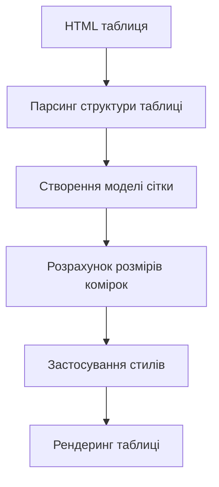
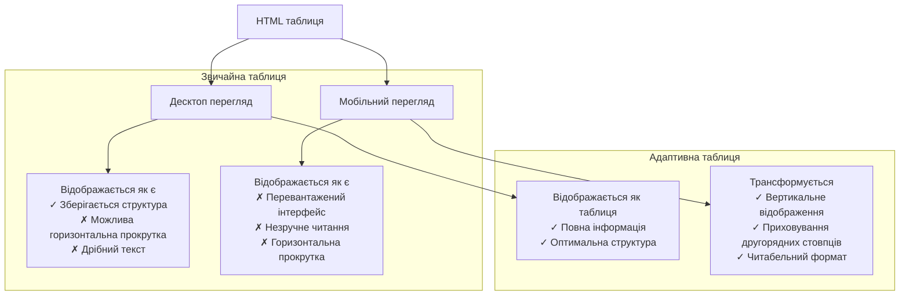

# HTML

## HTML: Таблиці

Таблиці в HTML — це структурні елементи, призначені для представлення даних у вигляді рядків і стовпців. Вони дозволяють організовувати інформацію в зручному для сприйняття табличному форматі, де дані можуть бути логічно згруповані та структуровані.

### Для чого використовуються

-   **Представлення структурованих даних**: Відображення інформації в рядках і стовпцях
-   **Порівняння інформації**: Зручне порівняння різних наборів даних
-   **Статистичні дані**: Представлення числових даних, статистики, результатів
-   **Розклади та календарі**: Відображення часових або подієвих графіків
-   **Технічні специфікації**: Структуроване представлення характеристик продуктів

### Повний список тегів таблиць

#### Основні структурні теги

| Тег       | Опис                                            | Приклад              |
| --------- | ----------------------------------------------- | -------------------- |
| `<table>` | Основний контейнер для таблиці                  | `<table>...</table>` |
| `<tr>`    | Визначає рядок таблиці (Table Row)              | `<tr>...</tr>`       |
| `<td>`    | Визначає комірку даних (Table Data)             | `<td>Дані</td>`      |
| `<th>`    | Визначає заголовок стовпця/рядка (Table Header) | `<th>Заголовок</th>` |

#### Семантичні секційні теги

| Тег          | Опис                              | Приклад                                                                 |
| ------------ | --------------------------------- | ----------------------------------------------------------------------- |
| `<thead>`    | Групує рядки заголовків таблиці   | `<thead><tr><th>Ім'я</th><th>Вік</th></tr></thead>`                     |
| `<tbody>`    | Групує основні рядки з даними     | `<tbody><tr><td>Іван</td><td>30</td></tr></tbody>`                      |
| `<tfoot>`    | Групує підсумкові рядки           | `<tfoot><tr><td>Всього</td><td>150</td></tr></tfoot>`                   |
| `<caption>`  | Визначає заголовок/підпис таблиці | `<caption>Таблиця 1: Дані співробітників</caption>`                     |
| `<colgroup>` | Групує стовпці для форматування   | `<colgroup><col span="2" style="background-color: #f2f2f2"></colgroup>` |
| `<col>`      | Визначає властивості для стовпців | `<col style="width: 100px">`                                            |

### Атрибути тегів таблиць

#### Атрибути для `<table>`

| Атрибут       | Опис                                                       | Приклад                               |
| ------------- | ---------------------------------------------------------- | ------------------------------------- |
| `border`      | Ширина рамки таблиці (застарілий, використовуйте CSS)      | `<table border="1">...</table>`       |
| `cellpadding` | Відступ всередині комірок (застарілий, використовуйте CSS) | `<table cellpadding="10">...</table>` |
| `cellspacing` | Відстань між комірками (застарілий, використовуйте CSS)    | `<table cellspacing="5">...</table>`  |
| `width`       | Ширина таблиці (застарілий, використовуйте CSS)            | `<table width="100%">...</table>`     |

#### Атрибути для `<td>` і `<th>`

| Атрибут   | Опис                                              | Приклад                                  |
| --------- | ------------------------------------------------- | ---------------------------------------- |
| `colspan` | Об'єднує комірки по горизонталі                   | `<td colspan="2">Об'єднана комірка</td>` |
| `rowspan` | Об'єднує комірки по вертикалі                     | `<td rowspan="3">Три рядки</td>`         |
| `headers` | Пов'язує комірку даних із заголовками             | `<td headers="col1 row1">Дані</td>`      |
| `scope`   | Вказує, що комірка є заголовком для рядка/стовпця | `<th scope="col">Назва стовпця</th>`     |

### Приклади використання таблиць

#### Базова структура таблиці з заголовком

```html
<table>
    <caption>
        Таблиця 1: Результати тестування
    </caption>
    <thead>
        <tr>
            <th>Ім'я</th>
            <th>Математика</th>
            <th>Фізика</th>
            <th>Інформатика</th>
        </tr>
    </thead>
    <tbody>
        <tr>
            <td>Іван Петренко</td>
            <td>85</td>
            <td>78</td>
            <td>92</td>
        </tr>
        <tr>
            <td>Марія Коваленко</td>
            <td>92</td>
            <td>88</td>
            <td>95</td>
        </tr>
        <tr>
            <td>Петро Сидоренко</td>
            <td>78</td>
            <td>82</td>
            <td>85</td>
        </tr>
    </tbody>
    <tfoot>
        <tr>
            <th>Середній бал</th>
            <td>85</td>
            <td>83</td>
            <td>91</td>
        </tr>
    </tfoot>
</table>
```

#### Таблиця з об'єднаними комірками

```html
<table border="1">
    <caption>
        Розклад занять
    </caption>
    <thead>
        <tr>
            <th>Час</th>
            <th>Понеділок</th>
            <th>Вівторок</th>
            <th>Середа</th>
            <th>Четвер</th>
            <th>П'ятниця</th>
        </tr>
    </thead>
    <tbody>
        <tr>
            <th>9:00 - 10:30</th>
            <td>Математика</td>
            <td>Історія</td>
            <td rowspan="2">Фізика<br />(подвійне заняття)</td>
            <td>Література</td>
            <td>Англійська</td>
        </tr>
        <tr>
            <th>10:45 - 12:15</th>
            <td>Інформатика</td>
            <td>Фізкультура</td>
            <!-- Об'єднана комірка з попереднього рядка -->
            <td>Математика</td>
            <td>Хімія</td>
        </tr>
        <tr>
            <th>12:30 - 14:00</th>
            <td colspan="5" align="center">Обідня перерва</td>
        </tr>
        <tr>
            <th>14:15 - 15:45</th>
            <td>Англійська</td>
            <td>Математика</td>
            <td>Інформатика</td>
            <td>Біологія</td>
            <td>Історія</td>
        </tr>
    </tbody>
</table>
```

#### Таблиця з використанням `<colgroup>` для стилізації стовпців

```html
<table>
    <caption>
        Фінансовий звіт за 2025 рік (тис. грн)
    </caption>
    <colgroup>
        <col style="width: 150px; background-color: #f2f2f2;" />
        <col style="width: 100px;" />
        <col style="width: 100px;" />
        <col style="width: 100px;" />
        <col style="width: 100px; background-color: #e6f2ff;" />
    </colgroup>
    <thead>
        <tr>
            <th>Квартал</th>
            <th>Дохід</th>
            <th>Витрати</th>
            <th>Податки</th>
            <th>Чистий прибуток</th>
        </tr>
    </thead>
    <tbody>
        <tr>
            <th>I квартал</th>
            <td>1250</td>
            <td>820</td>
            <td>105</td>
            <td>325</td>
        </tr>
        <tr>
            <th>II квартал</th>
            <td>1420</td>
            <td>930</td>
            <td>118</td>
            <td>372</td>
        </tr>
        <tr>
            <th>III квартал</th>
            <td>1380</td>
            <td>880</td>
            <td>112</td>
            <td>388</td>
        </tr>
        <tr>
            <th>IV квартал</th>
            <td>1560</td>
            <td>940</td>
            <td>125</td>
            <td>495</td>
        </tr>
    </tbody>
    <tfoot>
        <tr>
            <th>За рік</th>
            <td>5610</td>
            <td>3570</td>
            <td>460</td>
            <td>1580</td>
        </tr>
    </tfoot>
</table>
```

### Семантика таблиць

Семантичні елементи таблиць покращують структуру і доступність даних, роблячи їх більш зрозумілими як для користувачів, так і для скрін-рідерів і пошукових систем.

#### Основні принципи семантики таблиць

1. **Правильна структура**:

    - Використовуйте `<thead>`, `<tbody>` і `<tfoot>` для логічного групування вмісту
    - Використовуйте `<th>` з атрибутом `scope` для позначення заголовків

2. **Доступність**:

    - Додавайте атрибут `<caption>` для опису мети таблиці
    - Використовуйте атрибути `headers` для пов'язування даних з заголовками
    - Застосовуйте атрибути `scope="col"` або `scope="row"` для заголовків

3. **Зв'язок між комірками**:
    - Атрибут `id` для заголовків + атрибут `headers` для комірок даних
    - Це особливо важливо для складних таблиць з об'єднаними комірками

#### Приклад семантично правильної таблиці

```html
<table>
    <caption>
        Порівняння продуктів
    </caption>
    <thead>
        <tr>
            <th scope="col" id="product">Продукт</th>
            <th scope="col" id="price">Ціна</th>
            <th scope="col" id="features">Характеристики</th>
            <th scope="col" id="rating">Рейтинг</th>
        </tr>
    </thead>
    <tbody>
        <tr>
            <th scope="row" id="product1">Продукт A</th>
            <td headers="product product1 price">$499</td>
            <td headers="product product1 features">4GB RAM, 128GB SSD</td>
            <td headers="product product1 rating">4.5/5</td>
        </tr>
        <tr>
            <th scope="row" id="product2">Продукт B</th>
            <td headers="product product2 price">$699</td>
            <td headers="product product2 features">8GB RAM, 256GB SSD</td>
            <td headers="product product2 rating">4.8/5</td>
        </tr>
    </tbody>
</table>
```

### Підкапотні механізми

#### Як браузер інтерпретує таблиці

1. **Двоетапний процес рендеринга**:

    - Браузер має дочекатися завантаження всіх даних таблиці перед рендерингом
    - Спочатку обчислюються розміри всіх комірок, потім відображається таблиця

2. **Алгоритм розрахунку ширини колонок**:

    - Аналіз вмісту кожної комірки для визначення мінімальної необхідної ширини
    - Розподіл доступного простору між колонками
    - Урахування фіксованих ширин, заданих через CSS або атрибути

3. **Обробка об'єднаних комірок**:
    - Комірки з `colspan` або `rowspan` впливають на алгоритм розрахунку розмірів
    - Браузер створює складну внутрішню сітку для правильного відображення



#### Особливості та підводні камені

1. **Проблеми з продуктивністю**:

    - Великі таблиці можуть значно сповільнювати рендеринг сторінки
    - Браузер повинен завантажити всю таблицю перед відображенням

2. **Недоліки використання таблиць для макетування**:

    - Таблиці для макетування мають погану доступність
    - Сповільнюють завантаження та рендеринг сторінки
    - Ускладнюють підтримку та адаптивність

3. **Проблеми з адаптивністю**:

    - Таблиці природно не є адаптивними до різних розмірів екрану
    - Можуть створювати горизонтальну прокрутку на мобільних пристроях

4. **Складність об'єднаних комірок**:
    - Неправильне використання `rowspan` і `colspan` може призвести до спотворення таблиці
    - Комплексні таблиці складно підтримувати і вони часто ламаються при редагуванні

#### Оптимізація використання таблиць

1. **Коли слід використовувати таблиці**:

    - Використовуйте таблиці лише для табличних даних
    - Для макетування сторінки застосовуйте CSS Flexbox або Grid

2. **Підвищення продуктивності**:

    - Уникайте надмірно великих таблиць (понад 100 рядків)
    - Розділяйте великі таблиці на менші або використовуйте пагінацію
    - Встановлюйте фіксовані розміри колонок, щоб прискорити рендеринг

3. **Адаптивні таблиці**:

    - Використовуйте CSS для створення адаптивних таблиць
    - Техніки: горизонтальна прокрутка, перебудова в вертикальний вигляд, приховування неважливих колонок

4. **Доступність**:
    - Завжди додавайте `<caption>` і відповідні атрибути `scope`
    - Використовуйте `<th>` для всіх заголовків рядків та стовпців

### Адаптивні таблиці

Хоча традиційні таблиці не є адаптивними за своєю природою, існує кілька підходів для створення адаптивних таблиць:

#### 1. Таблиця з горизонтальною прокруткою

```html
<div style="overflow-x: auto;">
    <table>
        <!-- Вміст таблиці -->
    </table>
</div>
```

```css
/* CSS для прокрутки */
.table-container {
    overflow-x: auto;
    width: 100%;
}
```

#### 2. Перебудова таблиці для малих екранів

```css
/* На малих екранах змінюємо відображення таблиці */
@media screen and (max-width: 600px) {
    table,
    thead,
    tbody,
    th,
    td,
    tr {
        display: block;
    }

    thead tr {
        position: absolute;
        top: -9999px;
        left: -9999px;
    }

    tr {
        margin-bottom: 15px;
        border: 1px solid #ccc;
    }

    td {
        border: none;
        position: relative;
        padding-left: 50%;
    }

    td:before {
        position: absolute;
        top: 6px;
        left: 6px;
        width: 45%;
        padding-right: 10px;
        white-space: nowrap;
        content: attr(data-label);
        font-weight: bold;
    }
}
```

Відповідна HTML-структура:

```html
<table class="responsive-table">
    <thead>
        <tr>
            <th>Ім'я</th>
            <th>Вік</th>
            <th>Посада</th>
        </tr>
    </thead>
    <tbody>
        <tr>
            <td data-label="Ім'я">Іван Петренко</td>
            <td data-label="Вік">32</td>
            <td data-label="Посада">Розробник</td>
        </tr>
        <!-- Інші рядки -->
    </tbody>
</table>
```

### Схеми та діаграми

#### Структура семантичної HTML-таблиці

```
┌─────────────────────────────────────────────────────┐
│ <table>                                             │
│  ┌──────────────────────────────────────────────┐  │
│  │ <caption>Опис таблиці</caption>              │  │
│  └──────────────────────────────────────────────┘  │
│  ┌──────────────────────────────────────────────┐  │
│  │ <colgroup>                                   │  │
│  │  ┌────────────────────────────────────────┐  │  │
│  │  │ <col>                                  │  │  │
│  │  └────────────────────────────────────────┘  │  │
│  └──────────────────────────────────────────────┘  │
│  ┌──────────────────────────────────────────────┐  │
│  │ <thead>                                      │  │
│  │  ┌────────────────────────────────────────┐  │  │
│  │  │ <tr>                                   │  │  │
│  │  │  ┌──────────────────────────────────┐  │  │  │
│  │  │  │ <th>Заголовок 1</th>             │  │  │  │
│  │  │  │ <th>Заголовок 2</th>             │  │  │  │
│  │  │  └──────────────────────────────────┘  │  │  │
│  │  └────────────────────────────────────────┘  │  │
│  └──────────────────────────────────────────────┘  │
│  ┌──────────────────────────────────────────────┐  │
│  │ <tbody>                                      │  │
│  │  ┌────────────────────────────────────────┐  │  │
│  │  │ <tr>                                   │  │  │
│  │  │  ┌──────────────────────────────────┐  │  │  │
│  │  │  │ <td>Дані 1</td>                  │  │  │  │
│  │  │  │ <td>Дані 2</td>                  │  │  │  │
│  │  │  └──────────────────────────────────┘  │  │  │
│  │  └────────────────────────────────────────┘  │  │
│  └──────────────────────────────────────────────┘  │
│  ┌──────────────────────────────────────────────┐  │
│  │ <tfoot>                                      │  │
│  │  ┌────────────────────────────────────────┐  │  │
│  │  │ <tr>                                   │  │  │
│  │  │  ┌──────────────────────────────────┐  │  │  │
│  │  │  │ <td>Підсумок 1</td>              │  │  │  │
│  │  │  │ <td>Підсумок 2</td>              │  │  │  │
│  │  │  └──────────────────────────────────┘  │  │  │
│  │  └────────────────────────────────────────┘  │  │
│  └──────────────────────────────────────────────┘  │
└─────────────────────────────────────────────────────┘
```

#### Приклад об'єднання комірок з colspan та rowspan

```
┌────────┬────────┬────────┬────────┐
│        │ Стовп1 │ Стовп2 │ Стовп3 │
├────────┼────────┼────────┼────────┤
│ Рядок1 │        │        │        │
│        │   Об'єднано     │        │
│        │  colspan="2"    │        │
├────────┼────────┼────────┼────────┤
│ Рядок2 │        │        │        │
│        │        │        │        │
│ rowspan│        │        │        │
│   ="3" │        │        │        │
├────────┼────────┼────────┼────────┤
│ Рядок3 │        │        │        │
│        │        │        │        │
│        │        │        │        │
├────────┼────────┼────────┼────────┤
│ Рядок4 │        │        │        │
│        │        │        │        │
└────────┴────────┴────────┴────────┘
```

#### Порівняння звичайної та адаптивної таблиці



> **Важливо**: Використовуйте таблиці за прямим призначенням — для відображення табличних даних. Таблична розмітка не повинна використовуватися для створення макетів сторінок. Для цього існують сучасні інструменти CSS, такі як Flexbox і Grid, які пропонують кращу адаптивність, доступність та продуктивність.
