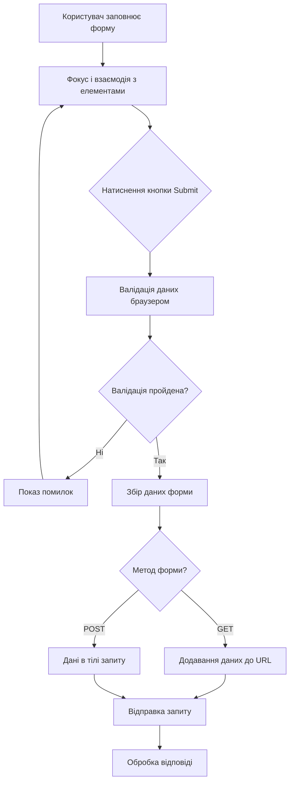
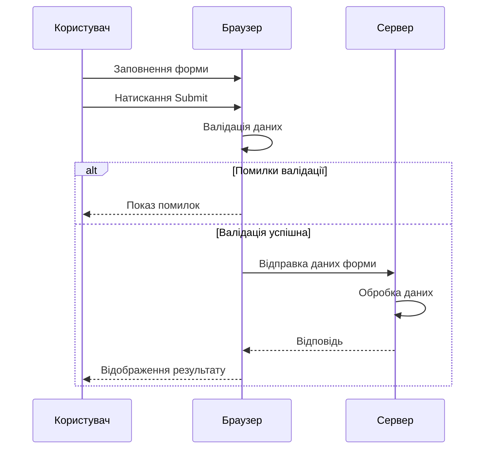

# HTML

## HTML: Форми

Форми в HTML — це інтерактивні елементи, які дозволяють користувачам вводити дані та взаємодіяти з веб-сторінкою. Вони є основним інструментом для збору інформації від користувачів та забезпечення двосторонньої взаємодії між користувачем і веб-додатком.

### Для чого використовуються

-   **Збір інформації**: Реєстрація, авторизація, контактні форми, опитування
-   **Взаємодія з користувачем**: Пошук, фільтрація, налаштування
-   **Редагування даних**: Профілі, налаштування облікових записів
-   **E-commerce**: Оформлення замовлень, платежі, підписки
-   **Завантаження файлів**: Передача файлів на сервер

### Повний список елементів форм

#### Основні структурні теги

| Тег          | Опис                            | Приклад                                                     |
| ------------ | ------------------------------- | ----------------------------------------------------------- |
| `<form>`     | Контейнер для елементів форми   | `<form action="/submit" method="post">...</form>`           |
| `<fieldset>` | Групує пов'язані елементи форми | `<fieldset><legend>Персональні дані</legend>...</fieldset>` |
| `<legend>`   | Заголовок для `<fieldset>`      | `<legend>Контактна інформація</legend>`                     |
| `<label>`    | Мітка для елемента форми        | `<label for="name">Ім'я:</label>`                           |

#### Елементи введення

| Тег          | Опис                               | Приклад                                                               |
| ------------ | ---------------------------------- | --------------------------------------------------------------------- |
| `<input>`    | Універсальний елемент введення     | `<input type="text" name="username">`                                 |
| `<textarea>` | Багаторядкове текстове поле        | `<textarea name="message" rows="5" cols="30"></textarea>`             |
| `<select>`   | Випадаючий список                  | `<select name="country"><option value="ua">Україна</option></select>` |
| `<option>`   | Елемент списку для `<select>`      | `<option value="fr">Франція</option>`                                 |
| `<optgroup>` | Група елементів у `<select>`       | `<optgroup label="Європа"><option>Україна</option></optgroup>`        |
| `<button>`   | Кнопка форми                       | `<button type="submit">Відправити</button>`                           |
| `<datalist>` | Список пропозицій для `<input>`    | `<datalist id="browsers"><option value="Chrome"></datalist>`          |
| `<output>`   | Відображення результату обчислення | `<output name="result">0</output>`                                    |
| `<progress>` | Індикатор виконання                | `<progress value="70" max="100">70%</progress>`                       |
| `<meter>`    | Шкала для відображення значення    | `<meter value="0.5">50%</meter>`                                      |

### Типи елемента `<input>`

| Тип (`type`)     | Опис                             | Приклад                                                  |
| ---------------- | -------------------------------- | -------------------------------------------------------- |
| `text`           | Однорядкове текстове поле        | `<input type="text" name="username">`                    |
| `password`       | Поле для введення пароля         | `<input type="password" name="pwd">`                     |
| `email`          | Поле для електронної пошти       | `<input type="email" name="email">`                      |
| `number`         | Поле для числових значень        | `<input type="number" min="1" max="10">`                 |
| `tel`            | Поле для телефонного номера      | `<input type="tel" name="phone">`                        |
| `url`            | Поле для URL-адреси              | `<input type="url" name="website">`                      |
| `search`         | Поле для пошуку                  | `<input type="search" name="query">`                     |
| `date`           | Вибір дати                       | `<input type="date" name="birthday">`                    |
| `time`           | Вибір часу                       | `<input type="time" name="meeting">`                     |
| `datetime-local` | Вибір дати і часу                | `<input type="datetime-local">`                          |
| `month`          | Вибір місяця                     | `<input type="month" name="month">`                      |
| `week`           | Вибір тижня                      | `<input type="week" name="week">`                        |
| `color`          | Вибір кольору                    | `<input type="color" name="color">`                      |
| `range`          | Повзунок для вибору числа        | `<input type="range" min="0" max="100">`                 |
| `file`           | Завантаження файлу               | `<input type="file" name="document">`                    |
| `checkbox`       | Прапорець (можна вибрати кілька) | `<input type="checkbox" name="agree">`                   |
| `radio`          | Перемикач (можна вибрати один)   | `<input type="radio" name="gender" value="male">`        |
| `hidden`         | Приховане поле                   | `<input type="hidden" name="id" value="123">`            |
| `submit`         | Кнопка відправки форми           | `<input type="submit" value="Відправити">`               |
| `reset`          | Кнопка скидання форми            | `<input type="reset" value="Скинути">`                   |
| `button`         | Кнопка                           | `<input type="button" value="Натиснути">`                |
| `image`          | Зображення-кнопка                | `<input type="image" src="button.png" alt="Відправити">` |

### Атрибути елементів форм

#### Основні атрибути для `<form>`

| Атрибут        | Опис                                | Приклад                         |
| -------------- | ----------------------------------- | ------------------------------- |
| `action`       | URL, куди відправляються дані форми | `action="/submit"`              |
| `method`       | HTTP-метод відправки (GET або POST) | `method="post"`                 |
| `enctype`      | Тип кодування даних форми           | `enctype="multipart/form-data"` |
| `novalidate`   | Вимикає валідацію форми браузером   | `novalidate`                    |
| `autocomplete` | Вмикає/вимикає автозаповнення       | `autocomplete="off"`            |
| `target`       | Де відображати відповідь            | `target="_blank"`               |

#### Загальні атрибути для елементів форм

| Атрибут          | Опис                                           | Приклад                       |
| ---------------- | ---------------------------------------------- | ----------------------------- |
| `name`           | Ім'я елемента (використовується при відправці) | `name="email"`                |
| `value`          | Значення елемента                              | `value="default@example.com"` |
| `disabled`       | Вимикає елемент                                | `disabled`                    |
| `readonly`       | Робить елемент лише для читання                | `readonly`                    |
| `required`       | Робить елемент обов'язковим                    | `required`                    |
| `autofocus`      | Автоматично фокусується на елементі            | `autofocus`                   |
| `placeholder`    | Підказка в пустому полі                        | `placeholder="Ваше ім'я"`     |
| `pattern`        | Регулярний вираз для валідації                 | `pattern="[A-Za-z]{3,}"`      |
| `min`, `max`     | Мінімальне і максимальне значення              | `min="0" max="100"`           |
| `step`           | Крок для числових полів                        | `step="0.5"`                  |
| `maxlength`      | Максимальна довжина тексту                     | `maxlength="50"`              |
| `multiple`       | Дозволяє вибирати кілька значень               | `multiple`                    |
| `form`           | Зв'язує елемент з формою за її ID              | `form="form1"`                |
| `formaction`     | Перевизначає атрибут action форми              | `formaction="/special"`       |
| `formmethod`     | Перевизначає атрибут method форми              | `formmethod="post"`           |
| `formnovalidate` | Вимикає валідацію при відправці                | `formnovalidate`              |
| `autocomplete`   | Вмикає/вимикає автозаповнення                  | `autocomplete="off"`          |
| `list`           | Посилання на datalist                          | `list="options"`              |

### Приклади використання форм

#### Проста контактна форма

```html
<form action="/submit" method="post">
    <div>
        <label for="name">Ім'я:</label>
        <input
            type="text"
            id="name"
            name="name"
            required
            placeholder="Ваше ім'я"
        />
    </div>

    <div>
        <label for="email">Email:</label>
        <input
            type="email"
            id="email"
            name="email"
            required
            placeholder="example@domain.com"
        />
    </div>

    <div>
        <label for="message">Повідомлення:</label>
        <textarea
            id="message"
            name="message"
            rows="5"
            required
            placeholder="Ваше повідомлення"
        ></textarea>
    </div>

    <div>
        <button type="submit">Надіслати</button>
        <button type="reset">Очистити</button>
    </div>
</form>
```

#### Реєстраційна форма з валідацією

```html
<form action="/register" method="post" novalidate>
    <fieldset>
        <legend>Персональні дані</legend>

        <div>
            <label for="username">Логін:</label>
            <input
                type="text"
                id="username"
                name="username"
                required
                pattern="[a-zA-Z0-9_]{3,15}"
                title="Логін має містити 3-15 символів (літери, цифри, нижнє підкреслення)"
            />
        </div>

        <div>
            <label for="password">Пароль:</label>
            <input
                type="password"
                id="password"
                name="password"
                required
                pattern="(?=.*\d)(?=.*[a-z])(?=.*[A-Z]).{8,}"
                title="Пароль має містити не менше 8 символів, включаючи велику, малу літери та цифру"
            />
        </div>

        <div>
            <label for="confirm-password">Підтвердіть пароль:</label>
            <input
                type="password"
                id="confirm-password"
                name="confirm-password"
                required
            />
        </div>
    </fieldset>

    <fieldset>
        <legend>Контактна інформація</legend>

        <div>
            <label for="fullname">Повне ім'я:</label>
            <input type="text" id="fullname" name="fullname" required />
        </div>

        <div>
            <label for="reg-email">Email:</label>
            <input type="email" id="reg-email" name="email" required />
        </div>

        <div>
            <label for="phone">Телефон:</label>
            <input
                type="tel"
                id="phone"
                name="phone"
                pattern="\+?[0-9]{10,15}"
                title="Телефонний номер (10-15 цифр)"
            />
        </div>
    </fieldset>

    <fieldset>
        <legend>Додаткова інформація</legend>

        <div>
            <label for="birthday">Дата народження:</label>
            <input type="date" id="birthday" name="birthday" />
        </div>

        <div>
            <label>Стать:</label>
            <label
                ><input type="radio" name="gender" value="male" />
                Чоловіча</label
            >
            <label
                ><input type="radio" name="gender" value="female" />
                Жіноча</label
            >
            <label
                ><input type="radio" name="gender" value="other" /> Інша</label
            >
        </div>

        <div>
            <label for="country">Країна:</label>
            <select id="country" name="country">
                <option value="">Виберіть країну</option>
                <optgroup label="Європа">
                    <option value="ua">Україна</option>
                    <option value="pl">Польща</option>
                    <option value="de">Німеччина</option>
                </optgroup>
                <optgroup label="Північна Америка">
                    <option value="us">США</option>
                    <option value="ca">Канада</option>
                </optgroup>
            </select>
        </div>
    </fieldset>

    <div>
        <label>
            <input type="checkbox" name="terms" required />
            Я погоджуюся з умовами користування
        </label>
    </div>

    <div>
        <button type="submit">Зареєструватися</button>
    </div>
</form>
```

#### Форма завантаження файлів

```html
<form action="/upload" method="post" enctype="multipart/form-data">
    <div>
        <label for="profile-pic">Фото профілю:</label>
        <input
            type="file"
            id="profile-pic"
            name="profile-pic"
            accept="image/png, image/jpeg"
        />
        <small>Підтримуються формати JPG, PNG. Максимальний розмір: 2MB.</small>
    </div>

    <div>
        <label for="documents">Документи:</label>
        <input
            type="file"
            id="documents"
            name="documents"
            accept=".pdf, .doc, .docx"
            multiple
        />
        <small
            >Підтримуються формати PDF, DOC. Можна вибрати кілька файлів.</small
        >
    </div>

    <div>
        <button type="submit">Завантажити</button>
    </div>
</form>
```

### Валідація форм

HTML5 надає вбудовані механізми валідації форм на стороні клієнта, які допомагають перевіряти правильність введених даних перед їх відправкою на сервер.

#### Типи валідації

1. **Вбудована валідація** (через атрибути HTML):

    - `required` - поле обов'язкове для заповнення
    - `min`, `max`, `step` - обмеження для числових значень
    - `minlength`, `maxlength` - обмеження довжини тексту
    - `pattern` - регулярний вираз для перевірки формату
    - Спеціалізовані типи `<input>` (`email`, `url`, `tel`)

2. **JavaScript-валідація**:
    - Перевірка даних через JavaScript
    - Доступ до Constraint Validation API
    - Власні складні правила валідації

#### Приклад форми з різними типами валідації

```html
<form id="validation-form" novalidate>
    <!-- Обов'язкове поле -->
    <div>
        <label for="val-name">Ім'я:</label>
        <input type="text" id="val-name" name="name" required />
        <span class="error" id="name-error"></span>
    </div>

    <!-- Email з вбудованою валідацією -->
    <div>
        <label for="val-email">Email:</label>
        <input type="email" id="val-email" name="email" required />
        <span class="error" id="email-error"></span>
    </div>

    <!-- Числове поле з обмеженнями -->
    <div>
        <label for="val-age">Вік:</label>
        <input type="number" id="val-age" name="age" min="18" max="120" />
        <span class="error" id="age-error"></span>
    </div>

    <!-- Поле з регулярним виразом -->
    <div>
        <label for="val-zip">Поштовий індекс:</label>
        <input
            type="text"
            id="val-zip"
            name="zip"
            pattern="[0-9]{5}"
            title="П'ятизначний поштовий індекс"
        />
        <span class="error" id="zip-error"></span>
    </div>

    <!-- Поле з обмеженням довжини -->
    <div>
        <label for="val-bio">Про себе:</label>
        <textarea id="val-bio" name="bio" maxlength="200"></textarea>
        <small><span id="char-count">0</span>/200 символів</small>
    </div>

    <!-- Перевірка паролів на збіг (потребує JavaScript) -->
    <div>
        <label for="val-password">Пароль:</label>
        <input
            type="password"
            id="val-password"
            name="password"
            required
            minlength="8"
        />
    </div>

    <div>
        <label for="val-confirm-password">Підтвердження паролю:</label>
        <input
            type="password"
            id="val-confirm-password"
            name="confirm-password"
            required
        />
        <span class="error" id="password-error"></span>
    </div>

    <button type="submit">Відправити</button>
</form>

<script>
    document
        .getElementById("validation-form")
        .addEventListener("submit", function (event) {
            // Скидаємо повідомлення про помилки
            const errorElements = document.querySelectorAll(".error");
            errorElements.forEach((element) => {
                element.textContent = "";
            });

            let isValid = true;

            // Перевірка паролів на збіг
            const password = document.getElementById("val-password").value;
            const confirmPassword = document.getElementById(
                "val-confirm-password"
            ).value;

            if (password !== confirmPassword) {
                document.getElementById("password-error").textContent =
                    "Паролі не співпадають";
                isValid = false;
            }

            // Якщо є помилки, запобігаємо відправці форми
            if (!isValid) {
                event.preventDefault();
            }
        });

    // Лічильник символів для текстової області
    document.getElementById("val-bio").addEventListener("input", function () {
        document.getElementById("char-count").textContent = this.value.length;
    });
</script>
```

### Підкапотні механізми

#### Як браузер обробляє форми

1. **Створення DOM-дерева**:

    - Браузер парсить HTML і створює відповідні об'єкти форми
    - Кожен елемент форми стає частиною DOM і доступний через JavaScript

2. **Зв'язування елементів**:

    - Елементи з атрибутом `for` зв'язуються з відповідними полями вводу
    - Клік на мітку (`<label>`) активує фокус на відповідному елементі форми

3. **Валідація**:

    - Браузер перевіряє обмеження валідації при спробі відправки форми
    - Показує вбудовані підказки для полів, що не пройшли валідацію

4. **Збір і форматування даних**:

    - При відправці форми браузер збирає дані з усіх елементів, що мають атрибут `name`
    - Формує запит відповідно до атрибутів `method` і `enctype`

5. **Відправка даних**:
    - Для `method="get"` - дані додаються до URL як параметри запиту
    - Для `method="post"` - дані відправляються в тілі HTTP-запиту



#### Особливості та підводні камені

1. **Проблеми з кодуванням**:

    - Для відправки файлів потрібно `enctype="multipart/form-data"`
    - Для спеціальних символів у GET-запитах потрібно URL-кодування

2. **Обмеження розміру**:

    - GET-запити мають обмеження на довжину URL (зазвичай 2048 символів)
    - Розмір завантажуваних файлів обмежується налаштуваннями сервера

3. **Автозаповнення**:

    - Браузери можуть автоматично заповнювати поля, що впливає на приватність
    - `autocomplete="off"` не завжди працює надійно в сучасних браузерах

4. **Підтримка браузерами**:

    - Нові типи `<input>` (date, color, тощо) можуть по-різному відображатися
    - Потрібно перевіряти підтримку та забезпечувати запасні варіанти

5. **Безпека**:
    - Клієнтська валідація може бути обійдена і не замінює серверну
    - CSRF-атаки можливі без належного захисту

#### Оптимізація використання форм

1. **Доступність**:

    - Завжди використовуйте `<label>` для елементів форми
    - Додавайте атрибути `aria-*` для поліпшення доступності
    - Забезпечуйте зрозумілі повідомлення про помилки

2. **Продуктивність**:

    - Уникайте надто складних регулярних виразів для валідації
    - Використовуйте делегування подій для обробки форм
    - Застосовуйте debounce для подій, що часто викликаються (input, keyup)

3. **Користувацький досвід**:

    - Зберігайте дані форми локально на випадок проблем
    - Показуйте прогрес відправки для довгих форм
    - Відображайте підказки з вимогами формату даних

4. **Безпека**:
    - Завжди валідуйте дані на сервері
    - Використовуйте CSRF-токени для захисту від атак
    - Фільтруйте та очищайте вхідні дані

### Сучасні підходи до роботи з формами

#### Прогресивне покращення

```html
<!-- Базова форма, що працює без JavaScript -->
<form action="/submit" method="post">
    <div>
        <label for="pe-name">Ім'я:</label>
        <input type="text" id="pe-name" name="name" required />
    </div>

    <div>
        <button type="submit">Відправити</button>
    </div>
</form>

<script>
    // Додаткова функціональність з JavaScript
    document.querySelector("form").addEventListener("submit", function (event) {
        event.preventDefault();

        // Показуємо індикатор завантаження
        const submitButton = this.querySelector('button[type="submit"]');
        const originalText = submitButton.textContent;
        submitButton.disabled = true;
        submitButton.textContent = "Відправляємо...";

        // Асинхронна відправка форми через Fetch API
        fetch(this.action, {
            method: this.method,
            body: new FormData(this),
        })
            .then((response) => response.json())
            .then((data) => {
                // Обробка успішної відповіді
                alert("Форма успішно відправлена!");
                this.reset();
            })
            .catch((error) => {
                // Обробка помилки
                alert("Сталася помилка: " + error.message);
            })
            .finally(() => {
                // Відновлення стану кнопки
                submitButton.disabled = false;
                submitButton.textContent = originalText;
            });
    });
</script>
```

#### Модулі користувацьких компонентів форми

```html
<!-- Компонент кастомного вибору з автозаповненням -->
<div class="custom-select">
    <label for="country-autocomplete">Країна:</label>
    <input type="text" id="country-autocomplete" autocomplete="off" />
    <input type="hidden" name="country_id" id="country-id" />
    <div class="suggestions" hidden></div>
</div>

<script>
    class AutocompleteField {
        constructor(element) {
            this.container = element;
            this.input = element.querySelector('input[type="text"]');
            this.hiddenInput = element.querySelector('input[type="hidden"]');
            this.suggestionsContainer = element.querySelector(".suggestions");
            this.suggestions = [];

            this.setupEventListeners();
        }

        setupEventListeners() {
            this.input.addEventListener("input", this.onInput.bind(this));
            this.input.addEventListener("focus", this.onFocus.bind(this));
            this.input.addEventListener("blur", () => {
                // Даємо час для обробки кліку на підказку
                setTimeout(() => {
                    this.suggestionsContainer.hidden = true;
                }, 150);
            });

            this.suggestionsContainer.addEventListener(
                "click",
                this.onSuggestionClick.bind(this)
            );
        }

        onInput() {
            const value = this.input.value.trim();
            if (value.length < 2) {
                this.suggestionsContainer.hidden = true;
                return;
            }

            // В реальному додатку тут був би запит на сервер
            this.fetchSuggestions(value);
        }

        onFocus() {
            if (this.input.value.length >= 2 && this.suggestions.length > 0) {
                this.suggestionsContainer.hidden = false;
            }
        }

        onSuggestionClick(event) {
            const item = event.target.closest("li");
            if (!item) return;

            const id = item.dataset.id;
            const value = item.textContent;

            this.input.value = value;
            this.hiddenInput.value = id;
            this.suggestionsContainer.hidden = true;
        }

        fetchSuggestions(query) {
            // Імітація запиту до API
            setTimeout(() => {
                // Тестові дані
                const allCountries = [
                    { id: "ua", name: "Україна" },
                    { id: "pl", name: "Польща" },
                    { id: "de", name: "Німеччина" },
                    { id: "fr", name: "Франція" },
                    { id: "it", name: "Італія" },
                ];

                this.suggestions = allCountries.filter((country) =>
                    country.name.toLowerCase().includes(query.toLowerCase())
                );

                this.renderSuggestions();
            }, 300);
        }

        renderSuggestions() {
            if (this.suggestions.length === 0) {
                this.suggestionsContainer.hidden = true;
                return;
            }

            const html = this.suggestions
                .map(
                    (country) =>
                        `<li data-id="${country.id}">${country.name}</li>`
                )
                .join("");

            this.suggestionsContainer.innerHTML = `<ul>${html}</ul>`;
            this.suggestionsContainer.hidden = false;
        }
    }

    // Ініціалізація компонента
    document.querySelectorAll(".custom-select").forEach((element) => {
        new AutocompleteField(element);
    });
</script>
```

### Схеми та діаграми

#### Структура HTML-форми

```
┌─────────────────────────────────────────────────────┐
│ <form>                                              │
│  ┌───────────────────────────────────────────────┐  │
│  │ <fieldset>                                    │  │
│  │  ┌────────────────────────────────────────┐   │  │
│  │  │ <legend>Група полів</legend>           │   │  │
│  │  └────────────────────────────────────────┘   │  │
│  │  ┌────────────────────────────────────────┐   │  │
│  │  │ <label>                                │   │  │
│  │  │   <input>                              │   │  │
│  │  └────────────────────────────────────────┘   │  │
│  │  ┌────────────────────────────────────────┐   │  │
│  │  │ <label>                                │   │  │
│  │  │   <select>                             │   │  │
│  │  │     <option>                           │   │  │
│  │  │     <option>                           │   │  │
│  │  │   </select>                            │   │  │
│  │  └────────────────────────────────────────┘   │  │
│  └───────────────────────────────────────────────┘  │
│  ┌───────────────────────────────────────────────┐  │
│  │ <button type="submit">Відправити</button>     │  │
│  └───────────────────────────────────────────────┘  │
└─────────────────────────────────────────────────────┘
```

#### Процес відправки форми



#### Порівняння методів GET і POST

```
┌───────────────────────────────────────────────────────────────┐
│ Порівняння методів GET і POST                                 │
├─────────────────┬─────────────────────┬─────────────────────┐
│ Характеристика  │ GET                 │ POST                │
├─────────────────┼─────────────────────┼─────────────────────┤
│ Видимість даних │ У URL               │ У тілі запиту       │
│ Кешування       │ Може кешуватися     │ Не кешується        │
│ Обмеження       │ ~2048 символів      │ Практично відсутні  │
│ Закладки        │ Можна зберігати     │ Неможливо зберегти  │
│ Чутливі дані    │ Не рекомендується   │ Рекомендується      │
│ Зображення/файли│ Не підходить        │ Підходить           │
│ Ідемпотентність │ Так                 │ Ні                  │
└─────────────────┴─────────────────────┴─────────────────────┘
```

> **Важливо**: Форми є критичним елементом взаємодії користувача з веб-додатком. Хоча HTML5 надає потужні інструменти для валідації та покращення досвіду користувача, завжди пам'ятайте про необхідність серверної валідації для безпеки. Використовуйте семантичні елементи, забезпечуйте доступність і прогресивне покращення, щоб форми працювали ефективно для всіх користувачів, незалежно від їхніх можливостей або використовуваних пристроїв.
