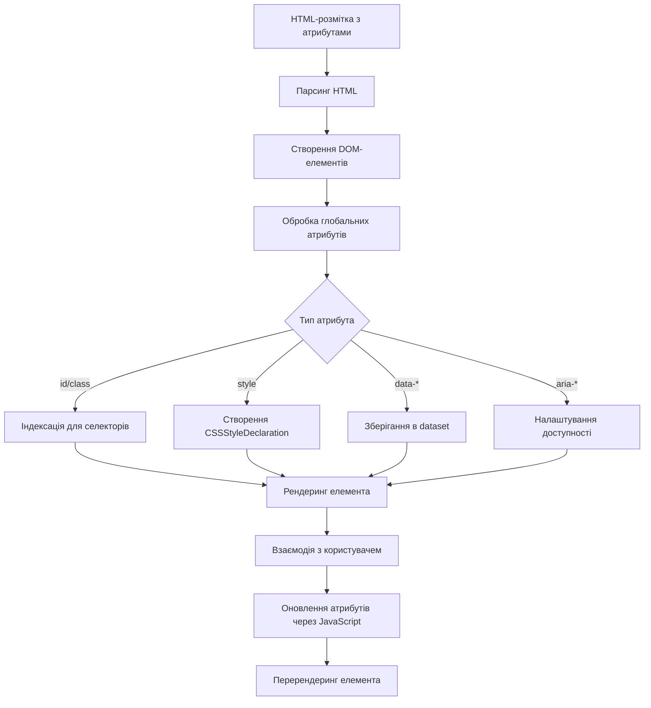
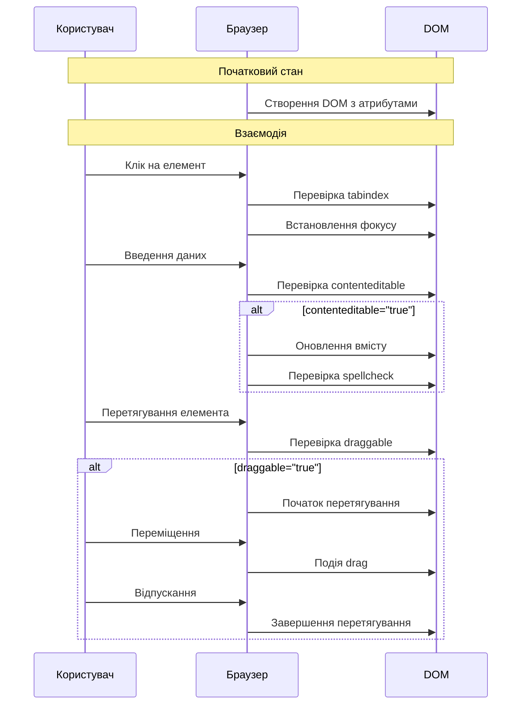

# HTML

## HTML: Глобальні атрибути

Глобальні атрибути — це атрибути, які можна застосовувати до всіх HTML-елементів, незалежно від їх типу. Вони надають універсальні можливості для керування поведінкою, стилізації та функціональності елементів.

### Для чого використовуються

-   **Ідентифікація елементів**: унікальні ідентифікатори та класи для вибору елементів
-   **Стилізація**: керування зовнішнім виглядом елементів
-   **Доступність**: покращення доступності сайту для людей з обмеженими можливостями
-   **Інтерактивність**: керування подіями та взаємодією користувача з елементами
-   **Міжнародна підтримка**: вказівка мови та напрямку тексту

### Повний список глобальних атрибутів

| Атрибут           | Опис                                                | Приклад                                               |
| ----------------- | --------------------------------------------------- | ----------------------------------------------------- |
| `id`              | Унікальний ідентифікатор елемента                   | `<div id="header">`                                   |
| `class`           | Список класів елемента для CSS та JS                | `<p class="intro highlight">`                         |
| `style`           | Вбудовані CSS-стилі                                 | `<span style="color: red;">`                          |
| `title`           | Додаткова інформація (підказка)                     | `<abbr title="HyperText Markup Language">HTML</abbr>` |
| `lang`            | Мова вмісту елемента                                | `<p lang="uk">Текст українською</p>`                  |
| `dir`             | Напрямок тексту                                     | `<p dir="rtl">نص عربي</p>`                            |
| `tabindex`        | Порядок фокусування при навігації клавішею Tab      | `<button tabindex="1">Перший</button>`                |
| `hidden`          | Приховує елемент                                    | `<div hidden>Прихований текст</div>`                  |
| `data-*`          | Користувацькі дані                                  | `<div data-user-id="123">`                            |
| `contenteditable` | Дозволяє редагувати вміст                           | `<div contenteditable="true">Редагуй мене</div>`      |
| `draggable`       | Дозволяє перетягувати елемент                       | ``                              |
| `spellcheck`      | Включає/виключає перевірку правопису                | `<textarea spellcheck="true"></textarea>`             |
| `translate`       | Вказує, чи слід перекладати вміст                   | `<p translate="no">HTML</p>`                          |
| `accesskey`       | Комбінація клавіш для швидкого доступу              | `<button accesskey="s">Зберегти</button>`             |
| `autocapitalize`  | Керує автокапіталізацією введення                   | `<input autocapitalize="words">`                      |
| `autofocus`       | Автоматично встановлює фокус                        | `<input autofocus>`                                   |
| `enterkeyhint`    | Підказка для кнопки Enter на віртуальній клавіатурі | `<input enterkeyhint="search">`                       |
| `inputmode`       | Тип віртуальної клавіатури для введення             | `<input inputmode="numeric">`                         |
| `is`              | Визначає користувацький елемент                     | `<button is="custom-button">`                         |
| `itemid`          | Microdata: унікальний ідентифікатор елемента        | `<div itemid="isbn:123456789">`                       |
| `itemprop`        | Microdata: властивість елемента                     | `<span itemprop="name">`                              |
| `itemref`         | Microdata: посилання на інші елементи               | `<div itemref="description price">`                   |
| `itemscope`       | Microdata: визначає область елемента                | `<div itemscope>`                                     |
| `itemtype`        | Microdata: тип елемента                             | `<div itemtype="http://schema.org/Product">`          |
| `slot`            | Визначає слот для Web Components                    | `<p slot="description">`                              |

### Приклади використання

#### Ідентифікація та стилізація

```html
<!DOCTYPE html>
<html lang="uk">
    <head>
        <title>Приклад глобальних атрибутів</title>
        <style>
            .highlight {
                background-color: yellow;
                padding: 5px;
            }
            #main-title {
                color: blue;
                font-size: 24px;
            }
            [data-importance="high"] {
                font-weight: bold;
                border-left: 3px solid red;
                padding-left: 10px;
            }
        </style>
    </head>
    <body>
        <h1 id="main-title">Головний заголовок</h1>
        <p class="highlight">Цей параграф виділено жовтим кольором.</p>
        <p style="color: green; font-style: italic;">
            Цей параграф має вбудовані стилі.
        </p>
        <p data-importance="high" data-author="John">
            Важлива інформація від автора.
        </p>
    </body>
</html>
```

#### Доступність та інтерактивність

```html
<div role="navigation" aria-label="Головне меню">
    <ul>
        <li><a href="#" tabindex="1" accesskey="h">Головна</a></li>
        <li><a href="#" tabindex="2" accesskey="a">Про нас</a></li>
        <li><a href="#" tabindex="3" accesskey="c">Контакти</a></li>
    </ul>
</div>

<button title="Натисніть для відправки форми" aria-describedby="submit-help">
    Відправити
</button>
<p id="submit-help" hidden>
    Після відправки форми ви отримаєте підтвердження на email.
</p>

<div
    contenteditable="true"
    spellcheck="true"
    aria-label="Редактор тексту"
    style="border: 1px solid #ccc; padding: 10px; min-height: 100px;"
>
    Це редагований текст. Спробуйте змінити його.
</div>
```

#### Використання з різними елементами

```html
<!-- Заголовок з іконкою, що перетягується -->
<h2 draggable="true" class="section-title" id="features">
     Функції продукту
</h2>

<!-- Багатомовний контент -->
<div>
    <p lang="uk" dir="ltr">Цей текст українською мовою.</p>
    <p lang="ar" dir="rtl">هذا النص باللغة العربية.</p>
    <p lang="en" translate="no">HTML5</p>
</div>

<!-- Приховування елементів -->
<div>
    <button onclick="toggleAnswer()">Показати відповідь</button>
    <p id="answer" hidden>Це прихована відповідь.</p>
</div>

<!-- Користувацькі дані для JavaScript -->
<ul id="users-list">
    <li data-user-id="1" data-role="admin" data-last-active="2023-06-15">
        Адміністратор
    </li>
    <li data-user-id="2" data-role="editor" data-last-active="2023-06-20">
        Редактор
    </li>
    <li data-user-id="3" data-role="user" data-last-active="2023-06-22">
        Користувач
    </li>
</ul>
```

### Підкапотні механізми

#### Як браузер обробляє глобальні атрибути

1. **Парсинг атрибутів**:

    - Браузер читає HTML-код і розпізнає атрибути
    - Атрибути зберігаються як властивості DOM-елементів

2. **Застосування значень**:

    - `id` - створює посилання в глобальному об'єкті `window`
    - `class` - додає елемент до колекцій для селекторів CSS
    - `style` - перетворюється на об'єкт `CSSStyleDeclaration`

3. **Спеціальна обробка**:
    - `hidden` - встановлює CSS `display: none`
    - `lang` - впливає на форматування дат, чисел, перевірку правопису
    - `dir` - змінює напрямок тексту і розташування елементів UI

#### Особливості реалізації в різних браузерах

```
┌─────────────────────────────────────────────────────────────┐
│ Особливості підтримки глобальних атрибутів у браузерах     │
├───────────────┬───────────┬───────────┬───────────┬─────────┤
│ Атрибут       │ Chrome    │ Firefox   │ Safari    │ IE/Edge │
├───────────────┼───────────┼───────────┼───────────┼─────────┤
│ contenteditable│ Повна    │ Повна     │ Повна     │ Повна   │
│ draggable     │ Повна     │ Повна     │ Обмежена  │ Повна   │
│ hidden        │ Повна     │ Повна     │ Повна     │ Повна   │
│ spellcheck    │ Повна     │ Повна     │ Обмежена  │ Часткова│
│ translate     │ Часткова  │ Часткова  │ Часткова  │ Відсутня│
│ enterkeyhint  │ Повна     │ Повна     │ Часткова  │ Відсутня│
│ inputmode     │ Повна     │ Повна     │ Часткова  │ Відсутня│
└───────────────┴───────────┴───────────┴───────────┴─────────┘
```

#### Приклад життєвого циклу обробки атрибутів



### Найкращі практики використання

#### Рекомендації з використання

1. **Використання `id` та `class`**:
    - `id` має бути унікальним на сторінці
    - `class` використовуйте для стилізації та групування
    - Не використовуйте занадто загальні імена

```html
<!-- Погано -->
<div id="container">
    <div id="box" class="item"></div>
    <div id="box2" class="item"></div>
    <!-- Повторювані ідентифікатори -->
</div>

<!-- Добре -->
<div id="main-container">
    <div class="product-item" id="product-123"></div>
    <div class="product-item" id="product-124"></div>
</div>
```

2. **Атрибути для доступності**:
    - Завжди використовуйте `lang` на рівні `<html>`
    - Додавайте `alt` для зображень
    - Використовуйте `aria-*` для складних компонентів

```html
<!-- Погано -->
<html>
    
    <div onclick="toggleMenu()">Меню</div>
</html>

<!-- Добре -->
<html lang="uk">
    
    <button
        aria-expanded="false"
        aria-controls="main-menu"
        onclick="toggleMenu()"
    >
        Меню
    </button>
    <nav id="main-menu" aria-label="Головне меню">
        <!-- Вміст меню -->
    </nav>
</html>
```

3. **Вбудовані стилі**:
    - Уникайте атрибута `style` для основних стилів
    - Використовуйте тільки для динамічних стилів через JavaScript

```html
<!-- Погано -->
<p style="color: blue; font-size: 16px; margin: 10px;">Текст</p>

<!-- Добре (стилі у CSS-файлі або в <style>) -->
<p class="text-primary">Текст</p>

<!-- Прийнятно для динамічних стилів -->
<div id="progress-bar" style="width: 70%;"></div>
```

4. **Користувацькі дані**:
    - Використовуйте `data-*` для зберігання даних
    - Доступ через властивість `dataset`

```html
<ul id="user-list">
    <li data-user-id="123" data-status="active">Іван Петренко</li>
</ul>

<script>
    const userElement = document.querySelector("#user-list li");
    const userId = userElement.dataset.userId; // "123"
    const status = userElement.dataset.status; // "active"
</script>
```

#### Оптимізація та продуктивність

1. **Вплив на продуктивність**:

    - Надмірне використання `data-*` атрибутів збільшує розмір HTML
    - Багато inline-стилів ускладнює кешування

2. **Керування відображенням**:
    - Використовуйте `hidden` замість `style="display: none"` для кращої семантики
    - Для анімованого приховування краще використовувати класи

```html
<!-- Семантичне приховування -->
<div id="notification" hidden>Повідомлення</div>

<!-- Для анімованого приховування -->
<div id="modal" class="modal hidden">Модальне вікно</div>

<style>
    .modal {
        opacity: 1;
        transition: opacity 0.3s;
    }
    .modal.hidden {
        opacity: 0;
        pointer-events: none;
    }
</style>
```

3. **Автофокус та керування фокусом**:
    - Використовуйте `autofocus` з обережністю (тільки один елемент на сторінці)
    - Плануйте порядок `tabindex` для складних компонентів

```html
<form>
    <!-- Автоматичний фокус на основному полі -->
    <input type="text" name="search" autofocus />

    <!-- Спеціальний порядок табуляції -->
    <div class="custom-form">
        <button tabindex="3">Додаткова дія</button>
        <input tabindex="1" type="text" name="username" />
        <input tabindex="2" type="password" name="password" />
        <button tabindex="4">Відправити</button>
    </div>
</form>
```

### Схеми та діаграми

#### Взаємодія атрибутів з DOM та CSS

```
┌─────────────────────────────────────────────┐
│             HTML-елемент                    │
│  ┌─────────────────────────────────────┐    │
│  │ <div id="box" class="card highlight" │    │
│  │      data-id="123"                  │    │
│  │      style="color: blue;"           │    │
│  │      hidden                         │    │
│  │      tabindex="1">                  │    │
│  └─────────────────────────────────────┘    │
│                    │                        │
│                    ▼                        │
│  ┌─────────────────────────────────────┐    │
│  │           DOM-об'єкт                │    │
│  │ {                                   │    │
│  │   id: "box",                        │    │
│  │   className: "card highlight",      │    │
│  │   dataset: { id: "123" },           │    │
│  │   style: CSSStyleDeclaration,       │    │
│  │   hidden: true,                     │    │
│  │   tabIndex: 1                       │    │
│  │ }                                   │    │
│  └─────────────────────────────────────┘    │
│                    │                        │
│        ┌───────────┼────────────┐          │
│        ▼           ▼            ▼          │
│  ┌──────────┐ ┌─────────┐ ┌──────────┐     │
│  │ CSS      │ │ JS      │ │ Браузер  │     │
│  │ Селектори│ │ API     │ │ Поведінка│     │
│  └──────────┘ └─────────┘ └──────────┘     │
└─────────────────────────────────────────────┘
```

#### Цикл життя атрибутів при взаємодії з користувачем



> **Важливо**: Глобальні атрибути надають потужні можливості для керування HTML-елементами, але їх слід використовувати виважено. Надмірне використання вбудованих стилів, нестандартних атрибутів або неправильне використання доступності може призвести до проблем з підтримкою, продуктивністю та користувацьким досвідом. Дотримуйтесь семантики HTML, розділяйте структуру (HTML), представлення (CSS) і поведінку (JavaScript), а також не забувайте про доступність при використанні глобальних атрибутів.
