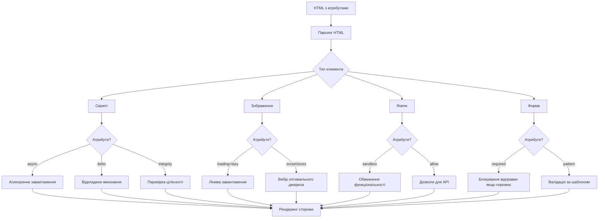
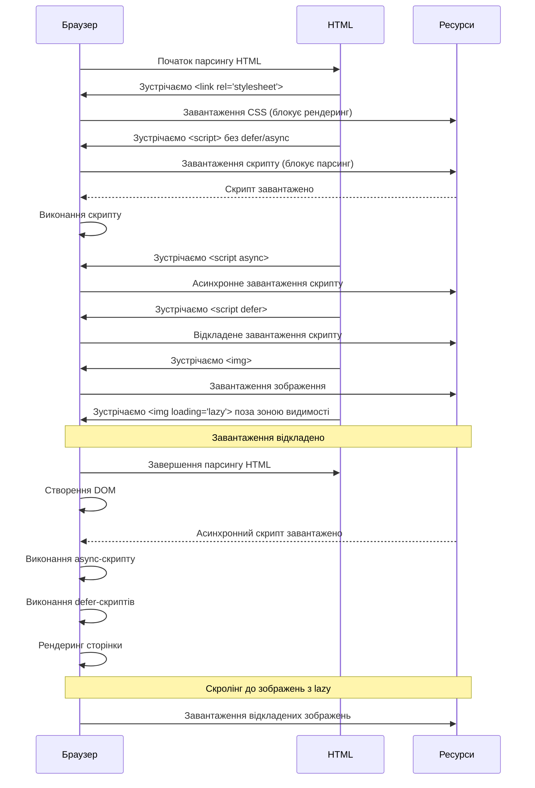

# HTML

## HTML: Специфічні атрибути

Специфічні атрибути HTML — це атрибути, які застосовуються лише до певних елементів і надають їм спеціальні можливості та функціональність. На відміну від глобальних атрибутів, які можуть використовуватися з усіма елементами, специфічні атрибути мають сенс тільки в контексті конкретних тегів.

### Для чого використовуються

-   **Спеціалізована функціональність**: надання унікальних можливостей для певних елементів
-   **Керування поведінкою**: налаштування специфічної поведінки елементів
-   **Доступність**: забезпечення додаткової інформації для допоміжних технологій
-   **Інтеграція**: взаємодія з різними технологіями та сервісами
-   **Оптимізація**: підвищення продуктивності відображення контенту

### Основні категорії специфічних атрибутів

#### Атрибути для посилань (`<a>`, `<area>`)

| Атрибут          | Опис                                            | Приклад                            |
| ---------------- | ----------------------------------------------- | ---------------------------------- |
| `href`           | URL-адреса, на яку вказує посилання             | `<a href="https://example.com">`   |
| `target`         | Де відкрити посилання                           | `<a target="_blank">`              |
| `rel`            | Відношення між поточним і цільовим документом   | `<a rel="nofollow">`               |
| `download`       | Вказує, що посилання повинно завантажувати файл | `<a download="file.pdf">`          |
| `hreflang`       | Мова цільового документа                        | `<a hreflang="uk">`                |
| `type`           | MIME-тип цільового документа                    | `<a type="image/jpeg">`            |
| `referrerpolicy` | Політика передачі реферера                      | `<a referrerpolicy="no-referrer">` |
| `ping`           | URL, які отримують повідомлення при переході    | `<a ping="track.php">`             |

#### Атрибути для медіа (``, `<video>`, `<audio>`)

| Атрибут           | Опис                                              | Приклад                                        |
| ----------------- | ------------------------------------------------- | ---------------------------------------------- |
| `src`             | URL-адреса медіа-ресурсу                          | ``                        |
| `alt`             | Альтернативний текст для зображень                | ``                  |
| `width`, `height` | Розміри медіа-елемента                            | ``               |
| `srcset`          | Набір зображень для різних умов                   | ``  |
| `sizes`           | Розміри зображення у різних контекстах            | `` |
| `controls`        | Відображає елементи керування медіа               | `<video controls>`                             |
| `autoplay`        | Автоматичне відтворення                           | `<video autoplay>`                             |
| `loop`            | Циклічне відтворення                              | `<audio loop>`                                 |
| `muted`           | Вимкнення звуку                                   | `<video muted>`                                |
| `poster`          | Зображення-заставка для відео                     | `<video poster="preview.jpg">`                 |
| `preload`         | Стратегія попереднього завантаження               | `<video preload="auto">`                       |
| `playsinline`     | Відтворення в рядку, а не в повноекранному режимі | `<video playsinline>`                          |

#### Атрибути для таблиць (`<table>`, `<tr>`, `<td>`, `<th>`)

| Атрибут   | Опис                                     | Приклад                |
| --------- | ---------------------------------------- | ---------------------- |
| `colspan` | Кількість стовпців, які об'єднує комірка | `<td colspan="2">`     |
| `rowspan` | Кількість рядків, які об'єднує комірка   | `<td rowspan="3">`     |
| `headers` | Зв'язок з заголовками для комірок        | `<td headers="h1 h2">` |
| `scope`   | Область дії заголовка                    | `<th scope="col">`     |

#### Атрибути для форм

| Атрибут        | Опис                              | Приклад                                  |
| -------------- | --------------------------------- | ---------------------------------------- |
| `form`         | Зв'язок елемента з формою         | `<input form="form1">`                   |
| `name`         | Ім'я елемента для відправки       | `<input name="email">`                   |
| `value`        | Значення елемента                 | `<input value="default">`                |
| `type`         | Тип елемента форми                | `<input type="checkbox">`                |
| `placeholder`  | Підказка в полі вводу             | `<input placeholder="Введіть email">`    |
| `required`     | Обов'язкове поле                  | `<input required>`                       |
| `readonly`     | Поле лише для читання             | `<input readonly>`                       |
| `disabled`     | Вимкнене поле                     | `<input disabled>`                       |
| `checked`      | Попередньо вибраний               | `<input type="checkbox" checked>`        |
| `selected`     | Попередньо вибраний варіант       | `<option selected>`                      |
| `multiple`     | Дозволяє вибрати кілька значень   | `<select multiple>`                      |
| `min`, `max`   | Мінімальне і максимальне значення | `<input type="number" min="1" max="10">` |
| `step`         | Крок для числових полів           | `<input type="number" step="0.5">`       |
| `pattern`      | Регулярний вираз для валідації    | `<input pattern="[0-9]{5}">`             |
| `autocomplete` | Керування автозаповненням         | `<input autocomplete="off">`             |
| `list`         | Зв'язок з `<datalist>`            | `<input list="suggestions">`             |

#### Атрибути для фреймів та вбудованого контенту

| Атрибут   | Опис                                 | Приклад                            |
| --------- | ------------------------------------ | ---------------------------------- |
| `src`     | URL-адреса вбудованого контенту      | `<iframe src="page.html">`         |
| `srcdoc`  | HTML-код для відображення в iframe   | `<iframe srcdoc="<p>Hello</p>">`   |
| `sandbox` | Обмеження для iframe                 | `<iframe sandbox="allow-scripts">` |
| `allow`   | Дозволи для функцій (Feature Policy) | `<iframe allow="camera">`          |
| `loading` | Стратегія завантаження               | `<iframe loading="lazy">`          |

#### Атрибути для скриптів і стилів

| Атрибут       | Опис                                | Приклад                            |
| ------------- | ----------------------------------- | ---------------------------------- |
| `src`         | URL-адреса зовнішнього ресурсу      | `<script src="script.js">`         |
| `type`        | MIME-тип або модуль                 | `<script type="module">`           |
| `async`       | Асинхронне завантаження             | `<script async>`                   |
| `defer`       | Відкладене виконання                | `<script defer>`                   |
| `integrity`   | Хеш для перевірки цілісності        | `<script integrity="sha256-...">`  |
| `crossorigin` | Політика CORS                       | `<script crossorigin="anonymous">` |
| `media`       | Медіа-запит для застосування стилів | `<link media="print">`             |

### Приклади використання специфічних атрибутів

#### Адаптивні зображення

```html

```

#### Відео з різними параметрами

```html
<video
    width="640"
    height="360"
    controls
    autoplay
    muted
    loop
    poster="preview.jpg"
    preload="metadata"
>
    <source src="video.mp4" type="video/mp4" />
    <source src="video.webm" type="video/webm" />
    <track
        src="subtitles.vtt"
        kind="subtitles"
        srclang="uk"
        label="Українські"
    />
    <track
        src="subtitles-en.vtt"
        kind="subtitles"
        srclang="en"
        label="English"
    />
    Ваш браузер не підтримує відео.
</video>
```

#### Безпечний iframe

```html
<iframe
    src="https://example.com/embed"
    width="560"
    height="315"
    sandbox="allow-scripts allow-same-origin"
    loading="lazy"
    allow="camera; microphone; fullscreen"
    referrerpolicy="no-referrer"
    title="Вбудований контент"
>
</iframe>
```

#### Розширене посилання

```html
<a
    href="document.pdf"
    download="important-document.pdf"
    type="application/pdf"
    hreflang="uk"
    rel="noopener noreferrer"
    target="_blank"
    referrerpolicy="no-referrer"
>
    Завантажити важливий документ
</a>
```

#### Таблиця з доступністю

```html
<table>
    <caption>
        Розклад занять
    </caption>
    <thead>
        <tr>
            <th scope="col">День</th>
            <th scope="col">Час</th>
            <th scope="col">Предмет</th>
        </tr>
    </thead>
    <tbody>
        <tr>
            <th scope="row" rowspan="2">Понеділок</th>
            <td>9:00</td>
            <td>Математика</td>
        </tr>
        <tr>
            <td>11:00</td>
            <td colspan="1">Фізика</td>
        </tr>
    </tbody>
</table>
```

#### Оптимізоване завантаження скриптів

```html
<!-- Критичний скрипт, блокує парсинг -->
<script src="critical.js"></script>

<!-- Асинхронний скрипт, не блокує парсинг -->
<script src="analytics.js" async></script>

<!-- Відкладений скрипт, виконується після парсингу -->
<script src="deferred.js" defer></script>

<!-- Скрипт з перевіркою цілісності -->
<script
    src="https://cdn.example.com/library.js"
    integrity="sha384-oqVuAfXRKap7fdgcCY5uykM6+R9GqQ8K/uxy9rx7HNQlGYl1kPzQho1wx4JwY8wC"
    crossorigin="anonymous"
></script>

<!-- Модульний скрипт -->
<script type="module" src="module.js"></script>
```

### Підкапотні механізми

#### Як браузер обробляє специфічні атрибути

1. **Розпізнавання і валідація**:

    - Браузер аналізує HTML-розмітку і визначає допустимі атрибути для кожного елемента
    - Невідомі атрибути зазвичай ігноруються (хоча залишаються в DOM)

2. **Інтерпретація**:

    - Деякі атрибути впливають на парсинг (`defer`, `async` для скриптів)
    - Інші змінюють візуальне відображення (`width`, `height`, `controls`)
    - Деякі впливають на взаємодію з користувачем (`disabled`, `readonly`)

3. **Завантаження ресурсів**:

    - Атрибути `src`, `srcset`, `href` ініціюють завантаження зовнішніх ресурсів
    - Атрибути `preload`, `loading` керують стратегією завантаження

4. **Валідація форм**:
    - Атрибути `required`, `pattern`, `min`/`max` використовуються для валідації форм
    - Браузер перевіряє відповідність перед відправкою форми

#### Вплив атрибутів на продуктивність і поведінку



#### Особливості в різних браузерах

Хоча основні специфічні атрибути підтримуються всіма сучасними браузерами, існують певні відмінності в реалізації:

```
┌─────────────────────────────────────────────────────────────┐
│ Підтримка деяких специфічних атрибутів у браузерах         │
├───────────────┬───────────┬───────────┬───────────┬─────────┤
│ Атрибут       │ Chrome    │ Firefox   │ Safari    │ IE/Edge │
├───────────────┼───────────┼───────────┼───────────┼─────────┤
│ loading="lazy"│ Повна     │ Повна     │ Часткова  │ Часткова│
│ srcset/sizes  │ Повна     │ Повна     │ Повна     │ Часткова│
│ decoding      │ Повна     │ Повна     │ Часткова  │ Відсутня│
│ playsinline   │ Повна     │ N/A       │ Критична* │ N/A     │
│ inputmode     │ Повна     │ Повна     │ Часткова  │ Відсутня│
│ enterkeyhint  │ Повна     │ Повна     │ Часткова  │ Відсутня│
└───────────────┴───────────┴───────────┴───────────┴─────────┘
```

\* В Safari на iOS атрибут `playsinline` критично важливий для відтворення відео на сторінці (без нього відео завжди відтворюється на повний екран).

### Найкращі практики використання

#### Загальні рекомендації

1. **Використовуйте атрибути за призначенням**:

    - Кожен атрибут має специфічну мету — дотримуйтесь її
    - Не використовуйте атрибути для зберігання довільних даних (для цього є `data-*`)

2. **Пам'ятайте про продуктивність**:

    - Використовуйте `loading="lazy"` для нижче зони видимості
    - Застосовуйте `srcset` і `sizes` для адаптивних зображень
    - Оптимізуйте завантаження скриптів з `async` і `defer`

3. **Забезпечуйте доступність**:

    - Завжди додавайте `alt` до зображень
    - Використовуйте `aria-*` атрибути для складних компонентів
    - Забезпечуйте правильні зв'язки в таблицях з `scope` і `headers`

4. **Гарантуйте безпеку**:
    - Використовуйте `rel="noopener"` для зовнішніх посилань
    - Застосовуйте `sandbox` для iframe з ненадійних джерел
    - Перевіряйте цілісність сторонніх ресурсів з `integrity`

#### Приклади правильного використання

```html
<!-- Погано: відсутність alt і непотрібні атрибути -->


<!-- Добре: необхідні атрибути і оптимізація -->

```

```html
<!-- Погано: посилання без належних атрибутів безпеки -->
<a href="https://example.com" target="_blank">Зовнішнє посилання</a>

<!-- Добре: безпечне зовнішнє посилання -->
<a
    href="https://example.com"
    target="_blank"
    rel="noopener noreferrer"
    aria-label="Відкриває зовнішній сайт у новому вікні"
>
    Зовнішнє посилання
</a>
```

```html
<!-- Погано: неоптимізований скрипт, що блокує рендеринг -->
<script src="analytics.js"></script>

<!-- Добре: оптимізований скрипт -->
<script src="analytics.js" async defer crossorigin="anonymous"></script>
```

#### Вирішення поширених проблем

1. **Проблема**: Зображення спочатку відображаються з неправильними пропорціями, потім "стрибають".
   **Рішення**: Завжди вказуйте `width` і `height`, навіть для адаптивних зображень.

```html

```

2. **Проблема**: Відео автоматично відтворюється зі звуком і дратує користувачів.
   **Рішення**: Якщо потрібне автовідтворення, завжди додавайте `muted`.

```html
<video autoplay muted loop playsinline>
    <source src="background.mp4" type="video/mp4" />
</video>
```

3. **Проблема**: Велике зображення сповільнює завантаження сторінки.
   **Рішення**: Використовуйте оптимізацію завантаження.

```html

```

### Схеми та діаграми

#### Життєвий цикл атрибутів при завантаженні сторінки



#### Схема застосування атрибутів для медіа-елементів

```
┌───────────────────────────────────────────────────────────────────┐
│                                                                   │
│  ┌───────────────┐  ┌────────────────┐  ┌───────────────────────┐ │
│  │ Завантаження  │  │ Відображення   │  │ Взаємодія            │ │
│  │ і оптимізація │  │                │  │                       │ │
│  │               │  │                │  │                       │ │
│  │ ┌───────────┐ │  │ ┌────────────┐ │  │ ┌─────────────────┐  │ │
│  │ │ src       │ │  │ │ width      │ │  │ │ controls        │  │ │
│  │ │ srcset    │ │  │ │ height     │ │  │ │ autoplay        │  │ │
│  │ │ sizes     │ │  │ │ alt        │ │  │ │ loop            │  │ │
│  │ │ type      │ │  │ │ poster     │ │  │ │ muted           │  │ │
│  │ │ preload   │ │  │ │            │ │  │ │                 │  │ │
│  │ └───────────┘ │  │ └────────────┘ │  │ └─────────────────┘  │ │
│  │               │  │                │  │                       │ │
│  └───────────────┘  └────────────────┘  └───────────────────────┘ │
│                                                                   │
│  ┌───────────────┐  ┌────────────────┐  ┌───────────────────────┐ │
│  │ Продуктивність│  │ Доступність    │  │ Безпека              │ │
│  │               │  │                │  │                       │ │
│  │ ┌───────────┐ │  │ ┌────────────┐ │  │ ┌─────────────────┐  │ │
│  │ │ loading   │ │  │ │ aria-*     │ │  │ │ crossorigin     │  │ │
│  │ │ decoding  │ │  │ │ title      │ │  │ │ referrerpolicy  │  │ │
│  │ │ async     │ │  │ │ lang       │ │  │ │ integrity       │  │ │
│  │ │ defer     │ │  │ │ role       │ │  │ │ sandbox         │  │ │
│  │ └───────────┘ │  │ └────────────┘ │  │ └─────────────────┘  │ │
│  │               │  │                │  │                       │ │
│  └───────────────┘  └────────────────┘  └───────────────────────┘ │
│                                                                   │
└───────────────────────────────────────────────────────────────────┘
```

#### Взаємодія атрибутів із завантаженням сторінки

```
┌─────────────────────────────────────────────────────────────┐
│ Вплив атрибутів на часову шкалу завантаження               │
│                                                             │
│ ─────────────▶ Час завантаження ─────────────────────────▶  │
│                                                             │
│ ┌──────────────────────────────────────────────┐           │
│ │ Парсинг HTML                                 │           │
│ └──────────────────────────────────────────────┘           │
│                                                             │
│   ┌──────────────┐                                          │
│   │ CSS (render- │                                          │
│   │ blocking)    │                                          │
│   └──────────────┘                                          │
│                                                             │
│     ┌────────────┐                                          │
│     │ JS (parser-│                                          │
│     │ blocking)  │                                          │
│     └────────────┘                                          │
│                                                             │
│           ┌──────────────┐                                  │
│           │ JS (async)   │                                  │
│           └──────────────┘                                  │
│                                                             │
│     ┌────────────────────────────┐                          │
│     │ JS (defer)                 │                          │
│     └────────────────────────────┘                          │
│                                                             │
│       ┌─────────────────────────────────┐                   │
│       │ Зображення (eager loading)      │                   │
│       └─────────────────────────────────┘                   │
│                                                             │
│                                       ┌───────────────┐     │
│                                       │ Зображення    │     │
│                                       │ (lazy loading)│     │
│                                       └───────────────┘     │
│                                                             │
│ ───────────┬────────────┬───────────────┬─────────────────  │
│            │            │               │                   │
│       DOM готовий   CSSOM готовий   JS виконаний     Усі   │
│                                                     ресурси │
└─────────────────────────────────────────────────────────────┘
```

> **Важливо**: Правильне використання специфічних атрибутів HTML має вирішальне значення для створення ефективних, доступних і безпечних веб-сторінок. Специфічні атрибути дозволяють тонко налаштувати поведінку елементів, оптимізувати завантаження ресурсів і забезпечити кращий користувацький досвід. Завжди враховуйте підтримку браузерами та тестуйте свій код у різних середовищах, щоб забезпечити послідовну роботу атрибутів на всіх платформах.
