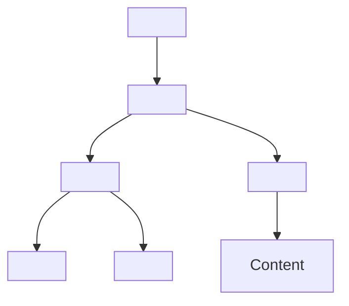

## 1.1. Fundamentals

### Document Structure: `<!DOCTYPE>`, `<html>`, `<head>`, `<body>`

HTML (HyperText Markup Language) documents have a strict structure that ensures browsers interpret content correctly. The main elements are:

```html
<!DOCTYPE html>
<html lang="en">
    <head>
        <meta charset="UTF-8" />
        <title>Document Title</title>
    </head>
    <body>
        <!-- Page content goes here -->
    </body>
</html>
```

-   `<!DOCTYPE html>` — Declaration that defines the document as HTML5. Browsers use this to enable standards mode.
-   `<html>` — Root element. The `lang` attribute specifies the language (important for accessibility and SEO).
-   `<head>` — Contains metadata (meta tags, title, links to styles/scripts). Not visible on the page.
-   `<body>` — Contains all visible content (text, images, forms, etc.).

> **Note:** Proper nesting and closing of tags is critical for valid HTML.

---

### Meta Tags and SEO Basics

Meta tags (мета-теги) provide metadata (дані про дані) to browsers and search engines. They are placed inside the `<head>` section.

```html
<head>
    <meta charset="UTF-8" />
    <!-- Character encoding -->
    <meta name="viewport" content="width=device-width, initial-scale=1.0" />
    <!-- Responsive design -->
    <meta name="description" content="Short page description for SEO" />
    <!-- SEO description -->
    <meta name="keywords" content="HTML, CSS, JavaScript" />
    <!-- SEO keywords (less relevant today) -->
    <title>Page Title</title>
</head>
```

-   `charset` — Character encoding (see below).
-   `viewport` — Controls layout on mobile devices (responsive design).
-   `description` — Short summary for search engines (SEO).
-   `keywords` — List of keywords (less used by modern search engines).
-   `title` — Title shown in browser tab and search results.

SEO (Search Engine Optimization) relies on:

-   Relevant meta tags
-   Semantic HTML structure
-   Proper use of headings (`<h1>`, `<h2>`, ...)
-   Descriptive alt attributes for images
-   Fast page load and mobile-friendliness

---

### Character Sets and Encoding

Character encoding (кодування символів) defines how text is stored and displayed. The most common encoding is UTF-8.

```html
<meta charset="UTF-8" />
```

-   `UTF-8` — Universal encoding supporting most world languages and symbols. Recommended for all modern web projects.
-   Without proper encoding, special characters (e.g., українські літери, emoji) may display incorrectly.

#### Example: Encoding Issue

```html
<!-- Incorrect encoding -->
<meta charset="ISO-8859-1" />
<!-- May break Cyrillic, emoji, etc. -->
```

> **Best Practice:** Always use UTF-8 for new projects.

---

### Mermaid Diagram: HTML Document Structure



_Структура базового HTML-документа_

---

#### Navigation

-   [Попередня тема: Вступ до HTML](#)
-   [Наступна тема: Text Elements](#)
