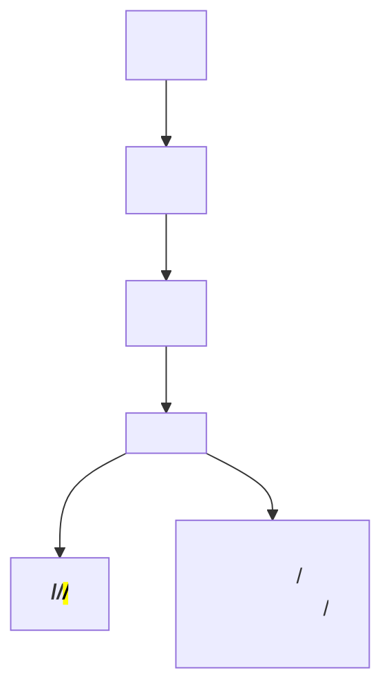

## 1.2. Text Elements

### Headings: `<h1>` to `<h6>`

Headings (заголовки) структурують контент і допомагають пошуковим системам (search engines) та користувачам орієнтуватися на сторінці.

```html
<h1>Main Title</h1>
<h2>Section Title</h2>
<h3>Subsection</h3>
<h4>Detail</h4>
<h5>Minor Detail</h5>
<h6>Smallest Heading</h6>
```

-   `<h1>` — головний заголовок сторінки (має бути лише один).
-   `<h2>`–`<h6>` — підзаголовки, що створюють ієрархію.
-   Важливо для SEO: пошукові системи аналізують структуру заголовків.

> **Best Practice:** Використовуйте заголовки для логічної структури, не для стилізації.

---

### Paragraphs: `<p>`

Параграфи (paragraphs) — основний елемент для тексту.

```html
<p>
    This is a paragraph of text. It is separated from other content by default
    spacing.
</p>
```

-   `<p>` — створює новий блок тексту з відступами.
-   Не вкладати блокові елементи всередину `<p>`.

---

### Text Formatting: `<strong>`, `<em>`, `<mark>`, `<del>`, etc.

Форматування тексту (text formatting) додає семантику та виділяє важливі частини.

```html
<p>This is <strong>important</strong> and <em>emphasized</em> text.</p>
<p><mark>Highlighted</mark> text and <del>deleted</del> text.</p>
```

-   `<strong>` — виділяє важливий текст (важливість, bold).
-   `<em>` — підкреслює акцент (emphasis, italic).
-   `<mark>` — підсвічує текст (highlight).
-   `<del>` — позначає видалений текст (strike-through).
-   `<ins>` — позначає вставлений текст (underline).
-   `<sup>`, `<sub>` — надрядковий та підрядковий текст (superscript, subscript).

> **Note:** Семантичне форматування допомагає доступності (accessibility) та SEO.

---

### Lists: Ordered, Unordered, Description

Списки (lists) структурують дані у вигляді переліку.

#### Ordered List (нумерований список)

```html
<ol>
    <li>First item</li>
    <li>Second item</li>
</ol>
```

#### Unordered List (маркірований список)

```html
<ul>
    <li>Apple</li>
    <li>Banana</li>
</ul>
```

#### Description List (описовий список)

```html
<dl>
    <dt>HTML</dt>
    <dd>Markup language for web pages</dd>
    <dt>CSS</dt>
    <dd>Styles web pages</dd>
</dl>
```

-   `<ol>` — ordered (нумерований) список.
-   `<ul>` — unordered (маркірований) список.
-   `<li>` — елемент списку.
-   `<dl>` — description (описовий) список.
-   `<dt>` — термін.
-   `<dd>` — опис.

---

### Mermaid Diagram: Text Elements Hierarchy



_Ієрархія текстових елементів HTML_

---

#### Navigation

-   [Попередня тема: Fundamentals](1.1-fundamentals.md)
-   [Наступна тема: Links and Navigation](#)
