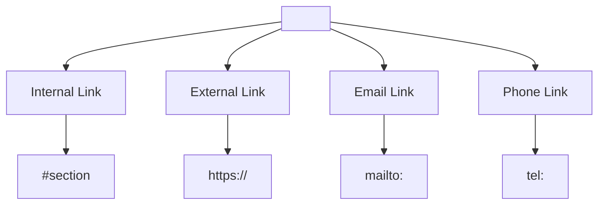

## 1.3. Links and Navigation

### Anchor Tags: `<a href="">`

Anchor tags (якірні теги, англ. anchor) створюють гіперпосилання (hyperlinks) між сторінками, секціями чи зовнішніми ресурсами.

```html
<a href="https://example.com">Visit Example</a>
```
- `href` (Hypertext Reference) — адреса призначення.
- Текст між тегами `<a>` — клікабельний.
- Можна додати атрибути: `target`, `rel`, `title`.

```html
<a href="https://example.com" target="_blank" rel="noopener noreferrer" title="Open in new tab">Open Example</a>
```
- `target="_blank"` — відкриває посилання у новій вкладці.
- `rel="noopener noreferrer"` — підвищує безпеку для зовнішніх посилань.
- `title` — підказка при наведенні.

---

### Internal Links and Page Navigation

Внутрішні посилання (internal links) ведуть на інші сторінки сайту або на секції поточної сторінки.

#### Перехід між сторінками:
```html
<a href="/about.html">About Us</a>
```

#### Якірні посилання (на секцію сторінки):
```html
<a href="#contact">Contact Section</a>
...
<section id="contact">...</section>
```
- `#contact` — посилання на елемент з відповідним `id`.

---

### External Links and Protocols

Зовнішні посилання (external links) ведуть на інші сайти або ресурси.

```html
<a href="https://www.google.com" target="_blank" rel="noopener">Google</a>
```

Підтримуються різні протоколи:
- `http://`, `https://` — веб-сторінки
- `ftp://` — файли
- `mailto:` — електронна пошта
- `tel:` — телефонний номер

---

### Email and Phone Links

#### Email Link:
```html
<a href="mailto:info@example.com">Email Us</a>
```
- Відкриває поштовий клієнт із заповненою адресою.

#### Phone Link:
```html
<a href="tel:+1234567890">Call Us</a>
```
- На мобільних пристроях відкриває додаток для дзвінків.

---

### Mermaid Diagram: Link Types


_Типи посилань у HTML_

---

#### Navigation

- [Попередня тема: Text Elements](1.2-text-elements.md)
- [Наступна тема: Media Elements](#)
