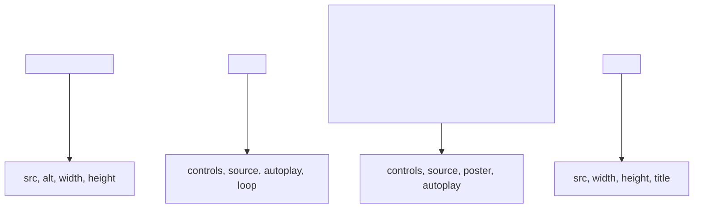

## 1.4. Media Elements

### Images: `` and Attributes

Зображення (images) додають візуальний контент на сторінку. Основний тег — ``.

```html

```

-   `src` — шлях до зображення (source).
-   `alt` — альтернативний текст (важливо для accessibility та SEO).
-   `width`, `height` — розміри (можна задавати через CSS).
-   `title` — підказка при наведенні.
-   `loading="lazy"` — відкладене завантаження (lazy loading).

> **Best Practice:** Завжди додавайте `alt` для доступності.

---

### Audio: `<audio>` and Controls

Аудіо (audio) додається через тег `<audio>`. Можна вбудовувати кілька форматів для кросбраузерності.

```html
<audio controls>
    <source src="sound.mp3" type="audio/mpeg" />
    <source src="sound.ogg" type="audio/ogg" />
    Your browser does not support the audio element.
</audio>
```

-   `controls` — показує стандартні елементи керування (play, pause).
-   `<source>` — дозволяє вказати кілька форматів.
-   Можна додати атрибути: `autoplay`, `loop`, `muted`.

---

### Video: `<video>` and Embedding

Відео (video) додається через тег `<video>`. Підтримує кілька форматів та додаткові атрибути.

```html
<video width="400" controls poster="preview.jpg">
    <source src="movie.mp4" type="video/mp4" />
    <source src="movie.webm" type="video/webm" />
    Your browser does not support the video tag.
</video>
```

-   `controls` — стандартні елементи керування.
-   `poster` — зображення-прев’ю до старту відео.
-   `autoplay`, `loop`, `muted` — додаткові атрибути.

#### Вбудовування відео з YouTube:

```html
<iframe
    width="560"
    height="315"
    src="https://www.youtube.com/embed/VIDEO_ID"
    frameborder="0"
    allowfullscreen
></iframe>
```

---

### iframes and Embedding Content

Тег `<iframe>` (inline frame) дозволяє вбудовувати зовнішній контент (іншу сторінку, відео, карту тощо).

```html
<iframe
    src="https://example.com"
    width="600"
    height="400"
    title="Embedded Page"
></iframe>
```

-   `src` — адреса вбудованого ресурсу.
-   `width`, `height` — розміри.
-   `title` — опис для доступності.
-   Можна додати атрибути: `allow`, `sandbox` для безпеки.

> **Note:** Використання iframes може впливати на безпеку та продуктивність.

---

### Mermaid Diagram: Media Elements



_Основні медіа-елементи HTML_

---

#### Navigation

-   [Попередня тема: Links and Navigation](1.3-links-navigation.md)
-   [Наступна тема: Tables](#)
