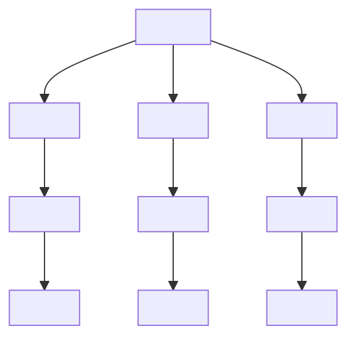

## 1.5. Tables

### Basic Structure: `<table>`, `<tr>`, `<td>`, `<th>`

Таблиці (tables) використовуються для організації даних у рядки та стовпці. Основні елементи:

```html
<table>
    <tr>
        <th>Name</th>
        <th>Age</th>
    </tr>
    <tr>
        <td>Anna</td>
        <td>28</td>
    </tr>
    <tr>
        <td>Oleh</td>
        <td>34</td>
    </tr>
</table>
```

-   `<table>` — контейнер для всієї таблиці.
-   `<tr>` (table row) — рядок таблиці.
-   `<th>` (table header) — заголовок стовпця (жирний, вирівнюється по центру).
-   `<td>` (table data) — комірка з даними.

> **Best Practice:** Використовуйте таблиці лише для табличних даних, не для верстки.

---

### Table Sections: `<thead>`, `<tbody>`, `<tfoot>`

Секції таблиці допомагають структурувати великі таблиці та покращують доступність.

```html
<table>
    <thead>
        <tr>
            <th>Name</th>
            <th>Age</th>
        </tr>
    </thead>
    <tbody>
        <tr>
            <td>Anna</td>
            <td>28</td>
        </tr>
        <tr>
            <td>Oleh</td>
            <td>34</td>
        </tr>
    </tbody>
    <tfoot>
        <tr>
            <td colspan="2">Total: 2 people</td>
        </tr>
    </tfoot>
</table>
```

-   `<thead>` — заголовок таблиці.
-   `<tbody>` — основний контент.
-   `<tfoot>` — підсумки або додаткова інформація.

---

### Spanning Cells: colspan and rowspan

Атрибути `colspan` та `rowspan` дозволяють об'єднувати комірки по горизонталі та вертикалі.

```html
<table>
    <tr>
        <th colspan="2">User Info</th>
    </tr>
    <tr>
        <td rowspan="2">Anna</td>
        <td>28</td>
    </tr>
    <tr>
        <td>Designer</td>
    </tr>
</table>
```

-   `colspan` — об'єднує комірки по горизонталі.
-   `rowspan` — по вертикалі.

---

### Styling Tables

Таблиці можна стилізувати за допомогою CSS для покращення вигляду та читабельності.

```css
/* Просте стилізування таблиці */
table {
    border-collapse: collapse;
    width: 100%;
}
th,
td {
    border: 1px solid #ccc;
    padding: 8px;
    text-align: left;
}
th {
    background-color: #f4f4f4;
}
tr:nth-child(even) {
    background-color: #fafafa;
}
```

---

### Mermaid Diagram: Table Structure



_Структура HTML-таблиці_

---

#### Navigation

-   [Попередня тема: Media Elements](1.4-media-elements.md)
-   [Наступна тема: Forms](#)
