## 1.6. Forms

### Form Structure: `<form>` Attributes

Форми (forms) дозволяють користувачам вводити та надсилати дані. Основний тег — `<form>`.

```html
<form action="/submit" method="post" autocomplete="on">
    <!-- Form fields go here -->
</form>
```

-   `action` — URL для надсилання даних.
-   `method` — спосіб передачі (`get` або `post`).
-   `autocomplete` — автозаповнення полів.
-   Можна додати: `novalidate`, `target`, `enctype`.

---

### Input Types: text, password, email, number, etc.

Тег `<input>` має багато типів для різних сценаріїв:

```html
<input type="text" name="username" placeholder="Enter your name" required />
<input type="password" name="password" minlength="6" required />
<input type="email" name="email" required />
<input type="number" name="age" min="0" max="120" />
<input type="date" name="birthdate" />
<input type="file" name="avatar" />
```

-   `type` — визначає тип поля.
-   `name` — ім'я для передачі на сервер.
-   `placeholder` — підказка.
-   `required`, `minlength`, `min`, `max` — валідація.

---

### Checkboxes and Radio Buttons

```html
<!-- Checkbox -->
<label>
    <input type="checkbox" name="subscribe" checked />
    Subscribe to newsletter
</label>

<!-- Radio buttons -->
<label> <input type="radio" name="gender" value="male" /> Male </label>
<label> <input type="radio" name="gender" value="female" /> Female </label>
```

-   `checkbox` — множинний вибір.
-   `radio` — вибір одного з групи (однакове `name`).

---

### Select Dropdowns

```html
<select name="country" required>
    <option value="">Select country</option>
    <option value="ua">Ukraine</option>
    <option value="pl">Poland</option>
</select>
```

-   `<select>` — випадаючий список.
-   `<option>` — варіант вибору.
-   Можна додати: `multiple`, `size`.

---

### Textareas

```html
<textarea
    name="message"
    rows="4"
    cols="40"
    placeholder="Your message..."
></textarea>
```

-   `<textarea>` — багаторядкове текстове поле.
-   `rows`, `cols` — розміри.
-   `placeholder` — підказка.

---

### Form Validation Attributes

HTML5 підтримує вбудовану валідацію (validation):

-   `required`, `pattern`, `min`, `max`, `minlength`, `maxlength`, `step`, `type`.

```html
<input type="email" required pattern=".+@example.com" />
<input type="number" min="1" max="10" step="1" />
```

-   Валідація відбувається на клієнті до надсилання.
-   Можна вимкнути через `novalidate` у `<form>`.

---

### Buttons and Submission

```html
<button type="submit">Send</button>
<button type="reset">Reset</button>
<button type="button" onclick="alert('Clicked!')">Custom Action</button>
```

-   `submit` — надсилає форму.
-   `reset` — очищає всі поля.
-   `button` — для кастомних дій.

---

### Mermaid Diagram: Form Structure

```mermaid
graph TD
    A[<form>] --> B[<input>]
    A --> C[<select>]
    A --> D[<textarea>]
    A --> E[<button>]
    B --> F[type, name, value, required]
    C --> G[<option>]
    E --> H[type: submit, reset, button]
```



_Структура HTML-форми_

---

#### Navigation

-   [Попередня тема: Tables](1.5-tables.md)
-   [Наступна тема: Semantic HTML](#)
