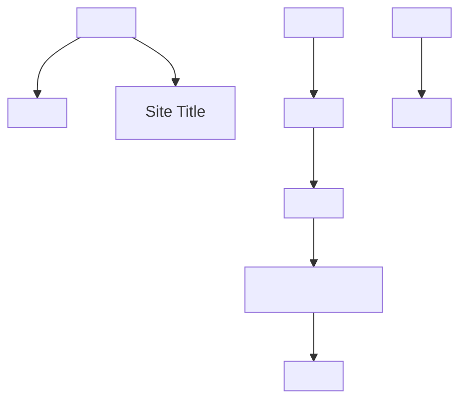

## 1.7. Semantic HTML

### Structural Elements: `<header>`, `<footer>`, `<nav>`, `<main>`, `<section>`, `<article>`

Семантичні елементи (semantic elements) описують структуру сторінки, роблячи її зрозумілою для браузерів, пошукових систем і assistive technologies.

```html
<header>
    <h1>Site Title</h1>
    <nav>
        <a href="/">Home</a>
        <a href="/about">About</a>
    </nav>
</header>
<main>
    <section>
        <article>
            <h2>Article Title</h2>
            <p>Content...</p>
        </article>
    </section>
</main>
<footer>
    <address>Contact info</address>
</footer>
```

-   `<header>` — верхня частина сторінки або секції (логотип, навігація).
-   `<footer>` — нижня частина (контакти, копірайт).
-   `<nav>` — навігаційне меню.
-   `<main>` — основний контент (тільки один на сторінці).
-   `<section>` — тематичний розділ.
-   `<article>` — самостійний контент (стаття, пост).

---

### Text Semantics: `<time>`, `<address>`, `<figure>`, `<figcaption>`

Семантичні елементи для тексту додають значення і покращують доступність.

```html
<time datetime="2025-08-04">August 4, 2025</time>
<address>
    Written by <a href="mailto:webmaster@example.com">Webmaster</a>
</address>
<figure>
    
    <figcaption>Structure diagram</figcaption>
</figure>
```

-   `<time>` — дата/час (з атрибутом `datetime`).
-   `<address>` — контактна інформація.
-   `<figure>` — ілюстрація, діаграма, медіа.
-   `<figcaption>` — підпис до ілюстрації.

---

### Accessibility Considerations

Доступність (accessibility, A11y) — це створення сайтів, якими можуть користуватись всі, включно з людьми з інвалідністю.

-   Використовуйте семантичні елементи для логічної структури.
-   Додавайте `alt` до зображень.
-   Забезпечуйте навігацію з клавіатури.
-   Використовуйте достатній контраст кольорів.
-   Перевіряйте сайт з екранними читачами.

---

### ARIA Roles and Attributes

ARIA (Accessible Rich Internet Applications) — набір атрибутів для покращення доступності складних елементів.

```html
<nav role="navigation" aria-label="Main menu">
    <ul>
        <li><a href="/">Home</a></li>
        <li><a href="/about">About</a></li>
    </ul>
</nav>
<button aria-pressed="false" aria-label="Toggle menu">Menu</button>
```

-   `role` — описує роль елемента (navigation, button, dialog).
-   `aria-label` — текстова мітка для assistive technologies.
-   `aria-pressed`, `aria-expanded`, `aria-hidden` — стан елемента.

> **Best Practice:** Використовуйте ARIA лише там, де стандартних семантичних елементів недостатньо.

---

### Mermaid Diagram: Semantic Structure



_Семантична структура HTML-документа_

---

#### Navigation

-   [Попередня тема: Forms](1.6-forms.md)
-   [Наступна тема: Advanced HTML](#)
