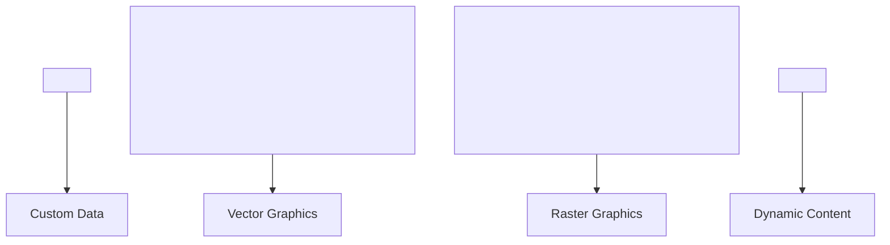

## 1.8. Advanced HTML

### Custom Data Attributes

Custom data attributes (кастомні атрибути даних) дозволяють зберігати додаткову інформацію у HTML-елементах для використання у JavaScript, CSS або для інтеграції з фреймворками.

```html
<div data-user-id="123" data-role="admin">User Info</div>
```

-   Атрибути мають формат `data-*`.
-   Доступ через JS: `element.dataset.userId`.

```js
const div = document.querySelector("[data-user-id]");
console.log(div.dataset.userId); // "123"
```

---

### SVG Integration

SVG (Scalable Vector Graphics) — формат для векторної графіки, інтегрується напряму у HTML.

```html
<svg width="100" height="100">
    <circle
        cx="50"
        cy="50"
        r="40"
        stroke="green"
        stroke-width="4"
        fill="yellow"
    />
</svg>
```

-   Можна стилізувати через CSS.
-   Підтримує анімації та інтерактивність.

---

### Canvas Element Basics

Canvas (елемент `<canvas>`) — для малювання растрової графіки через JavaScript.

```html
<canvas id="myCanvas" width="200" height="100"></canvas>
<script>
    const canvas = document.getElementById("myCanvas");
    const ctx = canvas.getContext("2d");
    ctx.fillStyle = "red";
    ctx.fillRect(10, 10, 150, 75);
</script>
```

-   API для малювання: `getContext('2d')` (або 'webgl').
-   Використовується для ігор, графіки, візуалізацій.

---

### HTML Templating

HTML шаблони (templating) дозволяють створювати динамічний контент без рендеру на сторінці до активації через JS.

```html
<template id="userTemplate">
    <div class="user">
        <h2></h2>
        <p></p>
    </div>
</template>
<script>
    const template = document.getElementById("userTemplate");
    const clone = template.content.cloneNode(true);
    clone.querySelector("h2").textContent = "Anna";
    clone.querySelector("p").textContent = "Designer";
    document.body.appendChild(clone);
</script>
```

-   Тег `<template>` не рендериться до активації через JS.
-   Зручно для компонентного підходу.

---

### Mermaid Diagram: Advanced HTML Elements



_Розширені елементи HTML_

---

#### Navigation

-   [Попередня тема: Semantic HTML](1.7-semantic-html.md)
-   [Наступна тема: CSS Fundamentals](../2.1-css-fundamentals.md)
