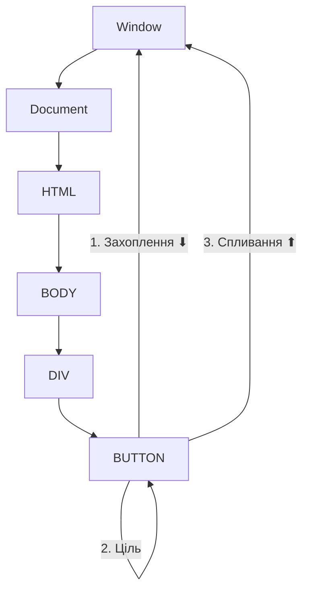
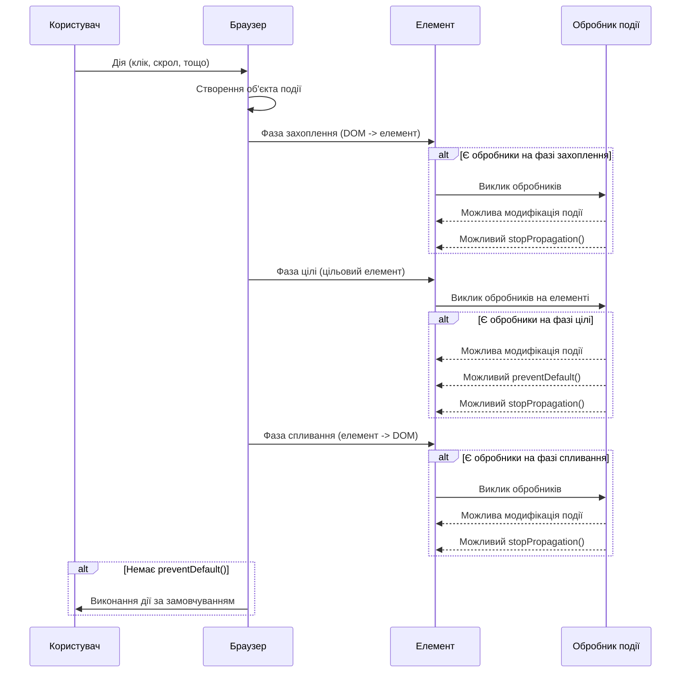

# HTML

## HTML: Події

HTML-події — це дії або відгуки, які відбуваються у відповідь на певні дії користувача або системні події в браузері. Вони дозволяють створювати інтерактивні веб-сторінки, реагуючи на дії користувача, такі як клік миші, натискання клавіш, завантаження сторінки тощо.

### Для чого використовуються

-   **Інтерактивність**: реагування на дії користувача
-   **Валідація форм**: перевірка введених даних у реальному часі
-   **Динамічний контент**: завантаження або зміна контенту без перезавантаження сторінки
-   **Анімації та ефекти**: запуск візуальних ефектів при певних діях
-   **Відстеження**: моніторинг поведінки користувача

### Основні категорії подій

#### 1. Події миші

| Подія         | Опис                         | Приклад                                             |
| ------------- | ---------------------------- | --------------------------------------------------- |
| `click`       | Клік на елементі             | `<button onclick="handleClick()">Клікни</button>`   |
| `dblclick`    | Подвійний клік               | `<div ondblclick="handleDoubleClick()"></div>`      |
| `mousedown`   | Натискання кнопки миші       | `<div onmousedown="handleMouseDown()"></div>`       |
| `mouseup`     | Відпускання кнопки миші      | `<div onmouseup="handleMouseUp()"></div>`           |
| `mouseover`   | Курсор наводиться на елемент | `<a onmouseover="showTooltip()">Наведи на мене</a>` |
| `mouseout`    | Курсор залишає елемент       | `<a onmouseout="hideTooltip()">Наведи на мене</a>`  |
| `mousemove`   | Рух курсора над елементом    | `<canvas onmousemove="draw(event)"></canvas>`       |
| `contextmenu` | Відкриття контекстного меню  | `<div oncontextmenu="return false"></div>`          |

#### 2. Події клавіатури

| Подія      | Опис                            | Приклад                                    |
| ---------- | ------------------------------- | ------------------------------------------ |
| `keydown`  | Натискання клавіші              | `<input onkeydown="checkKey(event)">`      |
| `keyup`    | Відпускання клавіші             | `<input onkeyup="countChars(event)">`      |
| `keypress` | Натискання клавіші (символьної) | `<input onkeypress="validateChar(event)">` |

#### 3. Події форм

| Подія    | Опис                    | Приклад                                 |
| -------- | ----------------------- | --------------------------------------- |
| `submit` | Відправка форми         | `<form onsubmit="validateForm(event)">` |
| `reset`  | Скидання форми          | `<form onreset="confirmReset()">`       |
| `change` | Зміна значення елемента | `<select onchange="updateOptions()">`   |
| `input`  | Введення в поле         | `<input oninput="showFeedback()">`      |
| `focus`  | Елемент отримує фокус   | `<input onfocus="highlightField()">`    |
| `blur`   | Елемент втрачає фокус   | `<input onblur="validateField()">`      |
| `select` | Виділення тексту        | `<input onselect="copySelection()">`    |

#### 4. Події вікна та документа

| Подія              | Опис                                  | Приклад                                         |
| ------------------ | ------------------------------------- | ----------------------------------------------- |
| `load`             | Завантаження ресурсу                  | `<body onload="initialize()">`                  |
| `unload`           | Вивантаження ресурсу                  | `<body onunload="cleanup()">`                   |
| `resize`           | Зміна розміру вікна                   | `<body onresize="adjustLayout()">`              |
| `scroll`           | Прокручування сторінки                | `<div onscroll="lazyLoad()">`                   |
| `DOMContentLoaded` | DOM готовий (без очікування ресурсів) | Тільки через JavaScript                         |
| `beforeunload`     | Перед вивантаженням сторінки          | `<body onbeforeunload="return 'Ви впевнені?'">` |
| `error`            | Помилка завантаження                  | ``            |

#### 5. Drag and Drop події

| Подія       | Опис                                         | Приклад                                                 |
| ----------- | -------------------------------------------- | ------------------------------------------------------- |
| `dragstart` | Початок перетягування                        | `<div draggable="true" ondragstart="dragStart(event)">` |
| `drag`      | Під час перетягування                        | `<div ondrag="updatePosition(event)">`                  |
| `dragend`   | Завершення перетягування                     | `<div ondragend="finishDrag(event)">`                   |
| `dragenter` | Перетягуваний елемент входить в цільову зону | `<div ondragenter="highlightTarget(event)">`            |
| `dragover`  | Перетягуваний елемент над цільовою зоною     | `<div ondragover="allowDrop(event)">`                   |
| `dragleave` | Перетягуваний елемент залишає цільову зону   | `<div ondragleave="unhighlightTarget(event)">`          |
| `drop`      | Елемент перетягнуто на ціль                  | `<div ondrop="handleDrop(event)">`                      |

#### 6. Сенсорні події

| Подія         | Опис                 | Приклад                                          |
| ------------- | -------------------- | ------------------------------------------------ |
| `touchstart`  | Дотик до екрану      | `<div ontouchstart="handleTouchStart(event)">`   |
| `touchmove`   | Рух пальця по екрану | `<div ontouchmove="handleTouchMove(event)">`     |
| `touchend`    | Закінчення дотику    | `<div ontouchend="handleTouchEnd(event)">`       |
| `touchcancel` | Переривання дотику   | `<div ontouchcancel="handleTouchCancel(event)">` |

#### 7. Медіа-події

| Подія          | Опис                       | Приклад                                   |
| -------------- | -------------------------- | ----------------------------------------- |
| `play`         | Початок відтворення        | `<video onplay="logStart()">`             |
| `pause`        | Пауза відтворення          | `<audio onpause="logPause()">`            |
| `ended`        | Завершення відтворення     | `<video onended="playNext()">`            |
| `timeupdate`   | Оновлення часу відтворення | `<video ontimeupdate="updateProgress()">` |
| `volumechange` | Зміна гучності             | `<audio onvolumechange="saveVolume()">`   |

### Способи додавання обробників подій

#### 1. Через HTML-атрибути (inline)

```html
<button onclick="alert('Привіт!')">Клікни мене</button>
```

#### 2. Через властивості DOM-елементів

```html
<button id="myButton">Клікни мене</button>
<script>
    document.getElementById("myButton").onclick = function () {
        alert("Привіт!");
    };
</script>
```

#### 3. Через метод addEventListener (найбільш сучасний підхід)

```html
<button id="myButton">Клікни мене</button>
<script>
    document.getElementById("myButton").addEventListener("click", function () {
        alert("Привіт!");
    });
</script>
```

### Приклади використання подій

#### Валідація форми

```html
<form id="registrationForm" onsubmit="return validateForm(event)">
    <div>
        <label for="username">Ім'я користувача:</label>
        <input
            type="text"
            id="username"
            name="username"
            oninput="checkUsername(this)"
        />
        <span id="usernameError" class="error"></span>
    </div>

    <div>
        <label for="email">Email:</label>
        <input type="email" id="email" name="email" onblur="checkEmail(this)" />
        <span id="emailError" class="error"></span>
    </div>

    <div>
        <label for="password">Пароль:</label>
        <input
            type="password"
            id="password"
            name="password"
            oninput="checkPassword(this)"
        />
        <span id="passwordError" class="error"></span>
    </div>

    <button type="submit">Зареєструватися</button>
</form>

<script>
    function checkUsername(input) {
        const value = input.value.trim();
        const errorElement = document.getElementById("usernameError");

        if (value.length < 3) {
            errorElement.textContent =
                "Ім'я користувача має містити не менше 3 символів";
            return false;
        } else {
            errorElement.textContent = "";
            return true;
        }
    }

    function checkEmail(input) {
        const value = input.value.trim();
        const errorElement = document.getElementById("emailError");
        const emailPattern = /^[^\s@]+@[^\s@]+\.[^\s@]+$/;

        if (!emailPattern.test(value)) {
            errorElement.textContent = "Введіть коректну email-адресу";
            return false;
        } else {
            errorElement.textContent = "";
            return true;
        }
    }

    function checkPassword(input) {
        const value = input.value;
        const errorElement = document.getElementById("passwordError");

        if (value.length < 8) {
            errorElement.textContent = "Пароль має містити не менше 8 символів";
            return false;
        } else {
            errorElement.textContent = "";
            return true;
        }
    }

    function validateForm(event) {
        const isUsernameValid = checkUsername(
            document.getElementById("username")
        );
        const isEmailValid = checkEmail(document.getElementById("email"));
        const isPasswordValid = checkPassword(
            document.getElementById("password")
        );

        if (!isUsernameValid || !isEmailValid || !isPasswordValid) {
            event.preventDefault(); // Запобігаємо відправці форми
            return false;
        }

        return true;
    }
</script>
```

#### Галерея зображень

```html
<div class="gallery">
    
    
    
</div>

<div id="overlay" onclick="hideOverlay()">
    
</div>

<script>
    function showImage(src) {
        const overlay = document.getElementById("overlay");
        const enlargedImage = document.getElementById("enlargedImage");

        enlargedImage.src = src;
        overlay.style.display = "flex";

        // Запобігаємо прокручуванню сторінки під час перегляду
        document.body.style.overflow = "hidden";
    }

    function hideOverlay() {
        const overlay = document.getElementById("overlay");
        overlay.style.display = "none";

        // Відновлюємо прокручування
        document.body.style.overflow = "auto";
    }

    // Додаємо обробник клавіші Escape для закриття галереї
    document.addEventListener("keydown", function (event) {
        if (event.key === "Escape") {
            hideOverlay();
        }
    });
</script>

<style>
    .gallery {
        display: flex;
        gap: 10px;
    }

    .gallery img {
        width: 100px;
        height: 100px;
        object-fit: cover;
        cursor: pointer;
    }

    #overlay {
        display: none;
        position: fixed;
        top: 0;
        left: 0;
        width: 100%;
        height: 100%;
        background-color: rgba(0, 0, 0, 0.8);
        justify-content: center;
        align-items: center;
        z-index: 1000;
    }

    #enlargedImage {
        max-width: 90%;
        max-height: 90%;
    }
</style>
```

#### Перетягування елементів

```html
<div class="draggable-container">
    <div class="draggable-item" draggable="true" id="item1">Елемент 1</div>
    <div class="draggable-item" draggable="true" id="item2">Елемент 2</div>
    <div class="draggable-item" draggable="true" id="item3">Елемент 3</div>
</div>

<div class="drop-zone" id="zone1">Зона 1</div>
<div class="drop-zone" id="zone2">Зона 2</div>

<script>
    // Змінна для збереження ID перетягуваного елемента
    let draggedItemId = null;

    // Налаштовуємо всі перетягувані елементи
    document.querySelectorAll(".draggable-item").forEach((item) => {
        // Початок перетягування
        item.addEventListener("dragstart", function (event) {
            draggedItemId = this.id;
            this.classList.add("dragging");

            // Зберігаємо ID елемента в об'єкті перетягування
            event.dataTransfer.setData("text/plain", this.id);

            // Встановлюємо ефект копіювання
            event.dataTransfer.effectAllowed = "move";
        });

        // Завершення перетягування
        item.addEventListener("dragend", function () {
            this.classList.remove("dragging");
        });
    });

    // Налаштовуємо всі зони для перетягування
    document.querySelectorAll(".drop-zone").forEach((zone) => {
        // Коли елемент входить у зону
        zone.addEventListener("dragenter", function (event) {
            event.preventDefault();
            this.classList.add("drag-over");
        });

        // Коли елемент над зоною
        zone.addEventListener("dragover", function (event) {
            event.preventDefault(); // Дозволяємо drop
            return false;
        });

        // Коли елемент залишає зону
        zone.addEventListener("dragleave", function () {
            this.classList.remove("drag-over");
        });

        // Коли елемент відпущено в зоні
        zone.addEventListener("drop", function (event) {
            event.preventDefault();
            this.classList.remove("drag-over");

            // Отримуємо ID перетягуваного елемента
            const itemId = event.dataTransfer.getData("text/plain");
            const draggedItem = document.getElementById(itemId);

            // Додаємо елемент до зони
            this.appendChild(draggedItem);
        });
    });
</script>

<style>
    .draggable-container {
        display: flex;
        gap: 10px;
        margin-bottom: 20px;
    }

    .draggable-item {
        padding: 10px;
        background-color: #f0f0f0;
        border: 1px solid #ccc;
        cursor: grab;
        user-select: none;
    }

    .draggable-item.dragging {
        opacity: 0.5;
        cursor: grabbing;
    }

    .drop-zone {
        padding: 20px;
        margin: 10px 0;
        border: 2px dashed #ccc;
        min-height: 100px;
    }

    .drop-zone.drag-over {
        background-color: #f0f0f0;
        border-color: #aaa;
    }
</style>
```

### Підкапотні механізми

#### Фази подій

У DOM подія проходить три фази:

1. **Фаза захоплення (capturing phase)**: подія проходить від кореня до цільового елемента
2. **Фаза цілі (target phase)**: подія досягає цільового елемента
3. **Фаза спливання (bubbling phase)**: подія спливає від цільового елемента до кореня



#### Об'єкт події

Коли відбувається подія, браузер створює об'єкт події з інформацією про неї:

```javascript
// Приклад обробника подій з об'єктом події
document.getElementById("myButton").addEventListener("click", function (event) {
    console.log("Тип події:", event.type);
    console.log("Цільовий елемент:", event.target);
    console.log("Поточний елемент:", event.currentTarget);
    console.log("Координати:", event.clientX, event.clientY);

    // Запобігання дії за замовчуванням
    event.preventDefault();

    // Зупинка поширення події
    event.stopPropagation();
});
```

#### Делегування подій

Делегування подій дозволяє додати один обробник для багатьох елементів, використовуючи спливання подій:

```html
<ul id="taskList">
    <li>Завдання 1 <button class="delete">Видалити</button></li>
    <li>Завдання 2 <button class="delete">Видалити</button></li>
    <li>Завдання 3 <button class="delete">Видалити</button></li>
</ul>

<script>
    // Замість додавання обробника до кожної кнопки,
    // додаємо один обробник до батьківського елемента
    document
        .getElementById("taskList")
        .addEventListener("click", function (event) {
            // Перевіряємо, чи клікнули на кнопку видалення
            if (event.target.classList.contains("delete")) {
                // Знаходимо батьківський елемент li і видаляємо його
                const listItem = event.target.closest("li");
                listItem.remove();
            }
        });
</script>
```

#### Особливості та підводні камені

1. **Порядок виконання обробників**:

    - Обробники, додані через `addEventListener`, виконуються в порядку додавання
    - Inline-обробники (`onclick`) і через властивості DOM (`element.onclick`) не можна додати кілька разів

2. **Запобігання діям за замовчуванням**:

    - `event.preventDefault()` - через JavaScript
    - `return false` - через inline-обробники

3. **Спливання і захоплення**:
    - За замовчуванням обробники додаються до фази спливання
    - Для додавання до фази захоплення використовуйте третій параметр `true` у `addEventListener`

```javascript
// Обробник для фази захоплення
element.addEventListener("click", handler, true);

// Або з об'єктом опцій
element.addEventListener("click", handler, { capture: true });
```

4. **Одноразові обробники**:
    - Для обробників, які повинні виконатися тільки один раз, використовуйте `{ once: true }`

```javascript
// Обробник виконається тільки один раз
element.addEventListener("click", handler, { once: true });
```

### Ефективне використання подій

#### Оптимізація продуктивності

1. **Використовуйте делегування подій** для зменшення кількості обробників:

```javascript
// Погано: багато обробників
document.querySelectorAll(".menu-item").forEach((item) => {
    item.addEventListener("click", handleClick);
});

// Добре: один обробник з делегуванням
document.querySelector(".menu").addEventListener("click", function (event) {
    if (event.target.closest(".menu-item")) {
        handleClick(event);
    }
});
```

2. **Обмеження частоти подій** для ресурсоємних операцій:

```javascript
// Обробник з debounce для події scroll
function debounce(func, wait) {
    let timeout;
    return function () {
        const context = this;
        const args = arguments;
        clearTimeout(timeout);
        timeout = setTimeout(() => func.apply(context, args), wait);
    };
}

// Застосування debounce до обробника події scroll
window.addEventListener(
    "scroll",
    debounce(function () {
        // Ресурсоємкі операції, наприклад, анімація
        updateScrollIndicator();
    }, 100)
);
```

3. **Видалення невикористовуваних обробників** для запобігання витоків пам'яті:

```javascript
// Додавання обробника
const handler = function () {
    /* ... */
};
element.addEventListener("click", handler);

// Видалення обробника, коли він більше не потрібен
element.removeEventListener("click", handler);
```

#### Забезпечення доступності

1. **Клавіатурна навігація**: додавайте обробники для подій клавіатури:

```javascript
// Додавання обробника клавіатури для кнопки
button.addEventListener("keydown", function (event) {
    // Активація при натисканні Enter або Space
    if (event.key === "Enter" || event.key === " ") {
        event.preventDefault();
        this.click();
    }
});
```

2. **ARIA-атрибути** для оновлення стану елементів:

```javascript
// Оновлення ARIA-атрибутів при зміні стану
toggleButton.addEventListener("click", function () {
    const expanded = this.getAttribute("aria-expanded") === "true";
    this.setAttribute("aria-expanded", !expanded);
    document.getElementById(this.getAttribute("aria-controls")).hidden =
        expanded;
});
```

### Схеми та діаграми

#### Потік подій у DOM

```
┌─────────────────────────────────────────────────────┐
│                                                     │
│                     Window                          │
│                        │                            │
│                        ▼                            │
│                     Document                        │
│                        │                            │
│                        ▼                            │
│                       HTML                          │
│                        │                            │
│                        ▼                            │
│                       BODY                          │
│                    ┌───┴───┐                        │
│                    ▼       ▼                        │
│                  DIV1     DIV2                      │
│                    │       │                        │
│                    ▼       ▼                        │
│                BUTTON1   BUTTON2                    │
│                    │                                │
│                    │                                │
│      ┌─────────────┼─────────────────┐             │
│      │             │                 │             │
│      ▼             │                 ▼             │
│  1. Capturing      │            3. Bubbling        │
│  Phase             │             Phase             │
│  (DOM -> Button)   │             (Button -> DOM)   │
│                    ▼                               │
│                2. Target Phase                     │
│                (Button1)                           │
│                                                     │
└─────────────────────────────────────────────────────┘
```

#### Життєвий цикл події



#### Порівняння методів додавання обробників

```
┌───────────────────────────────────────────────────────────────┐
│ Порівняння методів додавання обробників подій                 │
├───────────────────┬────────────────────┬────────────────────┐
│ Характеристика    │ HTML-атрибут       │ addEventListener   │
│                   │ або DOM-властивість│                    │
├───────────────────┼────────────────────┼────────────────────┤
│ Кілька обробників │ Ні                 │ Так                │
│ Видалення         │ Перезаписування    │ removeEventListener│
│ Параметри         │ Обмежено           │ Гнучко             │
│ Фаза захоплення   │ Недоступна         │ Доступна           │
│ Контекст (this)   │ window або елемент │ Елемент            │
│ Розділення логіки │ Перемішана з HTML  │ Відокремлена       │
└───────────────────┴────────────────────┴────────────────────┘
```

> **Важливо**: Події в HTML є основою інтерактивності веб-сторінок. Правильне використання подій, розуміння їх потоку та особливостей роботи дозволяє створювати зручні та ефективні інтерфейси. Використовуйте делегування подій для оптимізації, не забувайте про доступність і очищення ресурсів для запобігання витоків пам'яті. Пам'ятайте, що сучасна практика рекомендує розділяти структуру (HTML), представлення (CSS) і поведінку (JavaScript), тому надавайте перевагу додаванню обробників через JavaScript, а не через атрибути HTML.
