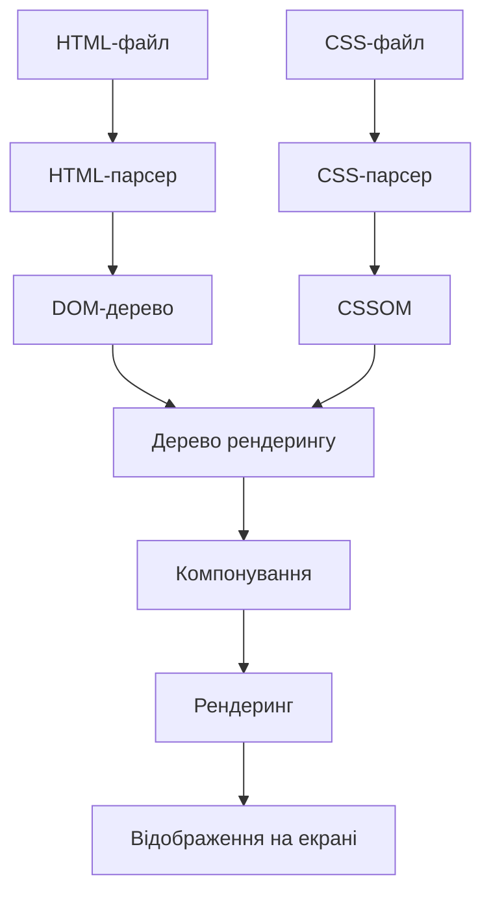
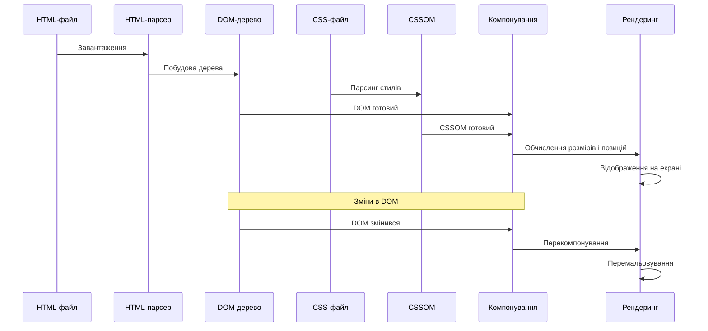

# HTML

## HTML: DOM (Document Object Model)

DOM (Document Object Model) — це програмний інтерфейс для HTML-документів, який представляє веб-сторінку як структуровану ієрархію об'єктів, що можуть бути маніпульовані через JavaScript. DOM перетворює HTML-документ на дерево об'єктів, які можуть бути змінені для динамічної зміни вмісту та структури сторінки.

### Для чого використовується

-   **Динамічне оновлення контенту**: зміна тексту, атрибутів та елементів без перезавантаження сторінки
-   **Маніпуляція структурою**: додавання, видалення і переміщення елементів
-   **Обробка подій**: реагування на дії користувача
-   **Анімації та ефекти**: зміна стилів і властивостей елементів
-   **Валідація форм**: перевірка даних перед відправкою на сервер
-   **AJAX-запити**: отримання даних з сервера та оновлення частин сторінки

### Основні концепції DOM

#### Структура DOM-дерева

DOM представляє HTML-документ як дерево вузлів різних типів:

1. **Document** — корінь дерева, представляє весь документ
2. **Element** — представляє HTML-елементи (теги)
3. **Attr** — представляє атрибути елементів
4. **Text** — представляє текстовий вміст
5. **Comment** — представляє коментарі в HTML

```mermaid
flowchart TD
    Document --> html[HTML]
    html --> head[HEAD]
    html --> body[BODY]

    head --> title[TITLE]
    title --> titleText[Text: "Мій документ"]

    body --> h1[H1]
    body --> div[DIV]

    h1 --> h1Text[Text: "Заголовок"]
    div --> p[P]
    p --> pText[Text: "Параграф"]

    div --> comment[Comment: "Примітка"]
```

#### Типи вузлів (Node types)

| Константа                 | Значення | Опис             |
| ------------------------- | -------- | ---------------- |
| `Node.ELEMENT_NODE`       | 1        | Елемент (тег)    |
| `Node.ATTRIBUTE_NODE`     | 2        | Атрибут елемента |
| `Node.TEXT_NODE`          | 3        | Текстовий вміст  |
| `Node.COMMENT_NODE`       | 8        | Коментар         |
| `Node.DOCUMENT_NODE`      | 9        | Об'єкт Document  |
| `Node.DOCUMENT_TYPE_NODE` | 10       | Об'єкт DOCTYPE   |

#### Основні властивості вузлів

| Властивість   | Опис                       | Приклад                                 |
| ------------- | -------------------------- | --------------------------------------- |
| `nodeType`    | Тип вузла                  | `element.nodeType === 1`                |
| `nodeName`    | Ім'я вузла                 | `div.nodeName === 'DIV'`                |
| `nodeValue`   | Значення вузла             | `textNode.nodeValue === 'Текст'`        |
| `textContent` | Текстовий вміст            | `element.textContent = 'Новий текст'`   |
| `innerHTML`   | HTML-вміст елемента        | `div.innerHTML = '<b>Жирний</b> текст'` |
| `outerHTML`   | HTML-код з самим елементом | `div.outerHTML = '<span>Заміна</span>'` |

#### Навігація по DOM-дереву

| Властивість              | Опис                        | Приклад                          |
| ------------------------ | --------------------------- | -------------------------------- |
| `parentNode`             | Батьківський вузол          | `element.parentNode`             |
| `childNodes`             | Всі дочірні вузли           | `element.childNodes`             |
| `children`               | Дочірні елементи            | `element.children`               |
| `firstChild`             | Перший дочірній вузол       | `element.firstChild`             |
| `lastChild`              | Останній дочірній вузол     | `element.lastChild`              |
| `firstElementChild`      | Перший дочірній елемент     | `element.firstElementChild`      |
| `lastElementChild`       | Останній дочірній елемент   | `element.lastElementChild`       |
| `nextSibling`            | Наступний сусідній вузол    | `element.nextSibling`            |
| `previousSibling`        | Попередній сусідній вузол   | `element.previousSibling`        |
| `nextElementSibling`     | Наступний сусідній елемент  | `element.nextElementSibling`     |
| `previousElementSibling` | Попередній сусідній елемент | `element.previousElementSibling` |

### Пошук елементів у DOM

#### Методи пошуку

| Метод                      | Опис                                 | Приклад                                               |
| -------------------------- | ------------------------------------ | ----------------------------------------------------- |
| `getElementById()`         | Пошук за ID                          | `document.getElementById('header')`                   |
| `getElementsByClassName()` | Пошук за класом                      | `document.getElementsByClassName('item')`             |
| `getElementsByTagName()`   | Пошук за тегом                       | `document.getElementsByTagName('div')`                |
| `getElementsByName()`      | Пошук за атрибутом name              | `document.getElementsByName('username')`              |
| `querySelector()`          | Пошук за CSS-селектором (перший)     | `document.querySelector('.menu > li')`                |
| `querySelectorAll()`       | Пошук за CSS-селектором (всі)        | `document.querySelectorAll('input[type="checkbox"]')` |
| `closest()`                | Пошук найближчого предка             | `element.closest('.container')`                       |
| `matches()`                | Перевірка на відповідність селектору | `element.matches('.active')`                          |

#### Типи повернених значень

-   `getElementById()` — повертає один елемент або `null`
-   `getElementsBy*()` — повертає "живу" колекцію (`HTMLCollection`)
-   `querySelectorAll()` — повертає статичну колекцію (`NodeList`)

```javascript
// Приклад різниці між живою і статичною колекціями
const liveCollection = document.getElementsByClassName("item");
const staticCollection = document.querySelectorAll(".item");

// Додаємо новий елемент з класом 'item'
const newItem = document.createElement("div");
newItem.className = "item";
document.body.appendChild(newItem);

console.log(liveCollection.length); // Оновлено: більше на 1
console.log(staticCollection.length); // Не змінилося
```

### Маніпуляції з DOM

#### Створення і вставка елементів

| Метод              | Опис                                 | Приклад                                       |
| ------------------ | ------------------------------------ | --------------------------------------------- |
| `createElement()`  | Створення елемента                   | `document.createElement('div')`               |
| `createTextNode()` | Створення текстового вузла           | `document.createTextNode('Текст')`            |
| `appendChild()`    | Додавання дочірнього вузла           | `parent.appendChild(child)`                   |
| `insertBefore()`   | Вставка перед вказаним вузлом        | `parent.insertBefore(newNode, referenceNode)` |
| `append()`         | Додавання в кінець (декілька вузлів) | `parent.append(child1, child2, 'Текст')`      |
| `prepend()`        | Додавання на початок                 | `parent.prepend(newChild)`                    |
| `before()`         | Вставка перед елементом              | `element.before(newNode)`                     |
| `after()`          | Вставка після елемента               | `element.after(newNode)`                      |
| `replaceWith()`    | Заміна елемента                      | `oldElement.replaceWith(newElement)`          |

```javascript
// Приклад створення і вставки елемента
const div = document.createElement("div");
div.className = "container";
div.innerHTML = "<h2>Заголовок</h2><p>Текст</p>";

document.body.appendChild(div);

// Вставка елемента перед іншим
const firstChild = document.body.firstElementChild;
const newElement = document.createElement("header");
document.body.insertBefore(newElement, firstChild);

// Використання сучасних методів
const paragraph = document.querySelector("p");
paragraph.after("Текст після параграфа", document.createElement("hr"));
```

#### Видалення і клонування

| Метод           | Опис                          | Приклад                     |
| --------------- | ----------------------------- | --------------------------- |
| `remove()`      | Видалення елемента            | `element.remove()`          |
| `removeChild()` | Видалення дочірнього елемента | `parent.removeChild(child)` |
| `cloneNode()`   | Клонування вузла              | `element.cloneNode(true)`   |

```javascript
// Видалення елемента
document.getElementById("obsolete").remove();

// Видалення всіх дочірніх елементів
const container = document.querySelector(".container");
while (container.firstChild) {
    container.removeChild(container.firstChild);
}

// Клонування елемента з усіма нащадками
const clone = document.getElementById("template").cloneNode(true);
document.body.appendChild(clone);
```

#### Робота з атрибутами

| Метод / Властивість | Опис                         | Приклад                                   |
| ------------------- | ---------------------------- | ----------------------------------------- |
| `getAttribute()`    | Отримання атрибута           | `element.getAttribute('src')`             |
| `setAttribute()`    | Встановлення атрибута        | `element.setAttribute('class', 'active')` |
| `hasAttribute()`    | Перевірка наявності атрибута | `element.hasAttribute('disabled')`        |
| `removeAttribute()` | Видалення атрибута           | `element.removeAttribute('style')`        |
| `attributes`        | Колекція всіх атрибутів      | `element.attributes`                      |
| `dataset`           | Доступ до data-атрибутів     | `element.dataset.userId`                  |

```javascript
// Робота з атрибутами
const img = document.querySelector("img");
img.setAttribute("src", "new-image.jpg");
img.setAttribute("alt", "Нове зображення");

// Перевірка і видалення атрибута
if (img.hasAttribute("width")) {
    img.removeAttribute("width");
}

// Робота з data-атрибутами
const user = document.querySelector(".user");
console.log(user.dataset.userId); // Доступ до data-user-id
user.dataset.status = "active"; // Встановлення data-status="active"
```

#### Робота з класами та стилями

| Властивість / Метод | Опис                         | Приклад                             |
| ------------------- | ---------------------------- | ----------------------------------- |
| `className`         | Рядок з класами              | `element.className = 'btn primary'` |
| `classList`         | Об'єкт для роботи з класами  | `element.classList.add('active')`   |
| `style`             | Об'єкт для роботи зі стилями | `element.style.color = 'red'`       |

```javascript
// Робота з класами
const button = document.querySelector("button");

// Додавання/видалення через className
button.className += " active"; // Додавання (не рекомендується)
button.className = button.className.replace("disabled", ""); // Видалення (не рекомендується)

// Використання classList (рекомендується)
button.classList.add("primary");
button.classList.remove("secondary");
button.classList.toggle("active"); // Перемикання класу
button.classList.replace("old", "new"); // Заміна одного класу іншим
console.log(button.classList.contains("disabled")); // Перевірка наявності класу

// Робота з інлайн-стилями
const box = document.getElementById("box");
box.style.backgroundColor = "lightblue";
box.style.width = "200px";
box.style.padding = "10px";
box.style.borderRadius = "5px"; // CSS property в camelCase

// Отримання обчислених стилів
const computedStyle = getComputedStyle(box);
console.log(computedStyle.width); // Обчислена ширина
```

### Практичні приклади використання DOM

#### Динамічне створення елементів

```javascript
// Функція для створення карточки товару
function createProductCard(product) {
    // Створення основного контейнера
    const card = document.createElement("div");
    card.className = "product-card";
    card.dataset.productId = product.id;

    // Створення зображення
    const image = document.createElement("img");
    image.src = product.imageUrl;
    image.alt = product.name;
    image.className = "product-image";

    // Створення заголовка
    const title = document.createElement("h3");
    title.className = "product-title";
    title.textContent = product.name;

    // Створення опису
    const description = document.createElement("p");
    description.className = "product-description";
    description.textContent = product.description;

    // Створення ціни
    const price = document.createElement("div");
    price.className = "product-price";
    price.textContent = `${product.price} грн`;

    // Створення кнопки
    const button = document.createElement("button");
    button.className = "add-to-cart-btn";
    button.textContent = "Додати в кошик";
    button.addEventListener("click", () => addToCart(product.id));

    // Складання карточки
    card.appendChild(image);
    card.appendChild(title);
    card.appendChild(description);
    card.appendChild(price);
    card.appendChild(button);

    return card;
}

// Використання функції для додавання товарів на сторінку
const products = [
    {
        id: 1,
        name: "Ноутбук",
        description: "Потужний ноутбук для роботи",
        price: 25000,
        imageUrl: "laptop.jpg",
    },
    {
        id: 2,
        name: "Смартфон",
        description: "Сучасний смартфон з хорошою камерою",
        price: 8000,
        imageUrl: "smartphone.jpg",
    },
];

const productsContainer = document.querySelector(".products-container");
products.forEach((product) => {
    const card = createProductCard(product);
    productsContainer.appendChild(card);
});
```

#### Оновлення вмісту та фільтрація

```javascript
// Функція фільтрації списку
function filterList() {
    const searchInput = document.getElementById("search");
    const filterValue = searchInput.value.toLowerCase();
    const items = document.querySelectorAll(".list-item");

    items.forEach((item) => {
        const text = item.textContent.toLowerCase();
        // Показуємо або приховуємо елементи залежно від фільтра
        if (text.includes(filterValue)) {
            item.style.display = "";
        } else {
            item.style.display = "none";
        }
    });

    // Оновлюємо лічильник відображених елементів
    const visibleItems = document.querySelectorAll(
        '.list-item[style="display: none;"]'
    ).length;
    const counter = document.getElementById("counter");
    counter.textContent = `Показано ${items.length - visibleItems} з ${
        items.length
    } елементів`;
}

// Додаємо обробник події до поля пошуку
document.getElementById("search").addEventListener("input", filterList);

// Початкове оновлення лічильника
filterList();
```

#### Маніпуляції з формами

```javascript
// Функція для динамічного додавання полів форми
function addFormField() {
    const fieldset = document.getElementById("dynamic-fields");
    const fieldCount = fieldset.querySelectorAll(".field-group").length + 1;

    // Створення групи полів
    const fieldGroup = document.createElement("div");
    fieldGroup.className = "field-group";

    // Створення мітки
    const label = document.createElement("label");
    label.setAttribute("for", `field-${fieldCount}`);
    label.textContent = `Поле ${fieldCount}:`;

    // Створення поля вводу
    const input = document.createElement("input");
    input.type = "text";
    input.id = `field-${fieldCount}`;
    input.name = `field-${fieldCount}`;
    input.required = true;

    // Створення кнопки видалення
    const removeButton = document.createElement("button");
    removeButton.type = "button";
    removeButton.className = "remove-field";
    removeButton.textContent = "Видалити";
    removeButton.addEventListener("click", function () {
        fieldGroup.remove();
        updateFieldNumbers();
    });

    // Додавання елементів до групи
    fieldGroup.appendChild(label);
    fieldGroup.appendChild(input);
    fieldGroup.appendChild(removeButton);

    // Додавання групи до форми
    fieldset.appendChild(fieldGroup);
}

// Функція для оновлення нумерації полів
function updateFieldNumbers() {
    const fieldGroups = document.querySelectorAll(".field-group");
    fieldGroups.forEach((group, index) => {
        const fieldNumber = index + 1;
        const label = group.querySelector("label");
        const input = group.querySelector("input");

        label.setAttribute("for", `field-${fieldNumber}`);
        label.textContent = `Поле ${fieldNumber}:`;
        input.id = `field-${fieldNumber}`;
        input.name = `field-${fieldNumber}`;
    });
}

// Додавання обробника для кнопки додавання поля
document.getElementById("add-field").addEventListener("click", addFormField);

// Додавання обробника для відправки форми
document
    .getElementById("dynamic-form")
    .addEventListener("submit", function (e) {
        e.preventDefault();

        // Збір даних з форми
        const formData = new FormData(this);
        const data = {};

        for (let [key, value] of formData.entries()) {
            data[key] = value;
        }

        console.log("Дані форми:", data);
        // Тут можна відправити дані на сервер
    });
```

### Підкапотні механізми

#### Як браузер створює DOM

1. **Парсинг HTML**:

    - Браузер завантажує HTML-файл і починає його парсинг зверху вниз
    - HTML-парсер перетворює теги, атрибути і текст у вузли DOM

2. **Побудова DOM-дерева**:

    - Створюється об'єкт `Document`
    - Для кожного HTML-тега створюється вузол `Element`
    - Для текстового вмісту створюються вузли `Text`
    - Вузли з'єднуються в ієрархічну структуру

3. **Інтеграція з CSS**:

    - Створюється CSSOM (CSS Object Model)
    - DOM та CSSOM об'єднуються у дерево рендерингу (Render Tree)

4. **Компонування (Layout)**:

    - Обчислюються розміри і позиції елементів на сторінці

5. **Рендеринг (Painting)**:
    - Відображення елементів на екрані



#### Оптимізація роботи з DOM

1. **Мінімізація доступу до DOM**:
    - DOM-операції повільніші за JavaScript-операції в пам'яті
    - Кешуйте посилання на елементи DOM у змінних

```javascript
// Погано: багаторазовий доступ до DOM
for (let i = 0; i < 1000; i++) {
    document.getElementById("result").innerHTML += i + ", ";
}

// Добре: мінімізація доступу до DOM
let result = "";
for (let i = 0; i < 1000; i++) {
    result += i + ", ";
}
document.getElementById("result").innerHTML = result;
```

2. **Групування змін**:
    - Кожна зміна DOM викликає перемальовування
    - Групуйте зміни для мінімізації перемальовувань

```javascript
// Погано: багато перемальовувань
const list = document.getElementById("myList");
for (let i = 0; i < 100; i++) {
    const item = document.createElement("li");
    item.textContent = `Елемент ${i}`;
    list.appendChild(item); // Викликає перемальовування щоразу
}

// Добре: одне перемальовування
const list = document.getElementById("myList");
const fragment = document.createDocumentFragment(); // Не входить в DOM
for (let i = 0; i < 100; i++) {
    const item = document.createElement("li");
    item.textContent = `Елемент ${i}`;
    fragment.appendChild(item);
}
list.appendChild(fragment); // Одне перемальовування
```

3. **Керування перемальовуваннями**:
    - Використовуйте `requestAnimationFrame` для анімацій
    - Змінюйте класи замість inline-стилів

```javascript
// Погано: змішування зчитування і запису
const box = document.getElementById("box");
const width = box.offsetWidth; // Зчитування
box.style.width = width + 10 + "px"; // Запис
const height = box.offsetHeight; // Змушує перерахунок стилів
box.style.height = height + 10 + "px"; // Інший запис

// Добре: розділення зчитування і запису
const box = document.getElementById("box");
const width = box.offsetWidth; // Зчитування
const height = box.offsetHeight; // Зчитування
box.style.width = width + 10 + "px"; // Запис
box.style.height = height + 10 + "px"; // Запис
```

#### Особливості та підводні камені

1. **"Живі" колекції**:

    - `getElementsBy*` повертають "живі" колекції, які автоматично оновлюються
    - `querySelectorAll` повертає статичні колекції

2. **Невидимі текстові вузли**:

    - Пробіли, табуляції, переноси рядків створюють текстові вузли
    - Використовуйте `element.children` замість `element.childNodes` для отримання лише елементів

3. **Неочікувані типи повернення**:

    - `innerHTML` повертає HTML у вигляді рядка
    - `offsetWidth`, `offsetHeight` повертають цілі числа (округлені)

4. **Трешхолди перемальовування**:
    - Зміна розміру → перекомпонування (reflow) → перемальовування (repaint)
    - Зміна кольору → тільки перемальовування (repaint)

### Сучасні API DOM

#### Intersection Observer

API для ефективного відстеження видимості елементів у вьюпорті:

```javascript
// Створення спостерігача для лінивого завантаження зображень
const observer = new IntersectionObserver(
    (entries, observer) => {
        entries.forEach((entry) => {
            if (entry.isIntersecting) {
                const img = entry.target;
                const src = img.getAttribute("data-src");
                img.src = src;
                img.removeAttribute("data-src");
                observer.unobserve(img); // Припиняємо спостереження після завантаження
            }
        });
    },
    {
        root: null, // Вьюпорт
        rootMargin: "0px",
        threshold: 0.1, // 10% видимості елемента
    }
);

// Застосування до всіх зображень з атрибутом data-src
document.querySelectorAll("img[data-src]").forEach((img) => {
    observer.observe(img);
});
```

#### Mutation Observer

API для відстеження змін у DOM:

```javascript
// Створення спостерігача за змінами DOM
const observer = new MutationObserver((mutations) => {
    mutations.forEach((mutation) => {
        if (mutation.type === "childList") {
            console.log("Додано або видалено дочірні елементи:");
            console.log("Додано:", mutation.addedNodes);
            console.log("Видалено:", mutation.removedNodes);
        } else if (mutation.type === "attributes") {
            console.log("Змінено атрибут:", mutation.attributeName);
            console.log("На елементі:", mutation.target);
        }
    });
});

// Початок спостереження за елементом і його дочірніми елементами
const targetNode = document.getElementById("observe-me");
observer.observe(targetNode, {
    childList: true, // Спостерігати за додаванням/видаленням дочірніх елементів
    attributes: true, // Спостерігати за змінами атрибутів
    subtree: true, // Спостерігати за всім піддеревом
});

// Пізніше, якщо потрібно припинити спостереження
// observer.disconnect();
```

#### ResizeObserver

API для відстеження змін розміру елементів:

```javascript
// Створення спостерігача за зміною розмірів
const observer = new ResizeObserver((entries) => {
    entries.forEach((entry) => {
        const { width, height } = entry.contentRect;
        console.log(`Елемент змінив розмір: ${width}x${height}`);

        // Адаптивні зміни в залежності від розміру
        if (width < 600) {
            entry.target.classList.add("small");
            entry.target.classList.remove("medium", "large");
        } else if (width < 1000) {
            entry.target.classList.add("medium");
            entry.target.classList.remove("small", "large");
        } else {
            entry.target.classList.add("large");
            entry.target.classList.remove("small", "medium");
        }
    });
});

// Початок спостереження за елементом
const element = document.getElementById("responsive-element");
observer.observe(element);
```

### Схеми та діаграми

#### Структура DOM

```
┌───────────────────────────────────────────────────────┐
│                      Document                         │
│                          │                            │
│                          ▼                            │
│                     DocumentType                      │
│                      (DOCTYPE)                        │
│                          │                            │
│                          ▼                            │
│                      HTMLElement                      │
│                        (html)                         │
│                          │                            │
│              ┌───────────┴───────────┐               │
│              ▼                       ▼               │
│        HTMLElement               HTMLElement         │
│          (head)                    (body)            │
│              │                       │               │
│      ┌───────┴───────┐       ┌───────┴───────┐       │
│      ▼               ▼       ▼               ▼       │
│ HTMLElement     HTMLElement   Text       HTMLElement │
│   (title)         (meta)                  (div)      │
│      │                               ┌──────┴──────┐ │
│      ▼                               ▼             ▼ │
│     Text                        HTMLElement      Text│
│                                   (span)             │
│                                      │               │
│                                      ▼               │
│                                     Text             │
└───────────────────────────────────────────────────────┘
```

#### Процес рендерингу сторінки



#### Порівняння методів вибору елементів

```
┌──────────────────────────────────────────────────────────────┐
│ Порівняння методів вибору елементів                          │
├────────────────────┬───────────────┬─────────────────────────┤
│ Метод              │ Повертає      │ Особливості             │
├────────────────────┼───────────────┼─────────────────────────┤
│ getElementById     │ Element       │ Найшвидший, лише за ID  │
│ getElementsByName  │ NodeList      │ Живий список            │
│ getElementsByTagName│ HTMLCollection│ Живий список           │
│ getElementsByClassName│ HTMLCollection│ Живий список         │
│ querySelector      │ Element       │ Перший відповідний      │
│ querySelectorAll   │ NodeList      │ Статичний список        │
├────────────────────┼───────────────┼─────────────────────────┤
│ children           │ HTMLCollection│ Тільки дочірні елементи │
│ childNodes         │ NodeList      │ Включно з текстовими    │
└────────────────────┴───────────────┴─────────────────────────┘
```

> **Важливо**: DOM є ключовим інтерфейсом для динамічної взаємодії з HTML-документами через JavaScript. Ефективна робота з DOM вимагає розуміння його структури, методів вибору та маніпуляції елементами, а також оптимізації для мінімізації перемальовувань і перекомпонувань. Використовуйте сучасні API, такі як Intersection Observer, для покращення продуктивності, особливо для складних веб-додатків. Пам'ятайте, що маніпуляції з DOM є відносно повільними операціями, тому мінімізуйте звернення до DOM і групуйте зміни, коли це можливо.
