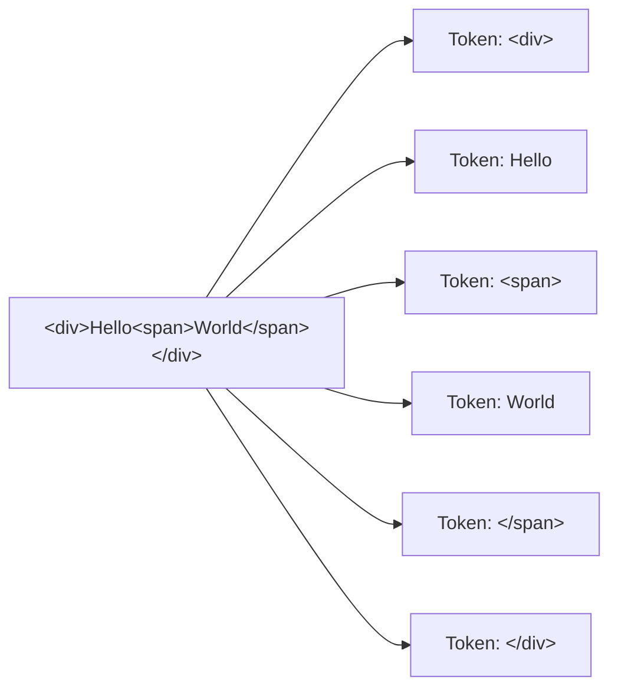
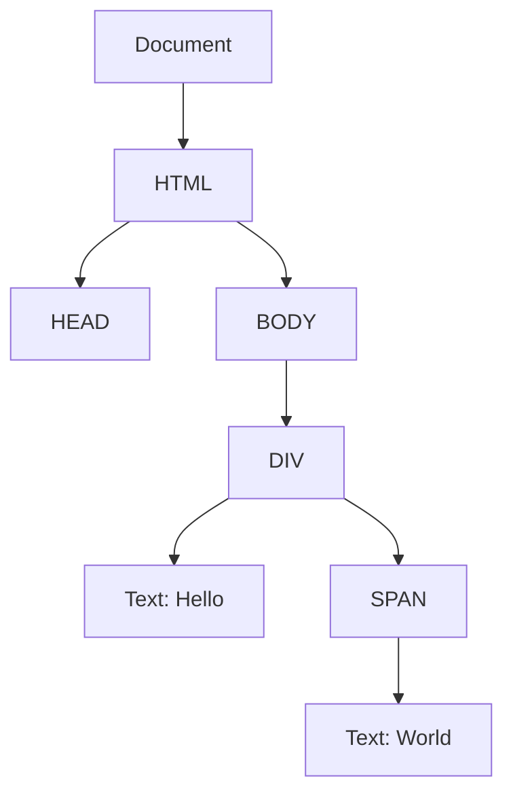
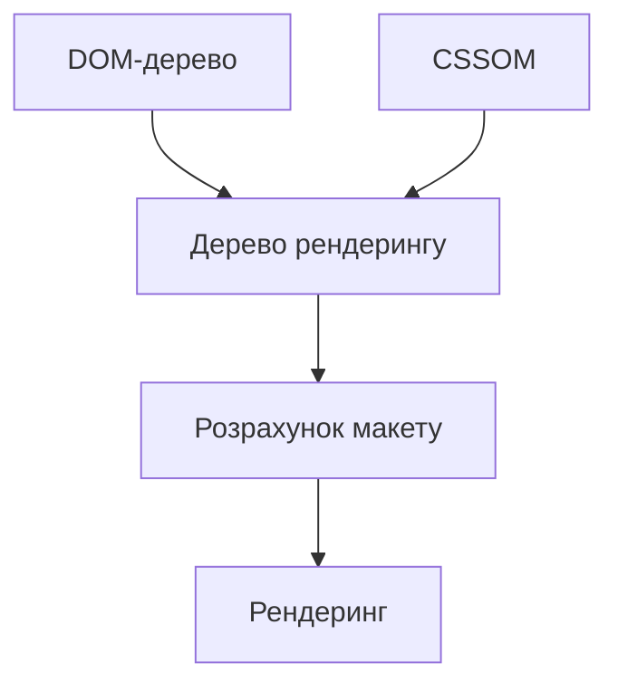
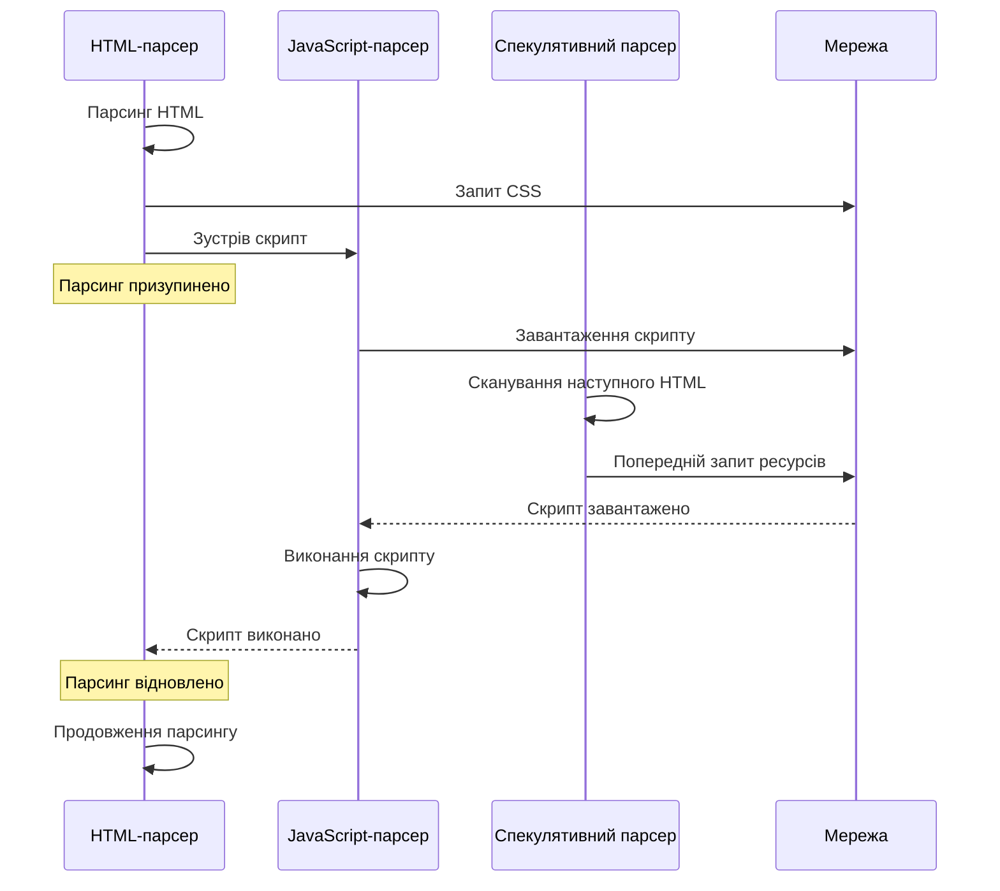
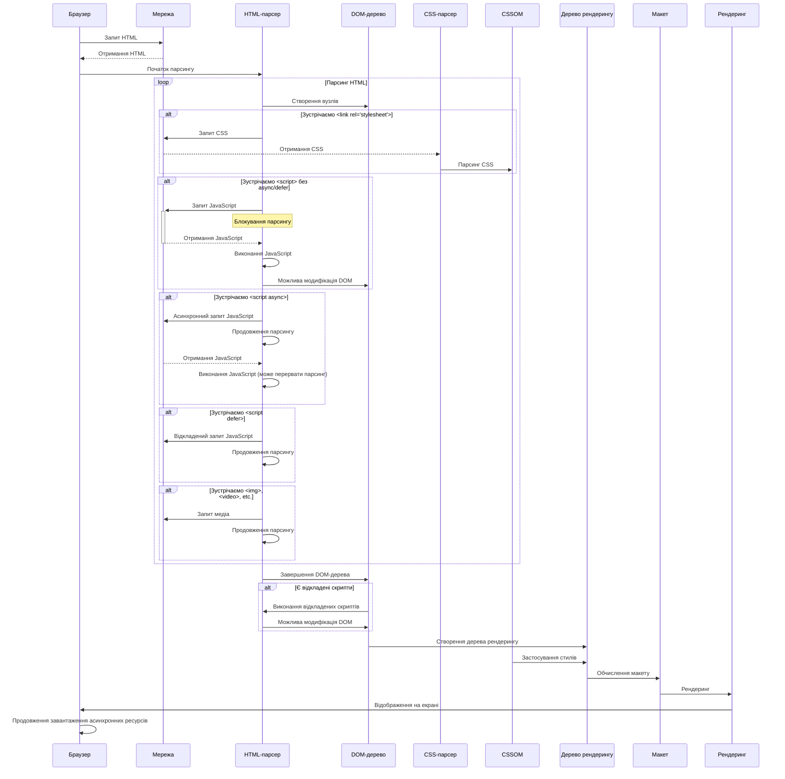
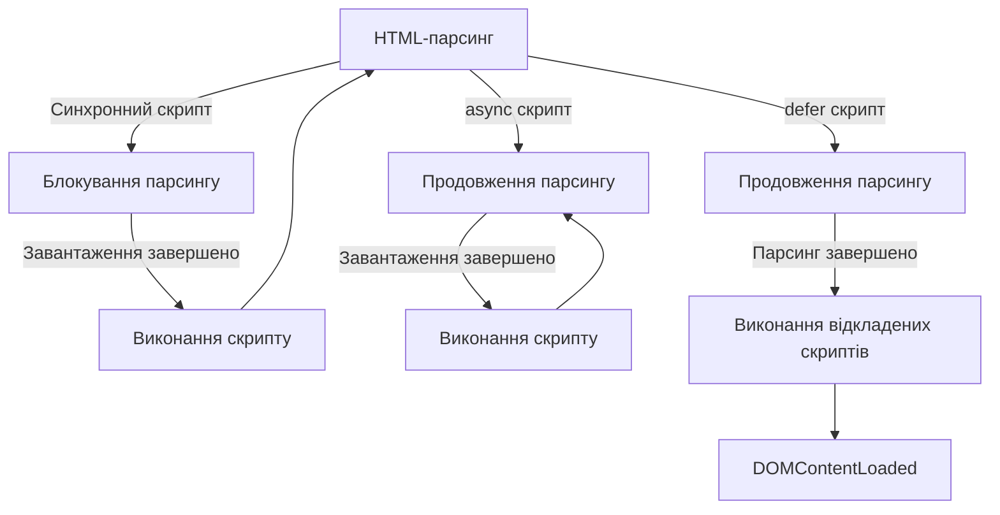

# HTML

## HTML: Парсинг в браузерах

Парсинг HTML у браузерах — це процес перетворення HTML-коду на DOM-дерево, з яким може працювати JavaScript та інші компоненти браузера. Це перший і критичний етап відображення веб-сторінки, який впливає на швидкість завантаження та інтерактивність.

### Для чого використовується

-   **Відображення веб-сторінки**: трансформація HTML-тексту в візуальне представлення
-   **Створення DOM**: побудова структури документа для подальших маніпуляцій
-   **Завантаження ресурсів**: виявлення та завантаження зовнішніх ресурсів (CSS, JavaScript, зображення)
-   **Оптимізація продуктивності**: ефективна обробка коду для швидкого відображення сторінки
-   **Обробка помилок**: розпізнавання та виправлення некоректного HTML

### Основні етапи парсингу HTML

#### 1. Отримання HTML-коду

Процес починається з отримання HTML-файлу від сервера:

1. Користувач вводить URL або переходить за посиланням
2. Браузер відправляє HTTP-запит на сервер
3. Сервер повертає HTML-документ
4. Браузер починає обробку отриманого HTML-коду

#### 2. Токенізація

Токенізація — це процес розбиття HTML-коду на окремі токени (лексеми):

-   **Відкриваючі теги**: `<div>`, `<p>`, `<a href="...">`
-   **Закриваючі теги**: `</div>`, `</p>`, `</a>`
-   **Текстовий вміст**: текст між тегами
-   **Коментарі**: `<!-- коментар -->`
-   **Doctype**: `<!DOCTYPE html>`
-   **Інші спеціальні токени**



#### 3. Побудова дерева вузлів

На основі токенів будується дерево вузлів, яке відображає структуру документа:

1. Створення кореневого вузла Document
2. Аналіз токенів і створення відповідних DOM-вузлів
3. Встановлення відношень між вузлами (батько-дочірній)
4. Обробка атрибутів та їх значень



#### 4. Обробка зовнішніх ресурсів

Під час парсингу HTML браузер виявляє посилання на зовнішні ресурси:

-   **CSS-файли**: `<link rel="stylesheet" href="styles.css">`
-   **JavaScript-файли**: `<script src="script.js"></script>`
-   **Зображення**: ``
-   **Шрифти**: через CSS `@font-face` або `<link rel="preload">`
-   **Медіа-файли**: аудіо, відео, та інші ресурси

```
┌───────────────────────────────────────────────────────┐
│                                                       │
│  HTML-парсинг                                         │
│  ┌─────────────────────────────────────────────────┐  │
│  │                                                 │  │
│  │  <link href="styles.css">  ──────────────────┐  │  │
│  │                                              │  │  │
│  │  <script src="script.js">  ──────────────────┼──┼─────┐
│  │                                              │  │  │   │
│  │       ──────────────────┼──┼─────┼─────┐
│  │                                              │  │  │   │     │
│  └─────────────────────────────────────────────────┘  │   │     │
│                                                       │   │     │
│  CSS-завантаження                                     │   │     │
│  ┌─────────────────────────────────────────────────┐  │   │     │
│  │                                                 │  │   │     │
│  │  Завантаження → Парсинг → CSSOM                │  │   │     │
│  │                                                 │  │   │     │
│  └─────────────────────────────────────────────────┘  │   │     │
│                                                       │   │     │
│  JavaScript-завантаження                              │   │     │
│  ┌─────────────────────────────────────────────────┐      │     │
│  │                                                 │      │     │
│  │  Завантаження → Парсинг → Виконання             │      │     │
│  │                                                 │      │     │
│  └─────────────────────────────────────────────────┘      │     │
│                                                           │     │
│  Завантаження зображень                                   │     │
│  ┌─────────────────────────────────────────────────┐            │
│  │                                                 │            │
│  │  Завантаження → Декодування → Відображення      │            │
│  │                                                 │            │
│  └─────────────────────────────────────────────────┘            │
│                                                                 │
└─────────────────────────────────────────────────────────────────┘
```

#### 5. Обробка CSS і стилізація

Після завантаження CSS-файлів відбувається їх парсинг і створення CSSOM (CSS Object Model):

1. Парсинг CSS-правил
2. Побудова CSSOM
3. Об'єднання DOM і CSSOM у дерево рендерингу (Render Tree)
4. Обчислення стилів для кожного видимого елемента



#### 6. Розрахунок макету (Layout)

На цьому етапі браузер обчислює розміри і позиції всіх елементів:

1. Обчислення розмірів вікна перегляду
2. Визначення розмірів і позицій елементів на основі CSS
3. Обробка потоку документа, флоатів, позиціонування
4. Створення боксів для кожного елемента

#### 7. Рендеринг (Painting)

Фінальний етап, коли елементи відображаються на екрані:

1. Перетворення дерева рендерингу в пікселі на екрані
2. Промальовування тексту, кольорів, зображень, меж, тіней
3. Композиція шарів для створення фінального зображення

### Особливості парсингу HTML

#### Блокуючі ресурси

Певні ресурси можуть блокувати парсинг і рендеринг:

1. **Блокуючі CSS**:

    - CSS за замовчуванням є ресурсом, що блокує рендеринг
    - Браузер затримує рендеринг, поки не завантажаться і не оброблять всі CSS-файли
    - Для оптимізації використовуйте `media` атрибути або асинхронне завантаження

2. **Блокуючі JavaScript**:
    - Стандартні скрипти блокують парсинг HTML
    - Під час обробки скрипта парсинг HTML призупиняється
    - Можна використовувати атрибути `async` і `defer` для оптимізації

```html
<!-- Блокуючий CSS -->
<link rel="stylesheet" href="styles.css" />

<!-- Неблокуючий CSS для друку -->
<link rel="stylesheet" href="print.css" media="print" />

<!-- Блокуючий JavaScript -->
<script src="script.js"></script>

<!-- Асинхронний JavaScript (не блокує парсинг) -->
<script src="analytics.js" async></script>

<!-- Відкладений JavaScript (виконується після парсингу) -->
<script src="deferred.js" defer></script>
```

#### Спекулятивний парсинг

Сучасні браузери використовують спекулятивний парсинг для оптимізації:

1. Основний потік парсить HTML і будує DOM
2. Коли зустрічається блокуючий скрипт, основний потік зупиняється
3. Окремий потік продовжує сканувати HTML для виявлення ресурсів
4. Завчасно починається завантаження виявлених ресурсів



#### Обробка синтаксичних помилок

HTML-парсер спроектований для толерантності до помилок:

1. **Автоматичне закриття тегів**:

    ```html
    <p>Абзац без закриваючого тега</p>
    <div>Новий блок</div>
    <!-- Браузер автоматично додасть </p> -->
    ```

2. **Вкладеність тегів**:

    ```html
    <b><i>Жирний і курсив</b></i>
    <!-- Браузер виправить на: <b><i>Жирний і курсив</i></b> -->
    ```

3. **Неіснуючі атрибути**:

    ```html
    <div nonexistent="value">Текст</div>
    <!-- Атрибут буде додано до DOM, але проігноровано -->
    ```

4. **Некоректна вкладеність**:
    ```html
    <table>
        <div>Текст</div>
    </table>
    <!-- Браузер переставить div за межі таблиці -->
    ```

#### Різниця між браузерами

Різні браузери можуть дещо відрізнятися в алгоритмах парсингу:

```
┌───────────────────────────────────────────────────────────────┐
│ Відмінності в парсингу між браузерами                         │
├─────────────────────┬───────────────┬─────────────────────────┤
│ Особливість         │ Chrome/Safari │ Firefox                 │
├─────────────────────┼───────────────┼─────────────────────────┤
│ HTML-парсер         │ WebKit/Blink  │ Gecko                   │
│ Обробка noscript    │ Подібна       │ Може відрізнятися       │
│ Толерантність       │ Висока        │ Висока, але інакше      │
│ Підтримка HTML5     │ Повна         │ Повна                   │
│ Швидкість парсингу  │ Дуже висока   │ Висока                  │
└─────────────────────┴───────────────┴─────────────────────────┘
```

### Оптимізація парсингу HTML

#### Стратегії оптимізації

1. **Мінімізація розміру HTML**:

    - Видалення непотрібних пробілів, коментарів
    - Стиснення HTML за допомогою gzip/brotli
    - Оптимізація розміру атрибутів і структури

2. **Правильне розміщення ресурсів**:
    - CSS-файли в `<head>` для швидкого рендерингу
    - JavaScript-файли в кінці `<body>` або з атрибутами `async`/`defer`
    - Пріоритизація критичного CSS

```html
<!DOCTYPE html>
<html>
    <head>
        <!-- Критичний CSS вбудований для швидкого рендерингу -->
        <style>
            /* Критичні стилі для видимої частини */
            body {
                margin: 0;
                font-family: sans-serif;
            }
            header {
                background: #f0f0f0;
                padding: 20px;
            }
        </style>

        <!-- Некритичний CSS завантажується асинхронно -->
        <link
            rel="preload"
            href="styles.css"
            as="style"
            onload="this.rel='stylesheet'"
        />
        <noscript><link rel="stylesheet" href="styles.css" /></noscript>

        <!-- Попереднє завантаження важливих ресурсів -->
        <link rel="preload" href="critical-image.jpg" as="image" />
        <link rel="preload" href="important-font.woff2" as="font" crossorigin />
    </head>
    <body>
        <header>
            <!-- Видимий контент -->
        </header>

        <main>
            <!-- Основний контент -->
        </main>

        <!-- JavaScript в кінці для неблокуючого рендерингу -->
        <script src="non-critical.js" defer></script>
        <script src="analytics.js" async></script>
    </body>
</html>
```

3. **Використання атрибутів завантаження для зображень**:
    - `loading="lazy"` для відкладеного завантаження зображень
    - `fetchpriority="high"` для пріоритетних зображень

```html
<!-- Важливе зображення з високим пріоритетом -->


<!-- Зображення нижче лінії згортання завантажуються лише при прокручуванні -->

```

4. **Використання Resource Hints**:
    - `preload` — вказівка браузеру завантажити ресурс заздалегідь
    - `prefetch` — завантаження ресурсу для майбутнього використання
    - `preconnect` — встановлення з'єднання заздалегідь
    - `dns-prefetch` — заздалегідь виконує DNS-резолвінг

```html
<!-- Встановлення з'єднання з важливим доменом -->
<link rel="preconnect" href="https://api.example.com" />

<!-- DNS-резолвінг для домену з зовнішніми ресурсами -->
<link rel="dns-prefetch" href="https://cdn.example.com" />

<!-- Заздалегідь завантажуємо ресурс, який знадобиться скоро -->
<link rel="preload" href="font.woff2" as="font" crossorigin />

<!-- Завантажуємо ресурс, який може знадобитися на наступній сторінці -->
<link rel="prefetch" href="next-page.html" />
```

5. **Мінімізація інлайнових стилів і скриптів**:
    - Винесення стилів і скриптів у зовнішні файли
    - Використання інлайнових стилів тільки для критичних компонентів

#### Практичні приклади оптимізації

```html
<!-- Погано: багато вкладених елементів без потреби -->
<div class="wrapper">
    <div class="container">
        <div class="item">
            <div class="content">
                <span>Текст</span>
            </div>
        </div>
    </div>
</div>

<!-- Добре: простіша і легша структура -->
<div class="item">
    <span>Текст</span>
</div>
```

```html
<!-- Погано: великі інлайнові стилі та скрипти -->
<div
    style="width: 100%; height: 200px; background-color: #f0f0f0; margin: 20px; padding: 10px; border: 1px solid #ccc;"
>
    Контент з інлайновими стилями
</div>
<button
    onclick="document.getElementById('result').innerHTML = 'Кнопка натиснута'; document.getElementById('result').style.color = 'green'; logClick(); updateStats(); showNotification();"
>
    Натисни мене
</button>

<!-- Добре: класи і зовнішні скрипти -->
<div class="content-box">Контент з класами</div>
<button id="action-button">Натисни мене</button>
<script src="app.js" defer></script>
```

```html
<!-- Погано: блокуючі ресурси -->
<head>
    <link rel="stylesheet" href="large-styles.css" />
    <script src="heavy-script.js"></script>
</head>

<!-- Добре: оптимізовані ресурси -->
<head>
    <style>
        /* Критичний CSS */
        .header {
            /* ... */
        }
        .hero {
            /* ... */
        }
    </style>
    <link
        rel="stylesheet"
        href="large-styles.css"
        media="print"
        onload="this.media='all'"
    />
</head>
<body>
    <!-- Контент -->
    <script src="heavy-script.js" defer></script>
</body>
```

### Підкапотні механізми

#### Детальний процес обробки HTML-документа



#### Критичний шлях рендерингу

Критичний шлях рендерингу (Critical Rendering Path) — це послідовність кроків, які браузер повинен виконати, щоб відобразити початкову сторінку:

1. **Побудова DOM**:

    - Парсинг HTML
    - Створення DOM-дерева

2. **Побудова CSSOM**:

    - Парсинг CSS
    - Створення CSSOM

3. **Виконання JavaScript**:

    - Блокує побудову DOM
    - Може модифікувати DOM і CSSOM

4. **Побудова дерева рендерингу**:

    - Комбінація DOM і CSSOM
    - Включає тільки видимі елементи

5. **Компонування (Layout)**:

    - Обчислення геометрії елементів
    - Визначення позицій і розмірів

6. **Рендеринг (Paint)**:

    - Перетворення дерева рендерингу в пікселі

7. **Композиція (Compositing)**:
    - Об'єднання шарів для фінального відображення

```
┌────────────────────────────────────────────────────────────────┐
│                                                                │
│  Критичний шлях рендерингу                                     │
│  ─────────────────────────────────────────────────────────────▶│
│                                                                │
│  ┌──────────┐    ┌────────┐    ┌───────────────┐              │
│  │ Байти    │    │ Токени │    │ Вузли         │              │
│  │ HTML     │───▶│        │───▶│               │──┐           │
│  └──────────┘    └────────┘    └───────────────┘  │           │
│                                                   │           │
│                                                   ▼           │
│                                           ┌────────────────┐  │
│                                           │ DOM-дерево     │  │
│                                           └────────────────┘  │
│                                                   │           │
│                                                   │           │
│  ┌──────────┐    ┌────────┐    ┌───────────────┐ │           │
│  │ Байти    │    │ Токени │    │ Правила       │ │           │
│  │ CSS      │───▶│        │───▶│               │ │           │
│  └──────────┘    └────────┘    └───────────────┘ │           │
│                                                   │           │
│                                                   ▼           │
│                                           ┌────────────────┐  │
│                                           │ CSSOM          │  │
│                                           └────────────────┘  │
│                                                   │           │
│                                                   ▼           │
│                                           ┌────────────────┐  │
│                                           │ Дерево         │  │
│                                           │ рендерингу     │  │
│                                           └────────────────┘  │
│                                                   │           │
│                                                   ▼           │
│                                           ┌────────────────┐  │
│                                           │ Layout         │  │
│                                           │ (компонування) │  │
│                                           └────────────────┘  │
│                                                   │           │
│                                                   ▼           │
│                                           ┌────────────────┐  │
│                                           │ Paint          │  │
│                                           │ (рендеринг)    │  │
│                                           └────────────────┘  │
│                                                   │           │
│                                                   ▼           │
│                                           ┌────────────────┐  │
│                                           │ Compositing    │  │
│                                           │ (композиція)   │  │
│                                           └────────────────┘  │
│                                                                │
└────────────────────────────────────────────────────────────────┘
```

#### Вплив JavaScript на парсинг

JavaScript може суттєво впливати на процес парсингу:

1. **Блокування парсингу**:

    - Синхронні скрипти блокують парсинг до завершення завантаження і виконання
    - Це може значно затримати відображення сторінки

2. **Модифікація DOM**:

    - JavaScript може змінювати DOM під час парсингу
    - Може створювати додаткові запити до мережі

3. **Оптимізація за допомогою атрибутів**:
    - `async` — скрипт завантажується асинхронно і виконується відразу після завантаження
    - `defer` — скрипт завантажується асинхронно, але виконується після завершення парсингу HTML



#### Оптимізація для повторних відвідувань

Браузери використовують різні механізми для прискорення завантаження при повторних відвідуваннях:

1. **Кешування**:

    - HTTP-кешування ресурсів
    - Локальне зберігання CSS, JavaScript, зображень

2. **Попереднє завантаження ресурсів**:

    - Браузери можуть передбачати переходи і заздалегідь завантажувати ресурси

3. **Service Workers**:
    - Дозволяють кешувати ресурси і навіть працювати офлайн
    - Можуть перехоплювати мережеві запити і відповідати з кешу

```javascript
// Приклад реєстрації Service Worker
if ("serviceWorker" in navigator) {
    window.addEventListener("load", function () {
        navigator.serviceWorker.register("/sw.js").then(
            function (registration) {
                console.log("ServiceWorker зареєстровано");
            },
            function (err) {
                console.log("Помилка реєстрації ServiceWorker:", err);
            }
        );
    });
}

// sw.js - файл Service Worker
self.addEventListener("install", function (event) {
    event.waitUntil(
        caches.open("v1").then(function (cache) {
            return cache.addAll([
                "/",
                "/index.html",
                "/styles.css",
                "/script.js",
                "/images/logo.png",
            ]);
        })
    );
});

self.addEventListener("fetch", function (event) {
    event.respondWith(
        caches.match(event.request).then(function (response) {
            // Повертаємо кешований ресурс або робимо мережевий запит
            return response || fetch(event.request);
        })
    );
});
```

### Інструменти для аналізу та оптимізації

#### Chrome DevTools

Chrome DevTools надає потужні можливості для аналізу парсингу та рендерингу:

1. **Network Panel**:

    - Аналіз часу завантаження ресурсів
    - Вивчення водоспаду завантаження
    - Перегляд блокуючих ресурсів

2. **Performance Panel**:

    - Запис і аналіз подій завантаження
    - Перегляд часу парсингу HTML, CSS, JavaScript
    - Аналіз компонування і рендерингу

3. **Coverage Panel**:
    - Аналіз невикористаного CSS і JavaScript
    - Оптимізація розміру завантажуваних ресурсів

#### Lighthouse

Lighthouse — інструмент від Google для аудиту веб-сторінок:

1. **Performance Score**:

    - First Contentful Paint (FCP)
    - Largest Contentful Paint (LCP)
    - Time to Interactive (TTI)
    - Cumulative Layout Shift (CLS)

2. **Рекомендації**:
    - Мінімізація ресурсів, що блокують рендеринг
    - Оптимізація зображень
    - Відкладене завантаження ресурсів

#### WebPageTest

WebPageTest — зовнішній сервіс для тестування продуктивності:

1. **Детальний аналіз завантаження**:

    - Водоспад завантаження ресурсів
    - Кадри відображення сторінки
    - Візуалізація критичного шляху рендерингу

2. **Тестування з різних локацій**:
    - Аналіз продуктивності з різних географічних точок
    - Тестування на різних браузерах і пристроях

### Схеми та діаграми

#### Процес парсингу HTML

```mermaid
flowchart TD
    A[HTML-код] --> B[Токенізація]
    B --> C[Побудова DOM-дерева]
    C --> D[Виявлення зовнішніх ресурсів]
    D --> E[Завантаження CSS]
    D --> F[Завантаження JavaScript]
    D --> G[Завантаження зображень та інших медіа]
    E --> H[Парсинг CSS]
    H --> I[Побудова CSSOM]
    F --> J[Парсинг і виконання JavaScript]
    J --> K[Можлива модифікація DOM і CSSOM]
    I --> L[Побудова дерева рендерингу]
    C --> L
    K --> L
    L --> M[Компонування (Layout)]
    M --> N[Рендеринг (Paint)]
    N --> O[Композиція (Compositing)]
    O --> P[Відображення на екрані]
```

#### Порівняння стратегій завантаження JavaScript

```
┌────────────────────────────────────────────────────────────────┐
│  Порівняння стратегій завантаження JavaScript                  │
│                                                                │
│  HTML-парсинг  ─────────────────────────────────────────────▶  │
│                                                                │
│  Стандартний <script>                                          │
│  ┌─────────┐    ┌──────────┐    ┌───────────────────────────┐  │
│  │ HTML до │    │ Заванта- │    │  HTML після скрипту       │  │
│  │ скрипту │───▶│ ження JS │───▶│                           │  │
│  └─────────┘    └──────────┘    └───────────────────────────┘  │
│                                                                │
│  Async <script async>                                          │
│  ┌───────────────────────────────────────────────────┐         │
│  │ HTML-парсинг                                      │         │
│  └───────────────────────────────────────────────────┘         │
│         ┌──────────┐    ┌─────────┐                            │
│         │ Заванта- │    │ Вико-   │                            │
│         │ ження JS │───▶│ нання JS│                            │
│         └──────────┘    └─────────┘                            │
│                                                                │
│  Defer <script defer>                                          │
│  ┌───────────────────────────────────────────────────┐         │
│  │ HTML-парсинг                                      │         │
│  └───────────────────────────────────────────────────┘         │
│         ┌──────────┐                       ┌─────────┐         │
│         │ Заванта- │                       │ Вико-   │         │
│         │ ження JS │───────────────────────▶ нання JS│         │
│         └──────────┘                       └─────────┘         │
│                                             ▲                  │
│                                             │                  │
│                                      DOMContentLoaded          │
└────────────────────────────────────────────────────────────────┘
```

#### Водоспад завантаження сторінки

```
┌────────────────────────────────────────────────────────────────┐
│ Водоспад завантаження ресурсів                                 │
│                                                                │
│ 0ms            1000ms           2000ms           3000ms        │
│ ┌───────────────┬────────────────┬────────────────┬────────────┐│
│ │               │                │                │            ││
│ │ index.html    ├────────────────┤                │            ││
│ │               │                │                │            ││
│ │               │ styles.css     ├───────┤        │            ││
│ │               │                │       │        │            ││
│ │               │ scripts.js     ├───────────┤    │            ││
│ │               │                │           │    │            ││
│ │               │ font.woff2     ├─────────────┤  │            ││
│ │               │                │             │  │            ││
│ │               │ hero.jpg       ├────────────────┤            ││
│ │               │                │                │            ││
│ │               │                │ analytics.js   ├───┤        ││
│ │               │                │                │   │        ││
│ │               │                │ banner.jpg     ├──────┤     ││
│ │               │                │                │      │     ││
│ └───────────────┴────────────────┴────────────────┴────────────┘│
│                                                                │
│ ┌─────────┐  ┌───────┐  ┌───────────┐  ┌─────────┐ ┌─────────┐ │
│ │ HTML    │──│ CSSOM │──│ Скрипти   │──│ Render  │─│ LCP     │ │
│ │ парсинг │  │       │  │ виконані  │  │ Tree    │ │         │ │
│ └─────────┘  └───────┘  └───────────┘  └─────────┘ └─────────┘ │
│                                                                │
└────────────────────────────────────────────────────────────────┘
```

> **Важливо**: Розуміння процесу парсингу HTML у браузерах є критичним для оптимізації веб-сторінок. Правильне розміщення ресурсів, мінімізація блокуючих скриптів, використання стратегій асинхронного і відкладеного завантаження, а також застосування передових практик, таких як попереднє завантаження і кешування, дозволяють значно покращити швидкість завантаження та відгуку сторінки. Пам'ятайте, що оптимізація критичного шляху рендерингу є ключовим фактором для створення швидких і відгуків веб-додатків.
