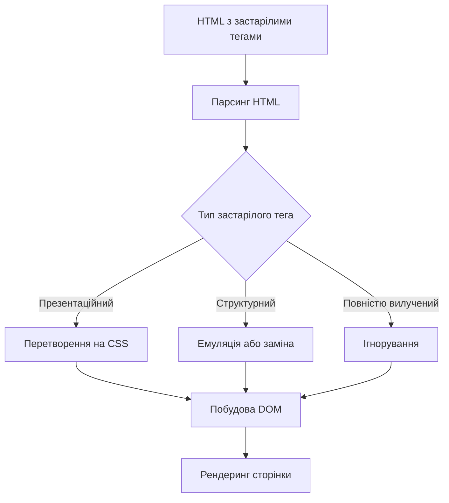
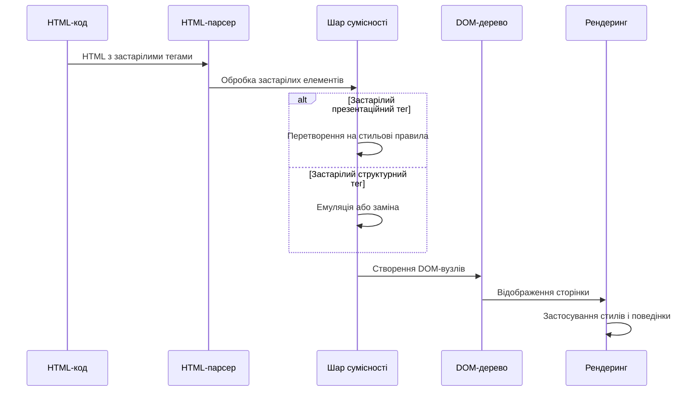
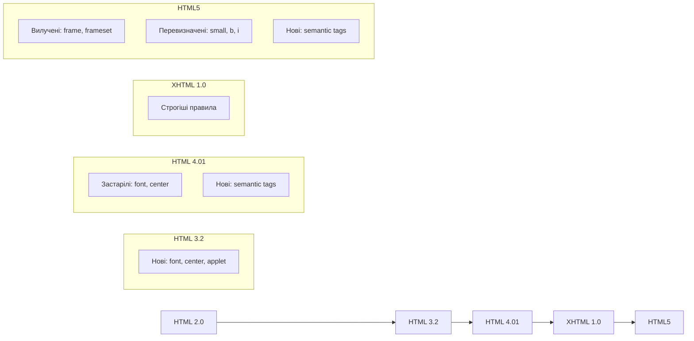
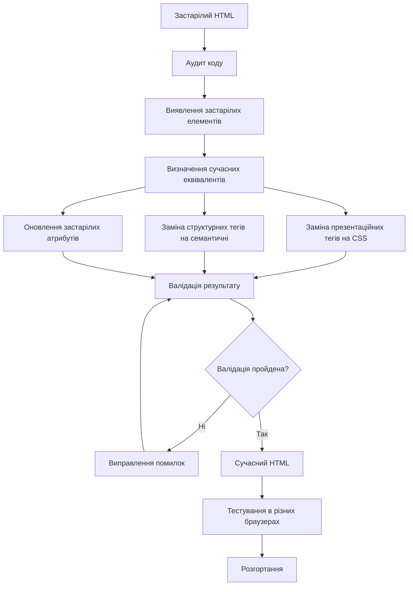

# HTML

## HTML: Застарілі та рідкісні теги

Застарілі (deprecated) та рідкісні теги — це елементи HTML, які або були визнані застарілими і більше не рекомендуються до використання, або є маловідомими і рідко використовуються в сучасній веб-розробці. Розуміння цих тегів важливе для підтримки старого коду, забезпечення зворотної сумісності та іноді для спеціалізованих завдань.

### Для чого потрібно знати

-   **Підтримка старого коду**: розуміння та обслуговування застарілих веб-сайтів
-   **Міграція**: переведення старого HTML-коду на сучасні стандарти
-   **Сумісність**: забезпечення коректного відображення в різних браузерах
-   **Історичний контекст**: розуміння еволюції веб-стандартів
-   **Спеціалізовані випадки**: деякі рідкісні теги можуть бути корисними в специфічних ситуаціях

### Застарілі (deprecated) теги HTML

#### Презентаційні теги

Ці теги використовувалися для стилізації вмісту і були замінені CSS:

| Тег               | Опис                                            | Сучасна альтернатива                             |
| ----------------- | ----------------------------------------------- | ------------------------------------------------ |
| `<font>`          | Визначає шрифт, розмір і колір тексту           | CSS: `font-family`, `font-size`, `color`         |
| `<center>`        | Центрує текст горизонтально                     | CSS: `text-align: center`                        |
| `<strike>`, `<s>` | Закреслений текст                               | CSS: `text-decoration: line-through` або `<del>` |
| `<u>`             | Підкреслений текст                              | CSS: `text-decoration: underline`                |
| `<big>`           | Збільшений текст                                | CSS: `font-size`                                 |
| `<small>`         | Зменшений текст (тепер має семантичне значення) | CSS: `font-size`                                 |
| `<tt>`            | Моноширинний текст                              | CSS: `font-family: monospace`                    |
| `<b>`             | Жирний текст (тепер має семантичне значення)    | CSS: `font-weight: bold` або `<strong>`          |
| `<i>`             | Курсивний текст (тепер має семантичне значення) | CSS: `font-style: italic` або `<em>`             |

```html
<!-- Застарілий спосіб стилізації -->
<font face="Arial" size="5" color="red">Червоний текст</font>
<center>Центрований текст</center>
<strike>Закреслений текст</strike>

<!-- Сучасний спосіб з CSS -->
<p style="font-family: Arial; font-size: 1.5em; color: red;">Червоний текст</p>
<p style="text-align: center;">Центрований текст</p>
<p style="text-decoration: line-through;">Закреслений текст</p>
```

#### Структурні застарілі теги

Ці теги використовувалися для структурування контенту:

| Тег                     | Опис                                          | Сучасна альтернатива                 |
| ----------------------- | --------------------------------------------- | ------------------------------------ |
| `<frameset>`, `<frame>` | Розділяє вікно браузера на кілька фреймів     | `<iframe>`, CSS Grid або Flexbox     |
| `<noframes>`            | Контент для браузерів без підтримки фреймів   | Не потрібен                          |
| `<applet>`              | Вбудовує Java-аплет                           | `<object>`, `<embed>` або JavaScript |
| `<dir>`                 | Створює список директорій                     | `<ul>`                               |
| `<basefont>`            | Встановлює базовий шрифт для всього документа | CSS                                  |
| `<isindex>`             | Створює поле пошуку                           | `<form>` з `<input>`                 |
| `<menu>`                | Створює меню (перевизначено в HTML5)          | `<ul>` або HTML5 `<menu>`            |
| `<xmp>`                 | Відображає попередньо форматований текст      | `<pre>`                              |
| `<listing>`             | Відображає вихідний код                       | `<pre>`, `<code>`                    |

```html
<!-- Застарілий спосіб створення фреймів -->
<frameset cols="25%,75%">
  <frame src="menu.html" name="menu">
  <frame src="content.html" name="content">
  <noframes>
    Ваш браузер не підтримує фрейми.
  </noframes>
</frameset>

<!-- Сучасний спосіб з iframe -->
<div style="display: flex;">
  <div style="width: 25%;">
    <iframe src="menu.html" name="menu" style="width: 100%; height: 100%;"></iframe>
  </div>
  <div style="width: 75%;">
    <iframe src="content.html" name="content" style="width: 100%; height: 100%;"></iframe>
  </div>
</div>
```

#### Атрибути, що стали застарілими

| Елемент        | Застарілий атрибут                                | Сучасна альтернатива  |
| -------------- | ------------------------------------------------- | --------------------- |
| `<a>`          | `name`                                            | `id`                  |
| ``        | `align`, `border`, `hspace`, `vspace`             | CSS                   |
| `<table>`      | `bgcolor`, `border`, `cellspacing`, `cellpadding` | CSS                   |
| `<td>`, `<th>` | `bgcolor`, `width`, `height`                      | CSS                   |
| `<ul>`, `<ol>` | `type`                                            | CSS `list-style-type` |
| `<body>`       | `bgcolor`, `text`, `alink`, `vlink`, `link`       | CSS                   |
| `<input>`      | `align`                                           | CSS                   |
| `<hr>`         | `width`, `size`, `noshade`                        | CSS                   |

```html
<!-- Застарілі атрибути -->
<table border="1" cellspacing="5" cellpadding="10" bgcolor="#f0f0f0">
    <tr>
        <td width="200" height="100" bgcolor="#ff0000">Комірка</td>
    </tr>
</table>

<!-- Сучасний підхід з CSS -->
<table
    style="border: 1px solid black; border-spacing: 5px; background-color: #f0f0f0;"
>
    <tr>
        <td
            style="padding: 10px; width: 200px; height: 100px; background-color: #ff0000;"
        >
            Комірка
        </td>
    </tr>
</table>
```

### Рідкісні, але підтримувані теги

#### Теги для спеціалізованих потреб

| Тег                      | Опис                                     | Приклад використання                                        |
| ------------------------ | ---------------------------------------- | ----------------------------------------------------------- |
| `<ruby>`, `<rt>`, `<rp>` | Анотації для східноазійської типографіки | Фонетичні керівництва для китайських або японських символів |
| `<bdi>`, `<bdo>`         | Керування напрямком тексту               | Для змішаного тексту з LTR і RTL мовами                     |
| `<dialog>`               | Діалогове вікно або модальне вікно       | Альтернатива JavaScript-модалкам                            |
| `<details>`, `<summary>` | Інтерактивний блок розкриття деталей     | FAQ, розгортання секцій                                     |
| `<mark>`                 | Виділений текст                          | Результати пошуку, виділення частини тексту                 |
| `<meter>`                | Представлення скалярного вимірювання     | Прогрес, рейтинги, показники                                |
| `<progress>`             | Індикатор прогресу                       | Завантаження, завершення завдання                           |
| `<time>`                 | Дата/час                                 | Семантичне представлення часу                               |
| `<wbr>`                  | Можлива точка перенесення                | Довгі слова, URL-адреси                                     |
| `<output>`               | Результат обчислення                     | Калькулятори, результати форм                               |
| `<keygen>`               | Генерація пари ключів (застаріло)        | Аутентифікація                                              |

```html
<!-- Приклад використання ruby для японського тексту -->
<ruby> 漢 <rt>かん</rt> 字 <rt>じ</rt> </ruby>

<!-- Приклад використання bdi для змішаного тексту -->
<p>Перший користувач: <bdi>إيان</bdi> отримав 90 балів</p>

<!-- Приклад використання dialog -->
<dialog id="myDialog">
    <h2>Діалогове вікно</h2>
    <p>Це приклад діалогового вікна.</p>
    <button onclick="document.getElementById('myDialog').close()">
        Закрити
    </button>
</dialog>
<button onclick="document.getElementById('myDialog').showModal()">
    Відкрити діалог
</button>

<!-- Приклад використання details і summary -->
<details>
    <summary>Розгорнути деталі</summary>
    <p>Додаткова інформація, яка розкривається при кліку.</p>
</details>

<!-- Приклад використання meter -->
<meter value="0.7" min="0" max="1">70%</meter>
```

#### Рідкісні теги зі спеціалізованими функціями

| Тег               | Опис                                              | Приклад використання                    |
| ----------------- | ------------------------------------------------- | --------------------------------------- |
| `<q>`             | Коротка вбудована цитата                          | Цитата в межах параграфа                |
| `<ins>`, `<del>`  | Доданий та видалений текст                        | Відстеження змін                        |
| `<dfn>`           | Визначення терміну                                | Глосарії, словники                      |
| `<abbr>`          | Абревіатура або акронім                           | Підказка повного значення при наведенні |
| `<cite>`          | Посилання на джерело                              | Цитування робіт                         |
| `<samp>`          | Зразок виводу програми                            | Документація, приклади коду             |
| `<kbd>`           | Користувацький ввід з клавіатури                  | Інструкції для гарячих клавіш           |
| `<var>`           | Змінна в математичному або програмному виразі     | Формули, код                            |
| `<sub>`, `<sup>`  | Нижній та верхній індекси                         | Формули, примітки                       |
| `<map>`, `<area>` | Карта зображення                                  | Інтерактивні зображення                 |
| `<noscript>`      | Альтернативний вміст для браузерів без JavaScript | Запасний вміст                          |

```html
<!-- Приклад використання q -->
<p>
    Як сказав <q cite="https://example.com/source">відомий автор</q>, кожен має
    свою історію.
</p>

<!-- Приклад використання ins і del -->
<p>Зустріч відбудеться в <del>понеділок</del> <ins>вівторок</ins> о 15:00.</p>

<!-- Приклад використання dfn і abbr -->
<p><dfn>HTML</dfn> - це стандартна мова розмітки для створення веб-сторінок.</p>
<p>
    Організація <abbr title="World Wide Web Consortium">W3C</abbr> розробляє
    веб-стандарти.
</p>

<!-- Приклад використання kbd і samp -->
<p>Натисніть <kbd>Ctrl</kbd> + <kbd>C</kbd>, щоб скопіювати текст.</p>
<p>Результат програми: <samp>Hello, World!</samp></p>

<!-- Приклад використання map і area -->

<map name="planetmap">
    <area shape="rect" coords="0,0,82,126" href="sun.html" alt="Сонце" />
    <area shape="circle" coords="90,58,30" href="earth.html" alt="Земля" />
</map>
```

### Особливості застарілих тегів

#### Проблеми з використанням застарілих тегів

1. **Сумісність**: застарілі теги можуть некоректно відображатися в сучасних браузерах
2. **Відповідність стандартам**: документи з застарілими тегами не пройдуть валідацію W3C
3. **Доступність**: старі теги часто не мають належної підтримки для людей з обмеженими можливостями
4. **SEO**: використання застарілих тегів може негативно вплинути на індексацію та ранжування сторінки
5. **Обслуговування**: ускладнює підтримку та оновлення коду

```
┌───────────────────────────────────────────────────────────────┐
│ Наслідки використання застарілих тегів                        │
├───────────────────┬───────────────────────────────────────────┤
│ Аспект            │ Потенційні проблеми                       │
├───────────────────┼───────────────────────────────────────────┤
│ Відображення      │ • Непередбачувана поведінка               │
│                   │ • Різний вигляд у різних браузерах        │
│                   │ • Можливі помилки рендерингу              │
├───────────────────┼───────────────────────────────────────────┤
│ Продуктивність    │ • Неоптимальний рендеринг                 │
│                   │ • Збільшення розміру сторінки             │
│                   │ • Зниження швидкості завантаження         │
├───────────────────┼───────────────────────────────────────────┤
│ Відповідність     │ • Недійсний HTML                          │
│ стандартам        │ • Непроходження валідації                 │
│                   │ • Порушення принципів сучасного HTML      │
├───────────────────┼───────────────────────────────────────────┤
│ Майбутня          │ • Можливе вилучення підтримки             │
│ сумісність        │ • Проблеми з новими браузерами            │
│                   │ • Складність міграції на новіші стандарти │
└───────────────────┴───────────────────────────────────────────┘
```

#### Як браузери обробляють застарілі теги

Сучасні браузери продовжують підтримувати більшість застарілих тегів для забезпечення зворотної сумісності:

1. **Перетворення на стилі**: багато застарілих тегів автоматично перетворюються на відповідні стилі CSS
2. **Ігнорування**: деякі застарілі атрибути можуть бути проігноровані
3. **Емуляція**: браузери можуть емулювати поведінку старих елементів
4. **Спеціальна обробка**: для деяких старих елементів може бути реалізована спеціальна логіка



### Практичні аспекти

#### Міграція застарілого коду на сучасні стандарти

1. **Аудит коду**: виявлення всіх застарілих елементів і атрибутів
2. **Заміна презентаційних тегів на CSS**:

```html
<!-- До міграції -->
<font color="blue" size="5">Заголовок</font>
<center>Центрований текст</center>
<table border="1" cellpadding="5" width="100%">
    <tr bgcolor="#f0f0f0">
        <td width="50%">Комірка 1</td>
        <td width="50%">Комірка 2</td>
    </tr>
</table>

<!-- Після міграції -->
<h2 style="color: blue; font-size: 1.5em;">Заголовок</h2>
<p style="text-align: center;">Центрований текст</p>
<table style="width: 100%; border-collapse: collapse;">
    <tr style="background-color: #f0f0f0;">
        <td style="width: 50%; border: 1px solid black; padding: 5px;">
            Комірка 1
        </td>
        <td style="width: 50%; border: 1px solid black; padding: 5px;">
            Комірка 2
        </td>
    </tr>
</table>
```

3. **Заміна структурних тегів на семантичні**:

```html
<!-- До міграції -->
<frameset cols="20%,80%">
  <frame src="menu.html" name="menu">
  <frame src="content.html" name="content">
</frameset>

<!-- Після міграції -->
<div class="container" style="display: flex;">
  <nav style="width: 20%;">
    <iframe src="menu.html" name="menu" style="width: 100%; height: 100%; border: none;"></iframe>
  </nav>
  <main style="width: 80%;">
    <iframe src="content.html" name="content" style="width: 100%; height: 100%; border: none;"></iframe>
  </main>
</div>
```

4. **Оновлення застарілих атрибутів**:

```html
<!-- До міграції -->
<a name="section1">Секція 1</a>


<!-- Після міграції -->
<a id="section1">Секція 1</a>

```

#### Інструменти для виявлення та виправлення застарілих тегів

1. **Валідатори HTML**:

    - [W3C Markup Validation Service](https://validator.w3.org/)
    - [HTML5 Validator](https://html5.validator.nu/)

2. **Аналізатори коду**:

    - ESLint з плагінами для HTML
    - HTML Tidy
    - SonarQube

3. **Автоматична міграція**:

    - HTML Minifier з опціями видалення застарілих атрибутів
    - Спеціалізовані скрипти та інструменти для міграції

4. **Браузерні інструменти розробника**:
    - Chrome DevTools
    - Firefox Developer Tools

### Випадки, коли застарілі теги все ще використовуються

#### Підтримка старих браузерів

У деяких випадках застарілі теги можуть бути необхідними для підтримки дуже старих браузерів:

```html
<!-- Підтримка старих і нових браузерів -->
<b>Жирний текст для всіх браузерів</b>
<strong>Семантично важливий текст для сучасних браузерів</strong>

<!-- Альтернативний контент для браузерів без підтримки JavaScript -->
<script>
    document.write('<div class="modern-content">Сучасний контент</div>');
</script>
<noscript>
    <div class="old-content">
        Альтернативний контент для браузерів без JavaScript
    </div>
</noscript>
```

#### Спеціалізовані платформи та додатки

Деякі платформи та середовища можуть вимагати використання специфічних застарілих тегів:

1. **Редактори WYSIWYG**: можуть генерувати застарілий HTML
2. **Email-розсилки**: обмежена підтримка сучасного HTML та CSS
3. **Вбудовані браузери**: в деяких пристроях або додатках можуть бути присутні обмеження

```html
<!-- Приклад HTML для email-розсилки -->
<table width="100%" cellpadding="0" cellspacing="0" border="0">
    <tr>
        <td align="center" bgcolor="#f0f0f0">
            <font face="Arial, sans-serif" size="3" color="#333333">
                Ласкаво просимо до нашої розсилки!
            </font>
        </td>
    </tr>
</table>
```

### Рідкісні теги, які можуть бути корисними

#### Корисні, але маловідомі HTML5 теги

| Тег          | Опис                           | Приклад використання                        |
| ------------ | ------------------------------ | ------------------------------------------- |
| `<picture>`  | Адаптивні зображення           | Різні зображення для різних розмірів екрану |
| `<datalist>` | Список опцій для input         | Автозаповнення з варіантами                 |
| `<details>`  | Розкривний контент             | FAQ, спойлери                               |
| `<template>` | Шаблон для клонування через JS | Динамічне створення елементів               |
| `<slot>`     | Заповнювач у веб-компонентах   | Композиція компонентів                      |
| `<portal>`   | Попередній перегляд сторінки   | Безшовна навігація між сторінками           |
| `<dialog>`   | Нативні діалогові вікна        | Заміна модальних вікон на JavaScript        |
| `<output>`   | Результат обчислення           | Динамічні форми з розрахунками              |

```html
<!-- Приклад використання picture для адаптивних зображень -->
<picture>
    <source media="(min-width: 1200px)" srcset="large.jpg" />
    <source media="(min-width: 600px)" srcset="medium.jpg" />
    
</picture>

<!-- Приклад використання datalist для автозаповнення -->
<input list="browsers" name="browser" placeholder="Виберіть браузер" />
<datalist id="browsers">
    <option value="Chrome"></option>
    <option value="Firefox"></option>
    <option value="Safari"></option>
    <option value="Edge"></option>
</datalist>

<!-- Приклад використання template для клонування -->
<template id="product-template">
    <div class="product">
        <h3 class="product-name"></h3>
        <p class="product-price"></p>
        <button class="buy-button">Купити</button>
    </div>
</template>

<script>
    // Клонування та заповнення шаблону
    function createProduct(name, price) {
        const template = document.getElementById("product-template");
        const clone = template.content.cloneNode(true);

        clone.querySelector(".product-name").textContent = name;
        clone.querySelector(".product-price").textContent = `${price} грн`;

        document.body.appendChild(clone);
    }

    createProduct("Смартфон", 8999);
    createProduct("Ноутбук", 25999);
</script>
```

#### Використання рідкісних тегів для поліпшення семантики

```html
<!-- Приклад семантичної сторінки з рідкісними тегами -->
<!DOCTYPE html>
<html lang="uk">
    <head>
        <meta charset="UTF-8" />
        <title>Рідкісні семантичні теги</title>
    </head>
    <body>
        <header>
            <h1>Наукова стаття</h1>
            <p>Автор: <cite>Іван Петренко</cite></p>
            <time datetime="2023-06-15">15 червня 2023</time>
        </header>

        <main>
            <section>
                <h2>Вступ</h2>
                <p>
                    У цій статті ми розглянемо формулу
                    <var>E</var> = <var>m</var><var>c</var><sup>2</sup>,
                    запропоновану <cite>Альбертом Ейнштейном</cite>.
                </p>

                <p>
                    Коли ми говоримо про <dfn>квантову механіку</dfn>, ми маємо
                    на увазі розділ фізики, що вивчає поведінку матерії на
                    атомному та субатомному рівнях.
                </p>
            </section>

            <section>
                <h2>Методологія</h2>
                <p>
                    Для запуску експерименту виконайте команду:
                    <kbd>python experiment.py --param=value</kbd>
                </p>

                <p>
                    Результат виконання команди:
                    <samp>
                        Loading data... Done. Processing... Done. Results saved
                        to: results.csv
                    </samp>
                </p>
            </section>

            <section>
                <h2>Результати</h2>
                <p>
                    Вимірювання показало рівень заряду
                    <meter value="0.8" min="0" max="1" optimum="0.9">80%</meter>
                </p>

                <p>
                    Експеримент завершено на
                    <progress value="75" max="100">75%</progress>
                </p>

                <details>
                    <summary>
                        Додаткові результати (клікніть, щоб розгорнути)
                    </summary>
                    <p>Тут знаходяться додаткові дані експерименту...</p>
                    <table>
                        <!-- Таблиця з даними -->
                    </table>
                </details>
            </section>

            <section>
                <h2>Висновки</h2>
                <p>
                    Текст <mark>із важливими виділеннями</mark> для акцентування
                    уваги.
                </p>

                <p>
                    Різниця між початковими <del>помилковими</del> та
                    <ins>правильними</ins> вимірюваннями.
                </p>

                <p>
                    Текст містить абревіатуру
                    <abbr title="Artificial Intelligence">AI</abbr>, яка
                    розшифровується при наведенні.
                </p>
            </section>
        </main>

        <footer>
            <p>© 2023 Наукова установа</p>
            <p>
                Для зворотного зв'язку:
                <output form="feedback-form" name="result">
                    Форма не відправлена
                </output>
            </p>
        </footer>
    </body>
</html>
```

### Підкапотні механізми

#### Як браузери обробляють застарілі та рідкісні теги

1. **Механізми сумісності**:

    - Всі основні браузери мають спеціальні механізми для обробки застарілих тегів
    - Внутрішня трансформація застарілих тегів у сучасні еквіваленти

2. **Поведінка рендерингу**:

    - Застарілі презентаційні теги перетворюються на відповідні стилі
    - Структурні теги можуть бути трансформовані в семантичні аналоги

3. **Обробка помилок**:
    - Толерантність до помилок у застарілому HTML
    - Автоматичне виправлення неправильно вкладених тегів



#### Поступове вилучення застарілих тегів

Браузери поступово змінюють поведінку застарілих тегів:

1. **Етапи вилучення**:

    - Маркування як застарілого в специфікації
    - Попередження у інструментах розробника
    - Зміна поведінки для сумісності з новими стандартами
    - Повне вилучення в майбутніх версіях

2. **Поточний стан**:
    - Більшість застарілих тегів HTML 4 все ще підтримуються
    - Нові теги вводяться з кращою семантикою
    - Деякі застарілі теги були перевизначені в HTML5 з новою семантикою

```
┌───────────────────────────────────────────────────────────────┐
│ Еволюція підтримки застарілих тегів                           │
│                                                               │
│ ─────────▶ Час ─────────────────────────────────────────────▶ │
│                                                               │
│ ┌──────┐    ┌──────────┐   ┌───────────────┐   ┌──────────┐   │
│ │ HTML │    │  HTML 4  │   │    HTML5      │   │ Майбутнє │   │
│ │ 3.2  │───▶│          │──▶│               │──▶│          │   │
│ └──────┘    └──────────┘   └───────────────┘   └──────────┘   │
│                                                               │
│ - <font>   ─ Активно ───▶ Застаріло ───▶ Підтримується ──▶ ?  │
│ - <center> ─ Активно ───▶ Застаріло ───▶ Підтримується ──▶ ?  │
│ - <b>      ─ Активно ───▶ Застаріло ───▶ Перевизначено ──▶ ✓  │
│ - <i>      ─ Активно ───▶ Застаріло ───▶ Перевизначено ──▶ ✓  │
│ - <frame>  ─ Активно ───▶ Застаріло ───▶ Вилучено ───────▶ ✗  │
│ - <strike> ─ Активно ───▶ Застаріло ───▶ Підтримується ──▶ ?  │
└───────────────────────────────────────────────────────────────┘
```

### Схеми та діаграми

#### Еволюція HTML-тегів



#### Порівняння застарілого та сучасного HTML

```
┌─────────────────────────────────────────────────────────────────┐
│                                                                 │
│                   Еволюція HTML-сторінки                        │
│                                                                 │
│  ┌────────────────────────┐     ┌─────────────────────────────┐ │
│  │ Застарілий HTML        │     │ Сучасний HTML5              │ │
│  │                        │     │                             │ │
│  │ <html>                 │     │ <!DOCTYPE html>             │ │
│  │ <head>                 │     │ <html lang="uk">            │ │
│  │   <title>Сторінка</title> │     │ <head>                     │ │
│  │ </head>                │     │   <meta charset="UTF-8">    │ │
│  │ <body bgcolor="#ffffff"> │     │   <title>Сторінка</title>   │ │
│  │   <font size="5"       │     │   <link rel="stylesheet"    │ │
│  │     color="blue">      │     │     href="styles.css">      │ │
│  │     Заголовок          │     │ </head>                     │ │
│  │   </font>              │     │ <body>                      │ │
│  │   <center>             │     │   <header>                  │ │
│  │     <table width="80%" │     │     <h1>Заголовок</h1>      │ │
│  │       border="1">      │     │   </header>                 │ │
│  │       <tr>             │     │   <main>                    │ │
│  │         <td>Комірка</td> │     │     <table>                 │ │
│  │       </tr>            │     │       <tr>                  │ │
│  │     </table>           │     │         <td>Комірка</td>    │ │
│  │   </center>            │     │       </tr>                 │ │
│  │   <br>                 │     │     </table>                │ │
│  │   <b>Жирний текст</b>  │     │     <p><strong>Важливий     │ │
│  │   <i>Курсив</i>        │     │       текст</strong></p>    │ │
│  │   <hr width="50%">     │     │     <p><em>Виділений        │ │
│  │ </body>                │     │       текст</em></p>        │ │
│  │ </html>                │     │   </main>                   │ │
│  │                        │     │   <footer>                  │ │
│  │                        │     │     <hr>                    │ │
│  │                        │     │     <p>© 2023</p>           │ │
│  │                        │     │   </footer>                 │ │
│  │                        │     │ </body>                     │ │
│  │                        │     │ </html>                     │ │
│  └────────────────────────┘     └─────────────────────────────┘ │
│                                                                 │
└─────────────────────────────────────────────────────────────────┘
```

#### Процес міграції з застарілого HTML



> **Важливо**: Хоча застарілі теги все ще підтримуються більшістю браузерів для забезпечення зворотної сумісності, їх використання у нових проектах не рекомендується. Замість них слід використовувати сучасні семантичні елементи HTML5 і CSS для стилізації. При роботі зі старим кодом рекомендується поступова міграція на сучасні стандарти, особливо якщо сайт потребує підтримки в довгостроковій перспективі. Використання рідкісних, але стандартних тегів може покращити семантику документа і забезпечити кращу доступність для всіх користувачів.
