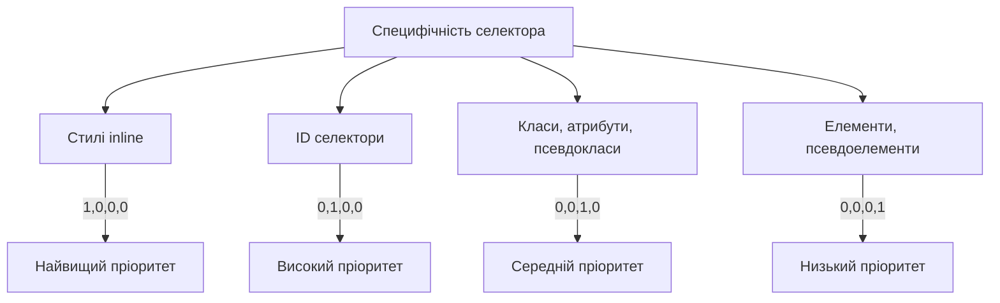
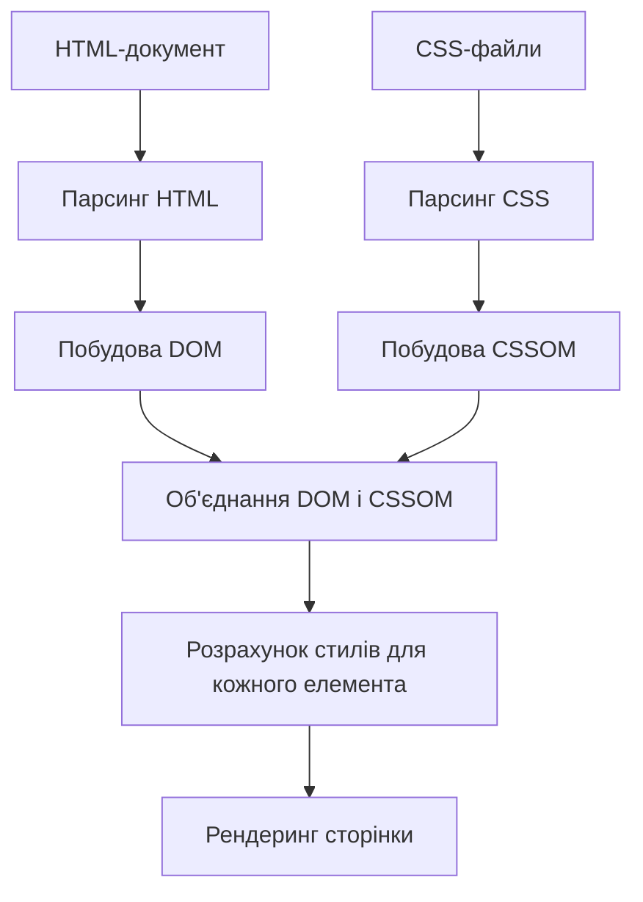
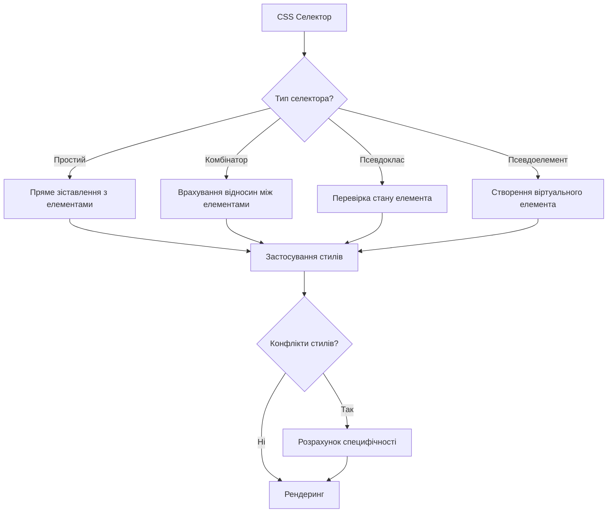

# CSS

## CSS: Селектори

Селектори — це шаблони, які використовуються для вибору HTML-елементів, до яких будуть застосовані стилі CSS. Вони є основою CSS і дозволяють точно націлювати елементи на сторінці, не змінюючи структуру HTML.

### Для чого використовуються селектори

-   **Цільове стилізування**: Дозволяють застосовувати стилі лише до вибраних елементів
-   **Структурування CSS**: Допомагають організувати стилі у логічні блоки
-   **Специфічність**: Дозволяють керувати пріоритетністю стилів
-   **Дизайн-системи**: Сприяють побудові масштабованих та узгоджених дизайн-систем

### Типи селекторів

#### Прості селектори

| Тип селектора   | Синтаксис                         | Опис                                  | Приклад                                     |
| --------------- | --------------------------------- | ------------------------------------- | ------------------------------------------- |
| Універсальний   | `*`                               | Вибирає всі елементи                  | `* { margin: 0; }`                          |
| Тегу (елемента) | `елемент`                         | Вибирає всі елементи вказаного типу   | `p { color: blue; }`                        |
| Класу           | `.клас`                           | Вибирає елементи з вказаним класом    | `.highlight { background: yellow; }`        |
| Ідентифікатора  | `#id`                             | Вибирає елемент з вказаним id         | `#header { height: 80px; }`                 |
| Атрибута        | `[атрибут]`, `[атрибут=значення]` | Вибирає елементи з вказаним атрибутом | `[type="text"] { border: 1px solid gray; }` |

#### Комбінатори

| Комбінатор      | Синтаксис | Опис                                       | Приклад                           |
| --------------- | --------- | ------------------------------------------ | --------------------------------- |
| Нащадка         | `A B`     | Вибирає елементи B, які є нащадками A      | `div p { line-height: 1.5; }`     |
| Дочірній        | `A > B`   | Вибирає елементи B, які є прямими дітьми A | `ul > li { list-style: square; }` |
| Сусідній        | `A + B`   | Вибирає елемент B, який іде одразу після A | `h2 + p { font-weight: bold; }`   |
| Наступні сусіди | `A ~ B`   | Вибирає всі елементи B, які йдуть після A  | `h2 ~ p { margin-left: 20px; }`   |

#### Псевдокласи

| Псевдоклас        | Опис                              | Приклад                                                  |
| ----------------- | --------------------------------- | -------------------------------------------------------- |
| `:hover`          | При наведенні курсора             | `a:hover { color: red; }`                                |
| `:active`         | При активації (натисканні)        | `button:active { transform: scale(0.98); }`              |
| `:focus`          | При фокусі                        | `input:focus { border-color: blue; }`                    |
| `:visited`        | Відвідане посилання               | `a:visited { color: purple; }`                           |
| `:first-child`    | Перший дочірній елемент           | `li:first-child { font-weight: bold; }`                  |
| `:last-child`     | Останній дочірній елемент         | `li:last-child { border-bottom: none; }`                 |
| `:nth-child(n)`   | N-ий дочірній елемент             | `tr:nth-child(odd) { background: #f5f5f5; }`             |
| `:nth-of-type(n)` | N-ий елемент свого типу           | `p:nth-of-type(2) { font-style: italic; }`               |
| `:not(селектор)`  | Заперечення                       | `input:not([type="submit"]) { border: 1px solid #ccc; }` |
| `:checked`        | Відмічений елемент                | `input:checked + label { font-weight: bold; }`           |
| `:disabled`       | Деактивований елемент             | `button:disabled { opacity: 0.5; }`                      |
| `:empty`          | Порожній елемент                  | `div:empty { display: none; }`                           |
| `:valid`          | Валідний елемент форми            | `input:valid { border-color: green; }`                   |
| `:invalid`        | Невалідний елемент форми          | `input:invalid { border-color: red; }`                   |
| `:target`         | Цільовий елемент URL-фрагмента    | `section:target { background: lightyellow; }`            |
| `:root`           | Кореневий елемент (зазвичай html) | `:root { --main-color: blue; }`                          |

#### Псевдоелементи

| Псевдоелемент    | Опис                                | Приклад                                             |
| ---------------- | ----------------------------------- | --------------------------------------------------- |
| `::before`       | Створює псевдоелемент перед вмістом | `p::before { content: "►"; color: red; }`           |
| `::after`        | Створює псевдоелемент після вмісту  | `p::after { content: "◄"; color: blue; }`           |
| `::first-letter` | Перша літера тексту                 | `p::first-letter { font-size: 150%; }`              |
| `::first-line`   | Перший рядок тексту                 | `p::first-line { font-weight: bold; }`              |
| `::selection`    | Виділений користувачем текст        | `::selection { background: yellow; color: black; }` |
| `::placeholder`  | Плейсхолдер в полях вводу           | `input::placeholder { color: #999; }`               |
| `::marker`       | Маркер списку                       | `li::marker { color: red; }`                        |
| `::backdrop`     | Фон за діалоговими вікнами          | `dialog::backdrop { background: rgba(0,0,0,0.5); }` |

#### Складні селектори атрибутів

| Селектор         | Опис                                                   | Приклад                                                   |
| ---------------- | ------------------------------------------------------ | --------------------------------------------------------- |
| `[attr]`         | Елементи з атрибутом attr                              | `[title] { cursor: help; }`                               |
| `[attr=value]`   | Елементи з attr="value"                                | `[type="checkbox"] { width: 20px; }`                      |
| `[attr~=value]`  | Елементи з attr, що містить слово "value"              | `[class~="box"] { padding: 10px; }`                       |
| `[attr\|=value]` | Елементи з attr, що починається з "value" або "value-" | `[lang\|="en"] { font-family: Arial; }`                   |
| `[attr^=value]`  | Елементи з attr, що починається з "value"              | `[src^="https"] { border: 1px solid green; }`             |
| `[attr$=value]`  | Елементи з attr, що закінчується на "value"            | `[href$=".pdf"] { background-image: url(pdf-icon.png); }` |
| `[attr*=value]`  | Елементи з attr, що містить "value"                    | `[href*="example"] { color: purple; }`                    |
| `[attr i]`       | Нечутливе до регістру порівняння                       | `[title*="hello" i] { font-weight: bold; }`               |

### Приклади використання селекторів

```css
/* Базові селектори */
h1 {
    color: navy;
}
.important {
    font-weight: bold;
}
#main-header {
    background-color: lightblue;
}
[disabled] {
    opacity: 0.5;
}

/* Комбінування селекторів */
h1.title {
    font-family: "Georgia", serif;
}
input[type="text"] {
    border-radius: 4px;
}

/* Комбінатори */
article p {
    line-height: 1.6;
}
ul > li {
    list-style-type: square;
}
h2 + p {
    font-size: 1.2em;
}
h3 ~ p {
    margin-left: 15px;
}

/* Псевдокласи */
a:hover {
    text-decoration: underline;
}
button:active {
    transform: translateY(2px);
}
section:nth-child(even) {
    background-color: #f9f9f9;
}
p:not(.exclude) {
    text-indent: 1.5em;
}

/* Псевдоелементи */
.quote::before {
    content: open-quote;
}
.quote::after {
    content: close-quote;
}
article p::first-letter {
    font-size: 2em;
}

/* Складні селектори */
.nav-item:hover > .dropdown {
    display: block;
}
input:focus:invalid {
    border-color: red;
}
.card:hover::after {
    opacity: 1;
}
```

### Специфічність селекторів

Специфічність — це механізм, який визначає, які правила CSS застосовуються до елемента, коли декілька правил конфліктують.

#### Як розраховується специфічність



#### Приклади розрахунку специфічності

| Селектор           | Специфічність | Пояснення                           |
| ------------------ | ------------- | ----------------------------------- |
| `h1`               | 0,0,0,1       | Один тег                            |
| `.title`           | 0,0,1,0       | Один клас                           |
| `#header`          | 0,1,0,0       | Один ID                             |
| `style="..."`      | 1,0,0,0       | Inline стиль                        |
| `h1.title`         | 0,0,1,1       | Один тег + один клас                |
| `#nav .item p`     | 0,1,1,1       | Один ID + один клас + один тег      |
| `p::first-line`    | 0,0,0,2       | Один тег + один псевдоелемент       |
| `button:hover`     | 0,0,1,1       | Один тег + один псевдоклас          |
| `div p.text[lang]` | 0,0,1,2       | Два теги + один клас + один атрибут |

> **Примітка**: Якщо дві специфічності рівні, застосовується правило, яке визначене пізніше в коді.

### Підкапотні механізми

#### Як браузер обробляє селектори

1. **Парсинг CSS**: Браузер розбирає CSS-код і створює CSSOM (CSS Object Model).
2. **Зіставлення селекторів**: Браузер шукає відповідні елементи в DOM для кожного селектора.
3. **Обчислення специфічності**: При конфліктах правил визначається, яке правило має більший пріоритет.
4. **Застосування стилів**: Фінальні стилі застосовуються до елементів.



#### Оптимізація селекторів

1. **Зменшення глибини селекторів**:

    ```css
    /* Повільно */
    html body .content .article p {
        color: black;
    }

    /* Швидше */
    .article p {
        color: black;
    }
    ```

2. **Уникнення універсального селектора**:

    ```css
    /* Повільно */
    * {
        box-sizing: border-box;
    }

    /* Краще */
    html,
    body,
    div,
    ... {
        box-sizing: border-box;
    }
    ```

3. **Конкретність замість вкладеності**:

    ```css
    /* Повільно */
    .sidebar ul li a {
        color: blue;
    }

    /* Швидше */
    .sidebar-link {
        color: blue;
    }
    ```

#### Особливості та підводні камені

1. **Перевизначення стилів**:

    - Специфічніші селектори перевизначають менш специфічні.
    - `!important` перевизначає все, але краще уникати його використання.

2. **Селектори з псевдокласами можуть бути повільними**:

    - Особливо `:nth-child()` та `:not()`
    - Рекомендується обмежувати їх область дії.

3. **Обмеження псевдоелементів**:

    - До елемента можна застосувати максимум один `::before` і один `::after`.
    - Вони не створюють реальні DOM-елементи.

4. **Різна підтримка браузерами**:
    - Деякі селектори (наприклад, `:has()`) мають обмежену підтримку.
    - Перевіряйте сумісність через caniuse.com.

#### Як браузер оптимізує селектори

1. **Зворотне зіставлення**: Браузери починають відповідність селекторів з правого боку:

    ```css
    /* Браузер шукає всі <a>, а потім перевіряє, чи вони всередині .nav */
    .nav a {
        color: blue;
    }
    ```

2. **Кешування результатів**: Браузери кешують результати зіставлення для покращення продуктивності.

3. **Структурні оптимізації**: Сучасні браузери використовують спеціальні алгоритми для швидкого пошуку відповідних елементів.

### Схема роботи селекторів



### Сучасні тенденції використання селекторів

1. **Компонентний підхід**:

    - BEM (Block Element Modifier)
    - CSS Modules
    - CSS-in-JS

2. **Функціональні селектори**:

    - Вибір елементів за їх функцією, а не структурою
    - Використання класів замість селекторів нащадків

3. **Нові CSS-можливості**:
    - `:is()` та `:where()` для групування селекторів
    - `:has()` для вибору батьківських елементів
    - Container queries для адаптивного дизайну на рівні компонентів

> **Важливо**: Хороша практика — використовувати найменш специфічний селектор, який вирішує поставлену задачу, для збереження гнучкості та масштабованості.

### Практичні поради з використання селекторів

1. **Дотримуйтесь методології**: Такі методології як BEM, SMACSS або OOCSS допомагають організувати селектори.

2. **Зменшуйте специфічність**: Високоспецифічні селектори складно перевизначити.

3. **Не зловживайте ID-селекторами**: Вони мають занадто високу специфічність і обмежують повторне використання стилів.

4. **Надавайте перевагу класам**: Класи забезпечують хороший баланс між потужністю та гнучкістю.

5. **Обмежуйте глибину вкладеності**: Не більше 3-4 рівнів для продуктивності і читабельності.

6. **Коментуйте складні селектори**: Для полегшення підтримки і розуміння.

7. **Використовуйте інструменти аналізу**: Лінтери CSS можуть виявити проблеми з селекторами.
