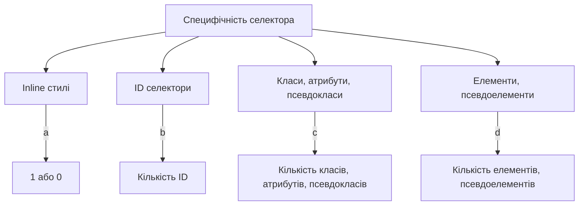
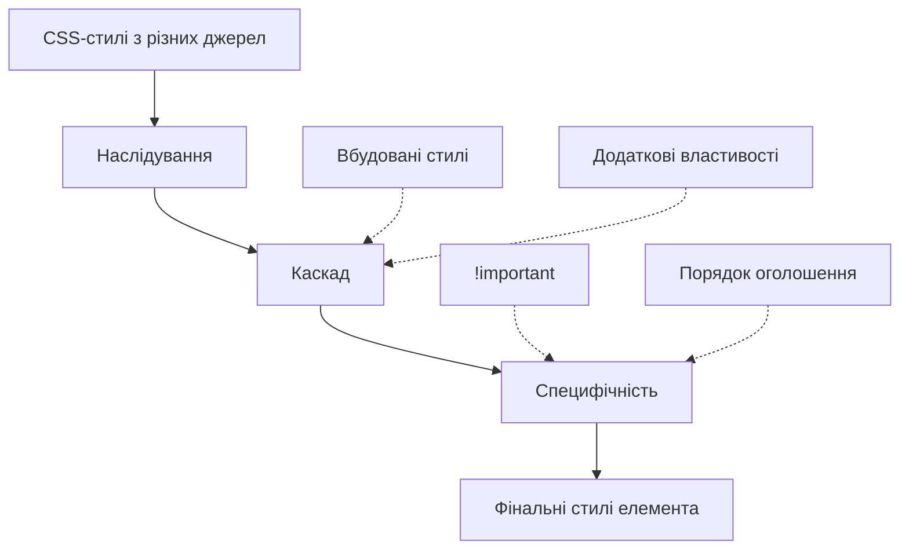
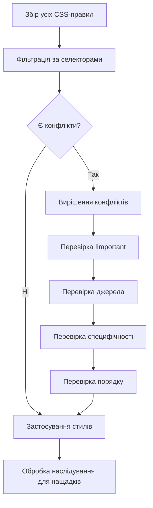

# CSS

## CSS: Каскад, специфічність, наслідування

Каскад, специфічність і наслідування — це три фундаментальні концепції, які визначають, як стилі застосовуються до елементів HTML. Ці механізми дозволяють CSS бути гнучким і передбачуваним, встановлюючи чіткі правила для вирішення конфліктів між стилями.

### Для чого існують ці механізми

-   **Керування стилями**: Визначають, які правила CSS мають пріоритет у разі конфлікту
-   **Структурування CSS**: Дозволяють організувати стилі ефективно і логічно
-   **Економія коду**: Через наслідування можна застосовувати стилі до елементів без прямого таргетування
-   **Передбачуваність**: Створюють систему правил, яка робить поведінку стилів передбачуваною

### Каскад в CSS

Каскад — це алгоритм, який визначає, які правила CSS застосовуються до елемента, коли декілька правил можуть впливати на нього. Назва "каскад" походить від "каскадних таблиць стилів" (Cascading Style Sheets).

#### Як працює каскад

Коли для елемента є кілька конфліктуючих правил CSS, браузер визначає, яке правило застосувати, використовуючи такий порядок пріоритету:

1. **Джерело походження стилів**
2. **Специфічність селекторів**
3. **Порядок оголошення**
4. **Важливість (використання `!important`)**

#### Джерела походження стилів (за зростанням пріоритету)

| Джерело                            | Опис                                         | Приклад                                                               |
| ---------------------------------- | -------------------------------------------- | --------------------------------------------------------------------- |
| Браузерні стилі                    | Стандартні стилі браузера                    | Типовий margin для `<body>`                                           |
| Користувацькі стилі                | Стилі, налаштовані користувачем              | Збільшений розмір шрифту в налаштуваннях браузера                     |
| Авторські стилі                    | Стилі, написані розробником                  | Ваші CSS-файли                                                        |
| Авторські стилі з `!important`     | Авторські стилі з оголошенням важливості     | `color: red !important;`                                              |
| Користувацькі стилі з `!important` | Користувацькі стилі з оголошенням важливості | Користувацькі стилі, які перевизначають навіть авторські `!important` |


#### Приклад дії каскаду

```html
<!-- HTML -->
<p class="text">Цей текст матиме стиль.</p>
```

```css
/* CSS */
/* Стиль 1 */
p {
    color: blue;
}

/* Стиль 2 */
.text {
    color: red;
}
```

У цьому випадку текст буде червоним, тому що:

1. Обидва стилі мають одне джерело (авторські стилі).
2. Селектор `.text` має вищу специфічність, ніж селектор `p`.

### Специфічність в CSS

Специфічність — це числове значення, яке визначає, наскільки конкретним є селектор. Якщо два селектори застосовуються до одного елемента, перемагає той, у якого вища специфічність.

#### Як розраховується специфічність

Специфічність можна представити як четвірку значень (a, b, c, d), де:

-   **a**: 1, якщо стиль вбудований (inline), інакше 0
-   **b**: кількість селекторів ID
-   **c**: кількість селекторів класів, атрибутів і псевдокласів
-   **d**: кількість селекторів елементів і псевдоелементів

Значення порівнюються зліва направо, як числа.



#### Таблиця специфічності селекторів

| Селектор           | Специфічність (a,b,c,d) | Десяткова | Пояснення                                |
| ------------------ | ----------------------- | --------- | ---------------------------------------- |
| `*`                | (0,0,0,0)               | 0         | Універсальний селектор                   |
| `li`               | (0,0,0,1)               | 1         | Один елемент                             |
| `li:first-child`   | (0,0,1,1)               | 11        | Один елемент, один псевдоклас            |
| `ul li`            | (0,0,0,2)               | 2         | Два елементи                             |
| `.class`           | (0,0,1,0)               | 10        | Один клас                                |
| `li.class`         | (0,0,1,1)               | 11        | Один елемент, один клас                  |
| `#id`              | (0,1,0,0)               | 100       | Один ID                                  |
| `style="..."`      | (1,0,0,0)               | 1000      | Inline стиль                             |
| `p::first-line`    | (0,0,0,2)               | 2         | Один елемент, один псевдоелемент         |
| `div p.class`      | (0,0,1,2)               | 12        | Два елементи, один клас                  |
| `#id .class p`     | (0,1,1,1)               | 111       | Один ID, один клас, один елемент         |
| `button.btn:hover` | (0,0,2,1)               | 21        | Один елемент, один клас, один псевдоклас |
| `div[title]`       | (0,0,1,1)               | 11        | Один елемент, один атрибут               |

#### Приклади розрахунку специфічності

```css
/* Специфічність: (0,0,0,1) = 1 */
p {
    color: black;
}

/* Специфічність: (0,0,1,0) = 10 */
.text {
    color: gray;
}

/* Специфічність: (0,1,0,0) = 100 */
#unique {
    color: purple;
}

/* Специфічність: (0,0,1,1) = 11 */
p.text {
    color: orange;
}

/* Специфічність: (0,1,1,1) = 111 */
#unique p.text {
    color: green;
}

/* Специфічність: (1,0,0,0) = 1000 */
<p style="color: blue;">Inline стиль</p>

/* Перевизначає будь-яку специфічність */
p {
    color: red !important;
}
```

### Наслідування в CSS

Наслідування — це механізм, за допомогою якого деякі CSS-властивості, застосовані до елемента, автоматично передаються його нащадкам.

#### Властивості, які наслідуються

Не всі CSS-властивості наслідуються. Зазвичай наслідуються властивості, пов'язані з текстом:

| Категорія            | Приклади властивостей                                                                                                            |
| -------------------- | -------------------------------------------------------------------------------------------------------------------------------- |
| Текстові властивості | `color`, `font-family`, `font-size`, `font-weight`, `line-height`, `text-align`, `text-indent`, `letter-spacing`, `word-spacing` |
| Таблиці              | `border-collapse`, `border-spacing`                                                                                              |
| Списки               | `list-style`, `list-style-type`, `list-style-position`                                                                           |
| Інші                 | `cursor`, `visibility`                                                                                                           |

#### Властивості, які НЕ наслідуються

| Категорія      | Приклади властивостей                                         |
| -------------- | ------------------------------------------------------------- |
| Блокова модель | `margin`, `padding`, `border`, `width`, `height`              |
| Позиціонування | `position`, `top`, `right`, `bottom`, `left`, `z-index`       |
| Фон            | `background`, `background-color`, `background-image`          |
| Інші           | `display`, `overflow`, `transform`, `animation`, `transition` |

#### Керування наслідуванням

CSS надає спеціальні значення для керування наслідуванням:

| Значення  | Опис                                                                                                          | Приклад            |
| --------- | ------------------------------------------------------------------------------------------------------------- | ------------------ |
| `inherit` | Примусово наслідує значення від батьківського елемента                                                        | `border: inherit;` |
| `initial` | Скидає властивість до значення за замовчуванням                                                               | `color: initial;`  |
| `unset`   | Комбінація `inherit` та `initial`: якщо властивість наслідується — працює як `inherit`, інакше — як `initial` | `margin: unset;`   |
| `revert`  | Повертає значення до стилю, який би був без авторських стилів                                                 | `all: revert;`     |

#### Приклад наслідування

```html
<div class="parent">
    Батьківський текст
    <p class="child">Дочірній текст</p>
</div>
```

```css
.parent {
    color: blue;
    border: 1px solid black;
    padding: 20px;
}

/* Дочірній елемент наслідує color автоматично,
   але не наслідує border і padding */
```

### Взаємодія каскаду, специфічності і наслідування

Ці три механізми працюють разом для визначення фінальних стилів елемента:

1. **Наслідування** передає деякі стилі від батьків до нащадків.
2. **Каскад** визначає, які правила застосовуються при наявності декількох джерел.
3. **Специфічність** визначає, які селектори мають пріоритет у разі конфлікту.



#### Приклад взаємодії

```html
<div id="container">
    <p class="text">Цей текст демонструє взаємодію CSS-механізмів.</p>
</div>
```

```css
/* Базові стилі */
body {
    color: black;
    font-family: Arial, sans-serif;
}

/* Стиль 1: Наслідується від body */
/* Специфічність: (0,0,0,1) */
p {
    font-size: 16px;
}

/* Стиль 2: Вища специфічність */
/* Специфічність: (0,0,1,1) */
p.text {
    color: blue;
}

/* Стиль 3: Ще вища специфічність */
/* Специфічність: (0,1,0,1) */
#container p {
    color: red;
}

/* Стиль 4: Нижча специфічність, але !important */
/* Специфічність: (0,0,1,0) + !important */
.text {
    color: green !important;
}
```

У цьому прикладі:

1. Тег `p` наслідує `font-family` від `body`.
2. Власний `font-size` визначається у селекторі `p`.
3. Для `color` застосовується `green`, бо хоч селектор `.text` має нижчу специфічність, ніж `#container p`, але використовує `!important`.

### Підкапотні механізми

#### Як браузер обробляє каскад і специфічність

1. **Збір усіх оголошень CSS**:

    - Браузер збирає всі правила CSS від різних джерел (браузерні, користувацькі, авторські).

2. **Сортування за джерелом**:

    - Правила сортуються за джерелом і важливістю (`!important`).

3. **Сортування за специфічністю**:

    - Для конфліктуючих правил з однаковим джерелом застосовується порівняння специфічності.

4. **Сортування за порядком**:

    - Якщо специфічність рівна, виграє правило, яке оголошене пізніше.

5. **Застосування наслідування**:
    - Деякі властивості передаються нащадкам, якщо для них не визначені явні значення.



#### Оптимізація в браузері

1. **Кешування специфічності**:

    - Браузери кешують розраховану специфічність для селекторів.

2. **Швидкі шляхи**:

    - Для поширених випадків (наприклад, один ID або клас) браузери використовують оптимізовані алгоритми.

3. **Інкрементальне оновлення**:
    - При зміні DOM або стилів браузери перераховують тільки те, що змінилося.

#### Особливості та підводні камені

1. **Конфлікти `!important`**:

    - Використання `!important` може створити складні для відлагодження каскади.
    - Коли багато правил використовують `!important`, повертаємося до перевірки специфічності.

2. **Перевизначення наслідуваних стилів**:

    - Навіть низькоспецифічний селектор перевизначає наслідуваний стиль.

    ```css
    /* Навіть при наявності */
    body {
        color: black !important;
    }

    /* Цей селектор все одно перевизначить колір */
    p {
        color: blue;
    }
    ```

3. **Специфічність селекторів із псевдоелементами**:

    - Псевдоелементи (наприклад, `::before`) враховуються як звичайні елементи для специфічності.

4. **Складність відлагодження**:
    - У великих проектах каскад може стати заплутаним і складним для відлагодження.
    - Інструменти розробника в браузерах показують, які стилі застосовуються і які перевизначаються.

### Сучасні підходи до керування каскадом і специфічністю

1. **CSS-методології**:

    - **BEM (Block Element Modifier)**: Зменшує конфлікти специфічності через іменування класів
    - **SMACSS (Scalable and Modular Architecture for CSS)**: Розділяє стилі на категорії
    - **OOCSS (Object Oriented CSS)**: Розділяє структуру та зовнішній вигляд

2. **CSS-in-JS**:

    - Локальні стилі для компонентів
    - Автоматична генерація унікальних класів

3. **CSS Modules**:

    - Локальна область видимості для класів
    - Уникнення конфліктів імен

4. **Утиліти для інверсії наслідування**:
    - `all: initial` — скидає всі властивості до значень за замовчуванням
    - `all: unset` — комбінує `initial` та `inherit`
    - `all: revert` — повертає до браузерних стилів

### Практичні поради

1. **Уникайте надмірної специфічності**:

    - Не використовуйте ID для стилів, якщо можна обійтися класами.
    - Не створюйте довгі ланцюжки селекторів.

2. **Уникайте `!important`**:

    - Використовуйте `!important` тільки як останній засіб.
    - Краще перегляньте структуру CSS, щоб уникнути потреби в `!important`.

3. **Структуруйте CSS за методологіями**:

    - Використовуйте BEM або іншу методологію для іменування класів.
    - Групуйте стилі логічно.

4. **Розумійте, які властивості наслідуються**:

    - Використовуйте наслідування для скорочення повторюваного коду.
    - Явно вказуйте `inherit`, коли потрібно наслідувати ненаслідувані властивості.

5. **Відлагоджуйте за допомогою інструментів розробника**:
    - Браузерні інструменти розробника показують, які стилі застосовуються і чому.
    - Вони також показують, які стилі перевизначаються.

### Приклади дії каскаду, специфічності і наслідування

```html
<!DOCTYPE html>
<html>
    <head>
        <style>
            /* Базові стилі */
            body {
                font-family: Arial, sans-serif;
                color: #333;
                line-height: 1.5;
            }

            /* Загальні стилі для абзаців */
            p {
                margin-bottom: 10px;
                text-align: justify;
            }

            /* Класи з різною специфічністю */
            .content {
                color: blue;
            }
            .article p {
                color: green;
            }
            #main .content p {
                color: purple;
            }
            p.highlighted {
                color: orange;
            }

            /* Використання !important */
            .urgent {
                color: red !important;
            }

            /* Демонстрація наслідування */
            .box {
                border: 1px solid #ccc;
                padding: 15px;
                font-style: italic;
            }

            /* Перевизначення наслідування */
            .box .no-inherit {
                font-style: normal;
            }

            /* Явне наслідування */
            .inherit-border {
                border: inherit;
            }
        </style>
    </head>
    <body>
        <div id="main">
            <div class="content">
                <p>
                    Цей абзац буде фіолетовим через високу специфічність
                    селектора #main .content p
                </p>
                <p class="highlighted">
                    Цей абзац буде помаранчевим, бо p.highlighted має вищу
                    специфічність, ніж #main .content p
                </p>
                <p class="urgent">
                    Цей абзац буде червоним через !important в класі .urgent
                </p>
            </div>
        </div>

        <div class="article">
            <p>Цей абзац буде зеленим через .article p</p>
        </div>

        <div class="box">
            Цей текст буде курсивом через font-style: italic;
            <p>Цей абзац також буде курсивом через наслідування</p>
            <p class="no-inherit">
                Цей абзац не буде курсивом через перевизначення
            </p>
            <div class="inherit-border">
                Цей div матиме такий самий бордер, як .box, через явне
                наслідування
            </div>
        </div>
    </body>
</html>
```

Результат:

1. Усі тексти матимуть шрифт Arial (наслідування від body).
2. Абзаци в `#main .content` будуть фіолетовими через високу специфічність.
3. Абзац з класом `highlighted` буде помаранчевим (вища специфічність).
4. Абзац з класом `urgent` буде червоним через `!important`.
5. Текст у `.box` буде курсивом, крім абзацу з класом `no-inherit`.
6. Елемент `.inherit-border` матиме такий самий бордер, як `.box`.

### Інструменти для аналізу каскаду і специфічності

1. **Інструменти розробника браузера**:

    - Вкладка "Computed" показує, які стилі застосовуються.
    - Закреслені стилі показують, які правила перевизначені.

2. **Онлайн-калькулятори специфічності**:

    - Дозволяють розрахувати і порівняти специфічність селекторів.

3. **Лінтери CSS**:

    - Stylelint може виявляти проблеми з специфічністю і дублюванням.
    - Попереджає про надмірне використання `!important`.

4. **CSS Stats**:
    - Аналізує CSS-файли і показує статистику специфічності.
    - Допомагає виявити проблемні місця в стилях.
