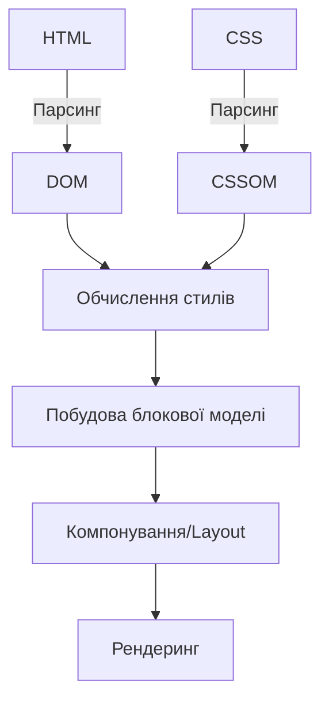
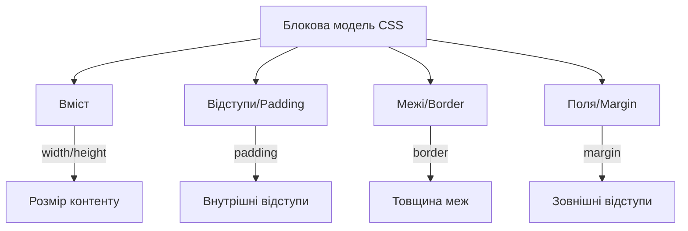

# CSS

## CSS: Базові властивості

Базові властивості CSS — це фундаментальні інструменти стилізації, які дозволяють контролювати зовнішній вигляд та поведінку HTML-елементів. Ці властивості визначають кольори, розміри, відступи, межі, позиціонування та інші основні аспекти візуального представлення елементів на веб-сторінці.

### Для чого використовуються базові властивості

-   **Стилізація вмісту**: Зміна кольорів, шрифтів та візуальних аспектів тексту та елементів
-   **Структурування сторінки**: Визначення розмірів, позиціонування та відображення елементів
-   **Створення макетів**: Формування блокової моделі та контроль розташування елементів
-   **Візуальна ієрархія**: Встановлення пріоритетності елементів через розмір, колір та позиціонування

### Кольори та фон

#### Властивість `color`

Властивість `color` встановлює колір тексту елемента.

| Значення      | Опис                                    | Приклад                           |
| ------------- | --------------------------------------- | --------------------------------- |
| Ключові слова | Назви кольорів                          | `color: red;`                     |
| Hex-код       | Шістнадцяткове значення                 | `color: #ff0000;`                 |
| RGB           | Red, Green, Blue                        | `color: rgb(255, 0, 0);`          |
| RGBA          | RGB + Alpha (прозорість)                | `color: rgba(255, 0, 0, 0.5);`    |
| HSL           | Hue, Saturation, Lightness              | `color: hsl(0, 100%, 50%);`       |
| HSLA          | HSL + Alpha                             | `color: hsla(0, 100%, 50%, 0.5);` |
| currentColor  | Поточний колір тексту елемента          | `border-color: currentColor;`     |
| inherit       | Наслідування від батьківського елемента | `color: inherit;`                 |

```css
/* Приклади використання color */
p {
    color: blue;
}
h1 {
    color: #336699;
}
.alert {
    color: rgb(255, 0, 0);
}
.overlay {
    color: rgba(0, 0, 0, 0.7);
}
.theme {
    color: hsl(120, 100%, 50%);
}
.transparent-text {
    color: hsla(0, 0%, 0%, 0.5);
}
```

#### Властивості фону (`background`)

Група властивостей для налаштування фону елемента.

| Властивість             | Опис                           | Приклад                                                     |
| ----------------------- | ------------------------------ | ----------------------------------------------------------- |
| `background-color`      | Колір фону                     | `background-color: yellow;`                                 |
| `background-image`      | Зображення фону                | `background-image: url('bg.jpg');`                          |
| `background-repeat`     | Повторення фонового зображення | `background-repeat: no-repeat;`                             |
| `background-position`   | Позиція фонового зображення    | `background-position: center;`                              |
| `background-size`       | Розмір фонового зображення     | `background-size: cover;`                                   |
| `background-attachment` | Прокрутка фону з вмістом       | `background-attachment: fixed;`                             |
| `background-origin`     | Початкова точка позиціонування | `background-origin: content-box;`                           |
| `background-clip`       | Область відображення фону      | `background-clip: padding-box;`                             |
| `background`            | Скорочений запис               | `background: #f5f5f5 url('bg.jpg') no-repeat center/cover;` |

```css
/* Приклади використання background */
body {
    background-color: #f0f0f0;
}

.hero {
    background-image: url("hero.jpg");
    background-size: cover;
    background-position: center;
    background-repeat: no-repeat;
}

.pattern {
    background: rgba(255, 255, 255, 0.8) url("pattern.png") repeat;
}

/* Градієнти як фон */
.gradient {
    background: linear-gradient(to right, #ff0000, #0000ff);
}

.radial {
    background: radial-gradient(circle, #ffffff, #000000);
}

/* Кілька фонових зображень */
.multiple-bg {
    background: url("top.png") no-repeat top center, url("middle.png") no-repeat
            center center, url("bottom.png") no-repeat bottom center, #f5f5f5;
}
```

### Типографіка

#### Властивості шрифту (`font`)

Властивості для налаштування шрифту тексту.

| Властивість    | Опис                | Приклад                                         |
| -------------- | ------------------- | ----------------------------------------------- |
| `font-family`  | Сімейство шрифтів   | `font-family: Arial, sans-serif;`               |
| `font-size`    | Розмір шрифту       | `font-size: 16px;`                              |
| `font-weight`  | Товщина шрифту      | `font-weight: bold;`                            |
| `font-style`   | Стиль шрифту        | `font-style: italic;`                           |
| `font-variant` | Варіант шрифту      | `font-variant: small-caps;`                     |
| `line-height`  | Висота рядка        | `line-height: 1.5;`                             |
| `font-stretch` | Розтягування шрифту | `font-stretch: condensed;`                      |
| `font`         | Скорочений запис    | `font: italic bold 16px/1.5 Arial, sans-serif;` |

```css
/* Приклади використання font */
body {
    font-family: "Helvetica Neue", Arial, sans-serif;
    font-size: 16px;
    line-height: 1.5;
}

h1 {
    font: bold 2em/1.2 Georgia, serif;
}

.quote {
    font-style: italic;
    font-weight: 300;
}

/* Використання користувацьких шрифтів */
@font-face {
    font-family: "MyCustomFont";
    src: url("custom-font.woff2") format("woff2"), url("custom-font.woff")
            format("woff");
    font-weight: normal;
    font-style: normal;
}

.custom-text {
    font-family: "MyCustomFont", sans-serif;
}
```

#### Додаткові властивості тексту

| Властивість       | Опис                  | Приклад                       |
| ----------------- | --------------------- | ----------------------------- |
| `text-align`      | Вирівнювання тексту   | `text-align: center;`         |
| `text-decoration` | Декорування тексту    | `text-decoration: underline;` |
| `text-transform`  | Перетворення тексту   | `text-transform: uppercase;`  |
| `letter-spacing`  | Відстань між літерами | `letter-spacing: 2px;`        |
| `word-spacing`    | Відстань між словами  | `word-spacing: 5px;`          |
| `text-indent`     | Відступ першого рядка | `text-indent: 20px;`          |
| `white-space`     | Обробка пробілів      | `white-space: nowrap;`        |
| `text-overflow`   | Обробка переповнення  | `text-overflow: ellipsis;`    |

```css
/* Приклади використання властивостей тексту */
.centered {
    text-align: center;
}

.link {
    text-decoration: none;
}

.caps {
    text-transform: uppercase;
    letter-spacing: 1px;
}

/* Обрізання тексту з трикрапкою */
.truncate {
    white-space: nowrap;
    overflow: hidden;
    text-overflow: ellipsis;
}
```

### Блокова модель

#### Розміри елементів

| Властивість  | Опис                     | Приклад                   |
| ------------ | ------------------------ | ------------------------- |
| `width`      | Ширина елемента          | `width: 300px;`           |
| `height`     | Висота елемента          | `height: 200px;`          |
| `min-width`  | Мінімальна ширина        | `min-width: 100px;`       |
| `min-height` | Мінімальна висота        | `min-height: 100px;`      |
| `max-width`  | Максимальна ширина       | `max-width: 800px;`       |
| `max-height` | Максимальна висота       | `max-height: 600px;`      |
| `box-sizing` | Метод розрахунку розміру | `box-sizing: border-box;` |

```css
/* Приклади використання розмірів */
.container {
    width: 80%;
    max-width: 1200px;
    min-height: 500px;
}

/* Респонсивне зображення */
img {
    max-width: 100%;
    height: auto;
}

/* Зміна моделі підрахунку розмірів */
* {
    box-sizing: border-box;
}

.box {
    width: 200px;
    height: 200px;
    padding: 20px;
    border: 5px solid black;
    /* Фактичний розмір: 200px (з border-box) */
    /* Без border-box було б: 250px (200px + 20px*2 + 5px*2) */
}
```

#### Поля, відступи, межі

| Властивість     | Опис                             | Приклад                     |
| --------------- | -------------------------------- | --------------------------- |
| `margin`        | Зовнішні відступи                | `margin: 10px;`             |
| `padding`       | Внутрішні відступи               | `padding: 15px;`            |
| `border`        | Межа елемента                    | `border: 1px solid black;`  |
| `border-radius` | Округлення кутів                 | `border-radius: 5px;`       |
| `border-color`  | Колір межі                       | `border-color: red;`        |
| `border-style`  | Стиль межі                       | `border-style: dashed;`     |
| `border-width`  | Товщина межі                     | `border-width: 2px;`        |
| `outline`       | Обведення (не впливає на розмір) | `outline: 2px dotted blue;` |

```css
/* Приклади використання margin, padding, border */
.box {
    /* Всі сторони однаково */
    margin: 20px;
    padding: 15px;

    /* За годинниковою стрілкою: top, right, bottom, left */
    margin: 10px 20px 15px 5px;
    padding: 5px 10px 15px 20px;

    /* Вертикально | горизонтально */
    margin: 10px 20px;
    padding: 15px 30px;
}

/* Окремі сторони */
.custom {
    margin-top: 10px;
    margin-right: 20px;
    margin-bottom: 30px;
    margin-left: 15px;

    padding-top: 5px;
    padding-right: 10px;
    padding-bottom: 15px;
    padding-left: 10px;
}

/* Межі */
.bordered {
    /* Скорочений запис */
    border: 1px solid #000;

    /* Детальний запис */
    border-width: 1px;
    border-style: solid;
    border-color: #000;

    /* Окремі сторони */
    border-top: 2px dashed red;
    border-right: 3px dotted green;
    border-bottom: 4px double blue;
    border-left: 5px groove orange;

    /* Округлення кутів */
    border-radius: 10px;

    /* Окремі кути (за годинниковою стрілкою від top-left) */
    border-radius: 10px 20px 30px 40px;
}
```

### Позиціонування і відображення

#### Властивість `display`

Властивість `display` визначає, як елемент відображається у потоці документа.

| Значення       | Опис                    | Приклад                  |
| -------------- | ----------------------- | ------------------------ |
| `block`        | Елемент як блок         | `display: block;`        |
| `inline`       | Елемент як рядковий     | `display: inline;`       |
| `inline-block` | Блочно-рядковий елемент | `display: inline-block;` |
| `flex`         | Flex-контейнер          | `display: flex;`         |
| `grid`         | Grid-контейнер          | `display: grid;`         |
| `none`         | Приховує елемент        | `display: none;`         |
| `table`        | Елемент як таблиця      | `display: table;`        |
| `contents`     | Елемент без боксу       | `display: contents;`     |

```css
/* Приклади використання display */
.block {
    display: block;
    width: 200px;
    height: 100px;
}

.inline {
    display: inline;
    /* width і height не працюють для inline */
}

.inline-block {
    display: inline-block;
    width: 100px;
    height: 50px;
    /* Поводиться як inline, але приймає width і height */
}

.hidden {
    display: none;
    /* Елемент повністю прибирається з потоку і не відображається */
}

/* Базовий flex-контейнер */
.flex-container {
    display: flex;
    justify-content: space-between;
}

/* Базовий grid-контейнер */
.grid-container {
    display: grid;
    grid-template-columns: repeat(3, 1fr);
}
```

#### Властивість `position`

Властивість `position` визначає метод позиціонування елемента.

| Значення   | Опис                                        | Приклад               |
| ---------- | ------------------------------------------- | --------------------- |
| `static`   | Звичайний потік (за замовчуванням)          | `position: static;`   |
| `relative` | Відносно нормальної позиції                 | `position: relative;` |
| `absolute` | Відносно найближчого позиціонованого предка | `position: absolute;` |
| `fixed`    | Відносно вікна перегляду                    | `position: fixed;`    |
| `sticky`   | Гібрид relative та fixed                    | `position: sticky;`   |

```css
/* Приклади використання position */
.default {
    position: static;
    /* Звичайна поведінка в потоці документа */
}

.shifted {
    position: relative;
    top: 20px;
    left: 30px;
    /* Зсунуто на 20px вниз і 30px вправо від нормальної позиції */
    /* Продовжує займати місце в потоці документа */
}

.absolute-box {
    position: absolute;
    top: 50px;
    left: 50px;
    /* Позиціонується відносно найближчого предка з position != static */
    /* Виходить з потоку документа */
}

.fixed-header {
    position: fixed;
    top: 0;
    left: 0;
    width: 100%;
    /* Завжди залишається у вказаній позиції, навіть при прокрутці */
    /* Виходить з потоку документа */
}

.sticky-nav {
    position: sticky;
    top: 0;
    /* Поводиться як relative, поки не досягне зазначеної точки прокрутки */
    /* Потім поводиться як fixed */
}
```

#### Властивість `z-index`

Властивість `z-index` контролює порядок накладання елементів на осі Z.

| Значення         | Опис                                           | Приклад          |
| ---------------- | ---------------------------------------------- | ---------------- |
| `auto`           | Автоматичне визначення                         | `z-index: auto;` |
| Числове значення | Позиція в стеку (вище = ближче до користувача) | `z-index: 100;`  |

```css
/* Приклади використання z-index */
.background {
    z-index: 1;
}

.middle-layer {
    z-index: 10;
}

.foreground {
    z-index: 100;
}

/* z-index працює тільки для позиціонованих елементів (не static) */
.stacked {
    position: relative; /* або absolute, fixed, sticky */
    z-index: 5;
}
```

#### Властивості `float` та `clear`

| Властивість | Опис                             | Приклад        |
| ----------- | -------------------------------- | -------------- |
| `float`     | Розміщення елемента з обтіканням | `float: left;` |
| `clear`     | Заборона обтікання               | `clear: both;` |

```css
/* Приклади використання float і clear */
.left-float {
    float: left;
    width: 200px;
    margin-right: 20px;
}

.right-float {
    float: right;
    width: 200px;
    margin-left: 20px;
}

.clearfix::after {
    content: "";
    display: table;
    clear: both;
}

/* Сучасний спосіб вирішення проблем з float */
.parent {
    display: flow-root;
    /* Створює новий блоковий контекст форматування */
}
```

### Видимість і переповнення

#### Властивість `visibility`

Властивість `visibility` контролює видимість елемента.

| Значення   | Опис                                | Приклад                 |
| ---------- | ----------------------------------- | ----------------------- |
| `visible`  | Елемент видимий                     | `visibility: visible;`  |
| `hidden`   | Елемент невидимий, але займає місце | `visibility: hidden;`   |
| `collapse` | Для рядків/колонок таблиці          | `visibility: collapse;` |

```css
/* Приклади використання visibility */
.invisible {
    visibility: hidden;
    /* Елемент невидимий, але займає місце в потоці документа */
}

/* Порівняння з display: none */
.removed {
    display: none;
    /* Елемент невидимий і НЕ займає місце в потоці */
}
```

#### Властивість `overflow`

Властивість `overflow` визначає поведінку при переповненні вмістом.

| Значення  | Опис                               | Приклад              |
| --------- | ---------------------------------- | -------------------- |
| `visible` | Вміст виходить за межі             | `overflow: visible;` |
| `hidden`  | Вміст обрізається                  | `overflow: hidden;`  |
| `scroll`  | Завжди показуються смуги прокрутки | `overflow: scroll;`  |
| `auto`    | Смуги прокрутки за потреби         | `overflow: auto;`    |

```css
/* Приклади використання overflow */
.overflow-container {
    width: 300px;
    height: 200px;

    /* Базові варіанти */
    overflow: visible; /* За замовчуванням */
    overflow: hidden; /* Обрізати надлишок */
    overflow: scroll; /* Завжди показувати прокрутку */
    overflow: auto; /* Прокрутка, якщо потрібно */

    /* Окремо для осей */
    overflow-x: hidden;
    overflow-y: auto;
}
```

#### Властивість `opacity`

Властивість `opacity` контролює прозорість елемента.

| Значення | Опис                                                   | Приклад         |
| -------- | ------------------------------------------------------ | --------------- |
| 0 - 1    | Від повністю прозорого (0) до повністю непрозорого (1) | `opacity: 0.5;` |

```css
/* Приклади використання opacity */
.semi-transparent {
    opacity: 0.5;
    /* Елемент і весь його вміст стають напівпрозорими */
}

.fade-effect:hover {
    opacity: 0.8;
    transition: opacity 0.3s ease;
}

/* Порівняння з rgba */
.bg-only-transparent {
    background-color: rgba(0, 0, 0, 0.5);
    /* Прозорий тільки фон, вміст залишається непрозорим */
}
```

### Приклад комплексного використання базових властивостей

```html
<!DOCTYPE html>
<html lang="uk">
    <head>
        <meta charset="UTF-8" />
        <title>CSS Базові властивості</title>
        <style>
            /* Загальні стилі */
            body {
                font-family: "Segoe UI", Tahoma, Geneva, Verdana, sans-serif;
                line-height: 1.6;
                color: #333;
                background-color: #f5f5f5;
                margin: 0;
                padding: 0;
            }

            /* Контейнер сторінки */
            .container {
                max-width: 1200px;
                margin: 0 auto;
                padding: 20px;
                box-sizing: border-box;
            }

            /* Заголовок */
            header {
                background-color: #2c3e50;
                color: white;
                padding: 1rem 2rem;
                position: sticky;
                top: 0;
                z-index: 100;
                box-shadow: 0 2px 10px rgba(0, 0, 0, 0.1);
            }

            /* Картка з інформацією */
            .card {
                background-color: white;
                border-radius: 8px;
                border: 1px solid #ddd;
                padding: 20px;
                margin-bottom: 20px;
                box-shadow: 0 4px 8px rgba(0, 0, 0, 0.05);
            }

            /* Зображення з обтіканням тексту */
            .float-img {
                float: left;
                width: 200px;
                height: auto;
                margin: 0 20px 10px 0;
                border-radius: 4px;
                border: 3px solid #3498db;
            }

            /* Очищення обтікання */
            .clearfix::after {
                content: "";
                display: table;
                clear: both;
            }

            /* Кнопка */
            .button {
                display: inline-block;
                background-color: #3498db;
                color: white;
                padding: 10px 20px;
                border-radius: 4px;
                text-decoration: none;
                font-weight: bold;
                border: none;
                cursor: pointer;
                transition: background-color 0.3s ease;
            }

            .button:hover {
                background-color: #2980b9;
            }

            /* Випадаюче меню */
            .dropdown {
                position: relative;
                display: inline-block;
            }

            .dropdown-content {
                display: none;
                position: absolute;
                top: 100%;
                left: 0;
                background-color: white;
                min-width: 200px;
                box-shadow: 0 8px 16px rgba(0, 0, 0, 0.1);
                border-radius: 4px;
                z-index: 10;
            }

            .dropdown:hover .dropdown-content {
                display: block;
            }

            .dropdown-content a {
                display: block;
                padding: 10px 15px;
                text-decoration: none;
                color: #333;
            }

            .dropdown-content a:hover {
                background-color: #f5f5f5;
            }

            /* Обмежений блок з прокруткою */
            .scrollable-box {
                height: 150px;
                overflow-y: auto;
                border: 1px solid #ddd;
                padding: 15px;
                background-color: #fafafa;
                border-radius: 4px;
            }

            /* Обрізання тексту з трикрапкою */
            .truncate {
                white-space: nowrap;
                overflow: hidden;
                text-overflow: ellipsis;
                width: 300px;
            }
        </style>
    </head>
    <body>
        <header>
            <h1>Демонстрація CSS властивостей</h1>
            <div class="dropdown">
                <button class="button">Меню</button>
                <div class="dropdown-content">
                    <a href="#">Пункт 1</a>
                    <a href="#">Пункт 2</a>
                    <a href="#">Пункт 3</a>
                </div>
            </div>
        </header>

        <div class="container">
            <div class="card clearfix">
                
                <h2>Стаття з обтіканням зображення</h2>
                <p>
                    Цей текст обтікає зображення зліва. Ми використовуємо
                    властивість float для розміщення зображення. Lorem ipsum
                    dolor sit amet, consectetur adipiscing elit. Nullam viverra
                    libero in nisl pharetra, eu malesuada nisi tincidunt.
                </p>
                <p>
                    Vestibulum ante ipsum primis in faucibus orci luctus et
                    ultrices posuere cubilia Curae; Mauris efficitur nunc vel
                    metus volutpat, id fringilla urna blandit.
                </p>
            </div>

            <div class="card">
                <h2>Блок із прокруткою</h2>
                <div class="scrollable-box">
                    <p>
                        Цей блок має фіксовану висоту і прокрутку при
                        переповненні. Lorem ipsum dolor sit amet, consectetur
                        adipiscing elit.
                    </p>
                    <p>
                        Nullam viverra libero in nisl pharetra, eu malesuada
                        nisi tincidunt. Vestibulum ante ipsum primis in faucibus
                        orci luctus et ultrices posuere cubilia Curae; Mauris
                        efficitur nunc vel metus volutpat, id fringilla urna
                        blandit.
                    </p>
                    <p>
                        Nullam viverra libero in nisl pharetra, eu malesuada
                        nisi tincidunt. Vestibulum ante ipsum primis in faucibus
                        orci luctus et ultrices posuere cubilia Curae; Mauris
                        efficitur nunc vel metus volutpat, id fringilla urna
                        blandit.
                    </p>
                    <p>
                        Nullam viverra libero in nisl pharetra, eu malesuada
                        nisi tincidunt. Vestibulum ante ipsum primis in faucibus
                        orci luctus et ultrices posuere cubilia Curae; Mauris
                        efficitur nunc vel metus volutpat, id fringilla urna
                        blandit.
                    </p>
                </div>
            </div>

            <div class="card">
                <h2>Обрізання тексту</h2>
                <p class="truncate">
                    Цей дуже довгий текст буде обрізано і закінчено трикрапкою,
                    оскільки він не вміщується в контейнер фіксованої ширини.
                    Lorem ipsum dolor sit amet, consectetur adipiscing elit.
                </p>
            </div>
        </div>
    </body>
</html>
```

### Підкапотні механізми

#### Як браузер обробляє базові властивості

1. **Парсинг CSS**: Браузер аналізує CSS та будує CSSOM (CSS Object Model).
2. **Обчислення стилів**: Визначається, які стилі застосовуються до кожного елемента.
3. **Побудова блокової моделі**: Обчислюються розміри, відступи, межі.
4. **Компонування (Layout)**: Визначаються позиції елементів на сторінці.
5. **Рендеринг**: Відображення елементів з усіма застосованими стилями.



#### Блокова модель CSS

Блокова модель визначає, як обчислюються фактичні розміри елемента з урахуванням вмісту, відступів, меж і полів.



Існує два основних режими розрахунку розмірів:

1. **Content-box** (за замовчуванням):

    ```
    Загальна ширина = width + padding-left + padding-right + border-left + border-right
    ```

2. **Border-box**:
    ```
    width = вміст + padding-left + padding-right + border-left + border-right
    Загальна ширина = width
    ```

#### Система координат і позиціонування

```
┌─────────────────────────────────────────────┐
│ Вікно перегляду браузера                    │
│ ┌─────────────────────────────────────────┐ │
│ │ Документ                                │ │
│ │                                         │ │
│ │ ┌──────────────┐    ┌──────────────┐    │ │
│ │ │ position:    │    │ position:    │    │ │
│ │ │ relative     │    │ absolute     │    │ │
│ │ │              │    │              │    │ │
│ │ └──────────────┘    └──────────────┘    │ │
│ │                                         │ │
│ └─────────────────────────────────────────┘ │
│                                             │
│ ┌──────────────┐                            │
│ │ position:    │                            │
│ │ fixed        │                            │
│ └──────────────┘                            │
└─────────────────────────────────────────────┘
```

-   **static**: Позиція визначається нормальним потоком документа
-   **relative**: Зсув відносно нормальної позиції, але місце в потоці зберігається
-   **absolute**: Позиціонування відносно найближчого позиціонованого предка
-   **fixed**: Позиціонування відносно вікна перегляду
-   **sticky**: Гібрид relative та fixed, залежно від позиції прокрутки

#### Моделі відображення

1. **Блокова модель (Block)**:

    - Займає всю доступну ширину
    - Елементи розміщуються один під одним
    - Можна задати width і height

2. **Рядкова модель (Inline)**:

    - Займає тільки необхідну ширину
    - Елементи розміщуються в одному рядку
    - Не можна задати width і height

3. **Рядково-блокова модель (Inline-block)**:

    - Поєднує властивості блоку і рядка
    - Можна задати width і height, але розміщується як рядковий елемент

4. **Гнучка модель (Flex)**:

    - Для створення одновимірних макетів
    - Гнучкий розподіл простору

5. **Сітчаста модель (Grid)**:
    - Для створення двовимірних макетів
    - Розміщення елементів у рядках і колонках

#### Особливості та підводні камені

1. **Колапс вертикальних margin**:

    - Коли два вертикальні margin стикаються, береться більший з них, а не сума

    ```css
    .first {
        margin-bottom: 20px;
    }
    .second {
        margin-top: 30px;
    }
    /* Відстань між елементами буде 30px, а не 50px */
    ```

2. **Box-sizing та розрахунок розмірів**:

    - За замовчуванням border і padding додаються до ширини/висоти
    - Використовуйте `box-sizing: border-box` для включення їх у width/height

    ```css
    .default-box {
        width: 100px;
        padding: 10px;
        border: 5px solid black;
        /* Фактична ширина: 100px + 10px*2 + 5px*2 = 130px */
    }

    .border-box {
        box-sizing: border-box;
        width: 100px;
        padding: 10px;
        border: 5px solid black;
        /* Фактична ширина: 100px */
    }
    ```

3. **Проблеми з `float`**:

    - Контейнер не враховує плаваючі елементи при розрахунку висоти
    - Рішення: використовуйте clearfix або `display: flow-root`

    ```css
    .clearfix::after {
        content: "";
        display: table;
        clear: both;
    }
    ```

4. **Відмінності між `display: none` і `visibility: hidden`**:

    - `display: none` повністю прибирає елемент з потоку
    - `visibility: hidden` приховує елемент, але зберігає його місце

5. **z-index та контексти накладання**:

    - z-index працює тільки для позиціонованих елементів (не static)
    - z-index створює локальний контекст накладання, який ізолює його нащадків

6. **Процентні значення**:
    - Для `width` і `margin` відсотки відносяться до ширини батьківського елемента
    - Для `height` - до висоти батьківського елемента
    - Для `padding` - до ширини батьківського елемента для горизонтальних і вертикальних відступів
    ```css
    .parent {
        width: 500px;
    }
    .child {
        width: 50%; /* 250px */
        padding-top: 10%; /* 50px (10% від ширини батька, а не висоти) */
    }
    ```

#### Оптимізація

1. **Мінімізація reflow і repaint**:

    - Групуйте зміни стилів
    - Використовуйте трансформації замість зміни позиції і розмірів

    ```css
    /* Викликає reflow і repaint */
    .box {
        left: 100px;
        top: 100px;
    }

    /* Викликає тільки repaint (GPU-прискорення) */
    .box {
        transform: translate(100px, 100px);
    }
    ```

2. **Використання апаратного прискорення**:

    - Властивості, які можуть використовувати GPU: `transform`, `opacity`, `filter`

    ```css
    /* Використовує GPU-прискорення */
    .optimized {
        transform: translateZ(0);
        opacity: 0.9;
    }
    ```

3. **Застосування `will-change`**:

    - Сповіщає браузер про майбутні зміни для оптимізації
    - Використовуйте економно!

    ```css
    .animation-ready {
        will-change: transform, opacity;
    }
    ```

4. **Покращення продуктивності селекторів**:

    - Уникайте глибоко вкладених селекторів
    - Краще використовуйте класи замість складних селекторів

    ```css
    /* Повільно */
    #header .navigation ul li a {
        color: blue;
    }

    /* Швидше */
    .nav-link {
        color: blue;
    }
    ```

### Сучасні підходи до базових властивостей

1. **CSS Variables (Custom Properties)**:

    ```css
    :root {
        --main-color: #3498db;
        --secondary-color: #2c3e50;
        --padding: 20px;
    }

    .card {
        background-color: var(--main-color);
        padding: var(--padding);
    }
    ```

2. **Адаптивні властивості**:

    ```css
    .container {
        width: clamp(300px, 80%, 1200px);
        font-size: clamp(1rem, 2vw, 1.5rem);
    }
    ```

3. **Логічні властивості**:

    ```css
    /* Замість left/right/top/bottom */
    .box {
        margin-inline-start: 20px;
        padding-block-end: 10px;
        border-inline: 1px solid black;
    }
    ```

4. **Аспектне співвідношення**:

    ```css
    .responsive-box {
        aspect-ratio: 16 / 9;
        width: 100%;
    }
    ```

5. **Нова генерація фонових градієнтів**:

    ```css
    .gradient {
        background: conic-gradient(
            from 45deg,
            #f00,
            #ff0,
            #0f0,
            #0ff,
            #00f,
            #f0f,
            #f00
        );
    }
    ```

6. **Container queries** (експериментальна функція):
    ```css
    @container (min-width: 700px) {
        .card {
            display: grid;
            grid-template-columns: 2fr 1fr;
        }
    }
    ```

### Практичні поради

1. **Використовуйте `box-sizing: border-box` глобально**:

    ```css
    *,
    *::before,
    *::after {
        box-sizing: border-box;
    }
    ```

2. **Застосовуйте сучасні методи розташування**:

    - Замініть float на flexbox або grid для складних макетів
    - Використовуйте позиціонування тільки коли це необхідно

3. **Дотримуйтесь єдиної системи розмірів**:

    - Використовуйте відносні одиниці (%, em, rem, vh, vw) для кращої адаптивності
    - Створіть систему масштабування для відступів і розмірів

4. **Обережно з `!important`**:

    - Уникайте надмірного використання `!important`
    - Підвищуйте специфічність селекторів замість використання `!important`

5. **Семантичне використання кольорів**:

    - Визначте систему кольорів для сайту
    - Використовуйте CSS-змінні для управління кольоровою схемою

6. **Прогресивне покращення**:

    - Забезпечте базову функціональність для старих браузерів
    - Використовуйте `@supports` для перевірки підтримки властивостей

    ```css
    .card {
        background: #f0f0f0;
    }

    @supports (backdrop-filter: blur(10px)) {
        .card {
            background: rgba(255, 255, 255, 0.8);
            backdrop-filter: blur(10px);
        }
    }
    ```

7. **Оптимізуйте поширені шаблони**:
    - Для обрізання тексту: `.truncate { white-space: nowrap; overflow: hidden; text-overflow: ellipsis; }`
    - Для центрування: `.center { display: flex; justify-content: center; align-items: center; }`
