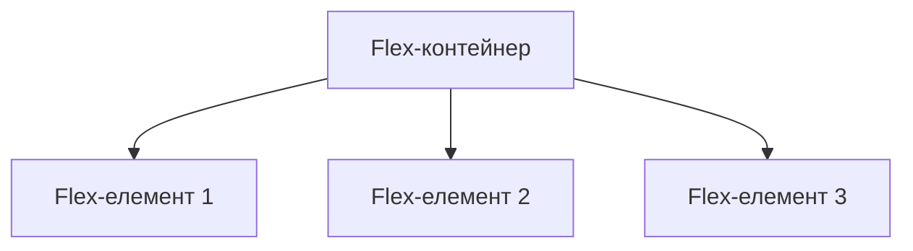
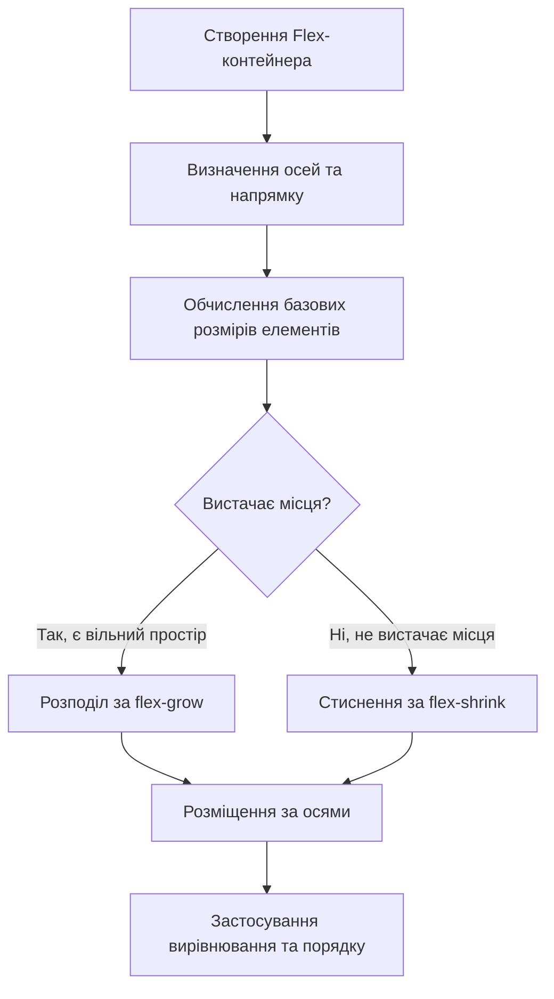

# CSS

## CSS: Flexbox

Flexbox (Flexible Box Layout) — це модуль CSS, розроблений для полегшення створення гнучких і адаптивних макетів. Він дозволяє ефективно розподіляти простір і вирівнювати елементи в контейнері, навіть коли їхні розміри невідомі або динамічні.

### Для чого використовується Flexbox

-   **Вирівнювання елементів**: Просте горизонтальне та вертикальне вирівнювання
-   **Розподіл простору**: Гнучке керування розподілом вільного простору
-   **Зміна порядку елементів**: Зміна візуального порядку без зміни HTML
-   **Адаптивні макети**: Створення адаптивних інтерфейсів, які автоматично підлаштовуються під розмір екрану

### Основні концепції Flexbox

Flexbox будується на основі двох головних компонентів:

1. **Flex-контейнер** — батьківський елемент, що отримує властивість `display: flex`
2. **Flex-елементи** — прямі нащадки flex-контейнера



```
┌─────────────────────────────── Flex-контейнер ───────────────────────────────┐
│                                                                              │
│  ┌─────────────┐            ┌─────────────┐            ┌─────────────┐       │
│  │             │            │             │            │             │       │
│  │    Flex-    │            │    Flex-    │            │    Flex-    │       │
│  │   елемент   │            │   елемент   │            │   елемент   │       │
│  │      1      │            │      2      │            │      3      │       │
│  │             │            │             │            │             │       │
│  └─────────────┘            └─────────────┘            └─────────────┘       │
│                                                                              │
└──────────────────────────────────────────────────────────────────────────────┘
```

Flexbox має дві осі:

-   **Головна вісь (main axis)** — визначається властивістю `flex-direction`
-   **Поперечна вісь (cross axis)** — перпендикулярна до головної осі

```
┌─────────────────────────────── Flex-контейнер ───────────────────────────────┐
│                                                                              │
│  ┌─────────────┐            ┌─────────────┐            ┌─────────────┐       │
│  │             │            │             │            │             │       │
│  │    Flex-    │            │    Flex-    │            │    Flex-    │       │
│  │   елемент   │            │   елемент   │            │   елемент   │       │
│  │      1      │            │      2      │            │      3      │       │
│  │             │            │             │            │             │       │
│  └─────────────┘            └─────────────┘            └─────────────┘       │
│                                                                              │
└──────────────────────────────────────────────────────────────────────────────┘
    ←───────────────────────── головна вісь (row) ─────────────────────────→
    ↑
    │
    │ поперечна
    │ вісь
    │ (column)
    ↓
```

### Властивості для Flex-контейнера

| Властивість       | Опис                                                              | Можливі значення                                                                    | Значення за замовчуванням |
| ----------------- | ----------------------------------------------------------------- | ----------------------------------------------------------------------------------- | ------------------------- |
| `display`         | Визначає елемент як flex-контейнер                                | `flex`, `inline-flex`                                                               | -                         |
| `flex-direction`  | Визначає напрямок головної осі                                    | `row`, `row-reverse`, `column`, `column-reverse`                                    | `row`                     |
| `flex-wrap`       | Визначає, чи повинні елементи переноситись на новий рядок         | `nowrap`, `wrap`, `wrap-reverse`                                                    | `nowrap`                  |
| `flex-flow`       | Скорочений запис для `flex-direction` і `flex-wrap`               | `<flex-direction> <flex-wrap>`                                                      | `row nowrap`              |
| `justify-content` | Вирівнювання вздовж головної осі                                  | `flex-start`, `flex-end`, `center`, `space-between`, `space-around`, `space-evenly` | `flex-start`              |
| `align-items`     | Вирівнювання вздовж поперечної осі                                | `flex-start`, `flex-end`, `center`, `baseline`, `stretch`                           | `stretch`                 |
| `align-content`   | Розподіл ліній вздовж поперечної осі (працює з `flex-wrap: wrap`) | `flex-start`, `flex-end`, `center`, `space-between`, `space-around`, `stretch`      | `stretch`                 |
| `gap`             | Визначає відступи між flex-елементами                             | `<row-gap> <column-gap>`                                                            | `0`                       |
| `row-gap`         | Відступи між рядками                                              | `<length>` або `<percentage>`                                                       | `0`                       |
| `column-gap`      | Відступи між колонками                                            | `<length>` або `<percentage>`                                                       | `0`                       |

#### Приклади використання властивостей контейнера

```css
/* Базовий flex-контейнер */
.container {
    display: flex;
}

/* Напрямок головної осі */
.row {
    flex-direction: row; /* Зліва направо (за замовчуванням) */
}
.row-reverse {
    flex-direction: row-reverse; /* Справа наліво */
}
.column {
    flex-direction: column; /* Зверху вниз */
}
.column-reverse {
    flex-direction: column-reverse; /* Знизу вверх */
}

/* Перенесення на новий рядок */
.nowrap {
    flex-wrap: nowrap; /* Без перенесення (за замовчуванням) */
}
.wrap {
    flex-wrap: wrap; /* Перенесення на новий рядок */
}
.wrap-reverse {
    flex-wrap: wrap-reverse; /* Перенесення у зворотному порядку */
}

/* Скорочений запис */
.container {
    flex-flow: row wrap; /* Напрямок рядка з перенесенням */
}

/* Вирівнювання вздовж головної осі */
.justify-start {
    justify-content: flex-start; /* Початок (за замовчуванням) */
}
.justify-end {
    justify-content: flex-end; /* Кінець */
}
.justify-center {
    justify-content: center; /* Центрування */
}
.justify-between {
    justify-content: space-between; /* Рівномірно, крайні елементи по краях */
}
.justify-around {
    justify-content: space-around; /* Рівномірно з однаковим простором навколо */
}
.justify-evenly {
    justify-content: space-evenly; /* Рівномірно з однаковим простором між усіма */
}

/* Вирівнювання вздовж поперечної осі */
.align-start {
    align-items: flex-start; /* Початок */
}
.align-end {
    align-items: flex-end; /* Кінець */
}
.align-center {
    align-items: center; /* Центрування */
}
.align-baseline {
    align-items: baseline; /* По базовій лінії тексту */
}
.align-stretch {
    align-items: stretch; /* Розтягування (за замовчуванням) */
}

/* Розподіл ліній (при flex-wrap: wrap) */
.align-content-start {
    align-content: flex-start;
}
.align-content-end {
    align-content: flex-end;
}
.align-content-center {
    align-content: center;
}
.align-content-between {
    align-content: space-between;
}
.align-content-around {
    align-content: space-around;
}
.align-content-stretch {
    align-content: stretch; /* За замовчуванням */
}

/* Відступи між flex-елементами */
.gap-container {
    gap: 20px; /* Відступи 20px між усіма елементами */
}
.row-gap-container {
    row-gap: 20px; /* Відступи 20px між рядками */
}
.column-gap-container {
    column-gap: 20px; /* Відступи 20px між елементами в рядку */
}
```

### Властивості для Flex-елементів

| Властивість   | Опис                                                           | Можливі значення                                                  | Значення за замовчуванням |
| ------------- | -------------------------------------------------------------- | ----------------------------------------------------------------- | ------------------------- |
| `flex-grow`   | Коефіцієнт розширення                                          | Число ≥ 0                                                         | `0`                       |
| `flex-shrink` | Коефіцієнт стиснення                                           | Число ≥ 0                                                         | `1`                       |
| `flex-basis`  | Базовий розмір вздовж головної осі                             | `<length>`, `<percentage>`, `auto`, `content`                     | `auto`                    |
| `flex`        | Скорочений запис для `flex-grow`, `flex-shrink` і `flex-basis` | `<flex-grow> <flex-shrink> <flex-basis>`                          | `0 1 auto`                |
| `align-self`  | Перевизначає `align-items` для конкретного елемента            | `auto`, `flex-start`, `flex-end`, `center`, `baseline`, `stretch` | `auto`                    |
| `order`       | Змінює порядок відображення                                    | Ціле число                                                        | `0`                       |

#### Приклади використання властивостей елементів

```css
/* Flex-grow: розширення елементів */
.grow-0 {
    flex-grow: 0; /* Не розширюється (за замовчуванням) */
}
.grow-1 {
    flex-grow: 1; /* Розширюється, займаючи доступний простір */
}
.grow-2 {
    flex-grow: 2; /* Розширюється вдвічі більше, ніж grow-1 */
}

/* Flex-shrink: стиснення елементів */
.shrink-0 {
    flex-shrink: 0; /* Не стискається */
}
.shrink-1 {
    flex-shrink: 1; /* Стискається (за замовчуванням) */
}
.shrink-2 {
    flex-shrink: 2; /* Стискається вдвічі більше, ніж shrink-1 */
}

/* Flex-basis: початковий розмір */
.basis-auto {
    flex-basis: auto; /* Розмір на основі контенту (за замовчуванням) */
}
.basis-0 {
    flex-basis: 0; /* Починає з нульового розміру */
}
.basis-100 {
    flex-basis: 100px; /* Починає з розміру 100px */
}
.basis-50-percent {
    flex-basis: 50%; /* Починає з 50% розміру контейнера */
}

/* Скорочений запис flex */
.flex-auto {
    flex: auto; /* Еквівалент flex: 1 1 auto */
}
.flex-none {
    flex: none; /* Еквівалент flex: 0 0 auto */
}
.flex-1 {
    flex: 1; /* Еквівалент flex: 1 1 0% */
}
.flex-custom {
    flex: 2 0 200px; /* grow: 2, shrink: 0, basis: 200px */
}

/* Індивідуальне вирівнювання */
.self-start {
    align-self: flex-start;
}
.self-end {
    align-self: flex-end;
}
.self-center {
    align-self: center;
}
.self-baseline {
    align-self: baseline;
}
.self-stretch {
    align-self: stretch;
}

/* Зміна порядку */
.first {
    order: -1; /* Відображається перед елементами з order: 0 */
}
.normal {
    order: 0; /* За замовчуванням */
}
.last {
    order: 1; /* Відображається після елементів з order: 0 */
}
```

### Типові шаблони Flexbox

#### 1. Центрування елемента горизонтально і вертикально

```css
.center {
    display: flex;
    justify-content: center; /* Горизонтально */
    align-items: center; /* Вертикально */
    height: 300px; /* Опціонально: задайте висоту контейнера */
}
```

```html
<div class="center">
    <div>Центрований вміст</div>
</div>
```

#### 2. Навігаційне меню

```css
.navbar {
    display: flex;
    justify-content: space-between; /* Логотип зліва, навігація справа */
    align-items: center;
    padding: 1rem;
}

.nav-links {
    display: flex;
    gap: 1rem; /* Відступи між пунктами меню */
}
```

```html
<nav class="navbar">
    <div class="logo">Логотип</div>
    <div class="nav-links">
        <a href="#">Головна</a>
        <a href="#">Про нас</a>
        <a href="#">Послуги</a>
        <a href="#">Контакти</a>
    </div>
</nav>
```

#### 3. Сітка карток з автоматичним перенесенням

```css
.card-grid {
    display: flex;
    flex-wrap: wrap;
    gap: 20px;
}

.card {
    flex: 1 0 300px; /* Grow, не shrink, базовий розмір 300px */
    /* Решта стилізації картки */
}
```

```html
<div class="card-grid">
    <div class="card">Картка 1</div>
    <div class="card">Картка 2</div>
    <div class="card">Картка 3</div>
    <!-- Можна додавати скільки завгодно карток -->
</div>
```

#### 4. Розділ "Герой" з контентом по центру

```css
.hero {
    display: flex;
    flex-direction: column;
    justify-content: center;
    align-items: center;
    height: 100vh;
    text-align: center;
}
```

```html
<section class="hero">
    <h1>Заголовок</h1>
    <p>Короткий опис</p>
    <button>Дізнатися більше</button>
</section>
```

#### 5. Розташування із сайдбаром

```css
.layout {
    display: flex;
    min-height: 100vh;
}

.sidebar {
    flex: 0 0 250px; /* Не розширюється, не стискається, ширина 250px */
    /* Стилізація сайдбару */
}

.content {
    flex: 1; /* Займає весь доступний простір */
    /* Стилізація основного контенту */
}
```

```html
<div class="layout">
    <aside class="sidebar">Сайдбар</aside>
    <main class="content">Основний контент</main>
</div>
```

#### 6. Адаптивний футер з вирівнюванням

```css
.footer {
    display: flex;
    flex-wrap: wrap;
    justify-content: space-between;
    gap: 2rem;
    padding: 2rem;
}

.footer-column {
    flex: 1 0 200px; /* Розширюється, не стискається, мінімум 200px */
}
```

```html
<footer class="footer">
    <div class="footer-column">Колонка 1</div>
    <div class="footer-column">Колонка 2</div>
    <div class="footer-column">Колонка 3</div>
    <div class="footer-column">Колонка 4</div>
</footer>
```

#### 7. Вирівнювання по базовій лінії тексту

```css
.baseline-alignment {
    display: flex;
    align-items: baseline;
}

.small {
    font-size: 1rem;
}

.medium {
    font-size: 2rem;
}

.large {
    font-size: 3rem;
}
```

```html
<div class="baseline-alignment">
    <div class="small">Малий текст</div>
    <div class="medium">Середній текст</div>
    <div class="large">Великий текст</div>
</div>
```

#### 8. Форма з вирівнюванням міток

```css
.form-row {
    display: flex;
    margin-bottom: 1rem;
}

.form-row label {
    flex: 0 0 150px; /* Фіксована ширина для міток */
    padding-right: 1rem;
}

.form-row input {
    flex: 1; /* Займає решту простору */
}
```

```html
<div class="form-row">
    <label for="name">Ім'я:</label>
    <input type="text" id="name" />
</div>
<div class="form-row">
    <label for="email">Email:</label>
    <input type="email" id="email" />
</div>
```

### Реальний приклад веб-сторінки з Flexbox

```html
<!DOCTYPE html>
<html lang="uk">
    <head>
        <meta charset="UTF-8" />
        <meta name="viewport" content="width=device-width, initial-scale=1.0" />
        <title>Flexbox Приклад</title>
        <style>
            /* Базові стилі */
            * {
                box-sizing: border-box;
                margin: 0;
                padding: 0;
            }

            body {
                font-family: Arial, sans-serif;
                line-height: 1.6;
                color: #333;
            }

            a {
                text-decoration: none;
                color: inherit;
            }

            /* Контейнер */
            .container {
                max-width: 1200px;
                margin: 0 auto;
                padding: 0 20px;
            }

            /* Заголовок сайту */
            header {
                display: flex;
                justify-content: space-between;
                align-items: center;
                padding: 20px 0;
                border-bottom: 1px solid #eee;
            }

            .logo {
                font-size: 1.8rem;
                font-weight: bold;
                color: #2c3e50;
            }

            /* Головна навігація */
            .main-nav {
                display: flex;
                gap: 1.5rem;
            }

            .main-nav a {
                padding: 5px 10px;
                border-radius: 4px;
                transition: background 0.3s;
            }

            .main-nav a:hover {
                background-color: #f0f0f0;
            }

            /* Герой-секція */
            .hero {
                display: flex;
                flex-direction: column;
                justify-content: center;
                align-items: center;
                text-align: center;
                height: 50vh;
                background-color: #f9f9f9;
            }

            .hero h1 {
                font-size: 2.5rem;
                margin-bottom: 1rem;
                color: #2c3e50;
            }

            .hero p {
                font-size: 1.2rem;
                margin-bottom: 2rem;
                max-width: 600px;
            }

            .btn {
                display: inline-block;
                padding: 10px 20px;
                background-color: #3498db;
                color: white;
                border-radius: 4px;
                transition: background 0.3s;
            }

            .btn:hover {
                background-color: #2980b9;
            }

            /* Секція особливостей */
            .features {
                padding: 4rem 0;
            }

            .section-title {
                text-align: center;
                margin-bottom: 3rem;
                font-size: 2rem;
                color: #2c3e50;
            }

            .features-grid {
                display: flex;
                flex-wrap: wrap;
                gap: 2rem;
            }

            .feature-card {
                flex: 1 0 300px;
                padding: 2rem;
                background-color: white;
                border-radius: 8px;
                box-shadow: 0 4px 6px rgba(0, 0, 0, 0.1);
                transition: transform 0.3s;
            }

            .feature-card:hover {
                transform: translateY(-5px);
            }

            .feature-card h3 {
                margin-bottom: 1rem;
                color: #2c3e50;
            }

            /* Секція для зворотного зв'язку */
            .cta {
                display: flex;
                justify-content: space-between;
                align-items: center;
                padding: 3rem 0;
                background-color: #3498db;
                color: white;
            }

            .cta-text {
                flex: 0 0 60%;
            }

            .cta-text h2 {
                margin-bottom: 1rem;
            }

            .cta-form {
                flex: 0 0 35%;
            }

            .form-group {
                display: flex;
                flex-direction: column;
                margin-bottom: 1rem;
            }

            .form-group label {
                margin-bottom: 0.5rem;
            }

            .form-group input {
                padding: 10px;
                border: none;
                border-radius: 4px;
            }

            .btn-submit {
                background-color: #2c3e50;
                border: none;
                cursor: pointer;
            }

            .btn-submit:hover {
                background-color: #1a252f;
            }

            /* Підвал сайту */
            footer {
                padding: 2rem 0;
                background-color: #2c3e50;
                color: white;
            }

            .footer-content {
                display: flex;
                flex-wrap: wrap;
                gap: 2rem;
            }

            .footer-column {
                flex: 1 0 200px;
            }

            .footer-column h3 {
                margin-bottom: 1rem;
                font-size: 1.2rem;
            }

            .footer-column ul {
                list-style: none;
            }

            .footer-column li {
                margin-bottom: 0.5rem;
            }

            .footer-bottom {
                margin-top: 2rem;
                text-align: center;
                padding-top: 1rem;
                border-top: 1px solid rgba(255, 255, 255, 0.1);
            }

            /* Адаптивність */
            @media (max-width: 768px) {
                header {
                    flex-direction: column;
                    gap: 1rem;
                }

                .cta {
                    flex-direction: column;
                    text-align: center;
                    gap: 2rem;
                }

                .cta-text,
                .cta-form {
                    flex: 0 0 100%;
                }
            }
        </style>
    </head>
    <body>
        <header class="container">
            <div class="logo">FlexSite</div>
            <nav class="main-nav">
                <a href="#">Головна</a>
                <a href="#">Особливості</a>
                <a href="#">Ціни</a>
                <a href="#">Про нас</a>
                <a href="#">Контакти</a>
            </nav>
        </header>

        <section class="hero">
            <div class="container">
                <h1>Гнучкі рішення для вашого бізнесу</h1>
                <p>
                    Використовуйте силу Flexbox для створення сучасних,
                    адаптивних веб-сайтів без зайвих зусиль.
                </p>
                <a href="#" class="btn">Дізнатися більше</a>
            </div>
        </section>

        <section class="features container">
            <h2 class="section-title">Наші особливості</h2>
            <div class="features-grid">
                <div class="feature-card">
                    <h3>Адаптивний дизайн</h3>
                    <p>
                        Наші рішення ідеально працюють на будь-яких пристроях,
                        від смартфонів до великих екранів.
                    </p>
                </div>
                <div class="feature-card">
                    <h3>Гнучкі макети</h3>
                    <p>
                        Використовуючи Flexbox, ми створюємо гнучкі та динамічні
                        макети, які легко адаптуються.
                    </p>
                </div>
                <div class="feature-card">
                    <h3>Сучасні технології</h3>
                    <p>
                        Ми використовуємо найновіші технології веб-розробки для
                        створення найкращих рішень.
                    </p>
                </div>
            </div>
        </section>

        <section class="cta">
            <div
                class="container"
                style="display: flex; justify-content: space-between; align-items: center; flex-wrap: wrap;"
            >
                <div class="cta-text">
                    <h2>Готові почати?</h2>
                    <p>
                        Зв'яжіться з нами сьогодні, щоб дізнатися, як ми можемо
                        допомогти вашому бізнесу.
                    </p>
                </div>
                <div class="cta-form">
                    <form>
                        <div class="form-group">
                            <label for="email">Email-адреса</label>
                            <input
                                type="email"
                                id="email"
                                placeholder="your@email.com"
                            />
                        </div>
                        <button type="submit" class="btn btn-submit">
                            Підписатися
                        </button>
                    </form>
                </div>
            </div>
        </section>

        <footer>
            <div class="container">
                <div class="footer-content">
                    <div class="footer-column">
                        <h3>Про нас</h3>
                        <p>
                            Ми створюємо сучасні веб-рішення, використовуючи
                            новітні технології та підходи.
                        </p>
                    </div>
                    <div class="footer-column">
                        <h3>Посилання</h3>
                        <ul>
                            <li><a href="#">Головна</a></li>
                            <li><a href="#">Особливості</a></li>
                            <li><a href="#">Ціни</a></li>
                            <li><a href="#">Блог</a></li>
                        </ul>
                    </div>
                    <div class="footer-column">
                        <h3>Контакти</h3>
                        <ul>
                            <li>info@flexsite.com</li>
                            <li>+380 123 456 789</li>
                            <li>вул. Прикладна, 123</li>
                        </ul>
                    </div>
                    <div class="footer-column">
                        <h3>Підписка</h3>
                        <p>
                            Підпишіться на наші новини, щоб бути в курсі
                            останніх оновлень.
                        </p>
                    </div>
                </div>
                <div class="footer-bottom">
                    <p>&copy; 2025 FlexSite. Усі права захищені.</p>
                </div>
            </div>
        </footer>
    </body>
</html>
```

### Підкапотні механізми

#### Як браузер обробляє Flexbox

1. **Розпізнавання Flex-контейнера**:

    - Браузер визначає елемент як flex-контейнер, коли йому призначається `display: flex` або `display: inline-flex`.
    - Прямі нащадки стають flex-елементами.

2. **Визначення напрямку осей**:

    - Головна вісь визначається через `flex-direction`.
    - Поперечна вісь завжди перпендикулярна до головної.

3. **Обчислення розмірів елементів**:
    - **Крок 1**: Визначення вільного простору: `flex-container-size - sum-of-all-items`.
    - **Крок 2**: Розподіл вільного простору на основі `flex-grow`.
    - **Крок 3**: Якщо елементи не вміщаються, стиснення на основі `flex-shrink`.



#### Обчислення розмірів Flex-елементів

1. **Базовий розмір (flex-basis)**:

    - Починається з визначення `flex-basis` для кожного елемента.
    - Якщо `flex-basis: auto`, використовується власний розмір елемента.

2. **Розподіл вільного простору (flex-grow)**:

    - Якщо є вільний простір, він розподіляється пропорційно значенням `flex-grow`.
    - Формула: `extra_space_for_item = available_space * (item_grow / total_grow)`.

3. **Стиснення при нестачі місця (flex-shrink)**:
    - Якщо недостатньо місця, елементи стискаються пропорційно до `flex-shrink`.
    - Формула: `shrink_amount = item_size * item_shrink / (sum_of_all_items_size * shrink)`.

Приклад:

```css
.container {
    display: flex;
    width: 500px; /* Загальна ширина */
}

.item-1 {
    flex: 1 1 100px; /* grow: 1, shrink: 1, basis: 100px */
}

.item-2 {
    flex: 2 1 100px; /* grow: 2, shrink: 1, basis: 100px */
}

.item-3 {
    flex: 1 1 100px; /* grow: 1, shrink: 1, basis: 100px */
}
```

Обчислення:

-   Базові розміри: 100px + 100px + 100px = 300px
-   Вільний простір: 500px - 300px = 200px
-   Загальний flex-grow: 1 + 2 + 1 = 4
-   Розподіл вільного простору:
    -   item-1: 200px \* (1/4) = 50px
    -   item-2: 200px \* (2/4) = 100px
    -   item-3: 200px \* (1/4) = 50px
-   Фінальні розміри:
    -   item-1: 100px + 50px = 150px
    -   item-2: 100px + 100px = 200px
    -   item-3: 100px + 50px = 150px

#### Алгоритм Flexbox

1. **Генерація анонімних flex-елементів**:

    - Текстові вузли обгортаються в анонімні inline-елементи.

2. **Розташування елементів у головному напрямку**:

    - Обчислення розмірів та розподіл вільного простору.
    - Застосування `justify-content` для розташування елементів.

3. **Вирівнювання елементів у поперечному напрямку**:

    - Обчислення поперечних розмірів.
    - Застосування `align-items` для окремих елементів або `align-self`.

4. **Застосування `align-content` для багаторядкових контейнерів**:
    - Розподіл вільного простору між рядками.

#### Особливості та підводні камені

1. **Проблеми з percent (%) значеннями**:

    - Відсоткові значення в `flex-basis` обчислюються від розміру flex-контейнера.
    - Можуть виникати проблеми, якщо контейнер не має визначеного розміру.

2. **Негативні маржини та Flexbox**:

    - Негативні маржини враховуються при обчисленні розмірів flex-елементів.
    - Можуть порушити очікувану поведінку flex-контейнера.

3. **`min-width`/`min-height` мають пріоритет над `flex-basis`**:

    - Якщо `flex-basis` менший за `min-width`/`min-height`, буде використано мінімальне значення.

4. **Проблема min-content і max-content**:

    - Деякі елементи можуть мати нетипову поведінку з `flex-basis: auto` через їхній внутрішній вміст.

5. **Вплив `box-sizing` на flex-елементи**:

    - `box-sizing: border-box` впливає на те, як обчислюється `flex-basis`.
    - Може призвести до несподіваних результатів у комбінації з `padding` і `border`.

6. **Порядок застосування властивостей**:
    - Найвища специфічність для розміру:
        1. `max-width`/`max-height`
        2. `min-width`/`min-height`
        3. `flex-basis`
        4. `width`/`height`
        5. Розмір вмісту

#### Оптимізація Flexbox

1. **Продуктивність відображення**:

    - Зміна `flex-direction` вимагає повного перекомпонування.
    - Зміни `order` потребують перерахунку розташування.

2. **Обмеження глибини вкладеності**:

    - Глибоко вкладені flex-контейнери можуть сповільнити рендеринг.
    - Краще використовувати поєднання Grid та Flexbox для складних макетів.

3. **Уникайте частих змін Flexbox-властивостей**:

    - Анімація `flex-grow` та `flex-shrink` може бути повільною.
    - Використовуйте `transform` для анімацій, коли можливо.

4. **Апаратне прискорення**:
    - Застосовуйте `will-change: transform` або `transform: translateZ(0)` для flex-контейнерів, які анімуються.

### Сучасні підходи та тенденції

1. **Комбінування Flexbox і Grid**:
    - Flexbox для одновимірних макетів.
    - Grid для двовимірних макетів.
    - Поєднання для створення складних інтерфейсів.

```css
.page-layout {
    display: grid;
    grid-template-columns: 1fr 3fr;
    grid-template-rows: auto 1fr auto;
}

.navigation {
    display: flex; /* Одновимірне розташування елементів навігації */
}
```

2. **Адаптивні компоненти з Flexbox**:
    - Використання `flex-wrap` разом з `flex-basis` для автоматичного перенесення елементів.
    - Використання відносних одиниць для `flex-basis`.

```css
.card-container {
    display: flex;
    flex-wrap: wrap;
}

.card {
    flex: 1 0 calc(33.333% - 20px);
    margin: 10px;

    @media (max-width: 768px) {
        flex-basis: calc(50% - 20px);
    }

    @media (max-width: 480px) {
        flex-basis: 100%;
    }
}
```

3. **CSS Змінні з Flexbox**:
    - Використання CSS-змінних для гнучких налаштувань Flexbox.

```css
:root {
    --gap: 20px;
    --flex-column: column;
    --justify: flex-start;
}

.flex-container {
    display: flex;
    flex-direction: var(--flex-column);
    gap: var(--gap);
    justify-content: var(--justify);
}

@media (min-width: 768px) {
    :root {
        --flex-column: row;
        --justify: space-between;
    }
}
```

4. **Використання властивості `gap`**:
    - Заміна старого способу з маржинами для встановлення відступів.

```css
/* Старий спосіб */
.old-flex {
    display: flex;
}

.old-flex > * {
    margin-right: 10px;
}

.old-flex > *:last-child {
    margin-right: 0;
}

/* Новий спосіб */
.new-flex {
    display: flex;
    gap: 10px; /* Встановлює відступи між всіма елементами */
}
```

### Порівняння Flexbox та інших методів макетування

| Метод        | Переваги                                                                                                        | Недоліки                                                                                   | Коли використовувати                                                      |
| ------------ | --------------------------------------------------------------------------------------------------------------- | ------------------------------------------------------------------------------------------ | ------------------------------------------------------------------------- |
| **Flexbox**  | - Одновимірне розташування<br>- Проста вертикальна та горизонтальна центрування<br>- Гнучкий розподіл простору  | - Обмежена підтримка двовимірних макетів<br>- Може бути повільним при глибокій вкладеності | - Навігаційні меню<br>- Картки<br>- Вирівнювання елементів<br>- Форми     |
| **Grid**     | - Двовимірне розташування<br>- Потужний контроль над рядками та колонками<br>- Області для розміщення елементів | - Більша складність для простих задач<br>- Потенційно надмірний для одновимірних макетів   | - Повні макети сторінок<br>- Фотогалереї<br>- Складні сітки<br>- Дешборди |
| **Float**    | - Широка підтримка браузерами<br>- Проста реалізація для обтікання тексту                                       | - Складно контролювати<br>- Багато підводних каменів<br>- Потребує clearfix                | - Обтікання зображень текстом<br>- Застарілі браузери                     |
| **Position** | - Точний контроль над розташуванням<br>- Виходить із потоку документа                                           | - Складно створювати адаптивні макети<br>- Елементи виходять з потоку                      | - Фіксовані елементи<br>- Модальні вікна<br>- Спливаючі підказки          |
| **Tables**   | - Сумісність зі старими браузерами<br>- Рівні висоти рядків                                                     | - Семантично неправильно для макетів<br>- Погана адаптивність<br>- Складний для оновлення  | - Табличні дані<br>- Email-шаблони                                        |

### Практичні поради для роботи з Flexbox

1. **Розуміння головної та поперечної осей**:

    - Завжди пам'ятайте, що `justify-content` працює вздовж головної осі.
    - `align-items` працює вздовж поперечної осі.

2. **Використання скороченого запису `flex`**:

    - `flex: 1` = `flex: 1 1 0%` — розширюється, стискається, починає з 0.
    - `flex: auto` = `flex: 1 1 auto` — розширюється, стискається, базується на контенті.
    - `flex: none` = `flex: 0 0 auto` — не розширюється, не стискається, базується на контенті.

3. **Вирішення спільних задач**:

    - Центрування елемента: `justify-content: center; align-items: center;`
    - Прикріплення елемента до правого краю: `margin-left: auto;`
    - Рівномірне розташування елементів: `justify-content: space-between;`

4. **Адаптивний дизайн з Flexbox**:

    - Використовуйте `flex-wrap: wrap` для адаптивного макета.
    - Змінюйте `flex-direction` на `column` для мобільних пристроїв.

5. **Сумісність із старими браузерами**:

    - Використовуйте префікси для старих браузерів (`-webkit-`, `-moz-`, `-ms-`).
    - Створюйте запасні варіанти для IE10 та старіших.

6. **Використання відносних одиниць**:

    - `%`, `em`, `rem` для гнучких та адаптивних макетів.
    - Використовуйте `calc()` для комбінації одиниць вимірювання.

7. **Відлагодження Flexbox**:
    - Додавайте рамки для візуалізації flex-контейнерів і елементів.
    - Використовуйте інструменти розробника браузера для перевірки Flexbox.
    - Firefox має спеціальний інструмент для відлагодження Flexbox.
