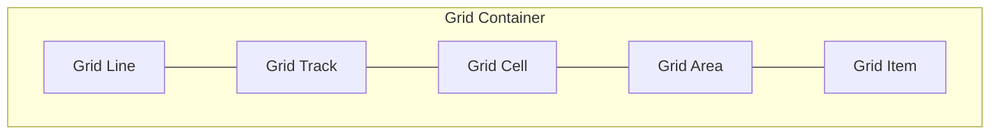
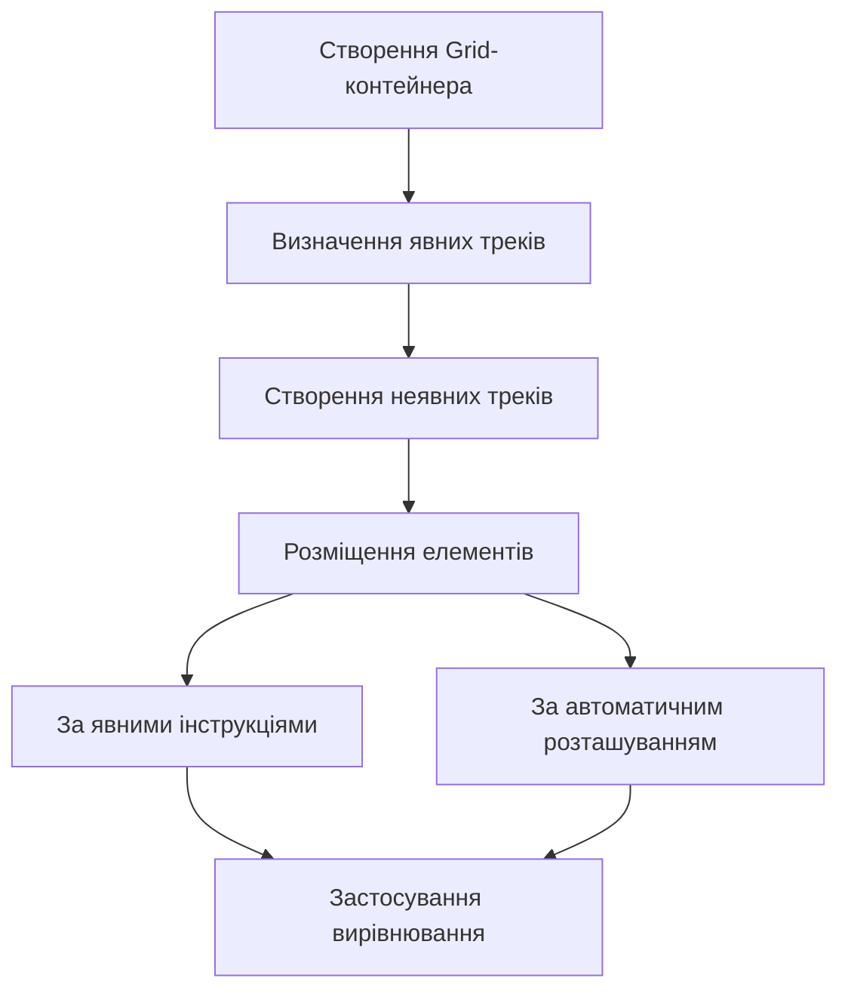
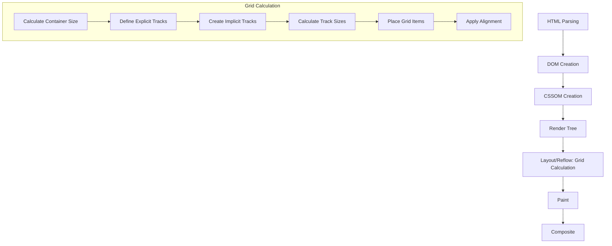

# CSS Grid

## Що таке CSS Grid?

CSS Grid Layout (або просто Grid) — це двовимірна система компонування, створена спеціально для веб, яка дозволяє розташовувати елементи у рядках і стовпцях. На відміну від Flexbox, який є переважно одновимірним, Grid дозволяє точно контролювати обидва виміри одночасно.

Grid є потужним інструментом для створення складних макетів веб-сторінок, надаючи можливість створювати сітки з чітко визначеними рядками та стовпцями, в яких елементи можуть займати декілька комірок і точно розташовуватися в межах цієї сітки.

## Основні терміни

Перш ніж заглиблюватись у властивості, важливо зрозуміти основні терміни:

| Термін         | Опис                                                                                           |
| -------------- | ---------------------------------------------------------------------------------------------- |
| Grid Container | Елемент, до якого застосовано `display: grid`. Це батьківський елемент для всіх grid-елементів |
| Grid Item      | Прямі нащадки grid-контейнера                                                                  |
| Grid Line      | Горизонтальні (ряди) і вертикальні (стовпці) лінії, які формують структуру сітки               |
| Grid Track     | Простір між двома сусідніми grid-лініями. Може бути рядком або стовпцем                        |
| Grid Cell      | Одиничний елемент сітки (комірка)                                                              |
| Grid Area      | Прямокутна область, обмежена чотирма grid-лініями                                              |



## Властивості Grid-контейнера

### Основні властивості

| Властивість                      | Опис                                                                                        | Можливі значення                                                                     |
| -------------------------------- | ------------------------------------------------------------------------------------------- | ------------------------------------------------------------------------------------ |
| `display`                        | Визначає елемент як grid-контейнер                                                          | `grid`, `inline-grid`                                                                |
| `grid-template-columns`          | Визначає кількість і розмір стовпців                                                        | `<track-size>...`, `repeat()`, `minmax()`, `auto-fill`, `auto-fit`, `fr`             |
| `grid-template-rows`             | Визначає кількість і розмір рядків                                                          | `<track-size>...`, `repeat()`, `minmax()`, `auto-fill`, `auto-fit`, `fr`             |
| `grid-template-areas`            | Визначає іменовані grid-області                                                             | Рядки з назвами областей                                                             |
| `grid-template`                  | Скорочений запис для `grid-template-rows`, `grid-template-columns` та `grid-template-areas` |                                                                                      |
| `grid-column-gap` / `column-gap` | Відступ між стовпцями                                                                       | `<length>` або `<percentage>`                                                        |
| `grid-row-gap` / `row-gap`       | Відступ між рядками                                                                         | `<length>` або `<percentage>`                                                        |
| `grid-gap` / `gap`               | Скорочений запис для `row-gap` та `column-gap`                                              | `<row-gap> <column-gap>`                                                             |
| `justify-items`                  | Вирівнювання grid-елементів по горизонталі                                                  | `start`, `end`, `center`, `stretch`                                                  |
| `align-items`                    | Вирівнювання grid-елементів по вертикалі                                                    | `start`, `end`, `center`, `stretch`                                                  |
| `place-items`                    | Скорочений запис для `align-items` та `justify-items`                                       | `<align-items> <justify-items>`                                                      |
| `justify-content`                | Вирівнювання grid-треків по горизонталі (якщо сітка менша за контейнер)                     | `start`, `end`, `center`, `stretch`, `space-around`, `space-between`, `space-evenly` |
| `align-content`                  | Вирівнювання grid-треків по вертикалі (якщо сітка менша за контейнер)                       | `start`, `end`, `center`, `stretch`, `space-around`, `space-between`, `space-evenly` |
| `place-content`                  | Скорочений запис для `align-content` та `justify-content`                                   | `<align-content> <justify-content>`                                                  |
| `grid-auto-columns`              | Розмір автоматично створених стовпців                                                       | `<track-size>`                                                                       |
| `grid-auto-rows`                 | Розмір автоматично створених рядків                                                         | `<track-size>`                                                                       |
| `grid-auto-flow`                 | Як розміщуються автоматично розташовані елементи                                            | `row`, `column`, `dense`                                                             |
| `grid`                           | Скорочений запис для всіх вищезгаданих властивостей                                         |                                                                                      |

### Детальний огляд основних властивостей

#### grid-template-columns / grid-template-rows

Визначають розмір та кількість стовпців/рядків у сітці:

```css
.container {
    display: grid;
    /* 3 стовпці різної ширини */
    grid-template-columns: 100px 200px 1fr;
    /* 2 ряди різної висоти */
    grid-template-rows: 50px 150px;
}
```

**Функція repeat()**:

```css
.container {
    /* 5 стовпців по 100px кожен */
    grid-template-columns: repeat(5, 100px);
    /* 3 ряди різної висоти, патерн повторюється */
    grid-template-rows: repeat(3, 50px 100px);
}
```

**Одиниця fr**:

```css
.container {
    /* 3 стовпці, які займають пропорційно 1:2:1 доступний простір */
    grid-template-columns: 1fr 2fr 1fr;
}
```

**Функція minmax()**:

```css
.container {
    /* Стовпці не менше 100px і не більше 1fr */
    grid-template-columns: repeat(3, minmax(100px, 1fr));
}
```

**auto-fill і auto-fit**:

```css
.container {
    /* Створює стільки стовпців шириною 100px, скільки поміститься */
    grid-template-columns: repeat(auto-fill, minmax(100px, 1fr));

    /* Схоже на auto-fill, але розтягує елементи, якщо є вільне місце */
    grid-template-columns: repeat(auto-fit, minmax(100px, 1fr));
}
```

#### grid-template-areas

Дозволяє створювати іменовані області в сітці:

```css
.container {
    display: grid;
    grid-template-columns: 1fr 3fr 1fr;
    grid-template-rows: auto 1fr auto;
    grid-template-areas:
        "header header header"
        "sidebar content aside"
        "footer footer footer";
}

.header {
    grid-area: header;
}
.sidebar {
    grid-area: sidebar;
}
.content {
    grid-area: content;
}
.aside {
    grid-area: aside;
}
.footer {
    grid-area: footer;
}
```

#### grid-gap / column-gap / row-gap

Встановлює проміжки між рядками/стовпцями:

```css
.container {
    display: grid;
    grid-template-columns: repeat(3, 1fr);
    grid-template-rows: repeat(2, 100px);
    column-gap: 20px; /* відступ між стовпцями */
    row-gap: 15px; /* відступ між рядками */
    /* або скорочено */
    gap: 15px 20px; /* row-gap column-gap */
}
```

#### justify-items / align-items / place-items

Вирівнювання елементів всередині своїх комірок:

```css
.container {
    display: grid;
    justify-items: center; /* горизонтальне вирівнювання */
    align-items: center; /* вертикальне вирівнювання */
    /* або скорочено */
    place-items: center center; /* align-items justify-items */
}
```

#### justify-content / align-content / place-content

Вирівнювання всієї сітки всередині контейнера (якщо сітка менша за контейнер):

```css
.container {
    display: grid;
    height: 500px;
    grid-template-columns: repeat(3, 100px);
    grid-template-rows: repeat(2, 100px);
    justify-content: space-between; /* горизонтальне вирівнювання сітки */
    align-content: center; /* вертикальне вирівнювання сітки */
    /* або скорочено */
    place-content: center space-between; /* align-content justify-content */
}
```

## Властивості Grid-елементів

| Властивість         | Опис                                                                                                                         | Можливі значення                                                       |
| ------------------- | ---------------------------------------------------------------------------------------------------------------------------- | ---------------------------------------------------------------------- |
| `grid-column-start` | Початкова лінія стовпця для розміщення елемента                                                                              | `<number>`, `<name>`, `span <number>`, `span <name>`, `auto`           |
| `grid-column-end`   | Кінцева лінія стовпця для розміщення елемента                                                                                | `<number>`, `<name>`, `span <number>`, `span <name>`, `auto`           |
| `grid-row-start`    | Початкова лінія ряду для розміщення елемента                                                                                 | `<number>`, `<name>`, `span <number>`, `span <name>`, `auto`           |
| `grid-row-end`      | Кінцева лінія ряду для розміщення елемента                                                                                   | `<number>`, `<name>`, `span <number>`, `span <name>`, `auto`           |
| `grid-column`       | Скорочений запис для `grid-column-start` та `grid-column-end`                                                                | `<start-line> / <end-line>` або `<start-line> / span <value>`          |
| `grid-row`          | Скорочений запис для `grid-row-start` та `grid-row-end`                                                                      | `<start-line> / <end-line>` або `<start-line> / span <value>`          |
| `grid-area`         | Визначає іменовану область або скорочений запис для `grid-row-start`, `grid-column-start`, `grid-row-end`, `grid-column-end` | `<name>` або `<row-start> / <column-start> / <row-end> / <column-end>` |
| `justify-self`      | Горизонтальне вирівнювання елемента в комірці                                                                                | `start`, `end`, `center`, `stretch`                                    |
| `align-self`        | Вертикальне вирівнювання елемента в комірці                                                                                  | `start`, `end`, `center`, `stretch`                                    |
| `place-self`        | Скорочений запис для `align-self` та `justify-self`                                                                          | `<align-self> <justify-self>`                                          |

### Позиціонування елементів

#### grid-column / grid-row

```css
.item {
    /* Займає від 1-ї до 3-ї лінії стовпця */
    grid-column: 1 / 3;
    /* Те саме, але використовуючи span */
    grid-column: 1 / span 2;

    /* Займає від 2-ї до 4-ї лінії ряду */
    grid-row: 2 / 4;
    /* Те саме, але використовуючи span */
    grid-row: 2 / span 2;
}
```

#### grid-area

```css
.item {
    /* Використання іменованої області */
    grid-area: header;

    /* Скорочений запис для grid-row-start/grid-column-start/grid-row-end/grid-column-end */
    grid-area: 1 / 2 / 3 / 4;
}
```

#### justify-self / align-self / place-self

```css
.item {
    justify-self: start; /* горизонтальне вирівнювання */
    align-self: center; /* вертикальне вирівнювання */
    /* або скорочено */
    place-self: center start; /* align-self justify-self */
}
```

## Приклади використання Grid

### Базова сітка

```html
<div class="grid-container">
    <div class="item">1</div>
    <div class="item">2</div>
    <div class="item">3</div>
    <div class="item">4</div>
    <div class="item">5</div>
    <div class="item">6</div>
</div>
```

```css
.grid-container {
    display: grid;
    grid-template-columns: repeat(3, 1fr);
    grid-template-rows: repeat(2, 100px);
    gap: 10px;
}

.item {
    background-color: #3498db;
    color: white;
    padding: 20px;
    font-size: 20px;
    text-align: center;
}
```

### Розширений макет сайту

```html
<div class="grid-container">
    <header class="header">Шапка сайту</header>
    <nav class="sidebar">Бокове меню</nav>
    <main class="content">Основний контент</main>
    <aside class="ads">Реклама/Додаткова інформація</aside>
    <footer class="footer">Підвал сайту</footer>
</div>
```

```css
.grid-container {
    display: grid;
    grid-template-columns: 200px 1fr 200px;
    grid-template-rows: auto 1fr auto;
    grid-template-areas:
        "header header header"
        "sidebar content ads"
        "footer footer footer";
    min-height: 100vh;
    gap: 10px;
}

.header {
    grid-area: header;
    background-color: #3498db;
}

.sidebar {
    grid-area: sidebar;
    background-color: #2ecc71;
}

.content {
    grid-area: content;
    background-color: #ecf0f1;
}

.ads {
    grid-area: ads;
    background-color: #e74c3c;
}

.footer {
    grid-area: footer;
    background-color: #34495e;
}

/* Адаптивність для мобільних пристроїв */
@media (max-width: 768px) {
    .grid-container {
        grid-template-columns: 1fr;
        grid-template-areas:
            "header"
            "sidebar"
            "content"
            "ads"
            "footer";
    }
}
```

### Мозаїчний макет (масонрі)

```html
<div class="masonry-grid">
    <div class="item tall">1</div>
    <div class="item">2</div>
    <div class="item wide">3</div>
    <div class="item">4</div>
    <div class="item tall wide">5</div>
    <div class="item">6</div>
</div>
```

```css
.masonry-grid {
    display: grid;
    grid-template-columns: repeat(4, 1fr);
    grid-auto-rows: 100px;
    gap: 10px;
}

.item {
    background-color: #3498db;
    color: white;
    display: flex;
    justify-content: center;
    align-items: center;
    font-size: 20px;
}

.tall {
    grid-row: span 2;
}

.wide {
    grid-column: span 2;
}

.tall.wide {
    grid-row: span 2;
    grid-column: span 2;
}
```

### Карткова галерея

```html
<div class="card-gallery">
    <div class="card">
        
        <h3>Назва картки 1</h3>
        <p>Опис картки 1</p>
    </div>
    <!-- Повторіть для інших карток -->
</div>
```

```css
.card-gallery {
    display: grid;
    grid-template-columns: repeat(auto-fill, minmax(250px, 1fr));
    gap: 20px;
    padding: 20px;
}

.card {
    border: 1px solid #ddd;
    border-radius: 8px;
    overflow: hidden;
    transition: transform 0.3s ease;
}

.card:hover {
    transform: translateY(-5px);
    box-shadow: 0 10px 20px rgba(0, 0, 0, 0.1);
}

.card img {
    width: 100%;
    height: 200px;
    object-fit: cover;
}

.card h3,
.card p {
    padding: 10px 15px;
}
```

### Складний макет зі вкладеними сітками

```html
<div class="complex-layout">
    <header class="header">Шапка</header>
    <nav class="nav">
        <a href="#">Посилання 1</a>
        <a href="#">Посилання 2</a>
        <a href="#">Посилання 3</a>
    </nav>
    <main class="main-content">
        <article class="article">
            <h2>Заголовок статті</h2>
            <p>Текст статті...</p>
            <div class="article-grid">
                <div class="article-item">Підрозділ 1</div>
                <div class="article-item">Підрозділ 2</div>
                <div class="article-item">Підрозділ 3</div>
                <div class="article-item">Підрозділ 4</div>
            </div>
        </article>
        <aside class="sidebar">
            <div class="widget">Віджет 1</div>
            <div class="widget">Віджет 2</div>
        </aside>
    </main>
    <footer class="footer">Підвал</footer>
</div>
```

```css
.complex-layout {
    display: grid;
    grid-template-columns: 1fr;
    grid-template-rows: auto auto 1fr auto;
    grid-template-areas:
        "header"
        "nav"
        "main"
        "footer";
    min-height: 100vh;
}

.header {
    grid-area: header;
    background-color: #3498db;
    padding: 20px;
}

.nav {
    grid-area: nav;
    display: grid;
    grid-template-columns: repeat(auto-fit, minmax(100px, 1fr));
    background-color: #2c3e50;
    padding: 10px;
}

.nav a {
    color: white;
    text-align: center;
    padding: 10px;
    text-decoration: none;
}

.main-content {
    grid-area: main;
    display: grid;
    grid-template-columns: 1fr 300px;
    gap: 20px;
    padding: 20px;
}

.article {
    background-color: #ecf0f1;
    padding: 20px;
}

.article-grid {
    display: grid;
    grid-template-columns: repeat(2, 1fr);
    gap: 15px;
    margin-top: 20px;
}

.article-item {
    background-color: #95a5a6;
    padding: 15px;
    color: white;
}

.sidebar {
    display: grid;
    grid-auto-rows: min-content;
    gap: 15px;
}

.widget {
    background-color: #e74c3c;
    padding: 20px;
    color: white;
}

.footer {
    grid-area: footer;
    background-color: #34495e;
    padding: 20px;
    color: white;
    text-align: center;
}

/* Адаптивність */
@media (max-width: 768px) {
    .main-content {
        grid-template-columns: 1fr;
    }
}
```

## Підкапотні механізми CSS Grid

### Алгоритм розміщення елементів

CSS Grid використовує двокроковий процес для розміщення елементів:

1. **Створення сітки**:

    - Визначаються явні ряди та стовпці (через `grid-template-*`)
    - Створюються неявні ряди та стовпці (для елементів, які виходять за межі явної сітки)
    - Застосовуються відступи між рядками та стовпцями

2. **Розміщення елементів**:
    - Елементи розміщуються за явними інструкціями (`grid-area`, `grid-column`, `grid-row`)
    - Елементи без явних інструкцій розміщуються відповідно до `grid-auto-flow`
    - Застосовуються вирівнювання елементів



### Обчислення розмірів треків

Розмір треків у Grid обчислюється в такому порядку:

1. **Фіксовані розміри** (`px`, `em`, `rem` тощо) застосовуються безпосередньо
2. **Відсотки** (`%`) обчислюються відносно розміру контейнера
3. **min-content** — мінімальний розмір, який потрібен для відображення контенту
4. **max-content** — ідеальний розмір для відображення всього контенту без розривів
5. **auto** — базується на вмісті, але з можливістю розтягування/стискання
6. **fr** — частина вільного простору, який залишився після розподілу всіх інших розмірів

### Відмінності від Flexbox

| Аспект       | CSS Grid                                                       | Flexbox                                              |
| ------------ | -------------------------------------------------------------- | ---------------------------------------------------- |
| Розмірність  | Двовимірна система (ряди та стовпці)                           | Одновимірна система (ряд або стовпець)               |
| Контроль     | Точний контроль над розташуванням елементів                    | Автоматичний розподіл елементів                      |
| Застосування | Макети сторінок і складні інтерфейси                           | Компоненти інтерфейсу та прості лінійні розташування |
| Напрямок     | Одночасний контроль горизонтального та вертикального напрямків | Вибір одного напрямку (main axis)                    |
| Розподіл     | Одночасне керування рядами та стовпцями                        | Керування елементами вздовж одної осі                |

### Продуктивність та рендеринг

CSS Grid може вимагати більше ресурсів для рендерингу, ніж простіші методи компонування, особливо при:

1. **Складних макетах** з багатьма неявними треками
2. **Динамічних сітках**, які часто змінюються
3. **Масштабних сітках** з сотнями елементів

Проте сучасні браузери мають оптимізації, які роблять Grid дуже ефективним для більшості випадків використання.

### Рендеринг у браузері



1. **Обчислення розміру контейнера** — основа для відсоткових значень
2. **Визначення явних треків** — встановлення початкової структури сітки
3. **Створення неявних треків** — розширення сітки для елементів, які виходять за її межі
4. **Обчислення розмірів треків** — розрахунок з урахуванням фіксованих розмірів, мінімумів/максимумів, і вільних частин
5. **Розміщення елементів сітки** — розташування елементів згідно з правилами
6. **Застосування вирівнювання** — фінальне розташування елементів у своїх комірках

## Типові шаблони та практики

### "Святий Грааль" макет

Класичний макет веб-сторінки з шапкою, підвалом, контентом і двома бічними панелями.

```css
.holy-grail {
    display: grid;
    grid-template-columns: 200px 1fr 200px;
    grid-template-rows: auto 1fr auto;
    grid-template-areas:
        "header header header"
        "left content right"
        "footer footer footer";
    min-height: 100vh;
}
```

### 12-колонкова сітка

Імітація популярних CSS-фреймворків.

```css
.grid-container {
    display: grid;
    grid-template-columns: repeat(12, 1fr);
    gap: 20px;
}

.span-1 {
    grid-column: span 1;
}
.span-2 {
    grid-column: span 2;
}
/* ... */
.span-12 {
    grid-column: span 12;
}
```

### RAM (Repeat, Auto, Minmax)

Популярний шаблон для адаптивних сіток.

```css
.container {
    display: grid;
    grid-template-columns: repeat(auto-fit, minmax(250px, 1fr));
    gap: 20px;
}
```

## Підтримка браузерами та поліфіли

CSS Grid підтримується всіма сучасними браузерами:

-   Chrome 57+ (березень 2017)
-   Firefox 52+ (березень 2017)
-   Safari 10.1+ (березень 2017)
-   Edge 16+ (жовтень 2017)

Для старіших браузерів можна використовувати:

-   Поліфіли (обмежена функціональність)
-   Резервні стилі з використанням `@supports`

```css
/* Перевірка підтримки Grid */
@supports (display: grid) {
    .container {
        display: grid;
        /* Grid стилі */
    }
}

@supports not (display: grid) {
    .container {
        display: flex;
        /* Резервні Flexbox стилі */
    }
}
```

## Поради та найкращі практики

1. **Комбінуйте Grid з Flexbox**:

    - Grid для загального макета сторінки
    - Flexbox для лінійних компонентів інтерфейсу

2. **Використовуйте іменовані лінії та області**:

    ```css
    .container {
        grid-template-columns: [sidebar-start] 200px [sidebar-end content-start] 1fr [content-end];
    }
    ```

3. **Мінімізуйте неявні треки** для кращої продуктивності

4. **Використовуйте `minmax()` з `auto-fit`/`auto-fill`** для адаптивності

5. **Надавайте перевагу `fr` над відсотками** для розподілу простору

6. **Завжди проектуйте макети з урахуванням мобільних пристроїв**

7. **Використовуйте `gap` замість margin** для відступів між елементами сітки

## Висновок

CSS Grid є потужним інструментом для створення складних двовимірних макетів. Завдяки багатому набору властивостей, Grid дозволяє реалізувати практично будь-який дизайн без використання складних хаків та обхідних шляхів. Хоча Grid може здаватися складнішим, ніж інші методи компонування, оволодіння його можливостями суттєво розширює можливості для створення сучасних і адаптивних веб-інтерфейсів.
