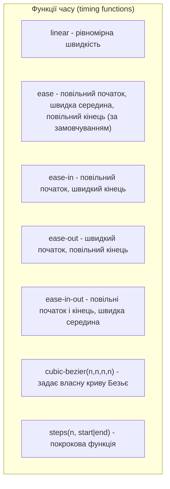
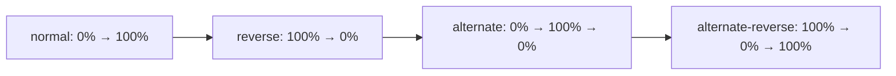
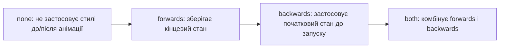
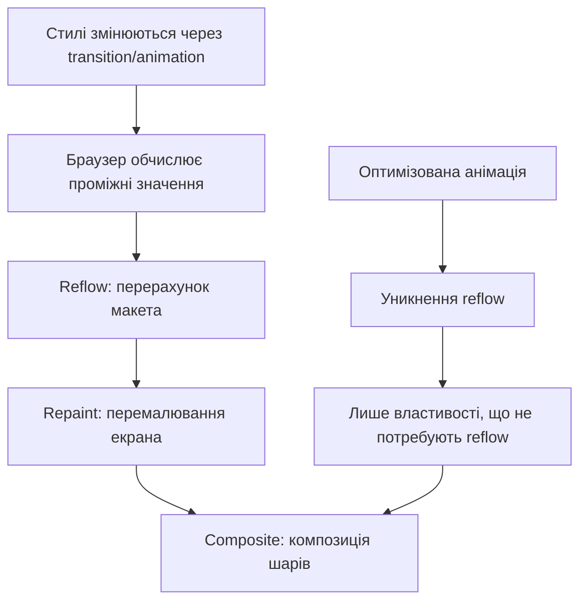

# CSS Анімації та переходи

## Що таке CSS анімації та переходи?

CSS надає два основних механізми для створення візуальних ефектів та анімацій:

1. **Переходи (Transitions)** — простий спосіб анімувати зміну CSS-властивостей протягом заданого часу. Переходи активуються, коли значення властивості змінюється (наприклад, при :hover).

2. **Анімації (Animations)** — більш потужний механізм, що дозволяє створювати складні послідовності анімацій з використанням ключових кадрів (@keyframes).

Обидва механізми дозволяють створювати плавні, інтерактивні візуальні ефекти без використання JavaScript, що покращує продуктивність і користувацький досвід.

## CSS Переходи (Transitions)

### Основні властивості переходів

| Властивість                  | Опис                                     | Значення                                                                            | Приклад                                      |
| ---------------------------- | ---------------------------------------- | ----------------------------------------------------------------------------------- | -------------------------------------------- |
| `transition-property`        | Вказує властивості, які будуть анімовані | `none`, `all`, або назва CSS-властивості                                            | `transition-property: opacity, transform;`   |
| `transition-duration`        | Тривалість переходу                      | Час у `s` (секунди) або `ms` (мілісекунди)                                          | `transition-duration: 0.3s;`                 |
| `transition-timing-function` | Функція часу (швидкість анімації)        | `ease`, `linear`, `ease-in`, `ease-out`, `ease-in-out`, `cubic-bezier()`, `steps()` | `transition-timing-function: ease-in-out;`   |
| `transition-delay`           | Затримка перед початком переходу         | Час у `s` або `ms`                                                                  | `transition-delay: 0.1s;`                    |
| `transition`                 | Скорочений запис для всіх властивостей   | `<property> <duration> <timing-function> <delay>`                                   | `transition: opacity 0.3s ease-in-out 0.1s;` |

### Функції часу (timing functions)



### Приклади переходів

#### Базовий перехід

```html
<button class="btn">Наведи на мене</button>
```

```css
.btn {
    background-color: #3498db;
    color: white;
    padding: 10px 20px;
    border: none;
    border-radius: 4px;
    transition: background-color 0.3s ease;
}

.btn:hover {
    background-color: #2980b9;
}
```

#### Комбінування кількох властивостей

```css
.card {
    width: 300px;
    padding: 20px;
    background-color: #f9f9f9;
    box-shadow: 0 2px 5px rgba(0, 0, 0, 0.1);
    transform: translateY(0);
    transition: transform 0.3s ease-out, box-shadow 0.3s ease-in-out,
        background-color 0.5s linear;
}

.card:hover {
    transform: translateY(-10px);
    box-shadow: 0 10px 20px rgba(0, 0, 0, 0.2);
    background-color: #fff;
}
```

#### Перехід з затримкою

```css
.menu-item {
    opacity: 0.7;
    transform: translateX(-10px);
    transition: opacity 0.3s ease, transform 0.5s ease 0.1s;
}

.menu-item:hover {
    opacity: 1;
    transform: translateX(0);
}
```

#### Перехід усіх властивостей

```css
.element {
    /* Анімує всі можливі властивості, що змінюються */
    transition: all 0.5s ease-in-out;
}
```

### Властивості, які можна анімувати

Не всі CSS-властивості можна анімувати. Ось основні категорії властивостей, які підтримують анімацію:

1. **Кольори** — `color`, `background-color`, `border-color` тощо
2. **Розміри** — `width`, `height`, `padding`, `margin`
3. **Трансформації** — `transform` (translate, scale, rotate, skew)
4. **Позиція** — `top`, `right`, `bottom`, `left`
5. **Прозорість** — `opacity`
6. **Тіні** — `box-shadow`, `text-shadow`
7. **Фільтри** — `filter`

Повний список можна знайти в [специфікації CSS](https://developer.mozilla.org/en-US/docs/Web/CSS/CSS_animated_properties).

## CSS Анімації (Animations)

### Основні властивості анімацій

| Властивість                 | Опис                             | Значення                                                                                             | Приклад                                                     |
| --------------------------- | -------------------------------- | ---------------------------------------------------------------------------------------------------- | ----------------------------------------------------------- |
| `animation-name`            | Назва @keyframes анімації        | Ідентифікатор                                                                                        | `animation-name: bounce;`                                   |
| `animation-duration`        | Тривалість одного циклу анімації | Час у `s` або `ms`                                                                                   | `animation-duration: 1s;`                                   |
| `animation-timing-function` | Функція часу                     | `ease`, `linear`, `ease-in`, `ease-out`, `ease-in-out`, `cubic-bezier()`, `steps()`                  | `animation-timing-function: ease-in-out;`                   |
| `animation-delay`           | Затримка перед початком анімації | Час у `s` або `ms`                                                                                   | `animation-delay: 0.5s;`                                    |
| `animation-iteration-count` | Кількість повторень              | Число або `infinite`                                                                                 | `animation-iteration-count: 3;`                             |
| `animation-direction`       | Напрямок відтворення анімації    | `normal`, `reverse`, `alternate`, `alternate-reverse`                                                | `animation-direction: alternate;`                           |
| `animation-fill-mode`       | Стан елемента до/після анімації  | `none`, `forwards`, `backwards`, `both`                                                              | `animation-fill-mode: forwards;`                            |
| `animation-play-state`      | Стан відтворення                 | `running`, `paused`                                                                                  | `animation-play-state: paused;`                             |
| `animation`                 | Скорочений запис                 | `<name> <duration> <timing-function> <delay> <iteration-count> <direction> <fill-mode> <play-state>` | `animation: bounce 1s ease-in-out 0.5s infinite alternate;` |

### @keyframes

Ключові кадри визначають стани CSS-властивостей в різні моменти анімації:

```css
@keyframes назва-анімації {
    від {
        /* CSS-властивості на початку анімації */
    }
    до {
        /* CSS-властивості в кінці анімації */
    }
}
```

або

```css
@keyframes назва-анімації {
    0% {
        /* CSS-властивості на початку анімації */
    }
    50% {
        /* CSS-властивості в середині анімації */
    }
    100% {
        /* CSS-властивості в кінці анімації */
    }
}
```

### Приклади анімацій

#### Проста анімація пульсації

```css
@keyframes pulse {
    0% {
        transform: scale(1);
    }
    50% {
        transform: scale(1.1);
    }
    100% {
        transform: scale(1);
    }
}

.pulse-element {
    animation: pulse 2s infinite ease-in-out;
}
```

#### Анімація зміни кольору

```css
@keyframes colorChange {
    0% {
        background-color: #3498db;
    }
    25% {
        background-color: #2ecc71;
    }
    50% {
        background-color: #f1c40f;
    }
    75% {
        background-color: #e74c3c;
    }
    100% {
        background-color: #3498db;
    }
}

.color-element {
    width: 100px;
    height: 100px;
    animation: colorChange 8s infinite;
}
```

#### Анімація завантаження (спінер)

```css
@keyframes spin {
    0% {
        transform: rotate(0deg);
    }
    100% {
        transform: rotate(360deg);
    }
}

.loader {
    width: 50px;
    height: 50px;
    border: 5px solid #f3f3f3;
    border-top: 5px solid #3498db;
    border-radius: 50%;
    animation: spin 1s linear infinite;
}
```

#### Анімація появи тексту

```css
@keyframes fadeIn {
    from {
        opacity: 0;
        transform: translateY(20px);
    }
    to {
        opacity: 1;
        transform: translateY(0);
    }
}

.fade-in-text {
    opacity: 0;
    animation: fadeIn 1s ease-out forwards;
}

/* Послідовна анімація для кожного елемента */
.fade-in-text:nth-child(1) {
    animation-delay: 0.1s;
}
.fade-in-text:nth-child(2) {
    animation-delay: 0.2s;
}
.fade-in-text:nth-child(3) {
    animation-delay: 0.3s;
}
```

#### Складна анімація з різними властивостями

```css
@keyframes bounceAndFade {
    0% {
        transform: translateY(0);
        opacity: 1;
        background-color: #3498db;
    }
    50% {
        transform: translateY(-30px);
        opacity: 0.7;
        background-color: #2ecc71;
    }
    100% {
        transform: translateY(0);
        opacity: 1;
        background-color: #3498db;
    }
}

.complex-animation {
    width: 100px;
    height: 100px;
    background-color: #3498db;
    border-radius: 10px;
    animation: bounceAndFade 2s ease-in-out infinite;
}
```

### Напрямки анімації (animation-direction)



### Режими заповнення (animation-fill-mode)



## Порівняння: Переходи vs Анімації

| Аспект           | Переходи (Transitions)                             | Анімації (Animations)                                          |
| ---------------- | -------------------------------------------------- | -------------------------------------------------------------- |
| **Запуск**       | Активуються зміною властивості (наприклад, :hover) | Можуть запускатися автоматично або через зміну властивості     |
| **Контроль**     | Простий: початковий і кінцевий стани               | Детальний: довільна кількість ключових кадрів                  |
| **Повторення**   | Не підтримують автоматичне повторення              | Підтримують налаштування повторень (infinite, число)           |
| **Напрямок**     | Тільки вперед (від початкового до кінцевого стану) | Різні напрямки (normal, reverse, alternate, alternate-reverse) |
| **Складність**   | Прості, для базових ефектів                        | Складні, для комплексних послідовностей                        |
| **Керування**    | Обмежене                                           | Розширене (play-state, fill-mode)                              |
| **Використання** | Інтерактивні елементи, зворотній зв'язок           | Автономні анімації, індикатори, складні ефекти                 |

## Підкапотні механізми та оптимізація

### Як браузер обробляє анімації



1. **Обробка стилів**: браузер визначає, які властивості змінюються.
2. **Обчислення проміжних значень**: для кожного кадру анімації обчислюються проміжні значення.
3. **Reflow (перекомпонування)**: якщо змінюються властивості, що впливають на макет (розміри, позиції), браузер перераховує розташування всіх елементів.
4. **Repaint (перемалювання)**: візуальне оновлення елементів після reflow або при зміні візуальних властивостей.
5. **Composite (композиція)**: збирання різних шарів разом для відображення на екрані.

### Продуктивні анімації: властивості, що не викликають reflow

Найефективніші властивості для анімації (не викликають reflow):

-   `transform` (translate, scale, rotate, skew)
-   `opacity`
-   `filter`

```css
/* Неефективна анімація (викликає reflow) */
@keyframes badAnimation {
    from {
        left: 0;
        top: 0;
        width: 100px;
        height: 100px;
    }
    to {
        left: 100px;
        top: 100px;
        width: 150px;
        height: 150px;
    }
}

/* Ефективна анімація (використовує лише transform) */
@keyframes goodAnimation {
    from {
        transform: translate(0, 0) scale(1);
    }
    to {
        transform: translate(100px, 100px) scale(1.5);
    }
}
```

### Оптимізація за допомогою will-change

Властивість `will-change` інформує браузер про майбутні зміни елемента, дозволяючи оптимізувати рендеринг:

```css
.animated-element {
    /* Повідомляємо браузеру, що буде анімуватись transform і opacity */
    will-change: transform, opacity;
    /* Анімація */
    transition: transform 0.3s, opacity 0.3s;
}
```

> **Увага**: Використовуйте `will-change` помірно і лише там, де це справді потрібно. Надмірне використання може призвести до зворотного ефекту, збільшуючи споживання пам'яті.

### Покадрова анімація з steps()

Для створення ефекту покадрової анімації використовується функція `steps()`:

```css
@keyframes sprite {
    from {
        background-position: 0 0;
    }
    to {
        background-position: -1000px 0;
    } /* Ширина спрайту */
}

.sprite-animation {
    width: 100px;
    height: 100px;
    background: url("sprite.png") no-repeat;
    /* 10 кадрів, кожен шириною 100px */
    animation: sprite 1s steps(10) infinite;
}
```

## Складні приклади та техніки

### Паралакс-ефект

```html
<div class="parallax-container">
    <div class="parallax-bg"></div>
    <div class="content">
        <h1>Паралакс-ефект</h1>
        <p>Прокрутіть сторінку вниз</p>
    </div>
</div>
```

```css
.parallax-container {
    height: 500px;
    overflow: hidden;
    position: relative;
}

.parallax-bg {
    background-image: url("background.jpg");
    height: 700px; /* Більше, ніж контейнер */
    background-size: cover;
    background-position: center;
    position: absolute;
    top: 0;
    left: 0;
    right: 0;
    bottom: 0;
    transform: translateY(0);
    /* Плавний ефект при скролі */
    transition: transform 0.1s cubic-bezier(0, 0, 0.58, 1);
    will-change: transform;
}

.content {
    position: relative;
    z-index: 1;
    text-align: center;
    padding-top: 200px;
    color: white;
}

/* JavaScript для паралакс-ефекту:
window.addEventListener('scroll', function() {
  const scrollPosition = window.pageYOffset;
  document.querySelector('.parallax-bg').style.transform = 
    'translateY(' + scrollPosition * 0.5 + 'px)';
});
*/
```

### Анімована навігація

```html
<nav class="main-nav">
    <ul>
        <li><a href="#">Головна</a></li>
        <li><a href="#">Про нас</a></li>
        <li><a href="#">Послуги</a></li>
        <li><a href="#">Контакти</a></li>
    </ul>
    <div class="nav-indicator"></div>
</nav>
```

```css
.main-nav {
    position: relative;
    background: #f5f5f5;
    padding: 10px 0;
}

.main-nav ul {
    display: flex;
    list-style: none;
    margin: 0;
    padding: 0;
    justify-content: space-around;
}

.main-nav a {
    display: block;
    padding: 10px 20px;
    text-decoration: none;
    color: #333;
    position: relative;
    z-index: 1;
}

.nav-indicator {
    position: absolute;
    bottom: 10px;
    height: 3px;
    background: #3498db;
    transition: width 0.3s ease, left 0.3s ease;
    will-change: width, left;
}

/* JavaScript для рухомого індикатора:
document.querySelectorAll('.main-nav a').forEach(link => {
  link.addEventListener('mouseenter', function() {
    const indicator = document.querySelector('.nav-indicator');
    indicator.style.width = this.offsetWidth + 'px';
    indicator.style.left = this.offsetLeft + 'px';
  });
});
*/
```

### Анімація кнопки з ripple-ефектом

```html
<button class="ripple-button">Натисніть мене</button>
```

```css
.ripple-button {
    position: relative;
    overflow: hidden;
    background: #3498db;
    color: white;
    border: none;
    padding: 12px 24px;
    border-radius: 4px;
    cursor: pointer;
    outline: none;
}

.ripple {
    position: absolute;
    background: rgba(255, 255, 255, 0.3);
    border-radius: 50%;
    transform: scale(0);
    animation: ripple 0.6s linear;
    will-change: transform;
}

@keyframes ripple {
    to {
        transform: scale(4);
        opacity: 0;
    }
}

/* JavaScript для ripple-ефекту:
document.querySelector('.ripple-button').addEventListener('click', function(e) {
  const button = this;
  const ripple = document.createElement('span');
  ripple.classList.add('ripple');
  button.appendChild(ripple);
  
  const rect = button.getBoundingClientRect();
  const size = Math.max(rect.width, rect.height);
  ripple.style.width = ripple.style.height = size + 'px';
  
  const x = e.clientX - rect.left - size/2;
  const y = e.clientY - rect.top - size/2;
  ripple.style.left = x + 'px';
  ripple.style.top = y + 'px';
  
  setTimeout(() => {
    ripple.remove();
  }, 600);
});
*/
```

### Анімація прокрутки (Smooth Scroll)

```html
<nav>
    <a href="#section1" class="scroll-link">Розділ 1</a>
    <a href="#section2" class="scroll-link">Розділ 2</a>
</nav>

<section id="section1">Розділ 1</section>
<section id="section2">Розділ 2</section>
```

```css
html {
    scroll-behavior: smooth; /* Нативна плавна прокрутка в сучасних браузерах */
}

/* Для JavaScript анімації в старіших браузерах:
document.querySelectorAll('.scroll-link').forEach(link => {
  link.addEventListener('click', function(e) {
    e.preventDefault();
    
    const targetId = this.getAttribute('href');
    const targetElement = document.querySelector(targetId);
    
    window.scrollTo({
      top: targetElement.offsetTop,
      behavior: 'smooth'
    });
  });
});
*/
```

## Підтримка браузерами та префікси

Сучасні браузери добре підтримують CSS-анімації та переходи, але для максимальної сумісності можна використовувати префікси:

```css
.element {
    -webkit-animation: fadeIn 1s ease-out;
    -moz-animation: fadeIn 1s ease-out;
    -o-animation: fadeIn 1s ease-out;
    animation: fadeIn 1s ease-out;
}

@-webkit-keyframes fadeIn {
    /* ... */
}
@-moz-keyframes fadeIn {
    /* ... */
}
@-o-keyframes fadeIn {
    /* ... */
}
@keyframes fadeIn {
    /* ... */
}
```

> **Примітка**: Використання автоматичних систем для додавання префіксів (Autoprefixer, PostCSS) значно спрощує цей процес.

## Практичні поради та best practices

1. **Надавайте перевагу `transform` і `opacity`** для плавних анімацій.

2. **Уникайте анімації складних властивостей**, таких як `box-shadow`, які вимагають багато ресурсів.

3. **Використовуйте `will-change` для критичних анімацій**, але не зловживайте цією властивістю.

4. **Обмежуйте кількість анімованих елементів** на екрані одночасно.

5. **Тестуйте на слабких пристроях**, щоб переконатися в продуктивності.

6. **Враховуйте доступність**:

    - Надавайте можливість вимкнути анімації (для людей з вестибулярними розладами)
    - Використовуйте `prefers-reduced-motion` для поваги до системних налаштувань користувача

    ```css
    @media (prefers-reduced-motion: reduce) {
        * {
            animation-duration: 0.01ms !important;
            animation-iteration-count: 1 !important;
            transition-duration: 0.01ms !important;
            scroll-behavior: auto !important;
        }
    }
    ```

7. **Розробляйте з думкою про "прогресивне покращення"** — сайт повинен працювати навіть без анімацій.

8. **Уникайте надмірних анімацій**, які відволікають від основного контенту.

## Висновок

CSS-анімації та переходи — потужні інструменти для покращення користувацького досвіду та створення динамічних інтерфейсів без використання JavaScript. Правильне застосування цих технік дозволяє створювати плавні, ефективні та доступні анімації, які працюють на різних пристроях і в різних браузерах.

При розробці анімацій необхідно завжди пам'ятати про баланс між візуальною привабливістю та продуктивністю, приділяючи особливу увагу доступності та врахуванню потреб всіх користувачів.
