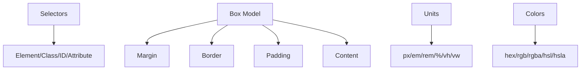

## 2.1. CSS Fundamentals

### Selectors and Specificity

Селектори (selectors) — це правила для вибору елементів на сторінці. Специфічність (specificity) визначає, яке правило буде застосовано, якщо є конфлікт.

```css
/* Типи селекторів */
/* Елемент */
p { color: blue; }
/* Клас */
.title { font-weight: bold; }
/* Ідентифікатор */
#main { background: #eee; }
/* Комбіновані */
section.article h2 { margin-top: 0; }
/* Атрибут */
input[type="email"] { border: 1px solid green; }
```
- Специфічність: inline style > id > class/attribute > element.
- Важливо уникати надмірної специфічності для легкого редагування стилів.

---

### Box Model: margin, border, padding, content

Box model (модель коробки) — основа верстки в CSS. Кожен елемент — це "коробка" з чотирма зонами:

```css
/* Приклад стилізації */
div {
  margin: 10px;   /* Зовнішній відступ */
  border: 2px solid #333; /* Рамка */
  padding: 20px;  /* Внутрішній відступ */
  width: 300px;   /* Ширина контенту */
}
```
- `margin` — зовнішній відступ.
- `border` — рамка.
- `padding` — внутрішній відступ.
- `content` — власне контент (текст, зображення).

> **Best Practice:** Використовуйте `box-sizing: border-box` для зручної роботи з розмірами.

```css
* { box-sizing: border-box; }
```

---

### Units: px, em, rem, %, vh/vw

Одиниці вимірювання (units) визначають розміри елементів:
- `px` — пікселі (fixed).
- `em` — відносно розміру шрифту батьківського елемента.
- `rem` — відносно кореневого елемента (`html`).
- `%` — відсотки від батьківського елемента.
- `vh`, `vw` — відносно висоти/ширини вікна браузера.

```css
.container {
  width: 80vw;
  height: 50vh;
  font-size: 1.2rem;
  margin: 2em auto;
}
```

---

### Colors: hex, rgb, rgba, hsl, hsla

CSS підтримує різні формати кольорів:
- `hex` — шістнадцятковий (#ffcc00).
- `rgb` — Red, Green, Blue (rgb(255, 204, 0)).
- `rgba` — те ж саме, але з прозорістю (alpha).
- `hsl` — Hue, Saturation, Lightness (hsl(45, 100%, 50%)).
- `hsla` — те ж саме, але з прозорістю.

```css
.box {
  background: #ffcc00;
  color: rgb(34, 34, 34);
  border: 2px solid rgba(0,0,0,0.2);
  box-shadow: 0 2px 8px hsla(0,0%,0%,0.1);
}
```

---

### Mermaid Diagram: CSS Fundamentals


_Основи CSS: селектори, модель коробки, одиниці, кольори_

---

#### Navigation

- [Попередня тема: Advanced HTML](1.8-advanced-html.md)
- [Наступна тема: Layout Techniques](2.2-layout-techniques.md)
