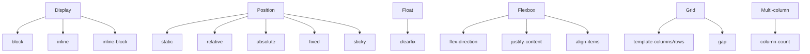

## 2.2. Layout Techniques

### Display Property: block, inline, inline-block

Властивість `display` визначає, як елемент поводиться у потоці документа.

```css
/* Block element */
div {
  display: block;
}
/* Inline element */
span {
  display: inline;
}
/* Inline-block element */
img {
  display: inline-block;
}
```
- `block` — займає всю ширину, починає новий рядок.
- `inline` — займає лише необхідну ширину, не починає новий рядок.
- `inline-block` — як inline, але можна задавати розміри.

---

### Position: static, relative, absolute, fixed, sticky

Властивість `position` визначає спосіб позиціонування елемента.

```css
/* Static (default) */
div { position: static; }
/* Relative */
div { position: relative; top: 10px; left: 20px; }
/* Absolute */
div { position: absolute; top: 0; left: 0; }
/* Fixed */
div { position: fixed; bottom: 0; right: 0; }
/* Sticky */
div { position: sticky; top: 0; }
```
- `static` — стандартне позиціонування.
- `relative` — зміщення від початкової позиції.
- `absolute` — позиція відносно найближчого позиціонованого батька.
- `fixed` — позиція відносно вікна браузера.
- `sticky` — "прилипає" до позиції при скролі.

---

### Floats and Clearfix

`float` використовується для обтікання елементів (наприклад, картинок).

```css
img {
  float: left;
  margin-right: 10px;
}
```
- `float: left|right|none` — обтікання зліва/справа/відсутнє.
- Для уникнення "залипання" контейнера використовуйте clearfix:

```css
.clearfix::after {
  content: "";
  display: table;
  clear: both;
}
```

---

### Flexbox Layout

Flexbox (Flexible Box Layout) — сучасний спосіб створення гнучких макетів.

```css
.container {
  display: flex;
  flex-direction: row;
  justify-content: space-between;
  align-items: center;
}
.item {
  flex: 1;
}
```
- `display: flex` — активує flex-контейнер.
- `flex-direction` — напрямок (row, column).
- `justify-content` — вирівнювання по головній осі.
- `align-items` — вирівнювання по поперечній осі.
- `flex` — гнучкість елемента.

---

### Grid Layout

Grid Layout — потужний інструмент для двовимірних макетів.

```css
.grid {
  display: grid;
  grid-template-columns: 1fr 2fr 1fr;
  grid-template-rows: auto 200px;
  gap: 16px;
}
.item {
  grid-column: 2 / 4;
  grid-row: 1 / 2;
}
```
- `display: grid` — активує grid-контейнер.
- `grid-template-columns/rows` — визначає структуру.
- `gap` — відступи між елементами.
- `grid-column`, `grid-row` — позиціонування елементів.

---

### Multi-Column Layout

Мультиколонковий макет для тексту та контенту.

```css
.columns {
  column-count: 3;
  column-gap: 24px;
}
```
- `column-count` — кількість колонок.
- `column-gap` — відстань між ними.

---

### Mermaid Diagram: Layout Techniques


_Основні техніки макетування в CSS_

---

#### Navigation

- [Попередня тема: CSS Fundamentals](2.1-css-fundamentals.md)
- [Наступна тема: Typography and Text](2.3-typography-and-text.md)
