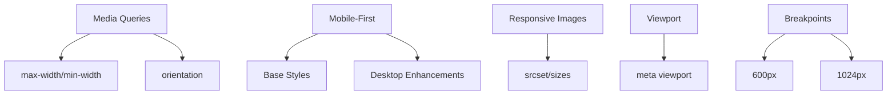

## 2.5. Responsive Design

### Media Queries

Media queries (медіа-запити) дозволяють застосовувати стилі залежно від розміру екрана, пристрою чи інших параметрів.

```css
@media (max-width: 600px) {
    .container {
        flex-direction: column;
        font-size: 16px;
    }
}
```

-   `@media` — ключове слово для медіа-запитів.
-   `max-width`, `min-width`, `orientation`, `resolution` — умови для застосування стилів.

---

### Mobile-First Approach

Mobile-first (мобільний пріоритет) — стратегія, коли стилі спочатку пишуться для мобільних пристроїв, а потім розширюються для більших екранів.

```css
/* Базові стилі для мобільних */
body {
    font-size: 16px;
}
@media (min-width: 768px) {
    body {
        font-size: 18px;
    }
}
```

-   Підвищує продуктивність і зручність для мобільних користувачів.

---

### Responsive Images

Адаптивні зображення (responsive images) автоматично підлаштовуються під розмір екрана.

```html

```

-   `srcset` — список зображень для різних розмірів.
-   `sizes` — умови для вибору зображення.
-   Можна використовувати `<picture>` для складних сценаріїв.

---

### Viewport Settings

Viewport (вікно перегляду) — область, яку бачить користувач. Для коректної адаптації потрібно додати мета-тег:

```html
<meta name="viewport" content="width=device-width, initial-scale=1.0" />
```

-   `width=device-width` — ширина viewport дорівнює ширині пристрою.
-   `initial-scale` — початковий масштаб.

---

### Breakpoint Strategies

Breakpoints (точки перелому) — розміри екранів, на яких змінюється макет.

```css
@media (max-width: 600px) {
    ...;
}
@media (min-width: 601px) and (max-width: 1024px) {
    ...;
}
@media (min-width: 1025px) {
    ...;
}
```

-   Вибір breakpoints залежить від цільових пристроїв.
-   Рекомендується використовувати мінімальну кількість точок для простоти.

---

### Mermaid Diagram: Responsive Design



_Адаптивний дизайн у CSS_

---

#### Navigation

-   [Попередня тема: Visual Effects](2.4-visual-effects.md)
-   [Наступна тема: SCSS Features](2.6-scss-features.md)
